记录ChatGPT注册方法！

<!--more-->

## 1、注册ChatGPT账号

- 首先挂梯子，没有梯子，或者挂了梯子显示429的，看文章最后。
- 打开 https://chat.openai.com/auth/login ，输入邮箱进行账号注册（ip已被限流，使用的微软账户，依旧可行）
- 邮箱接收验证码，点击验证按钮完成验证。

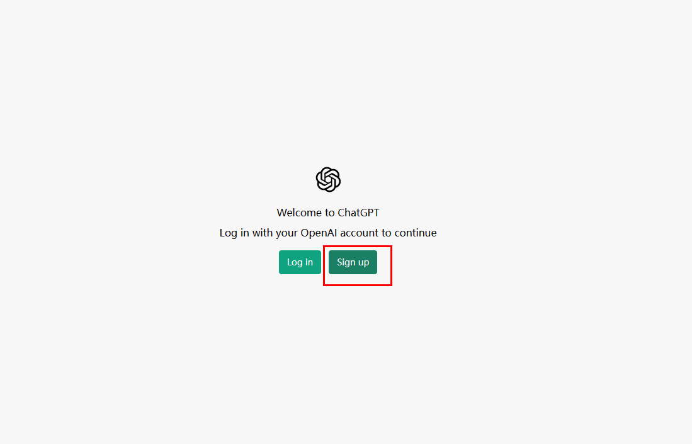

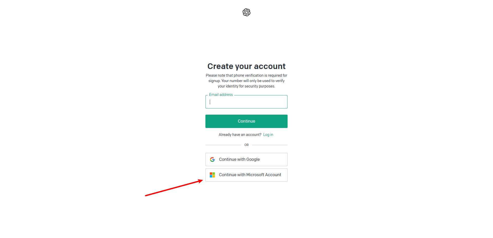

微软验证成功之后，就会提示验证手机号码。

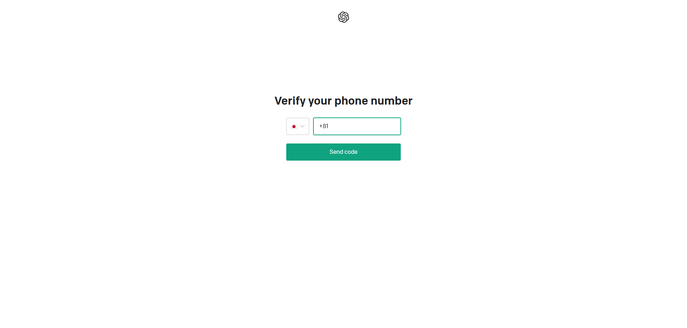

## 2、手机验证

这一步需要用到接码平台完成手机号验证，平台链接地址：[sms-activate.org](https://sms-activate.org/?ref=2780512)

1. 注册平台，并验证邮箱
2. 打开邮箱完成账号认证
3. 登录平台并充值，先充值0.2美金
4. 充值完成打开openAI

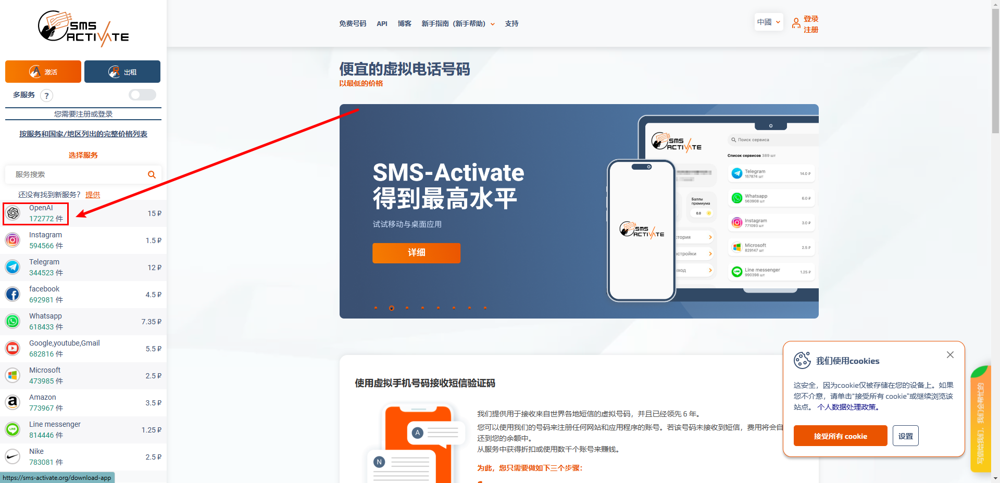

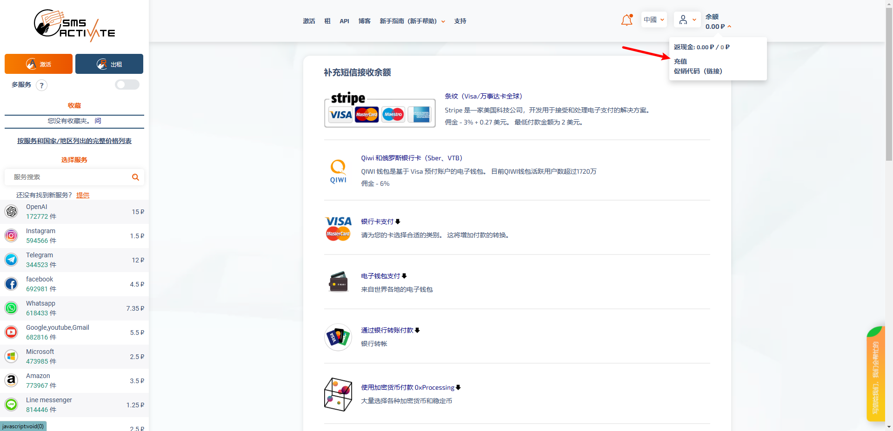

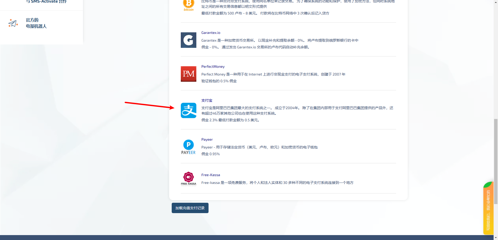

充值成功后就选国家，进行购买。涨价了，狗东西

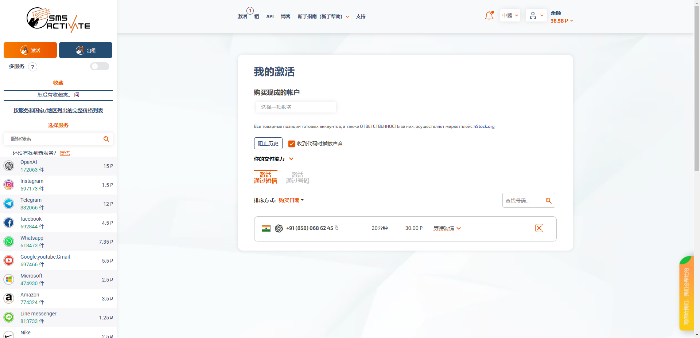

输入手机号

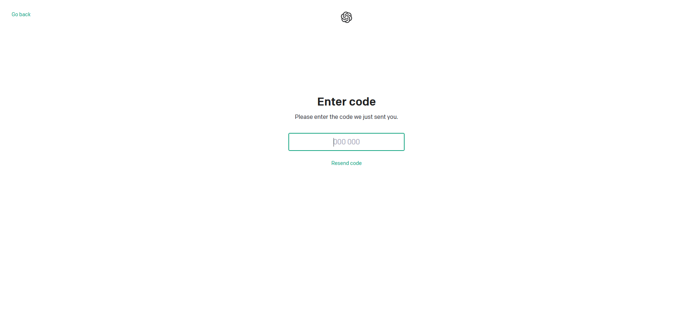

等待验证码，如果没接收到验证码，点击下面的resend重新发送一下

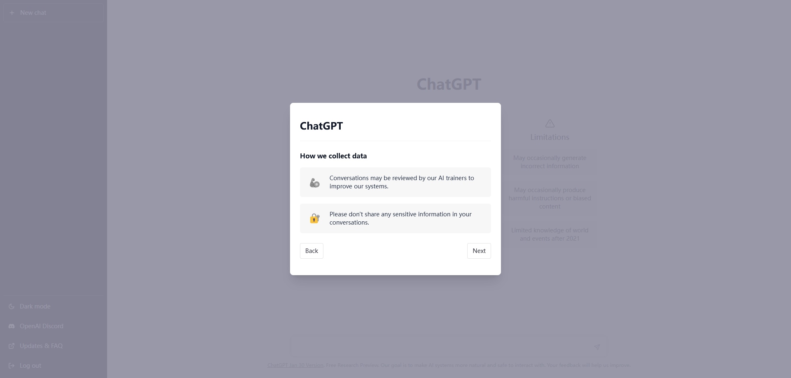

注册成功，一路next。

## 3、注册成功

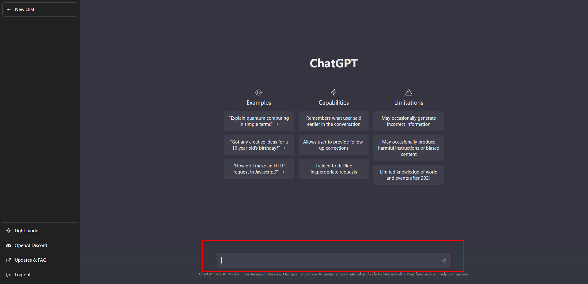

登录之后，在输入框输入你想问的事情。

## 4、爬墙

没有科学上网的同学，看这里：https://xn-4gq62f52gdss.com/#/register?code=W5ofzR7g

由于gpt做了限制，可能挂了梯子注册也会显示，同一个ip注册过多，或者直接进不去网站，将节点切换到临时即可，只限和我相同得梯子。

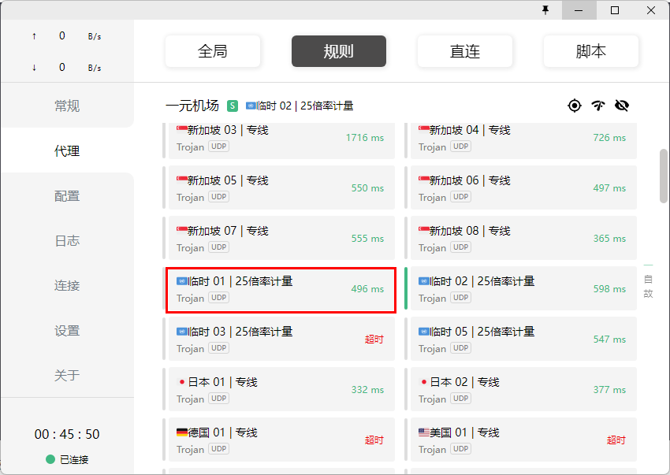

记得将系统代理打开，否则上不去网。

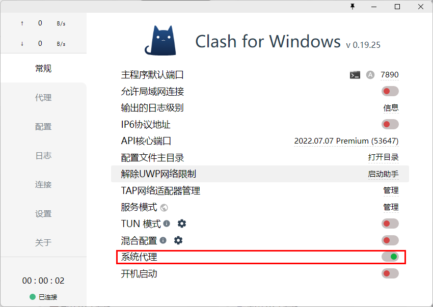