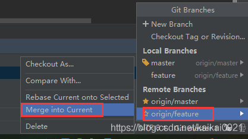
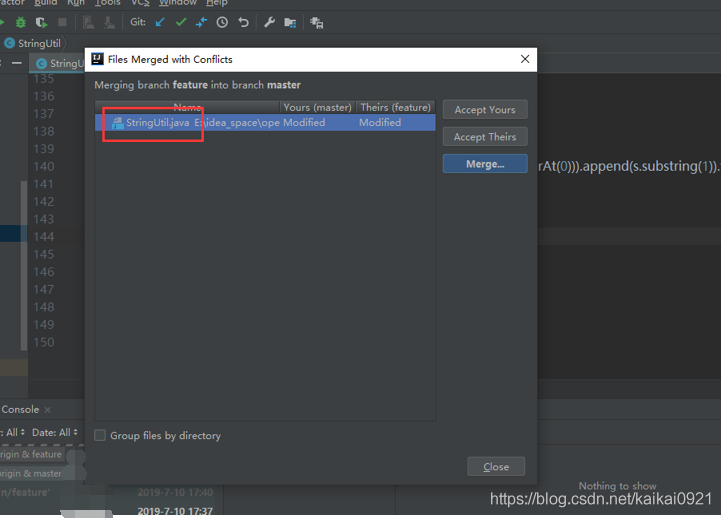
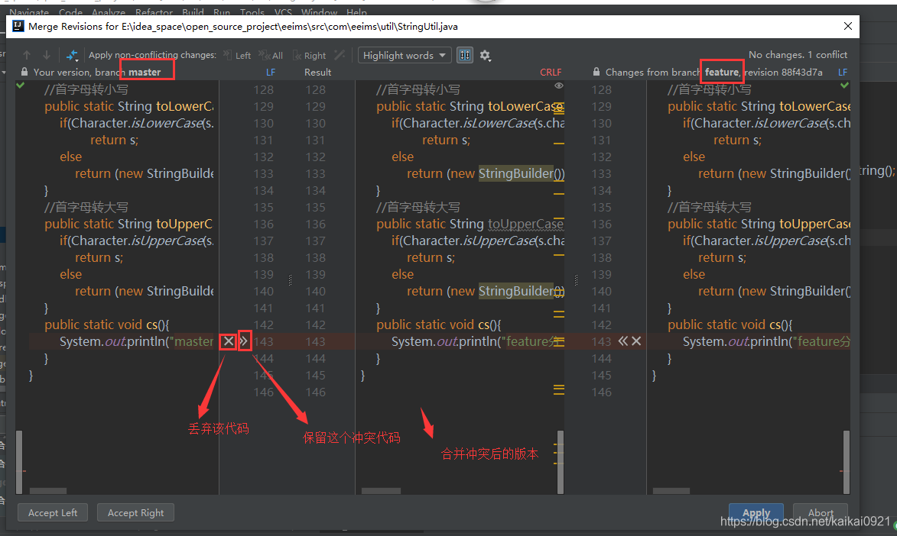
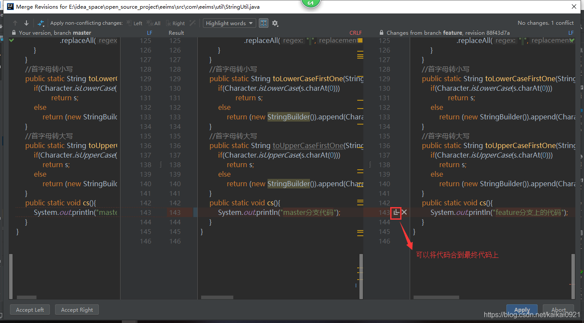
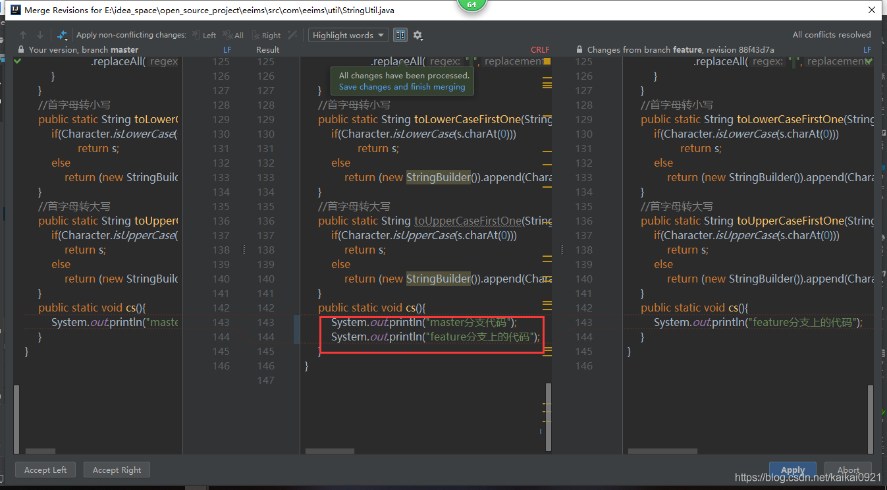
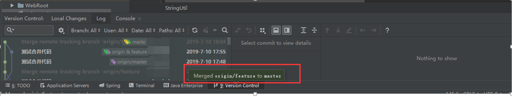

两个分支之间存在代码冲突，如何使用IDEA处理？

<!--more-->

> 由于当时处理代码时候忘记了截图，所以只能从网上借几张图啦。

1、如果将feature分支合到master分支是出现冲突,先切到需要合并目标分支master

2、找到想要合并的分支，点击merge into current

3、此时可能出现两个分支上代码冲突，接下来要解决冲突，双击该冲突的类。

4、中间视图为最终解决冲突后的代码，>>表示是否将该代码保留，X表示去掉改代码。

5、可以将两个分支上的代码都合到上面

合并后效果

5、点击应用之后，出现下面代表已经合到本地上了，还要push到远程分支上。

