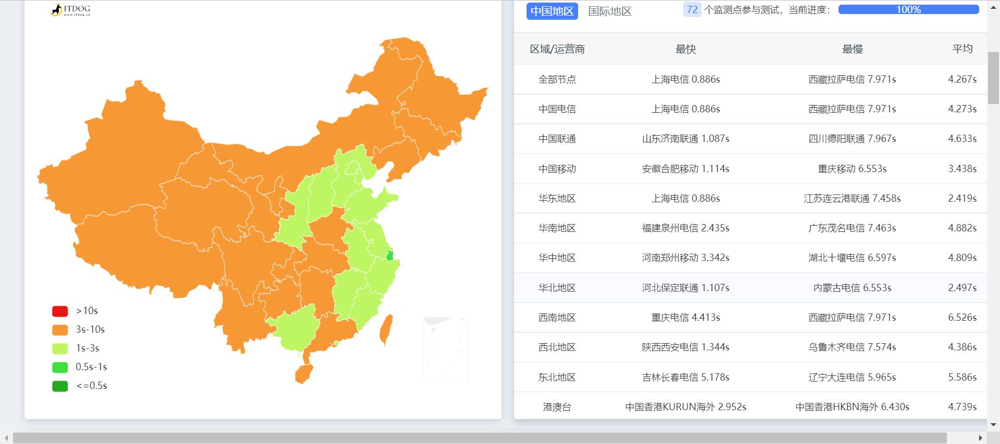
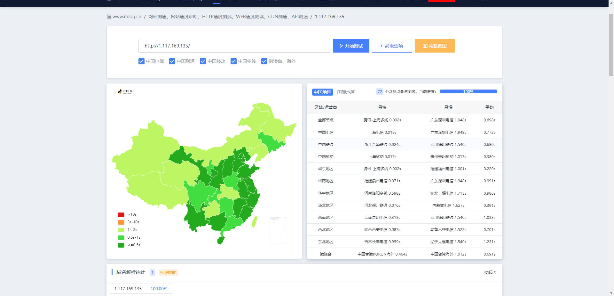

简介：

近期发现Typecho访问速度以及加载文章的速度很慢。

# 解决办法



测试网站访问速度。发现黄了一片。。。。。

测试工具地址：[网站测速_网站速度诊断_HTTP速度测速_WEB速度测试_CDN测速_API测速_多线路速度测试_多地区速度测试 (itdog.cn)](https://www.itdog.cn/http/)

去百度搜索解决办法，发现一个博主写了一篇解决此问题的文章。

尝试。

## 参考文章

提供两个`PHP`代码脚本，一个是不需要密码的，一个是需要密码的；
首先在网站根目录新建一个`php`文件，文件命名为：`jingtai.php`
然后在其中写入需要的代码（不需要密码和需要密码的选择其中一个即可）

**不需要密码的PHP脚本**

```php
<?php
$nowtime=time();
$pastsec = $nowtime - $_GET["t"];
if($pastsec<600)
{
exit; //10分钟更新一次，时间可以自己调整
}
ob_start(); //打开缓冲区
include("index.php");
$content = ob_get_contents(); //得到缓冲区的内容
$content .= "\n<script language=javascript src=\"jingtai.php?t=".$nowtime."\"></script>"; //加上调用更新程序的代码

file_put_contents("index.html",$content);
if (!function_exists("file_put_contents"))
{
function file_put_contents($fn,$fs)
{
$fp=fopen($fn,"w+");
fputs($fp,$fs);
fclose($fp);  
}
}
?>
```

**需要要密码的PHP脚本**

```php
<?php
/**
 * 首页静态化脚本
 */
ini_set( 'date.timezone', 'PRC' );

/* 缓存过期时间 单位：秒 */
$expire = 600;
/* 主动刷新密码  格式：https://你的域名/jingtai.php?password=123456 */
$password = '123456';
$file_time = @filemtime( 'index.html' );
time() - $file_time > $expire && create_index();
isset( $_GET['password'] ) && $_GET['password'] == $password && create_index();

/**
 * 生成 index.html
 */
function create_index()
{
    ob_start();
    include( 'index.php' );
    $content = ob_get_contents();
    $content .= "\n<!-- Create time: " . date( 'Y-m-d H:i:s' ) . " -->";
    /* 调用更新 */
    $content .= "\n<script language=javascript src='jingtai.php'></script>";
    ob_clean();
    $res = file_put_contents( 'index.html', $content );
    if ( $res !== false )
    {
        die( 'Create successful' );
    }
    else
    {
        die( 'Create error' );
    }
}
```

保存为`utf8`编码后退出；

**注意：如果使用的宝塔面板，还要在后台网站设置-默认文档-将`index.html`的排序上调至第一位**
然后在浏览器中打开`PHP`脚本链接即可
打开链接后会在网站根目录下生成一个`index.html`的静态文件，首页静态化也就完成了；
**不需要密码脚本的链接：[https://你的域名/jingtai.php](https://xn--6qqv7i2xdt95b/jingtai.php)**
**需要密码脚本的链接：[https://你的域名/jingtai.php?password=123456](https://xn--6qqv7i2xdt95b/jingtai.php?password=123456)**

### 说明

两个`PHP`脚本中的更新时间默认为`600`秒，也就是十分钟更新一次，默认密码为`123456`
更新时间及访问密码都可以自行设定，修改脚本中的数值即可；

### 验证

查看是否生效，浏览器中重新打开你的网站首页，右键查看源代码
**不需要密码的脚本**
在最后一行如果有`<script language=javascript>...`之类的字眼，说明你访问的就是index.html的页面
**需要密码的脚本**
在最后一行会有显示最后一次更新时间
`<!-- Create time: 2020-03-09 00:33:41 -->`
`<script language=javascript src='jt_index.php'></script>`


参考文章[Typecho生成首页静态HTML数倍提高网站打开速度 - SunPma'Blog](https://sunpma.com/484.html)

## 尝试解决



设置完成之后，确实速度变快。

设置成功之后，会出现一个问题，就是搜索按钮失效，在HandSome美化文章中有解决方法。