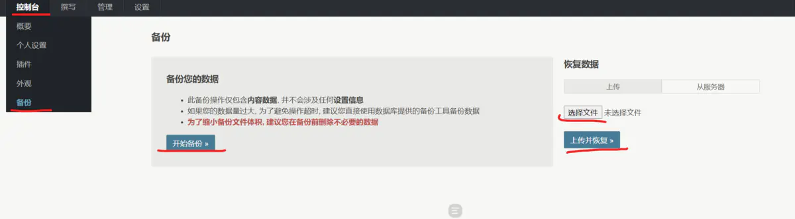
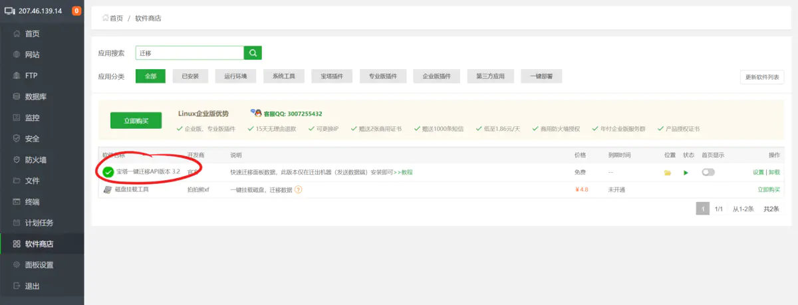
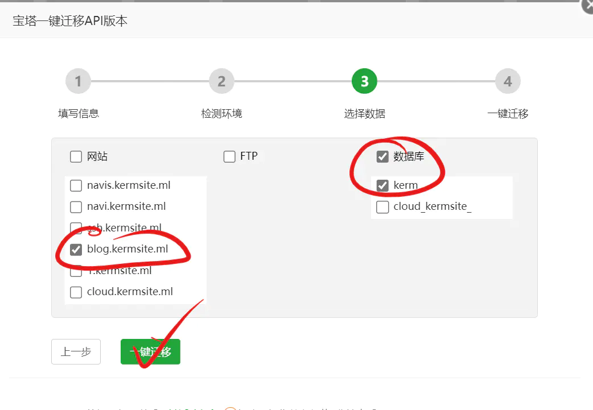
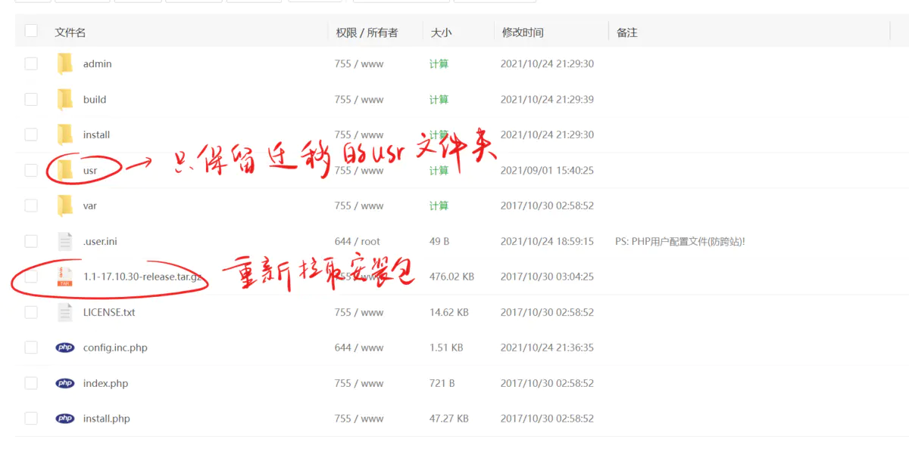

简介：

以防服务器到期数据丢失，准备迁移数据前的准备。

<!--more-->

原来部署typecho的服务器准备删除了，准备把博客转到新的服务器上，但是在迁移的时候遇到了问题。

实际上typecho是有一个备份功能的，如图，但是我用不了，显示数据错误，就很离谱。此外，这样的备份只备份了数据库文件，附件、设置和主题都不会备份（这些数据都保存在usr文件夹中）。会丢失很多内容。

综上选择手动备份迁移。

注意由于需要使用迁移过来的数据库，目标网站必须是全新的安装。

参考了博客[Typecho博客转移服务器,数据备份. - 简书 (jianshu.com)](https://www.jianshu.com/p/084ee2712879)，但是做到一半发现有更简单的方法，就在原文的基础上稍作修改了。

### 使用宝塔一键迁移转移usr文件夹和数据库

在原服务器如图所示找到一键迁移：

按照提示获取API，添加白名单，安装相应的环境之后，备份对应的网站目录和数据库（两个都要备份）

### 在目标服务器重新安装typecho

回到目标服务器，重新下载安装文件，替换网站目录下除了usr文件夹之外的文件。

访问博客的域名，在配置数据库时，填写你刚才迁移过来的数据库名、数据库密码，以及数据库用户名。

第二步完成后，会提示安装失败，数据库中已存在数据表。这里我们只需要点击使用原有数据就操作完成了。

### 手动备份和恢复，储存数据到本地

参考文章https://www.jianshu.com/p/58e72ff024a0

