<!--more-->

## 安装步骤：

1、下载安装Navicat 在Navicat关闭的情况下运行注册机
官网https://www.navicat.com.cn/下载最新版本下载安装

2、[Xuzb's 网盘](https://ali.xuzb.cc/软件/编程软件)下载地址

3、激活Navicat Premium
先把Navicat安装好
然后把破解工具Navicat_Keygen_Patch解压， 在Navicat关闭的情况下,以管理员身份运行

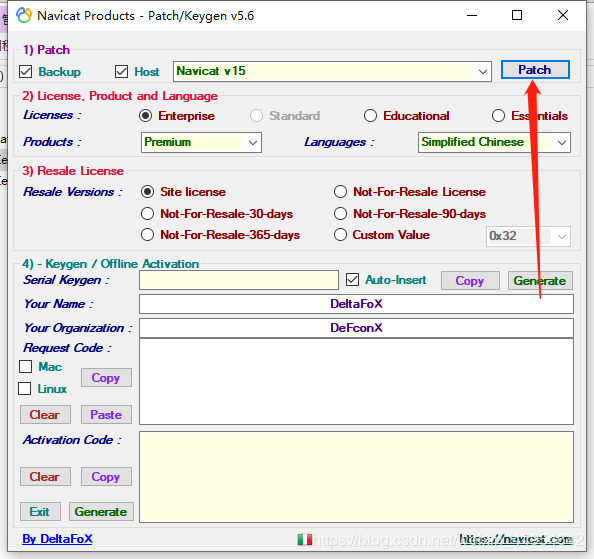

4.点击patch 弹出窗口，找到navicat下载的目录选择navicat，点击打开 (注意:products选择Premium; languages选择 Chinese)

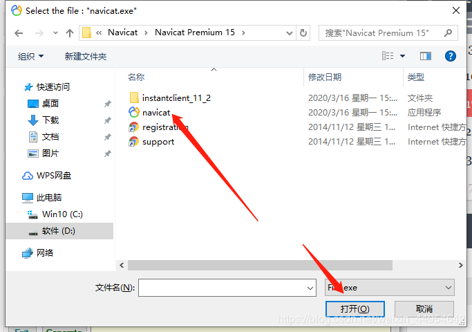

5.显示为下图就是破解成功了

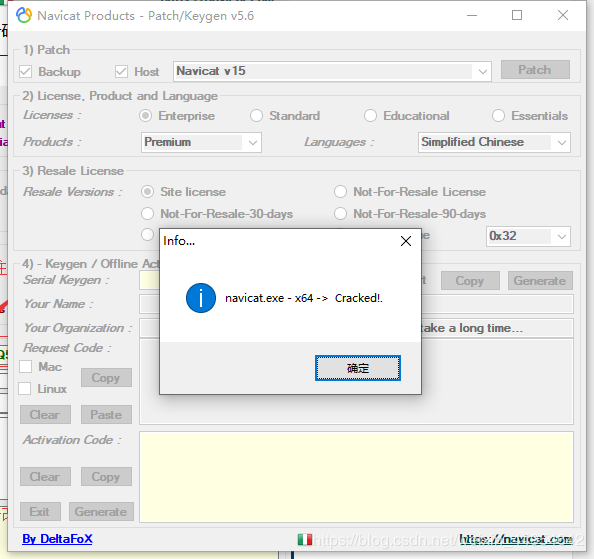

5.1.点击Generate

5.2.出现序列码

5.3.点击Copy

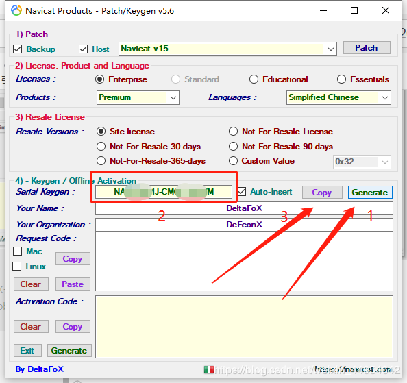

6.然后打开navicat

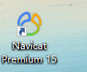

7.第一次打开会提示注册和试用，由于作者是破解过了，我就不截图了，你们第一次打开的时候点击注册，然后把刚才copy的序列码复制进去，点击激活。

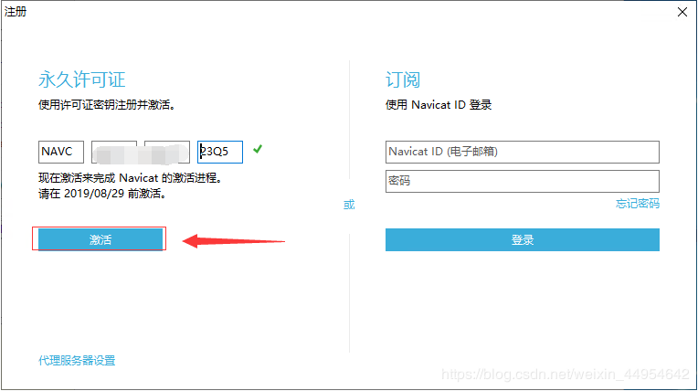

8.选择手动激活

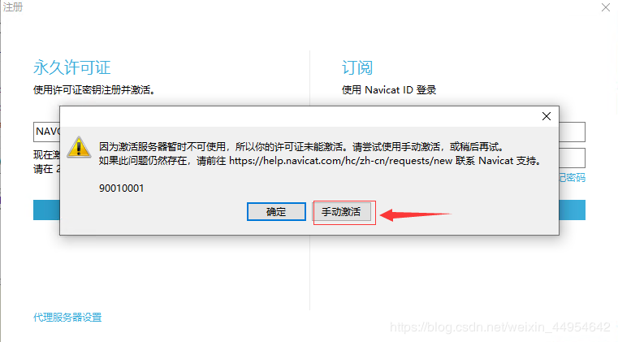

9.然后会生成一大串请求码

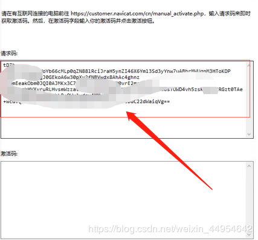

10.复制请求码到注册机中的Request Code中，点击Activation Code下的generate，生成激活码

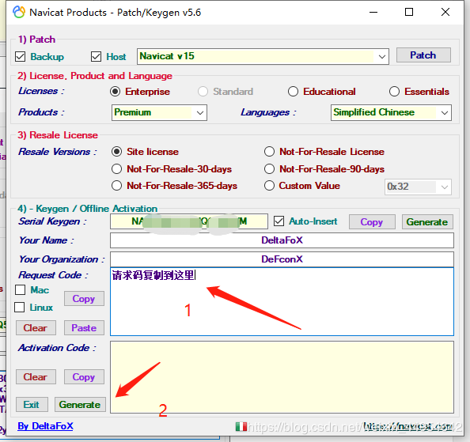

 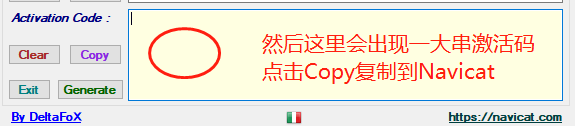

 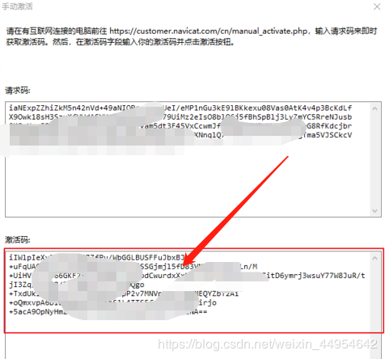

点击激活！！！
然后再次打开就可以啦，破解成功！

## 问题总结:

1.navicat的破解注册机出现错误提示No All Pattern Found! File Already Patched?

第一步：先把注册机放入安装目录。 （这一步非常关键，先不要打开桌面上安装好的快捷方式！！）

第二步：如果之前下载过，把注册表清理干净

　　计算机HKEY_CURRENT_USERSOFTWAREPremiumSoft（把这个目录下面的东西全部删了！）

注册表打开方式:

1.按Windows+R快捷键打开运行窗口。

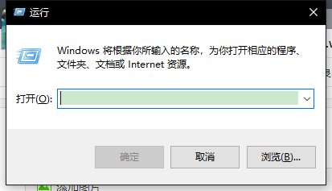

2.输入regedit，按下回车键即可进入注册表编辑器。

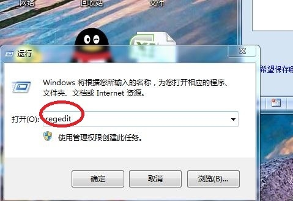

第三步：右键管理员身份运行注册机程序，点击“path”按钮,*这时会重新生成一个新的文件navicat.exe*

第四步：双击运行新的navicat.exe，点击“Generate”获取许可证：
　　再激活，将请求码复制放入点击左下方的“Generate”，成功出现激活码！

2.*报达到激活上限或者手动激活报 Generate First a serial以及Rsa pubic key not find 或者No All Pattern Found! File Already Patched的错误的解决办法*

当我们联网使用注册机的时候，Navicat会报注册达到上限，这时我们需要要把网络断掉 但是之后还是注册失败会报 Generate  First a serial错或者报Rsa pubic key not find  的错误，这时是因为我们注册的步骤错了,我们需要关闭网络,重新按照上面步骤操作,就可以激活成功

转载至：https://www.cnblogs.com/justBobo/p/15808271.html