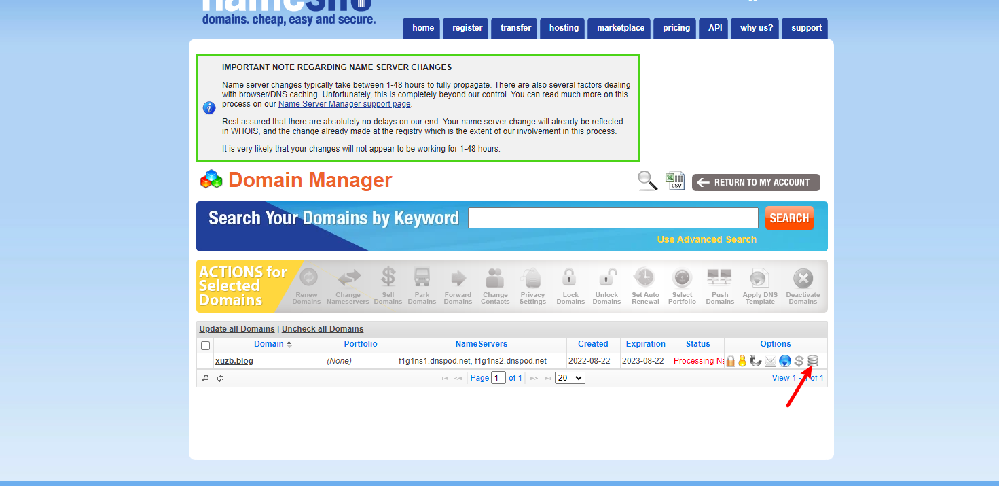

# 一、首先购买域名

[Cheap Domain Names & Web Hosting Starting at $0.99! | NameSilo](https://www.namesilo.com/)


购买xuzb.blog为博客域名。花费22人民币；

记得在买的时候使用优惠卷okoff；

# 二、购买腾讯云服务器


[轻量应用服务器专场特惠_香港轻量应用服务器特惠_海外轻量应用服务器特惠-腾讯云 (tencent.com)](https://cloud.tencent.com/act/pro/lighthouse2021?from=16897)

花费69人民币

# 三、配置服务器环境


首先重置服务器密码、然后打开宝塔面板所需端口；

登录宝塔面板绑定服务器并且安装所需要的运行环境；

http://1.117.169.135:8888/tencentcloud

```
用户名:telkwevr密码:2f12e10b
```

添加站点


# 四、安装Typecho

进入 [Typecho](https://link.zhihu.com/?target=http%3A//typecho.org/) 官网，下载安装包。建议下载正式版。

打开网站管理页面，进入网站目录，把该目录中的现有文件全部删除。然后把 Typecho 文件压缩包上传到网站目录中并解压,然后删除压缩文件；


浏览器访问` www.xuzb.blog/install.php`，按提示完成 Typecho 配置。

出现问题，出现域名解析慢的情况


第二天还是没有解决这个问题，将服务器重装。。。。


**php安装7.1版本以上；**

域名问题先搁置到一边，先使用ip地址来配置；


重装了第三遍之后，将php版本更新到7.3之后。就可以了；

由于域名解析还没完成，只能使用ip地址登录；


解析域名   

将namesilo的dns服务器改为国内




然后去[www.dnspod.cn](http://www.dnspod.cn/)

管理自己的域名；


**国内服务器+国外域名同样需要备案。**

**所以将国外域名退掉，购买的腾讯云的服务器+腾讯云的域名。。。。**


# 五、选择Typecho插件与主题


## 主题 & 插件

Typecho 博客本身不带主题/插件商店，因此主题和插件需要自己到论坛、网上去找，下载后上传到网站目录的相应文件夹中，再到网站后台启用即可。

- **插件位置：**网站目录/usr/plugins
- **主题位置：**网站目录/usr/themes
- **附件位置：**网站目录/usr/uploads


参考文档[30分钟搭建 Typecho 个人博客教程 - 知乎 (zhihu.com)](https://zhuanlan.zhihu.com/p/34211709)