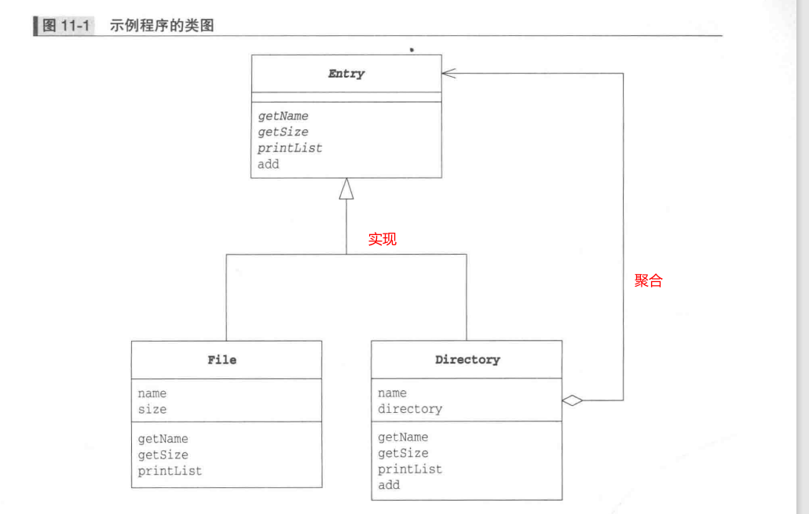
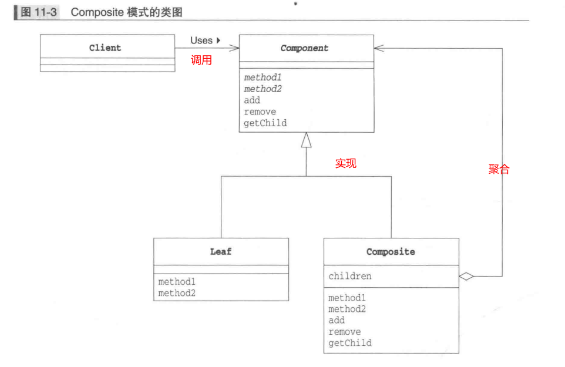
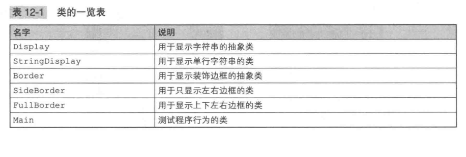
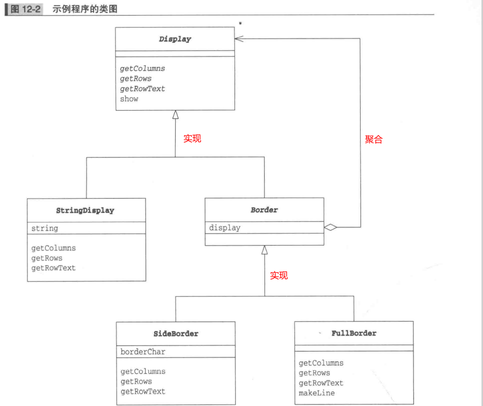
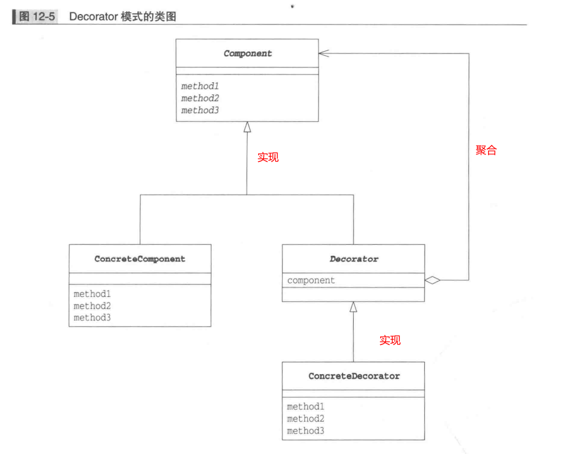
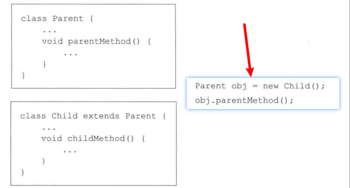
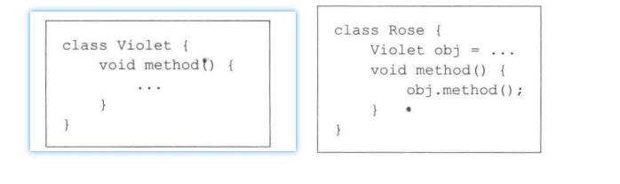

简介：

图解设计模式第五部分：Composite模式、Decorate模式。

<!--more-->

# 一、Composite模式

## 1.1、介绍

> 将容器和内容作为同一种东西看待。能够使容器与内容具有一致性，创造出递归结构的模式就是Composite模式。
>
> 另一种说法是：用于把一组相似的对象当作一个单一的对象。

例如：想查找某个文件夹中有什么东西时候，找到的可能是文件夹，也有可能是文件。简单来说，找到的都是目录条目。

## 1.2、示例程序

### 1.2.1、类的一览表

| 名字                    | 说明                                      |
| ----------------------- | ----------------------------------------- |
| Entry                   | 抽象类用来实现File类和Directory类的一致性 |
| File                    | 表示文件的类                              |
| Directory               | 表示文件夹的类                            |
| FileTreatementException | 表示向文件中增加Entry时发生的异常的类     |
| Main                    | 测试程序行为的类                          |

### 1.2.2、类图



### 1.2.3、Entry

```java
public abstract class Entry {
    public abstract String getName();                               // 获取名字
    public abstract int getSize();                                  // 获取大小
    public Entry add(Entry entry) throws FileTreatmentException {   // 加入目录条目
        throw new FileTreatmentException();
    }
    public void printList() {                                       // 为一览加上前缀并显示目录条目一览
        printList("");
    }
    protected abstract void printList(String prefix);               // 为一览加上前缀
    @Override
    public String toString() {                                      // 显示代表类的文字
        return getName() + " (" + getSize() + ")";
    }
}

```

### 1.2.4、File

```java
public class File extends Entry {
    private String name;
    private int size;
    public File(String name, int size) {
        this.name = name;
        this.size = size;
    }
    @Override
    public String getName() {
        return name;
    }
    @Override
    public int getSize() {
        return size;
    }
    @Override
    protected void printList(String prefix) {
        System.out.println(prefix + "/" + this);
    }
}

```

### 1.2.5、Directory

```java
import java.util.Iterator;
import java.util.ArrayList;

public class Directory extends Entry {
    private String name;                    // 文件夹的名字
    private ArrayList directory = new ArrayList();      // 文件夹中目录条目的集合
    public Directory(String name) {         // 构造函数
        this.name = name;
    }
    @Override
    public String getName() {               // 获取名字
        return name;
    }
    @Override
    public int getSize() {                  // 获取大小
        int size = 0;
        Iterator it = directory.iterator();
        while (it.hasNext()) {
            Entry entry = (Entry)it.next();
            size += entry.getSize();
        }
        return size;
    }
    @Override
    public Entry add(Entry entry) {         // 增加目录条目
        directory.add(entry);
        return this;
    }
    @Override
    protected void printList(String prefix) {       // 显示目录条目一览
        System.out.println(prefix + "/" + this);
        Iterator it = directory.iterator();
        while (it.hasNext()) {
            Entry entry = (Entry)it.next();
            entry.printList(prefix + "/" + name);
        }
    }
}

```

### 1.2.6、FileTreatmentException

```java
public class FileTreatmentException extends RuntimeException {
    public FileTreatmentException() {
    }
    public FileTreatmentException(String msg) {
        super(msg);
    }
}
```

### 1.2.7、Main

```java
public class Main {
    public static void main(String[] args) {
        try {
            System.out.println("Making root entries...");
            Directory rootdir = new Directory("root");
            Directory bindir = new Directory("bin");
            Directory tmpdir = new Directory("tmp");
            Directory usrdir = new Directory("usr");
            rootdir.add(bindir);
            rootdir.add(tmpdir);
            rootdir.add(usrdir);
            bindir.add(new File("vi", 10000));
            bindir.add(new File("latex", 20000));
            rootdir.printList();

            System.out.println("");
            System.out.println("Making user entries...");
            Directory yuki = new Directory("yuki");
            Directory hanako = new Directory("hanako");
            Directory tomura = new Directory("tomura");
            usrdir.add(yuki);
            usrdir.add(hanako);
            usrdir.add(tomura);
            yuki.add(new File("diary.html", 100));
            yuki.add(new File("Composite.java", 200));
            hanako.add(new File("memo.tex", 300));
            tomura.add(new File("game.doc", 400));
            tomura.add(new File("junk.mail", 500));
            rootdir.printList();
        } catch (FileTreatmentException e) {
            e.printStackTrace();
        }
    }
}
```

## 1.3、登场角色

#### 1.Leaf（树叶）

表示“内容”的角色。在该角色中不能放入其他对象。在示例程序中，由File类扮演此角色。

#### 2.Composite（复合物）

表示容器的角色。可以在其中放入Leaf角色和Composite角色。在示例程序中，由Directory类扮演此角色。

#### 3.Component

使Leaf角色和Composite角色具有一致性的角色。Component角色是Leaf角色和Composite角色的父类。在示例程序中，由Entry类扮演此角色。

#### 4.Client

使用Composite模式的角色。在示例程序中，由Main类扮演此角色。


## 1.4、注意点

通用类图



使用Composite模式可以使容器与内容具有一致性，也可以称其为多个和单个的一致性，即将多个对象结合在一起，当作一个对象进行处理。

# 二、Decorator 模式

## 2.1、简介

> 程序中的对象与蛋糕十分相似。首先有一个相当于蛋糕的对象，然后像不断的装饰蛋糕一样地不断地对其增加功能，他就变成了使用目的更加明确的对象。
>
> 像这样不断的为对象添加装饰的设计模式被称为Decorator 模式。通过添加装饰物增加对象的功能。

## 2.2、示例程序





### Display

```java
public abstract class Display {
    public abstract int getColumns();               // 获取横向字符数
    public abstract int getRows();                  // 获取纵向行数
    public abstract String getRowText(int row);     // 获取第row行的字符串
    public void show() {                            // 全部显示
        for (int i = 0; i < getRows(); i++) {
            System.out.println(getRowText(i));
        }
    }
}
```

#### StringDisplay

```java
public class StringDisplay extends Display {
    private String string;                          // 要显示的字符串
    public StringDisplay(String string) {           // 通过参数传入要显示的字符串
        this.string = string;
    }
    @Override
    public int getColumns() {                       // 字符数
        return string.getBytes().length;
    }
    @Override
    public int getRows() {                          // 行数是1
        return 1;
    }
    @Override
    public String getRowText(int row) {             // 仅当row为0时返回值
        if (row == 0) {
            return string;
        } else {
            return null;
        }
    }
}
```

#### Border

```java
public abstract class Border extends Display {
    protected Display display;          // 表示被装饰物
    protected Border(Display display) { // 在生成实例时通过参数指定被装饰物
        this.display = display;
    }
}
```

#### SideBorder

```java
public class SideBorder extends Border {
    private char borderChar;                        // 表示装饰边框的字符
    public SideBorder(Display display, char ch) {   // 通过构造函数指定Display和装饰边框字符 
        super(display);
        this.borderChar = ch;
    }
    @Override
    public int getColumns() {                       // 字符数为字符串字符数加上两侧边框字符数
        return 1 + display.getColumns() + 1;
    }
    @Override
    public int getRows() {                          // 行数即被装饰物的行数
        return display.getRows();
    }
    @Override
    public String getRowText(int row) {             // 指定的那一行的字符串为被装饰物的字符串加上两侧的边框的字符
        return borderChar + display.getRowText(row) + borderChar;
    }
}
```

#### FullBorder

```java
public class FullBorder extends Border {
    public FullBorder(Display display) {
        super(display);
    }
    @Override
    public int getColumns() {                   // 字符数为被装饰物的字符数加上两侧边框字符数
        return 1 + display.getColumns() + 1;
    }
    @Override
    public int getRows() {                      // 行数为被装饰物的行数加上上下边框的行数
        return 1 + display.getRows() + 1;
    }
    @Override
    public String getRowText(int row) {         // 指定的那一行的字符串
        if (row == 0) {                                                 // 上边框
            return "+" + makeLine('-', display.getColumns()) + "+";
        } else if (row == display.getRows() + 1) {                      // 下边框
            return "+" + makeLine('-', display.getColumns()) + "+";
        } else {                                                        // 其他边框
            return "|" + display.getRowText(row - 1) + "|";
        }
    }
    private String makeLine(char ch, int count) {         // 生成一个重复count次字符ch的字符串 
        StringBuffer buf = new StringBuffer();
        for (int i = 0; i < count; i++) {
            buf.append(ch);
        }
        return buf.toString();
    }
}

```

#### Main

```java
public class Main {
    public static void main(String[] args) {
        Display b1 = new StringDisplay("Hello, world.");
        Display b2 = new SideBorder(b1, '#');
        Display b3 = new FullBorder(b2);
        b1.show();
        b2.show();
        b3.show();
        Display b4 = new SideBorder(
                        new FullBorder(
                            new FullBorder(
                                new SideBorder(
                                    new FullBorder(
                                        new StringDisplay("你好，世界。")
                                    ),
                                    '*'
                                )
                            )
                        ),
                        '/'
                    );
        b4.show();
    }
}
```

## 2.3、登场角色

#### 1.Component

增加功能时的核心角色。在示例程序中，由Display类扮演此角色。

#### 2.ConcreteComponent

该角色是实现了Component角色所定义的接口（API）的具体蛋糕。在示例程序中，由StringDisplay类扮演此角色。

#### 3.Decorator（装饰物）

该角色具有与Component角色相同的接口（API）。在它内部保存了被装饰对象——Component角色。Decorator角色知道自己要装饰的对象。在示例程序中，由Border类扮演此角色。

#### 4.ConcreteDecorator（具体的装饰物）

该角色是具体的Decorator角色。在示例程序中，由SideBorder和FullBorder类扮演此角色。

## 2.4、通用类图



## 2.5、扩展

### 继承和委托中的一致性

> “可以将不同的东西当作同一种东西看待”

例如：

#### 父类和子类



将子类当作父类看待，但是反过来，将父类当作子类看待，就需要强制类型转换了。

#### 委托



Rose将method方法的处理委托给了Violet。