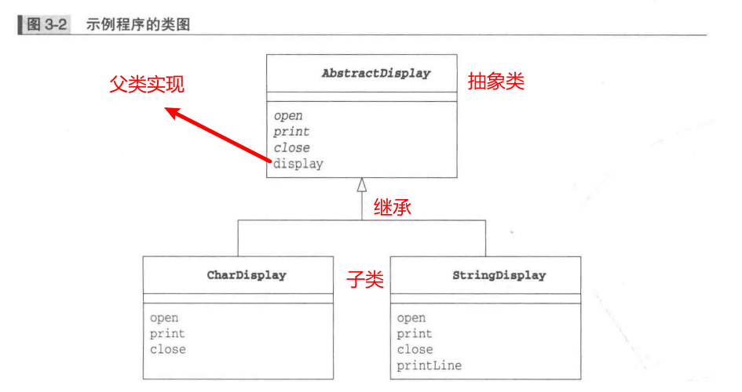
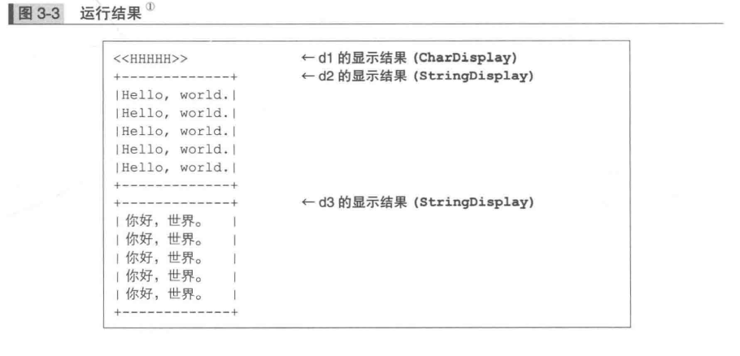
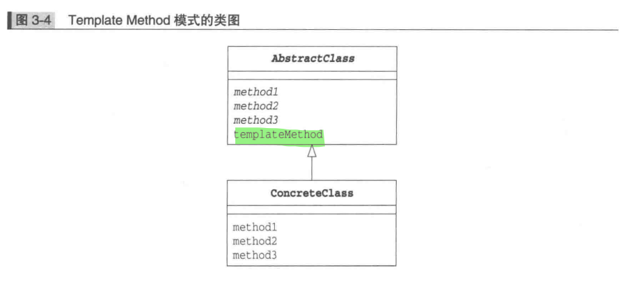
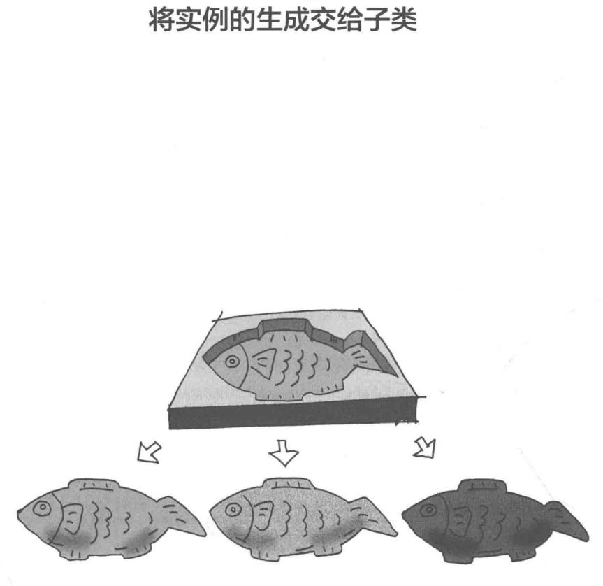
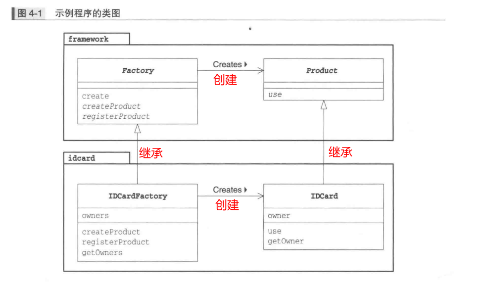
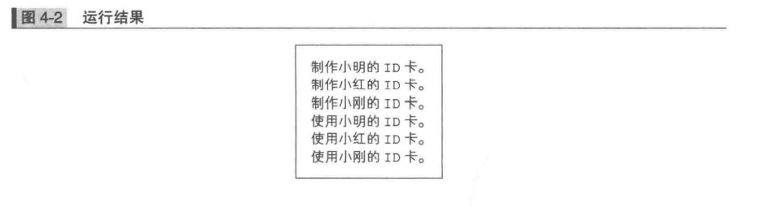
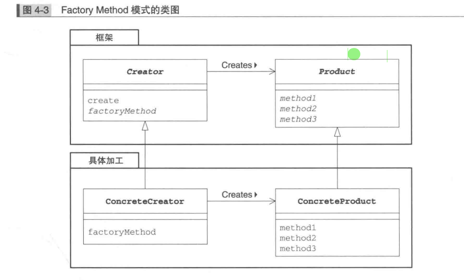
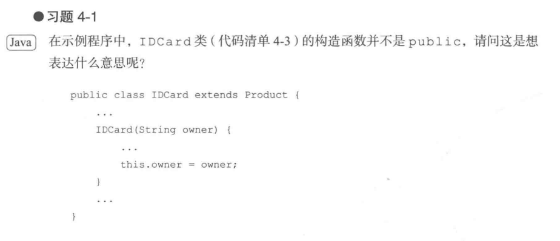
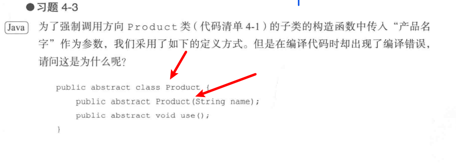

# Template Method模式

## 定义

什么是Template Method模式？

>不论子类中的具体实现如何，处理的流程都会按照父类中定义的那样进行。
>
>再父类中定义处理流程的框架，再子类中实现具体处理的模式就称为Template Method模式。

## 示例程序

一段将字符和字符串循环显示5次的简单程序。

| 名字            | 说明                             |
| --------------- | -------------------------------- |
| AbstractDisplay | 只实现了display方法的抽象类      |
| CharDisplay     | 实现了open、print、close方法的类 |
| StringDisplay   | 实现了open、print、close方法的类 |
| Main            | 测试类                           |



### AbstractDisplay

```java
public abstract class AbstractDisplay { // 抽象类AbstractDisplay
    public abstract void open();        // 交给子类去实现的抽象方法(1) open
    public abstract void print();       // 交给子类去实现的抽象方法(2) print
    public abstract void close();       // 交给子类去实现的抽象方法(3) close
    public final void display() {       // 本抽象类中实现的display方法
        open();                         // 首先打开…
        for (int i = 0; i < 5; i++) {   // 循环调用5次print
            print();                    
        }
        close();                        // …最后关闭。这就是display方法所实现的功能
    }
}
```

### CharDisplay

```java
public class CharDisplay extends AbstractDisplay {  // CharDisplay是AbstractDisplay的子类 
    private char ch;                                // 需要显示的字符
    public CharDisplay(char ch) {                   // 构造函数中接收的字符被
        this.ch = ch;                               // 保存在字段中
    }
    public void open() {                            // 在父类中是抽象方法，此处重写该方法  
        System.out.print("<<");                     // 显示开始字符"<<"
    }
    public void print() {                           // 同样地重写print方法。该方法会在display中被重复调用
        System.out.print(ch);                       // 显示保存在字段ch中的字符
    }
    public void close() {                           // 同样地重写close方法
        System.out.println(">>");                   // 显示结束字符">>"
    }
}

```

### StringDisplay

```java
public class StringDisplay extends AbstractDisplay {    // StringDisplay也是AbstractDisplay的子类 
    private String string;                              // 需要显示的字符串
    private int width;                                  // 以字节为单位计算出的字符串长度
    public StringDisplay(String string) {               // 构造函数中接收的字符串被
        this.string = string;                           // 保存在字段中
        this.width = string.getBytes().length;          // 同时将字符串的字节长度也保存在字段中，以供后面使用 
    }
    public void open() {                                // 重写的open方法
        printLine();                                    // 调用该类的printLine方法画线
    }
    public void print() {                               // print方法
        System.out.println("|" + string + "|");         // 给保存在字段中的字符串前后分别加上"|"并显示出来 
    }
    public void close() {                               // close方法
        printLine();                                    // 与open方法一样，调用printLine方法画线
    }
    private void printLine() {                          // 被open和close方法调用。由于可见性是private，因此只能在本类中被调用 
        System.out.print("+");                          // 显示表示方框的角的"+"
        for (int i = 0; i < width; i++) {               // 显示width个"-"
            System.out.print("-");                      // 组成方框的边框
        }
        System.out.println("+");                        // /显示表示方框的角的"+"
    }
}

```

### Main

```java
public class Main {
    public static void main(String[] args) {
        AbstractDisplay d1 = new CharDisplay('H');                  // 生成一个持有'H'的CharDisplay类的实例 
        AbstractDisplay d2 = new StringDisplay("Hello, world.");    // 生成一个持有"Hello, world."的StringDisplay类的实例 
        AbstractDisplay d3 = new StringDisplay("你好，世界。");     // 生成一个持有"你好，世界。"的StringDisplay类的实例 
        d1.display();                                               // 由于d1、d2和d3都是AbstractDisplay类的子类
        d2.display();                                               // 可以调用继承的display方法
        d3.display();                                               // 实际的程序行为取决于CharDisplay类和StringDisplay类的具体实现 
    }
}

```

### 运行结果



## 登场角色

### AbstractClass（抽象类）

>AbstractClass角色不仅负责实现模板方法，还负责声明在模版方法中所使用到的抽象方法。抽象方法由子类ConcreteClass角色实现。示例中，AbstractDisplay类扮演次角色。

### ConcreteClass（具体类）

>该角色负责具体实现 **AbstractClass** 角色中定义的抽象方法。这里的实现会将在 **AbstractClass** 角色的模板方法中被调用。在示例程序中由 **CharDisplay** 和 **StringDisplay** 类扮演此角色。



## 拓展

优点：可复用性，由于在父类的模版方法中编写了算法，因此无需在每个子类中再编写算法。


### 多态

为什么要将子类实例保存在父类变量中呢？

> - 即使没有用指定子类的种类，程序也能正常工作，方便后期修改
> - 这种原则称谓LSP（里氏替换原则）

### 父类和子类之间的协作

> - 父类与子类的相互协作撑起了整个程序
> - 那些处理需要父类实现，那些需要子类实现，并没有定式
> - 需要负责程序开发的人员来决定

# Factory Method 模式



## 简介

> 用Template Method模式来构建生成实例的工厂，这就是工厂模式。
>
> 在**Factory Method模式**中，父类决定实例的**生成方式**，但并不决定所要生成的具体的类，具体的处理全部交给子类负责。

##  示例程序

| 包        | 名字          | 说明                                         |
| --------- | ------------- | -------------------------------------------- |
| framework | Product       | 只定义抽象方法use的抽象类                    |
| framework | Factory       | 实现了create方法的抽象类                     |
| idcard    | IDCard        | 实现了use方法的类                            |
| idcard    | IDCardFactory | 实现了createProduct、registerProduct方法的类 |
| 无        | Main          | 测试类                                       |



- Framework生成实例的框架
- Idcard加工处理

### Product类

```java
public abstract class Product {
    public abstract void use();
}
```

### Factory类

```java
public abstract class Factory {
    public final Product create(String owner) {
        Product p = createProduct(owner);
        registerProduct(p);
        return p;
    }

    protected abstract Product createProduct(String owner);

    protected abstract void registerProduct(Product product);
}

```

具体的实现内容根据**Factory Method模式**适用的场景不同而不同。但是，只要是**Factory Method模式**，在生成实例时就一定会使用到**Template Method模式**。

### IDCard类

```java
public class IDCard extends Product {

    private String owner;

    IDCard(String owner) {
        System.out.println("制作" + owner + "的ID卡。");
        this.owner = owner;
    }

    @Override
    public void use() {
        System.out.println("使用" + owner + "的ID卡。");
    }

    public String getOwner() {
        return owner;
    }
}
```

### IDCardFactory类

```java
public class IDCardFactory extends Factory {
    private List<String> owners = new ArrayList<>();

    @Override
    protected Product createProduct(String owner) {
        return new IDCard(owner);
    }

    @Override
    protected void registerProduct(Product product) {
        owners.add(((IDCard) product).getOwner());
    }

    public List getOwners() {
        return owners;
    }
}
```

### Main类

```java
public class Main {
    public static void main(String[] args) {
        Factory factory = new IDCardFactory();
        Product card1 = factory.create("小明");
        Product card2 = factory.create("小红");
        Product card3 = factory.create("小刚");
        card1.use();
        card2.use();
        card3.use();
    }
}
```



从代码可以看出，framework不依赖于idcard。框架与具体加工分开实现。

## 登场角色



### 1.Product(产品)

**Product**角色属于框架这一方，是一个抽象类。它定义了在**Factory Method**模式中生成的那些实例所持有的接口（API），但具体的处理则由子类**ConcreteProduct**角色决定。在示例程序中，由**Product**类扮演此角色。

### 2.Creator(创建者)

**Creator**角色属于框架这一方，它是负责生成**Product**角色的抽象类，但具体的处理则由子类**ConcreteCreator**角色决定。在示例程序中，由**Factory**类扮演此角色。

Creator角色对于实际负责生成实例的ConcreteCreator角色一无所知，它唯一知道的就是，只要调用Product角色和生成实例的方法，就可以生成Product的实例。在示例程序中，createProduct方法是用于生成实例的方法。

> **不用new关键字来生成实例，而是调用生成实例的专用方法来生成实例，这样就可以防止父类与其他具体类耦合**。

### 3.ConcreteProduct(具体的产品)

ConcreteProduct角色属于具体加工这一方，它决定了具体的产品。在示例程序中，由IDCard类扮演此角色。

### 4.ConcreteCreator(具体的创建者)

ConcreteCreator角色属于具体加工这一方，它负责生成具体的产品。在示例程序中，由ID CardFactory类扮演此角色。

## 扩展

### 生成实例————方法的三种实现方式

- 指定其为抽象方法

  ```java
  public abstract class Factory {
      protected abstract Product createProduct(String name);
  }
  ```

- 为其实现默认处理

  ```java
  class Factory {
      public Product createProduct(String name){
          return new Product(name);
      }
  }
  //子类不实现这个方法的话，默认走父类的方法
  ```

- 在其中抛出异常（子类没有实现这个方法，就会直接调用父类方法，抛出异常）

  ```java
  class Factory {
      public Product createProduct(String name){
          throws new FactoryMethodRuntimeException(name);
      }
  }
  ```

## 总结

> 分析设计模式时候，不应将其中一个类单独拿出来分析，必须着眼于类和接口之间的相互关系。

## 练习题



解答：

> 构造函数不加Public只有相同包可以访问，意思就是在别的包下，是不能new这个实例的，只能使用相同包下的工厂进行生成。



解答：

> 抽象类的构造器不能为抽象方法。