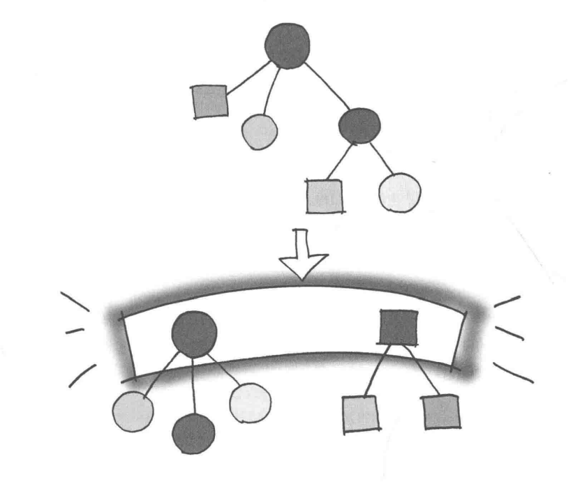
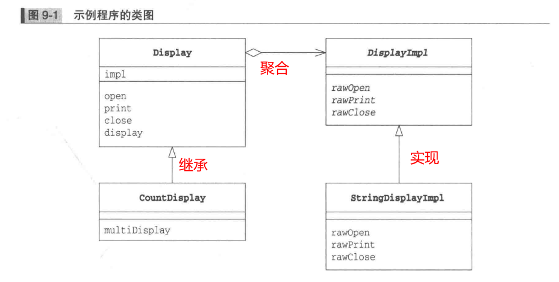
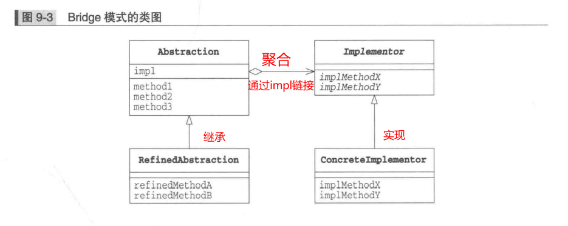
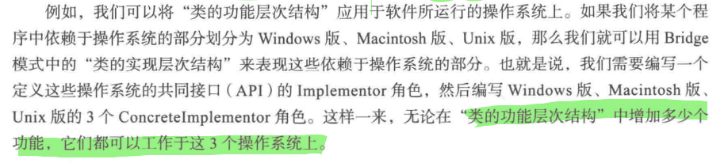
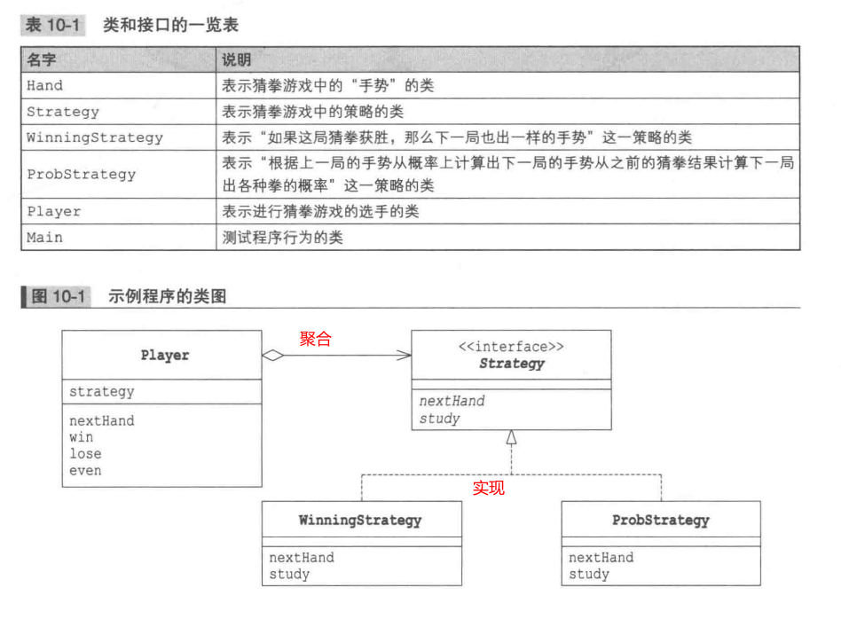
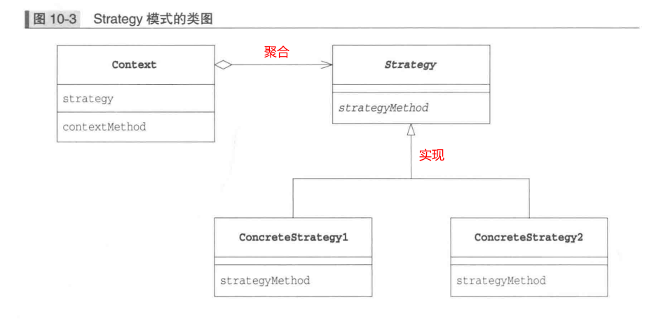

简介：

图解设计模式第四部分，包含Bridge模式、Strategy模式。

<!--more-->

# 一、Bridge模式



> Bridge模式的作用是在“类的功能层次结构”和“类的实现层次机构”之间搭建桥梁。

- 类的功能层次结构
- 类的实现层次结构

### 1、类的层次结构的两个作用

#### （1）.希望增加新的功能时

其实就是主要是继承，我们在子类中增加新的方法。这样就构成了一个小小的类层次结构。
也就是为了增加新功能而产生的层次结构。

- 父类具有基本功能
- 在子类中增加新的功能

像这种层次结构就称为“类的功能层次结构”。

**通常来说，类的层次机构关系不应该过深。**

#### （2）.希望增加新的实现时

- 父类通过声明抽象方法来定义接口（API）
- 子类通过实现具体方法来实现接口（API）

像这种层次结构被称为“类的实现层次结构”。

### 2、示例程序

| 在桥的那一侧     | 名字              | 说明                       |
| ---------------- | ----------------- | -------------------------- |
| 类的功能层次结构 | Display           | 负责“显示”的类             |
| 类的功能层次结构 | CountDisplay      | 增加了“只显示规定次数”功能 |
| 类的实现层次结构 | DisplayImpl       | 负责“显示”的类             |
| 类的实现层次结构 | StringDisplayImpl | “用字符串显示”的类         |
|                  | Main              | 测试程序行为的类           |

#### 2.1 类图



#### 2.2 类的功能层次结构

##### Display类

```java
public class Display {
    private DisplayImpl impl;

    public Display(DisplayImpl impl) {
        this.impl = impl;
    }

    public void open() {
        impl.rawOpen();
    }

    public void print() {
        impl.rawPrint();
    }

    public void close() {
        impl.rawClose();
    }

    public final void display() {
        open();
        print();
        close();
    }
}
```

##### CountDisplay类

```java
public class CountDisplay extends Display {
    public CountDisplay(DisplayImpl impl) {
        super(impl);
    }

    public void multiDisplay(int times) {       // 循环显示times次
        open();
        for (int i = 0; i < times; i++) {
            print();
        }
        close();
    }
}
```

#### 2.3 类的实现层次结构

##### DisplayImpl类

```java
public abstract class DisplayImpl {
    public abstract void rawOpen();

    public abstract void rawPrint();

    public abstract void rawClose();
}

```

##### StringDisplayImpl类

```java
public class StringDisplayImpl extends DisplayImpl {
    private String string;                              // 要显示的字符串
    private int width;                                  // 以字节单位计算出的字符串的宽度

    public StringDisplayImpl(String string) {           // 构造函数接收要显示的字符串string
        this.string = string;                           // 将它保存在字段中
        this.width = string.getBytes().length;          // 把字符串的宽度也保存在字段中，以供使用。
    }

    @Override
    public void rawOpen() {
        printLine();
    }

    @Override
    public void rawPrint() {
        System.out.println("|" + string + "|");         // 前后加上"|"并显示
    }

    @Override
    public void rawClose() {
        printLine();
    }

    private void printLine() {
        System.out.print("+");                          // 显示用来表示方框的角的"+"
        for (int i = 0; i < width; i++) {               // 显示width个"-"
            System.out.print("-");                      // 将其用作方框的边框
        }
        System.out.println("+");                        // 显示用来表示方框的角的"+"
    }
}
```

##### Main

```java
public class Main {
    public static void main(String[] args) {
        Display d1 = new Display(new StringDisplayImpl("Hello, China."));
        Display d2 = new CountDisplay(new StringDisplayImpl("Hello, World."));
        CountDisplay d3 = new CountDisplay(new StringDisplayImpl("Hello, Universe."));
        d1.display();
        d2.display();
        d3.display();
        d3.multiDisplay(5);
    }
}
```


### 3、Bridge 模式中的登场角色

#### 1.Abstraction（角色）

该角色位于“类的功能层次结构”的最上层。它使用Implementor角色的方法定义了基本的功能。该角色中保存了Implementor角色的实例。

#### 2.RefinedAbstraction（改善后的抽象化）

在Abstraction角色的基础上增加了新功能的角色。

#### 3.Implementor（实现者）

该角色位于“类的实现层次结构”的最上层。它定义了用于实现Abstraction角色的接口（API）的方法。

#### 4.ConcreteImplementor（具体实现者）

该角色负责实现在Implementor角色中定义的接口（API）。

### 4、通用类图



### 5、扩展

#### 5.1、为什么要进行扩展

> 将功能与实现层分离，有助于独立的对他们进行扩展。
>
> 当想要增加功能，只需要在“类的功能层次结构”一侧增加类即可。增加后的功能可以被“所有的实现”使用（就是所有的实现了接口的实现类）；

例如：



#### 5.2、继承是强关联，委托是弱关联

> 继承容易进行扩展，但是限制也比较厉害，只要不修改代码，就无法改变继承关系，形成了一种强关联。


> 示例中的实例impl就是委托，可以在不改变代码的情况下，就改变关联关系，只要改变传入的实现类就可以改变。具体请看示例代码。

# 二、Strategy模式

>无论什么程序，其目的都是解决问题。而为了解决问题，我们又需要编写特定的算法。使用Strategy模式可以整体地替换算法的实现部分。能够整体地替换算法，能让我们轻松地以不同的方法去解决同一个问题，这种模式就是Strategy模式。
>
>简单来说，就是可以随意替换算法，而不用修改原有方法。


## 1、示例程序



### 1.1、Hand

相当于单例模式，因为其中包含的实例是不可更改，并且有且只有一个。

```java
public class Hand {
    public static final int HANDVALUE_GUU = 0;  // 表示石头的值
    public static final int HANDVALUE_CHO = 1;  // 表示剪刀的值
    public static final int HANDVALUE_PAA = 2;  // 表示布的值
    public static final Hand[] hand = {         // 表示猜拳中3种手势的实例
            new Hand(HANDVALUE_GUU),
            new Hand(HANDVALUE_CHO),
            new Hand(HANDVALUE_PAA),
    };
    private static final String[] name = {      // 表示猜拳中手势所对应的字符串
            "石头", "剪刀", "布",
    };
    private int handvalue;                      // 表示猜拳中出的手势的值

    private Hand(int handvalue) {
        this.handvalue = handvalue;
    }

    public static Hand getHand(int handvalue) { // 根据手势的值获取其对应的实例
        return hand[handvalue];
    }

    public boolean isStrongerThan(Hand h) {     // 如果this胜了h则返回true
        return fight(h) == 1;
    }

    public boolean isWeakerThan(Hand h) {       // 如果this输给了h则返回true
        return fight(h) == -1;
    }

    private int fight(Hand h) {                 // 计分：平0, 胜1, 负-1
        if (this == h) {
            return 0;
        } else if ((this.handvalue + 1) % 3 == h.handvalue) {
            return 1;
        } else {
            return -1;
        }
    }

    @Override
    public String toString() {                  // 转换为手势值所对应的字符串
        return name[handvalue];
    }
}
```

### 1.2、Strategy

接口，实现这个接口的实现类就是一种种的算法。

```java
public interface Strategy {
    Hand nextHand();

    void study(boolean win);
}
```

### 1.3、ProbStrategy

实现类，也就是其中一种算法。

```java
import java.util.Random;

public class ProbStrategy implements Strategy {
    private Random random;
    private int prevHandValue = 0;
    private int currentHandValue = 0;
    private int[][] history = {
        { 1, 1, 1, },
        { 1, 1, 1, },
        { 1, 1, 1, },
    };
    public ProbStrategy(int seed) {
        random = new Random(seed);
    }
    @Override
    public Hand nextHand() {
        int bet = random.nextInt(getSum(currentHandValue));
        int handvalue = 0;
        if (bet < history[currentHandValue][0]) {
            handvalue = 0;
        } else if (bet < history[currentHandValue][0] + history[currentHandValue][1]) {
            handvalue = 1;
        } else {
            handvalue = 2;
        }
        prevHandValue = currentHandValue;
        currentHandValue = handvalue;
        return Hand.getHand(handvalue);
    }
    private int getSum(int hv) {
        int sum = 0;
        for (int i = 0; i < 3; i++) {
            sum += history[hv][i];
        }
        return sum;
    }
    @Override
    public void study(boolean win) {
        if (win) {
            history[prevHandValue][currentHandValue]++;
        } else {
            history[prevHandValue][(currentHandValue + 1) % 3]++;
            history[prevHandValue][(currentHandValue + 2) % 3]++;
        }
    }
}
```

### 1.4、WinningStrategy

```java
import java.util.Random;

public class WinningStrategy implements Strategy {
    private Random random;
    private boolean won = false;
    private Hand prevHand;
    public WinningStrategy(int seed) {
        random = new Random(seed);
    }
    @Override
    public Hand nextHand() {
        if (!won) {
            prevHand = Hand.getHand(random.nextInt(3));
        }
        return prevHand;
    }
    @Override
    public void study(boolean win) {
        won = win;
    }
}
```

### 1.5、Player

```java
public class Player {
    private String name;
    private Strategy strategy;
    private int wincount;
    private int losecount;
    private int gamecount;
    public Player(String name, Strategy strategy) {         // 赋予姓名和策略
        this.name = name;
        this.strategy = strategy;
    }
    public Hand nextHand() {                                // 策略决定下一局要出的手势
        return strategy.nextHand();
    }
    public void win() {                 // 胜
        strategy.study(true);
        wincount++;
        gamecount++;
    }
    public void lose() {                // 负
        strategy.study(false);
        losecount++;
        gamecount++;
    }
    public void even() {                // 平
        gamecount++;
    }
    @Override
    public String toString() {
        return "[" + name + ":" + gamecount + " games, " + wincount + " win, " + losecount + " lose" + "]";
    }
}

```

### 1.6、Main

```java
public class Main {
    public static void main(String[] args) {
        int seed1 = 314;
        int seed2 = 15;
        Player player1 = new Player("Taro", new WinningStrategy(seed1));
        Player player2 = new Player("Hana", new ProbStrategy(seed2));
        for (int i = 0; i < 10000; i++) {
            Hand nextHand1 = player1.nextHand();
            Hand nextHand2 = player2.nextHand();
            if (nextHand1.isStrongerThan(nextHand2)) {
                System.out.println("Winner:" + player1);
                player1.win();
                player2.lose();
            } else if (nextHand2.isStrongerThan(nextHand1)) {
                System.out.println("Winner:" + player2);
                player1.lose();
                player2.win();
            } else {
                System.out.println("Even...");
                player1.even();
                player2.even();
            }
        }
        System.out.println("Total result:");
        System.out.println(player1.toString());
        System.out.println(player2.toString());
    }
}
```

## 2、登场角色

### 2.1、Strategy（策略）

> Strategy角色负责决定实现策略所必须的接口（API）。在示例程序中，由Strategy接口扮演此角色。

### 2.2、ConcreteStrategy（具体的策略）

> ConcreteStrategy角色负责实现Strategy角色的接口（API），即负责实现具体的策略（战略、方向、方法和算法）。在示例程序中，由WinningStrategy类和ProbStrategy类扮演此角色。

### 2.3、Context（上下文）

> 负责使用Strategy角色。Context角色保存了ConcreteStrategy角色的实例，并使用ConcreteStrategy角色去实现需求（总之，还是要调用Strategy角色的接口（API））。在示例程序中，由Player类扮演此角色。

## 3、通用类图



## 4、优点

当我们想要通过改善算法来提高算法的处理速度时，如果使用了Strategy 模式，就不必修改Strategy 角色的接口（API）了，仅仅修改ConcreteStrategy角色即可。而且，**使用委托这种弱关联关系可以很方便地整体替换算法**。