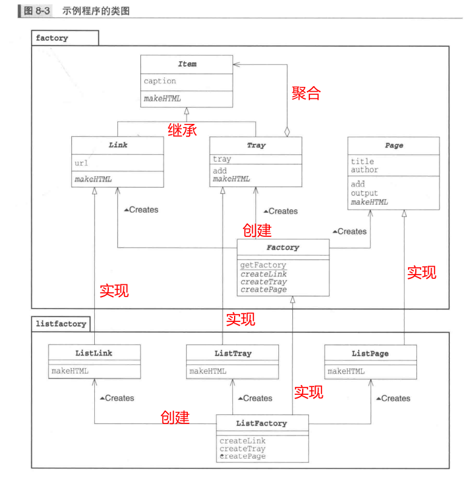

简介：

图解设计模式第三部分，包含单例模式、原型模式、Builder模式、Abstract Factory模式。

<!--more-->

# 一、Singleton单例模式

> 只有一个实例

## 示例程序

### 线程安全的单例模式

```java
public class Singleton {
    private static Singleton singleton = null;
    private Singleton(){
        System.out.println("生成了一个实例");
        slowdown();
    }
    public static synchronized Singleton getInstance(){
        if(singleton == null){
            singleton = new Singleton();
        }
        return singleton;
    }
    private void slowdown(){
        try {
            Thread.sleep(1000);
        } catch (InterruptedException e) {
            e.printStackTrace();
        }
    }
}

```

```java
public class Main {
    public static void main(String[] args) {
        for (int i = 0; i < 20; i++) {
            Thread t = new Thread(new Runnable() {
                @Override
                public void run() {
                    Singleton instance = Singleton.getInstance();
                    instance.getNextTicketNumber();
                    System.out.println(instance.toString());
                }
            });
            t.start();
        }
    }
}
```

> 不增加synchronized关键字的话，会出现线程问题，所以说不加synchronized关键字不是完整的单例模式，因为在同一时间可能存在多个线程同时访问，就会创建多个实例。

## 单例分类

### 1、饿汉式单例

```java
public class Singleton {
    private static final Singleton singleton = new Singleton();
    private Singleton(){
    }
    public static Singleton getSingleton(){
        return singleton;
    }
}
```

### 2、懒汉式单例

```java
public class Singleton {
    private static  Singleton singleton = null;
    private Singleton(){
    }
    public synchronized static Singleton getSingleton(){
        if(singleton == null){
            singleton = new Singleton();
        }
        return singleton;
    }
}

```

### 3、双重检查加锁

```java
public class Singleton {
    private volatile static Singleton instance;
    private Singleton() {
    }
    public static Singleton getInstance() {
        if (instance == null) {
            synchronized (Singleton.class) {
                if (instance == null) {
                    instance = new Singleton();
                }
            }
        }
        return instance;
    }
}
```

### 4、懒汉与饿汉区别

- 饿汉式是线程安全的,在类创建的同时就已经创建好一个静态的对象供系统使用,以后不在改变。
  懒汉式如果在创建实例对象时不加上synchronized则会导致对对象的访问不是线程安全的。
- 从实现方式来讲他们最大的区别就是懒汉式是延时加载,他是在需要的时候才创建对象
  而饿汉式在虚拟机启动的时候就会创建，饿汉式无需关注多线程问题

## 单例优缺点

### 1、优点

- 由于单例模式在内存中只有一个实例，减少了内存开支，特别是一个对象需要频繁地创建、销毁时，而且创建或销毁时性能又无法优化，单例模式的优势就非常明显。
- 由于单例模式只生成一个实例，所以减少了系统的性能开销，当一个对象的产生需要比较多的资源时，可以通过在应用启动时直接产生一个单例对象，然后用永久驻留内存的方式来解决。
- 单例模式可以避免对资源的多重占用，例如一个写文件动作，由于只有一个实例存在在内存中，避免对同一个资源文件的同时写操作。
- 单例模式可以在系统设置全局的访问点，优化和共享资源访问，例如可以设计一个单例类，负责所有数据表的映射处理。

### 2、缺点

- 单例模式一般没有接口，扩展很困难，若要扩展，除了修改代码基本上没有第二种途径可以实现。
- 单例模式对测试是不利的。在并行开发环境中，如果单例模式没有完成，是不能进行测试的，没有接口也不能使用mock的方式虚拟一个对象。
- 单例模式与单一职责原则?️冲突。一个类应该只实现一个逻辑，而不关心它是否是单例的，是不是要单例取决于环境，单例模式把“要单例”和业务逻辑融合在一个类中。

# 二、Prototype模式

## 2.1、什么是原型模式？

> **这种模式是实现了一个原型接口，该接口用于创建当前对象的克隆。当直接创建对象的代价比较大时，则采用这种模式**。


> - 比如一个表格，需要很多人填写，你创建好了之后，复制发给别人就行了，别人就不用重新创建了。
> - 例如，一个对象需要在一个高代价的数据库操作之后被创建。我们可以缓存该对象，在下一个请求时返回它的克隆，在需要的时候更新数据库，以此来减少数据库调用。

## 2.2、使用情况

### 1、当一个类的实例只能有几个不同状态组合中的一种时。

> 建立相应数目的原型并克隆它们可能比每次用合适的状态手工实例化该类更方便一些。
>
> 这里不要片面的想只有输出，好比是个士兵，有血量、等级等状态，想要新建一个士兵，那么克隆比new一个更方便

### 2、难以根据类生成实例时。

> 例如，我们假设这里有一个实例，即表示用户在图形编辑器中使用鼠标制作出的图形实例。想在程序中创建这样的实例是非常困难的。通常，在想生成一个和之前用户通过操作所创建出的实例完全一样的实例的时候，我们事先将用户所创建出的实例保存起来，然后在需要时通过复制来生成新的实例。

### 3、想解耦框架与生成的实例时

第三种情况是想要让生成实例的框架不依赖于具体的类。这时，不能指定类名来生成实例，而要事先“注册”一个“原型”实例，然后通过复制该实例来生成新的实例。
根据实例生成实例与使用复印文档相类似。即使不知道原来的文档中的内容，我们也可以使用复印机复制出完全相同的文件，无论多少份都行。

> **一旦在代码重出现要使用的类的名字，就无法与改类分离开来，也就无法实现复用。**

## 2.3、实例代码


#### Product接口

```java
public interface Product extends Cloneable{
    void use(String s);

    Product createClone();
}

```

#### Manager类

```java
public class Manager {
    private HashMap showcase = new HashMap<>();

    public void register(String name, Product proto) {
        showcase.put(name, proto);
    }

    public Product create(String protoname){
        Product p = (Product) showcase.get(protoname);
        return p.createClone();
    }
}
```

#### UnderlinePen类

```java
public class UnderlinePen implements Product {

    private char ulchar;

    public UnderlinePen(char ulchar) {
        this.ulchar = ulchar;
    }

    @Override
    public void use(String s) {
        int length = s.getBytes().length;
        System.out.println("\"" + s + "\"");
        System.out.print(" ");
        for (int i = 0; i < length; i++) {
            System.out.print(ulchar);
        }
        System.out.println(ulchar);
    }

    @Override
    public Product createClone() {
        Product p = null;
        try {
            p = (Product) clone();
        } catch (CloneNotSupportedException e) {
            e.printStackTrace();
        }
        return p;
    }
}

```

#### MessageBox类

```java
public class MessageBox implements Product {

    private char decochar;

    public MessageBox(char decochar) {
        this.decochar = decochar;
    }

    @Override
    public void use(String s) {
        int length = s.getBytes().length;
        for (int i = 0; i < length + 4; i++) {
            System.out.print(decochar);
        }
        System.out.println("");
        System.out.println(decochar + " " + s + " " + decochar);
        for (int i = 0; i < length + 4; i++) {
            System.out.print(decochar);
        }
        System.out.println("");
    }

    @Override
    public Product createClone() {
        Product p = null;
        try {
            //调用类的副本，super.
            p = (Product) clone();
        } catch (CloneNotSupportedException e) {
            e.printStackTrace();
        }

        return p;
    }
}

```

#### Main类

```java
public class Main {
    public static void main(String[] args) {
        // 准备
        Manager manager = new Manager();
        UnderlinePen upen = new UnderlinePen('~');
        MessageBox mbox = new MessageBox('*');
        MessageBox sbox = new MessageBox('/');
        manager.register("strong message", upen);
        manager.register("warning box", mbox);
        manager.register("slash box", sbox);

        // 生成
        Product p1 = manager.create("strong message");
        p1.use("Hello,world.");
        Product p2 = manager.create("warning box");
        p2.use("Hello,world.");
        Product p3 = manager.create("slash box");
        p3.use("Hello,world.");
    }
}

```

> 这个示例其实不是很好理解，因为你可能会说，我直接调用use方法不就可以改变输入的字符串，你改变样式也是需要先new一个对象，放进register方法中，这不是多此一举嘛。
>
> 其实不然，这里只演示了输出，如果use方法是对实例属性进行赋值呢，比如给小明赋值年龄11，你再赋值13，那么11的小明去了哪里呢，所以说，原型模式的本意是可以复制多个实例，减少new提升性能。

## 2.4、登场角色

### 1.Prototype(原型)

Product角色负责定义用于复制现有实例来生成新实例的方法。在示例程序中，由Product接口扮演此角色。

### 2.ConcretePrototype(具体的原型)

ConcretePrototype角色负责实现复制现有实例并生成新实例的方法。在示例程序中，由MessageBox类和UnderlinePen类扮演此角色。

### 3.Client(使用者)

Client角色负责使用复制实例的方法生成新的实例。在示例程序中，由Manager类扮演此角色。

### Protoype模式的通用类图


## 2.5、Java语言的clone

注意：被复制的对象必须要实现Cloneable接口。没有实现则抛出异常。

**clone方法所进行的复制只是将被复制实例的字段值直接复制到新的实例中**。换言之，它并没有考虑字段中所保存的实例的内容。例如，当字段中保存的是数组时，如果使用clone方法进行复制，则只会复制该数组的引用，并不会一一复制数组中的元素。


clone方法是浅复制，如果不符合要求，可以进行重写。


> clone方法只会进行复制，并不会调用被复制实例的构造函数。

# 三、Builder模式

组装复杂的实例！


## 3.1、示例程序

- 含有一个标题
- 含有几个字符串
- 含有条目项目

| 名字        | 说明                             |
| ----------- | -------------------------------- |
| Builder     | 定义了决定文档结构的方法的抽象类 |
| Director    | 编写一个文档的类                 |
| TextBuilder | 使用纯文本编写文档的类           |
| HTMLBuilder | 使用HTML编写文档的类             |
| Main        | 测试类                           |


### Builder类

```java
public abstract class Builder {
    public abstract void makeTitle(String title);
    public abstract void makeString(String str);
    public abstract void makeItems(String[] items);
    public abstract void close();
}
```

### Director类

并不关心实际编写文档的到底是TextBuilder还是HTMLBuilder。

```java
public class Director {
    private Builder builder;
    public Director(Builder builder){
        this.builder = builder;
    }

    /**
     * 编写文档
     */
    public void construct(){
        // 标题
        builder.makeTitle("Greeting");
        // 字符串
        builder.makeString("从早上至下午");
        // 条目
        builder.makeItems(new String[]{"早上好。","下午好。"});
        // 其他字符串
        builder.makeString("晚上");
        // 其他条目
        builder.makeItems(new String[]{"晚上好","晚安","再见"});
        // 完成文档
        builder.close();
    }
}
```

### TextBuilder类

```java
public class TextBuilder extends Builder {
    /**
     * 将文档的内容保存在该字段中
     */
    private StringBuffer buffer = new StringBuffer();

    @Override
    public void makeTitle(String title) {
        buffer.append("========================================\n");
        buffer.append("「" + title + "」\n");
        buffer.append("\n");
    }

    @Override
    public void makeString(String str) {                        // 纯文本的字符串
        buffer.append('■' + str + "\n");                       // 为字符串添加■
        buffer.append("\n");                                    // 换行
    }

    @Override
    public void makeItems(String[] items) {                     // 纯文本的条目
        for (int i = 0; i < items.length; i++) {
            buffer.append("　・" + items[i] + "\n");            // 为条目添加・
        }
        buffer.append("\n");                                    // 换行
    }

    @Override
    public void close() {                                       // 完成文档
        buffer.append("==============================\n");      // 装饰线
    }

    public String getResult() {                                 // 完成的文档
        return buffer.toString();                               // 将StringBuffer变换为String
    }
}

```

### HTMLBuilder

```java
public class HTMLBuilder extends Builder {
    private String filename;                                                        // 文件名
    private PrintWriter writer;                                                     // 用于编写文件的PrintWriter
    @Override
    public void makeTitle(String title) {                                           // HTML文件的标题
        filename = title + ".html";                                                 // 将标题作为文件名
        try {
            writer = new PrintWriter(new FileWriter(filename));                     // 生成 PrintWriter
        } catch (IOException e) {
            e.printStackTrace();
        }
        writer.println("<html><head><title>" + title + "</title></head><body>");    // 输出标题
        writer.println("<h1>" + title + "</h1>");
    }
    @Override
    public void makeString(String str) {                                            // HTML文件中的字符串
        writer.println("<p>" + str + "</p>");                                       // 用<p>标签输出
    }
    @Override
    public void makeItems(String[] items) {                                         // HTML文件中的条目
        writer.println("<ul>");                                                     // 用<ul>和<li>输出
        for (int i = 0; i < items.length; i++) {
            writer.println("<li>" + items[i] + "</li>");
        }
        writer.println("</ul>");
    }
    @Override
    public void close() {                                                           // 完成文档
        writer.println("</body></html>");                                           // 关闭标签
        writer.close();                                                             // 关闭文件
    }
    public String getResult() {                                                     // 编写完成的文档
        return filename;                                                            // 返回文件名
    }
}

```

### Main类

```java
public class Main {
    public static void main(String[] args) {
        if (args.length != 1) {
            usage();
            System.exit(0);
        }
        if (args[0].equals("plain")) {
            TextBuilder textbuilder = new TextBuilder();
            Director director = new Director(textbuilder);
            director.construct();
            String result = textbuilder.getResult();
            System.out.println(result);
        } else if (args[0].equals("html")) {
            HTMLBuilder htmlbuilder = new HTMLBuilder();
            Director director = new Director(htmlbuilder);
            director.construct();
            String filename = htmlbuilder.getResult();
            System.out.println(filename + "文件编写完成。");
        } else {
            usage();
            System.exit(0);
        }
    }

    public static void usage() {
        System.out.println("Usage: java Main plain      编写纯文本文档");
        System.out.println("Usage: java Main html       编写HTML文档");
    }
}
```

## 3.2、登场角色

### 1.Builder（建造者）

Builder角色负责定义用于生成实例的接口（API）。Builder角色中准备了用于生成实例的方法。在实例程序中，由Builder类扮演此角色。

### 2.ConcreteBuilder（具体的建造者）

ConcreteBuilder角色是负责实现Builder角色的接口的类（API）。这里定义了在生成实例时实际被调用的方法。此外，在ConcreteBuilder角色中还定义了获取最终生成结果的方法。在示例程序中，由TextBuilder类和HTMLBuilder类扮演此角色。

### 3.Director（监工）

Director角色负责使用Builder角色的接口（API）来生成实例。它并不依赖于ConcreteBuilder角色。为了确保不论ConcreteBuilder角色是如何被定义的，Director角色都能正常工作，它只调用在Builder角色中定义的方法。在示例程序中，由Director类扮演此角色。

### 4.Client（使用者）

该角色使用了Builder模式。在示例程序中，由Main类扮演此角色。

## 3.3、类图和时序图


## 3.4、拓展

> 在面向对象中，“谁知道什么”是非常重要的。也就是说，我们需要在编程时注意哪个类可以使用哪个方法以及使用这个方法到底好不好。
>
> **“只有不知道子类才能替换”**
>
> 正是因为不知道才能够替换，正是因为可以替换，组件才具有高价值。

## 3.5、习题


```java
public abstract class Builder {
    private boolean initialized = false;
    public void makeTitle(String title) {
        if (!initialized) {
            buildTitle(title);
            initialized = true;
        }
    }
    public void makeString(String str) {
        if (initialized) {
            buildString(str);
        }
    }
    public void makeItems(String[] items) {
        if (initialized) {
            buildItems(items);
        }
    }
    public void close() {
        if (initialized) {
            buildDone();
        }
    }
    protected abstract void buildTitle(String title);
    protected abstract void buildString(String str);
    protected abstract void buildItems(String[] items);
    protected abstract void buildDone();
}

```

让需要限制顺序的子类调用make方法，不需要限制顺序的调用build方法。

# 四、Abstract Factory模式（难点）

将关联零件组装成产品。


> 我们并不关心零件的具体实现，而是只关心接口（API）。我们仅使用该接口将零件组装成为产品。

## 4.1、示例程序

- factory包：包含抽象工厂、零件、产品的包
- 无名包：包含Main类的包
- listfactory包：包含具体工厂、零件、产品的包

| 包          | 名字        | 说明                                                 |
| ----------- | ----------- | ---------------------------------------------------- |
| factory     | Factory     | 表示抽象工厂的类（知错Link、Page、Tray）             |
| factory     | Item        | 方便统一处理link和Tray的类                           |
| factory     | Link        | 抽象零件：表示HTML的链接的类                         |
| factory     | Tray        | 抽象零件：表示含有Link和Tray的类                     |
| factory     | Page        | 抽象零件：表示HTML页面的类                           |
| 无名        | Main        | 测试程序行为的类                                     |
| listfactory | ListFactory | 表示具体工厂的类（制作ListLink、ListTray、ListPage） |
| listfactory | ListLink    | 具体零件：表示HTML的链接的类                         |
| listfactory | ListTray    | 具体零件：表示含有Link和Tray的类--                   |
| listfactory | ListPage    | 具体零件：表示HTML页面的类                           |



### 抽象零件类

#### Item

是Link和Tray的父类。这样link类和Tray就具有可替换性了。

```java
public abstract class Item {
    protected String caption;

    public Item(String caption) {
        this.caption = caption;
    }

    public abstract String makeHTML();
}
```

#### Link

```java
public abstract class Link extends Item {
    protected String url;

    public Link(String caption, String url) {
        super(caption);
        this.url = url;
    }
}
```

#### Tray

```java
public abstract class Tray extends Item {
    protected ArrayList tray = new ArrayList();
    public Tray(String caption) {
        super(caption);
    }
    public void add(Item item) {
        tray.add(item);
    }
}
```

### 抽象产品类

#### Page

```java
public abstract class Page {
    protected String title;
    protected String author;
    protected ArrayList content = new ArrayList();

    public Page(String title, String author) {
        this.title = title;
        this.author = author;
    }

    public void add(Item item) {
        content.add(item);
    }

    public void output() {
        try {
            String filename = title + ".html";
            Writer writer = new FileWriter(filename);
            writer.write(this.makeHTML());
            writer.close();
            System.out.println(filename + " 编写完成。");
        } catch (IOException e) {
            e.printStackTrace();
        }
    }

    public abstract String makeHTML();
}
```

### 抽象工厂类

#### Factory

```java
public abstract class Factory {
    public static Factory getFactory(String classname) {
        Factory factory = null;
        try {
            factory = (Factory) Class.forName(classname).newInstance();
        } catch (ClassNotFoundException e) {
            System.err.println("没有找到 " + classname + "类。");
        } catch (Exception e) {
            e.printStackTrace();
        }
        return factory;
    }

    public abstract Link createLink(String caption, String url);

    public abstract Tray createTray(String caption);

    public abstract Page createPage(String title, String author);
}
```

### 具体的工厂

#### ListFactory

```java
public class ListFactory extends Factory {
    public Link createLink(String caption, String url) {
        return new ListLink(caption, url);
    }
    public Tray createTray(String caption) {
        return new ListTray(caption);
    }
    public Page createPage(String title, String author) {
        return new ListPage(title, author);
    }
}
```

### 具体的零件

#### ListLink

```java
public class ListLink extends Link {
    public ListLink(String caption, String url) {
        super(caption, url);
    }
    @Override
    public String makeHTML() {
        return "  <li><a href=\"" + url + "\">" + caption + "</a></li>\n";
    }
}
```

#### ListTray

```java
public class ListTray extends Tray {
    public ListTray(String caption) {
        super(caption);
    }
    public String makeHTML() {
        StringBuffer buffer = new StringBuffer();
        buffer.append("<li>\n");
        buffer.append(caption + "\n");
        buffer.append("<ul>\n");
        Iterator it = tray.iterator();
        while (it.hasNext()) {
            Item item = (Item)it.next();
            buffer.append(item.makeHTML());
        }
        buffer.append("</ul>\n");
        buffer.append("</li>\n");
        return buffer.toString();
    }
}

```

### 具体的产品

#### ListPage

```java
public class ListPage extends Page {
    public ListPage(String title, String author) {
        super(title, author);
    }
    public String makeHTML() {
        StringBuffer buffer = new StringBuffer();
        buffer.append("<html><head><title>" + title + "</title></head>\n");
        buffer.append("<body>\n");
        buffer.append("<h1>" + title + "</h1>\n");
        buffer.append("<ul>\n");
        Iterator it = content.iterator();
        while (it.hasNext()) {
            Item item = (Item)it.next();
            buffer.append(item.makeHTML());
        }
        buffer.append("</ul>\n");
        buffer.append("<hr><address>" + author + "</address>");
        buffer.append("</body></html>\n");
        return buffer.toString();
    }
}
```

### 用工厂组装

#### Main

```java
public class Main {
    public static void main(String[] args) {
        if (args.length != 1) {
            System.out.println("Usage: java Main class.name.of.ConcreteFactory");
            System.out.println("Example 1: java Main listfactory.ListFactory");
            System.exit(0);
        }
        //创建工厂
        Factory factory = Factory.getFactory(args[0]);
		//创建link
        Link people = factory.createLink("人民日报", "http://www.people.com.cn/");
        Link gmw = factory.createLink("光明日报", "http://www.gmw.cn/");

        Link us_yahoo = factory.createLink("Yahoo!", "http://www.yahoo.com/");
        Link jp_yahoo = factory.createLink("Yahoo!Japan", "http://www.yahoo.co.jp/");
        Link excite = factory.createLink("Excite", "http://www.excite.com/");
        Link google = factory.createLink("Google", "http://www.google.com/");
		//创建tray
        Tray traynews = factory.createTray("日报");
        traynews.add(people);
        traynews.add(gmw);

        Tray trayyahoo = factory.createTray("Yahoo!");
        trayyahoo.add(us_yahoo);
        trayyahoo.add(jp_yahoo);

        Tray traysearch = factory.createTray("检索引擎");
        traysearch.add(trayyahoo);
        traysearch.add(excite);
        traysearch.add(google);
		//将item放入page
        Page page = factory.createPage("LinkPage", "杨文轩");
        page.add(traynews);
        page.add(traysearch);
        //输出文件
        page.output();
    }
}

```

## 4.2、出场角色

### 1.AbstractProduct（抽象产品）

AbstractProduct角色负责定义AbstractFactory角色所生成的抽象零件和产品的接口（API）。	

示例：由Link、Page、Tray扮演。

### 2.AbstractFactory（抽象工厂）

AbstractFactory角色负责定义用于生成抽象产品的接口（API）。

示例：由Factory扮演。

### 3.Client（委托者）

Client角色仅会调用AbstractFactory角色和AbstractProduct角色的接口（API）来进行工作，对于具体的零件、产品和工厂一无所知。

示例：由Main扮演。

### 4.ConcreteProduct（具体产品）

ConcreteProduct角色负责实现AbstractProduct角色的接口（API）。

示例：由ListLink、ListPage、ListTray扮演。

### 5.ConcreteFactory（具体工厂）

ConcreteFactory角色负责实现AbstractFactory角色的接口（API）。

示例：由ListFactory扮演。

## 4.3、拓展

### 1、易于增加具体的工厂

> 假设我们现在要增加新的具体的工厂，需要做的就是编写Factory、Link、Tary、Page这个四个类的子类。并且实现他们的抽象方法。

### 2、难以增加新的零件

比如，我们要增加一个展示图像的零件，需要做以下修改

- 新增零件抽象类
- 工厂中增加create方法
- 新增图片的实现类

已经编写完的具体工厂越多，修改工作量越大。

