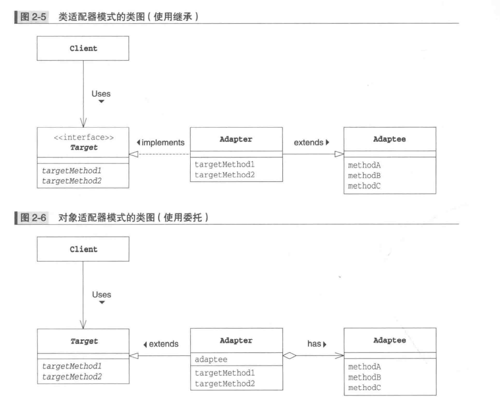

简介：

图解设计模式的第一部分，其中包括Iterator模式与Adapter模式。

<!--more-->

# 前言

> **设计模式的作用**：帮助我们编写可复用的类，所谓“可复用”，就是将类实现为“组件”。当一个组件发生变化时，不需要对其他的组件进行修改或者只需要很小的修改即可应对。

**重点：不要只使用具体类来编程，要优先使用抽象类和接口来编程。**

# 一、Iterator模式（迭代器）

> 模式介绍：一个一个遍历、在数据集合中按照数据遍历集合。


在java中显示arr数组的元素时，可用for循环遍历数据

```java
for(int i=0;i<arr.length;i++){
	System.out.println(arr[i]);
}
```


这里的i++作用让i的值在每次循环后自增1，也就从头至尾逐一遍历数据元素

将这里的循环变量i的作用抽象化、通用化后形成的模式，在设计模式中成为Iterator模式


**案例：将书放在书架中，并将书的名字按顺序显示出来**


| 名字              | 说明             |
| ----------------- | ---------------- |
| Aggregate         | 集合的接口       |
| Iterator          | 遍历集合的接口   |
| Book              | 书的类           |
| BookShelf         | 书架的类         |
| BookShelfIterator | 遍历书架的类     |
| Main              | 测试程序行为的类 |

**Aggregate接口**

```java
public interface Aggregate{
	public abstract Iterator iterator();//生成一个用于遍历集合的迭代器
}
```

**Iterator接口**

```java
public interface Iterator{
	public abstract boolean hasNext();//当集合中存在下一个元素时，返回true，否则返回false；主要用于循环终止条件
	public abstract Objct next();//返回集合中的一个元素
}
```

**Book类**：

```java
public class Book{
    private String name;
    public Book(String name){
        this.name = name;
    }
    public String getName(){
        return name;
    }
}
```

**BookShelf类**

```java
public class BookShelf implements Aggregate{
    private Book[] books;
    private int last = 0;
    public BookShelf(int maxsize){
        this.books = new Book[maxsize];
    }
    public Book getBookAt(int index){
        return books[index];
    }
    public void appendBook(Book book){
        this.books[last] = book;
        last++;
    }
    public int getLength(){
        return last;
    }
    public Iterator iterator(){
        return new BookShelfIterator(this);
    }
}
```

**BookShelfIterator类**

```java
public class BookShelfIterator implements Iterator{
    private BookShelf bookShelf;
    private int index;
    public BookShelfIterator(BookShelf bookShelf){
        this.bookShelf = bookShelf;
        this.index = 0;
    }
    public boolean hasNext(){
        if(index<bookShelf.getLength()){
            return true;
        }else{
            return false;
        }
    }
    public Object next(){
        Book book = bookShelf.getBookAt(index);
        index++;
        return book;
    }
}
```

**Main类**

```java
public class Main{
    public static void main(String[] args){
        BookShelf bookShelf = new BookShelf(4);
        bookShelf.appendBook(new Book("Around the world in 80 Days"));
        bookShelf.appendBook(new Book("Bible"));
        bookShelf.appendBook(new Book("Cinderella"));
        bookShelf.appendBook(new Book("Daddy-Long-Legs"));
        Iterator it = bookShelf.iterator();
        while(it.hasNext()){
            Book book = (Book)it.next();
            System.out.println(book.getName())
        }
    }
}
```

**Iterator模式中的角色**

- **Iterator（迭代器）**
  负责定义按顺序逐个遍历元素的接口（API）。在案例中有Iterator接口扮演这个角色，它定义了hasNext和next两个方法。hasNext判断是否存在下一个元素，next用于获取该元素。

- **ConcreteIterator（具体的迭代器）**

  负责实现Iterator角色定义的接口（API）。在案例中由BookShelfIterator类扮演。该角色中包含了遍历集合所需要的信息。在案例中BookShelf类的实例保存在bookShelf字段中，被指向的书的下标保存在index字段中。

- **Aggregate（集合）**

  负责定义创建Iterator角色的接口（API）。这个接口是一个方法，会创建出”按顺序访问保存在我内部的人“。在案例中那个Aggregate接口扮演这个角色，它里面定义了iterator方法。

- **ConcreteAggregate（具体的集合）**

  该角色负责实现Aggregate角色所定义的接口。它会创建出具体的Iterator角色，在案例中BookShelf类扮演，实现了iterator方法。


**引用Iterator这种模式的优点：可以将遍历和实现分离开来**

```java
while（it.hasNext()）{
    Book book = (Book)it.next();
    System.out.println(book.getName())
}
```

>这里只使用到Iterator的hasNext和next方法。这里while不依赖BookShelf的实现，如果后期放弃用数组来管理书本，而采用Vector，对while循环没有影响。（意思就是修改数据代码，不影响遍历代码）。

# 二、Adapter模式（适配器）


举例：AC适配器的作用就是让工作于直流12伏特的笔记本电脑适合于交流100伏特。

**比如老虎和飞禽，现在多了一个飞虎，在不增加实体的需求下，增加一个适配器，在里面包容一个虎对象，实现飞的接口。**

> 定义：在程序世界中，经常会存在现有的程序无法直接使用，需要做适当的变换后才能使用的情况。这种用于填补“现有的程序”与“所需的程序”之间差异的设计模式就是Adapter模式。
>
> **将一个类的接口转换成客户希望的另外一个接口。适配器模式使得原本由于接口不兼容而不能一起工作的那些类可以一起工作。**

适配器模式分为两种：

- 类适配器模式（使用继承的适配器）
- 对象适配器模式（使用委托的适配器）

## 2.1、类适配器模式（案例）

将输入的字符串显示为（Hello）或是\*Hello\*的程序


|          | 电源的比喻 | 示例程序                                 |
| -------- | ---------- | ---------------------------------------- |
| 实际情况 | 交流100V   | Banner类（showWithParen、showWithAster） |
| 变换装置 | 适配器     | PrintBanner类                            |
| 需求     | 直流12V    | print接口（printWeak、printStrong）      |

> Banner类中有已经实现的方法，现在print接口也想要用，那么就使用PrintBanner类继承Banner类来实现print接口的方法。

**print接口**

```java
public interface print{
	public abstract void printWeak();
	public abstract void printStrong();
}
```

**printBanner类：继承了Banner类，又实现了print接口**

```java
public class PrintBanner extends Banner implements Print{
    public PrintBanner(String string){
        super(string);
    }
    public void printWeak(){
        showWithParen();
    }
    public void printStrong(){
        showWithAster();
    }
}
```

**Main类**

```java
public class Main{
	public static void main(String[] args){
		Print p = new PrintBanner("Hello");
		p.printWeak();
		p.printStrong();
	}
}
```

>在Main类中，使用Print接口。对Main中的代码而言，Banner类、showWithParen方法和showWithAster方法被完全隐藏起来了。其并不用知道PrintBanner类如何实现的，这样就可以在不用对Main类进行修改的情况下改变PrintBanner类的具体实现

## 2.2、对象（委托）适配器模式（案例）

> 委托：将某个方法中的实际处理交给其他实例的方法。

这里假设Print不是接口而是类，即利用Banner类实现一个类，该类的方法和Print类的方法相同。由于java中无法同时继承两个类，因此无法将PrintBanner类分别定义为Print类和Banner类的子类。


PrintBanner类的banner字段保存了Banner类的实例。该实例实在PrintBanner类的构造函数中生成的。然后PrintWeak方法和printStrong方法会通过banner字段调用Banner类的showWithParen方法和showWithAster方法。**与上面的调用从父类中继承的方法不同，这次通过字段来调用这两种方法。这样就形成了一种委托关系。**

**Print类：**

```java
public abstract class Print{
    public abstract void printWeak();
    public abstract void printStrong();
}
```

**PrintBanner类：**

```java
public class PrintBanner extends Print{
    private Banner banner;
    public PrintBanner(String string){
        this.banner = new Banner(string);
    }
    public void printWeak(){
        banner.showWithParen();
    }
    public void printStrong(){
        banner.showWithAster();
    }
}

```

## 2.3、Adapter模式中的角色

- **Target（对象）**

  负责定义所需要的方法，以电流为例，即为直流12V。在案例中由Print接口（使用继承方法）和Print类（使用委托时）扮演此角色。

- **Client（请求者）**
  负责使用Target角色所定义的方法进行具体处理。在案例中由Main类扮演此角色。

- **Adaptee（被适配）**
  Adaptee是一个持有既定方法的角色，在案例中，由Banner类扮演此角色。如果Adaptee角色中的方法与Target角色的方法相同（也就是说家庭使用的电压就是12V）就不需要Adapter角色了。

- **Adapter（适配）**
  使用Adapter角色的方法来满足Target角色的需求，这就是Adapter模式的作用，就是将交流100V电转换为直流12V，在案例中由PrintBanner类扮演。



## 2.4、扩展思路

### 2.4.1、什么时候使用Adapter模式？

>当用到现有的类，特别是当现有的类已经被充分测试过了，bug很少，而且已经被用于其他软件之中时，更愿意将这些类作为组件重复利用。
>
>Adapter模式会对现有的类进行适配，生成新的类。通过该模式可以很方便的创建我们需要的方法群。当出现Bug时，可以很明确的知道Bug不在现在的类中，所以只需要调查扮演Adapter角色的类即可。

### 2.4.2、如果没有现成的代码

> 使用Adapter模式可以在完全不改变现有代码的前提下使现有代码适配新的接口（API）。此外，在Adapter模式中，并非要有现成的代码。只要知道现有类的功能，就可以编写出新的类。

简单来说：比如老虎和飞禽，现在多了一个飞虎，在不增加实体的需求下，增加一个适配器，在里面包容一个虎对象，实现飞的接口。

### 2.4.3、版本升级与兼容性


注意：**功能完全不相同的类，是无法使用Adapter模式的。**