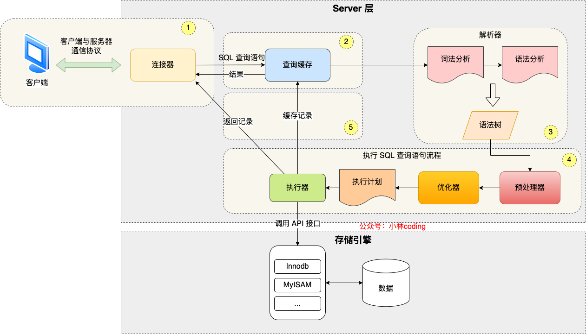
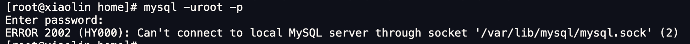
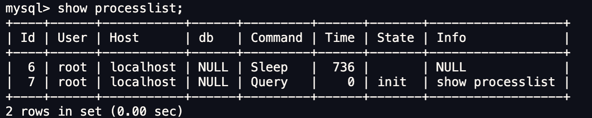
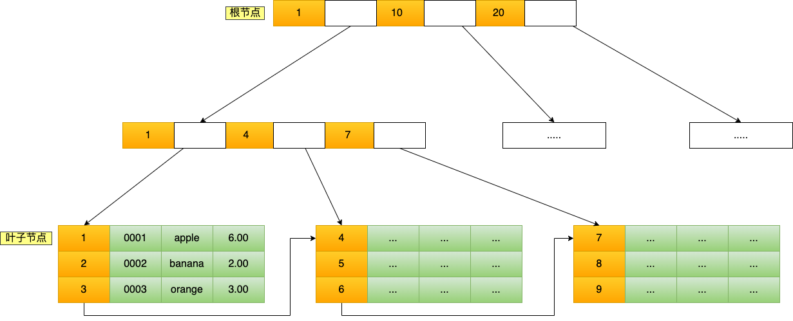
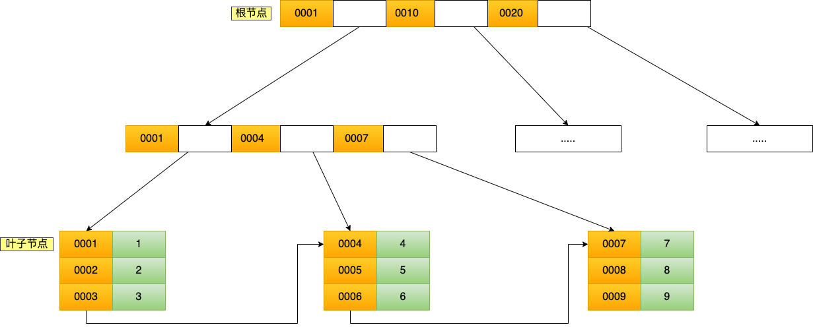
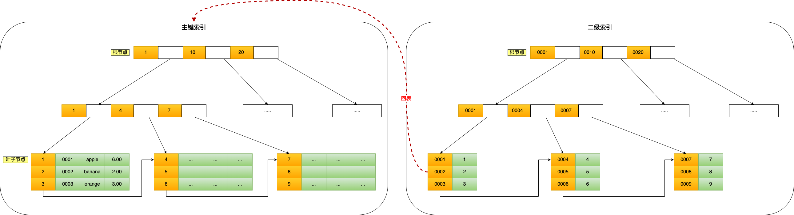

# 一、基础篇

##  执行一条 select 语句，期间发生了什么？

### MySQL执行流程

-

MySQL 的架构共分为两层：**Server 层和存储引擎层**

- **Server 层负责建立连接、分析和执行 SQL**。MySQL 大多数的核心功能模块都在这实现，主要包括连接器，查询缓存、解析器、预处理器、优化器、执行器等。另外，所有的内置函数（如日期、时间、数学和加密函数等）和所有跨存储引擎的功能（如存储过程、触发器、视图等。）都在 Server 层实现。
- **存储引擎层负责数据的存储和提取**。支持 InnoDB、MyISAM、Memory 等多个存储引擎，不同的存储引擎共用一个 Server 层。现在最常用的存储引擎是 InnoDB，从 MySQL 5.5 版本开始， InnoDB 成为了 MySQL 的默认存储引擎。我们常说的索引数据结构，就是由存储引擎层实现的，不同的存储引擎支持的索引类型也不相同，比如 InnoDB 支持索引类型是 B+树 ，且是默认使用，也就是说在数据表中创建的主键索引和二级索引默认使用的是 B+ 树索引。

好了，现在我们对 Server 层和存储引擎层有了一个简单认识，接下来，就详细说一条 SQL 查询语句的执行流程，依次看看每一个功能模块的作用。

## 第一步：连接器

如果你在 Linux 操作系统里要使用 MySQL，那你第一步肯定是要先连接 MySQL 服务，然后才能执行 SQL 语句，普遍我们都是使用下面这条命令进行连接：

```shell
# -h 指定 MySQL 服务得 IP 地址，如果是连接本地的 MySQL服务，可以不用这个参数；
# -u 指定用户名，管理员角色名为 root；
# -p 指定密码，如果命令行中不填写密码（为了密码安全，建议不要在命令行写密码），就需要在交互对话里面输入密码
mysql -h$ip -u$user -p
```

连接的过程需要先经过 TCP 三次握手，因为 MySQL 是基于 TCP 协议进行传输的，如果 MySQL 服务并没有启动，则会收到如下的报错：



如果 MySQL 服务正常运行，完成 TCP 连接的建立后，连接器就要开始验证你的用户名和密码，如果用户名或密码不对，就收到一个"Access denied for user"的错误，然后客户端程序结束执行。


如果用户密码都没有问题，连接器就会获取该用户的权限，然后保存起来，后续该用户在此连接里的任何操作，都会基于连接开始时读到的权限进行权限逻辑的判断。

所以，如果一个用户已经建立了连接，即使管理员中途修改了该用户的权限，也不会影响已经存在连接的权限。修改完成后，只有再新建的连接才会使用新的权限设置。

> 如何查看 MySQL 服务被多少个客户端连接了？

如果你想知道当前 MySQL 服务被多少个客户端连接了，你可以执行 `show processlist` 命令进行查看。



比如上图的显示结果，共有两个用户名为 root 的用户连接了 MySQL 服务，其中 id 为 6 的用户的 Command 列的状态为 `Sleep` ，这意味着该用户连接完 MySQL 服务就没有再执行过任何命令，也就是说这是一个空闲的连接，并且空闲的时长是 736 秒（ Time 列）。

> 空闲连接会一直占用着吗？

当然不是了，MySQL 定义了空闲连接的最大空闲时长，由 `wait_timeout` 参数控制的，默认值是 8 小时（28880秒），如果空闲连接超过了这个时间，连接器就会自动将它断开。

```sql
mysql> show variables like 'wait_timeout';
+---------------+-------+
| Variable_name | Value |
+---------------+-------+
| wait_timeout  | 28800 |
+---------------+-------+
1 row in set (0.00 sec)
```

当然，我们自己也可以手动断开空闲的连接，使用的是 kill connection + id 的命令。

```sql
mysql> kill connection +6;
Query OK, 0 rows affected (0.00 sec)
```

一个处于空闲状态的连接被服务端主动断开后，这个客户端并不会马上知道，等到客户端在发起下一个请求的时候，才会收到这样的报错“ERROR 2013 (HY000): Lost connection to MySQL server during query”。

> MySQL 的连接数有限制吗？

MySQL 服务支持的最大连接数由 max_connections 参数控制，比如我的 MySQL 服务默认是 151 个,超过这个值，系统就会拒绝接下来的连接请求，并报错提示“Too many connections”。

```sql
mysql> show variables like 'max_connections';
+-----------------+-------+
| Variable_name   | Value |
+-----------------+-------+
| max_connections | 151   |
+-----------------+-------+
1 row in set (0.00 sec)
```

MySQL 的连接也跟 HTTP 一样，有短连接和长连接的概念，它们的区别如下：

```c
// 短连接
连接 mysql 服务（TCP 三次握手）
执行sql
断开 mysql 服务（TCP 四次挥手）

// 长连接
连接 mysql 服务（TCP 三次握手）
执行sql
执行sql
执行sql
....
断开 mysql 服务（TCP 四次挥手）
```

可以看到，使用长连接的好处就是可以减少建立连接和断开连接的过程，所以一般是推荐使用长连接。

但是，使用长连接后可能会占用内存增多，因为 MySQL 在执行查询过程中临时使用内存管理连接对象，这些连接对象资源只有在连接断开时才会释放。如果长连接累计很多，将导致 MySQL 服务占用内存太大，有可能会被系统强制杀掉，这样会发生 MySQL 服务异常重启的现象。

> 怎么解决长连接占用内存的问题？

有两种解决方式。

第一种，**定期断开长连接**。既然断开连接后就会释放连接占用的内存资源，那么我们可以定期断开长连接。

第二种，**客户端主动重置连接**。MySQL 5.7 版本实现了 `mysql_reset_connection()` 函数的接口，注意这是接口函数不是命令，那么当客户端执行了一个很大的操作后，在代码里调用 mysql_reset_connection 函数来重置连接，达到释放内存的效果。这个过程不需要重连和重新做权限验证，但是会将连接恢复到刚刚创建完时的状态。

至此，连接器的工作做完了，简单总结一下：

- 与客户端进行 TCP 三次握手建立连接；
- 校验客户端的用户名和密码，如果用户名或密码不对，则会报错；
- 如果用户名和密码都对了，会读取该用户的权限，然后后面的权限逻辑判断都基于此时读取到的权限；

## 总结

执行一条 SQL 查询语句，期间发生了什么？

- 连接器：建立连接，管理连接、校验用户身份；
- 查询缓存：查询语句如果命中查询缓存则直接返回，否则继续往下执行。MySQL 8.0 已删除该模块；
- 解析 SQL，通过解析器对 SQL 查询语句进行词法分析、语法分析，然后构建语法树，方便后续模块读取表名、字段、语句类型；
- 执行 SQL：执行 SQL 共有三个阶段：
  - 预处理阶段：检查表或字段是否存在；将 `select *` 中的 `*` 符号扩展为表上的所有列。
  - 优化阶段：基于查询成本的考虑， 选择查询成本最小的执行计划；
  - 执行阶段：根据执行计划执行 SQL 查询语句，从存储引擎读取记录，返回给客户端；

# 二、索引篇

## 索引的分类

我们可以按照四个角度来分类索引。

- 按「数据结构」分类：**B+tree索引、Hash索引、Full-text索引**。
- 按「物理存储」分类：**聚簇索引（主键索引）、二级索引（辅助索引）**。
- 按「字段特性」分类：**主键索引、唯一索引、普通索引、前缀索引**。
- 按「字段个数」分类：**单列索引、联合索引**。

### B+Tree索引

**创建的主键索引和二级索引默认使用的是 B+Tree 索引**。

B+Tree 是一种多叉树，叶子节点才存放数据，非叶子节点只存放索引，而且每个节点里的数据是**按主键顺序存放**的。每一层父节点的索引值都会出现在下层子节点的索引值中，因此在叶子节点中，包括了所有的索引值信息，并且每一个叶子节点都指向下一个叶子节点，形成一个链表。



#### 通过主键查询商品数据的过程

比如，我们执行了下面这条查询语句，这条语句使用了主键索引查询 id 号为 5 的商品。查询过程是这样的，B+Tree 会自顶向下逐层进行查找：

- 将 5 与根节点的索引数据 (1，10，20) 比较，5 在 1 和 10 之间，所以根据 B+Tree的搜索逻辑，找到第二层的索引数据 (1，4，7)；
- 在第二层的索引数据 (1，4，7)中进行查找，因为 5 在 4 和 7 之间，所以找到第三层的索引数据（4，5，6）；
- 在叶子节点的索引数据（4，5，6）中进行查找，然后我们找到了索引值为 5 的行数据。

数据库的索引和数据都是存储在硬盘的，我们可以把读取一个节点当作一次磁盘 I/O 操作。那么上面的整个查询过程一共经历了 3 个节点，也就是进行了 3 次 I/O 操作。

B+Tree 存储千万级的数据只需要 3-4 层高度就可以满足，这意味着从千万级的表查询目标数据最多需要 3-4 次磁盘 I/O，所以**B+Tree 相比于 B 树和二叉树来说，最大的优势在于查询效率很高，因为即使在数据量很大的情况，查询一个数据的磁盘 I/O 依然维持在 3-4次。**

#### 通过二级索引查询商品数据的过程

主键索引的 B+Tree 和二级索引的 B+Tree 区别如下：

- 主键索引的 B+Tree 的叶子节点存放的是实际数据，所有完整的用户记录都存放在主键索引的 B+Tree 的叶子节点里；
- 二级索引的 B+Tree 的叶子节点存放的是主键值，而不是实际数据。

我这里将前面的商品表中的 product_no （商品编码）字段设置为二级索引，那么二级索引的 B+Tree 如下图，其中非叶子的 key 值是 product_no（图中橙色部分），叶子节点存储的数据是主键值（图中绿色部分）。



如果我用 product_no 二级索引查询商品，如下查询语句：

```sql
select * from product where product_no = '0002';
```

会先检二级索引中的 B+Tree 的索引值（商品编码，product_no），找到对应的叶子节点，然后获取主键值，然后再通过主键索引中的 B+Tree 树查询到对应的叶子节点，然后获取整行数据。**这个过程叫「回表」，也就是说要查两个 B+Tree 才能查到数据**。如下图：



不过，当查询的数据是能在二级索引的 B+Tree 的叶子节点里查询到，这时就不用再查主键索引查，比如下面这条查询语句：

```sql
select id from product where product_no = '0002';
```

**这种在二级索引的 B+Tree 就能查询到结果的过程就叫作「覆盖索引」，也就是只需要查一个 B+Tree 就能找到数据**。

顾名思义，二级索引就是需要查两个b+，如果正巧查询的是id（主键），那么就只用查一次就可以了。叫做覆盖索引。


### InnoDB为什么要使用B+Tree作为索引的数据结构？

MySQL 默认的存储引擎 InnoDB 采用的是 B+ 作为索引的数据结构，原因有：

- B+ 树的非叶子节点不存放实际的记录数据，仅存放索引，因此数据量相同的情况下，相比存储即存索引又存记录的 B 树，B+树的非叶子节点可以存放更多的索引，因此 B+ 树可以比 B 树更「矮胖」，查询底层节点的磁盘 I/O次数会更少。
- B+ 树有大量的冗余节点（所有非叶子节点都是冗余索引），这些冗余索引让 B+ 树在插入、删除的效率都更高，比如删除根节点的时候，不会像 B 树那样会发生复杂的树的变化；
- B+ 树叶子节点之间用链表连接了起来，有利于范围查询，而 B 树要实现范围查询，因此只能通过树的遍历来完成范围查询，这会涉及多个节点的磁盘 I/O 操作，范围查询效率不如 B+ 树。