简介：
此文章主要是对Linux系统的基础学习，一些比较基础的命令。
<!--more-->

##  一、前期准备

### 1、初步了解Linux

 注意：Linux内核版本都是一样的，自己也可以使用官方的内核，来开发一个自己的Linux系统。

####   为什么要用centOS呢？

因为redhat收费，centOS为社区开发版本，其中命令什么的都和redhat一致 ，所以选择centOS作为学习版本。

开源软件：足够多的眼睛，就会让问题浮现，开源不等同于免费。 

#### 最流行的网站平台搭建环境：


#### 如何查询服务器使用的是什么系统？

www.netcraft.com


### 2、系统分区

步骤：


1. 写入文件系统就是写入内存
2. 挂载点必须是目录，而且必须是空目录。

###  3、系统安装

图形化————》字符界面 转换   c+a+f2(f1)

### 4、网络连接

桥接模式：使用真实的网卡

net/only:使用虚拟的  同网段的ip，没网也可以进行通信


ifconfig:查看网络   与ipconfig类似。**ifconfig  网卡名称   ip地址**     修改IP地址 

### 5、远程工具


破解教程


注意是否可以ping通ip地址。

**centOS7  root用户不可以远程   好像要开启ssh   centOS7  就使用xshell吧**

#### CentOS 7.7 远程SSH连接不上问题解决

1.检查主机与目标服务器是否能相互ping通

在主机上 cmd --> telnet 192.168.199.227 22  -- 目标机器的ip、端口

如果主机无法使用telnet命令,则需要打开Telnet客户端,控制面板 --> 程序 --> 卸载或更改程序 --> 打开或关闭Windows功能 --> 选中 Telnet客户端

2.查看linux是否安装ssh服务

登录 root 用户下

命令：ssh localhost 

如果提示 "ssh:connect to host localhost port 22:connection refused",就说明没有打开ssh服务或者未安装ssh服务.

(1)如果linux系统是 ubuntu linux 版本,执行命令：sudo apt-get install openssh-server 安装ssh服务，在提示时都选择yes,然后会自动安装ssh服务.

(2)如果linux系统是 centos linux 版本,查看ssh是否安装,执行命令：rpm -qa | grep ssh 

　如果没有安装过ssh服务，则执行命令：yum install openssh-server 安装

3.安装完成后输入命令(root用户下)

　启动ssh服务命令:service sshd start 

　重启SSH服务:service sshd restart

　停止ssh服务命令:service sshd stop 

　查看ssh服务22端口是否启动命令：netstat -antp | grep sshd

　查看ssh服务进程命令：ps -ef|grep ssh

    设置ssh服务为开机启动命令：chkconfig sshd on 

　设置ssh服务禁止开机启动命令：chkconfig sshd off 

 

具体操作：

```shell
[root@centos01 ~]# ssh localhost
The authenticity of host 'localhost (::1)' can't be established.
ECDSA key fingerprint is SHA256:2LmA8OrgIY4wtuI+92d6t0xk6zleY3obJmkyh4E2tuA.
ECDSA key fingerprint is MD5:ed:ed:80:68:1f:47:a6:bc:73:b3:bc:9d:63:6b:c1:5c.
Are you sure you want to continue connecting (yes/no)? yes
Warning: Permanently added 'localhost' (ECDSA) to the list of known hosts.
root@localhost's password: 
Last login: Sun Apr 26 17:51:19 2020
[root@centos01 ~]# rpm -qa | grep ssh
openssh-clients-7.4p1-21.el7.x86_64
libssh2-1.8.0-3.el7.x86_64
openssh-7.4p1-21.el7.x86_64
openssh-server-7.4p1-21.el7.x86_64   -- 说明已经安装了ssh
[root@centos01 ~]# ps -ef|grep ssh
root       1301      1  0 16:15 ?        00:00:00 /usr/sbin/sshd -D
root      54071  53935  0 17:51 ?        00:00:00 /usr/bin/ssh-agent /bin/sh -c exec -l /bin/bash -c "env GNOME_SHELL_SESSION_MODE=classic gnome-session --session gnome-classic"
root      55734  54650  0 18:40 pts/0    00:00:00 ssh localhost
root      55735   1301  0 18:40 ?        00:00:00 sshd: root@pts/1
root      55742  53930  0 18:41 ?        00:00:00 /usr/bin/ssh-agent -D -a /run/user/0/keyring/.ssh
root      55815  55750  0 18:43 pts/1    00:00:00 grep --color=auto ssh
[root@centos01 ~]# ps -ef | grep ssh | grep -v grep
root       1301      1  0 16:15 ?        00:00:00 /usr/sbin/sshd -D
root      54071  53935  0 17:51 ?        00:00:00 /usr/bin/ssh-agent /bin/sh -c exec -l /bin/bash -c "env GNOME_SHELL_SESSION_MODE=classic gnome-session --session gnome-classic"
root      55734  54650  0 18:40 pts/0    00:00:00 ssh localhost
root      55735   1301  0 18:40 ?        00:00:00 sshd: root@pts/1
root      55742  53930  0 18:41 ?        00:00:00 /usr/bin/ssh-agent -D -a /run/user/0/keyring/.ssh
[root@centos01 ~]# service sshd start
Redirecting to /bin/systemctl start sshd.service
[root@centos01 ~]# ps -ef|grep ssh|grep -v grep
root       1301      1  0 16:15 ?        00:00:00 /usr/sbin/sshd -D
root      54071  53935  0 17:51 ?        00:00:00 /usr/bin/ssh-agent /bin/sh -c exec -l /bin/bash -c "env GNOME_SHELL_SESSION_MODE=classic gnome-session --session gnome-classic"
root      55734  54650  0 18:40 pts/0    00:00:00 ssh localhost
root      55735   1301  0 18:40 ?        00:00:00 sshd: root@pts/1
root      55742  53930  0 18:41 ?        00:00:00 /usr/bin/ssh-agent -D -a /run/user/0/keyring/.ssh
[root@centos01 ~]# netstat -antp | grep sshd
tcp        0      0 0.0.0.0:22              0.0.0.0:*               LISTEN      1301/sshd           
tcp6       0      0 :::22                   :::*                    LISTEN      1301/sshd           
tcp6       0      0 ::1:22                  ::1:41754               ESTABLISHED 55735/sshd: root@pt 
[root@centos01 ~]# ps -ef | grep ssh | grep -v grep
root       1301      1  0 16:15 ?        00:00:00 /usr/sbin/sshd -D
root      54071  53935  0 17:51 ?        00:00:00 /usr/bin/ssh-agent /bin/sh -c exec -l /bin/bash -c "env GNOME_SHELL_SESSION_MODE=classic gnome-session --session gnome-classic"
root      55734  54650  0 18:40 pts/0    00:00:00 ssh localhost
root      55735   1301  0 18:40 ?        00:00:00 sshd: root@pts/1
root      55742  53930  0 18:41 ?        00:00:00 /usr/bin/ssh-agent -D -a /run/user/0/keyring/.ssh
[root@centos01 ~]# chkconfig sshd on     -- 设置开机启动ssh服务
注意：正在将请求转发到“systemctl enable sshd.service”。
[root@centos01 ~]# 
```

xshell

xftp

### 6、注意点


### 7、Linux个目录的作用


### 8、服务器注意事项

- 远程服务器不允许关机，只能重启
- 重启时应该关闭服务
- 不要在服务器访问高峰运行高负载命令
- 远程配置防火墙时不要把自己踢出服务器

## 二、linux常用命令

### 1、目录与文件处理命令

#### 命令格式：

#### 目录处理命令：ls


文件的三个属性：所有者（只能有一个，可以变更）、所属组（只能有一个）、其他人   u  g   o

补充：

-h   人性化显示，可以自己计算文件大小。

-d  显示目录信息 ，一般与l一块使用

-i    i节点，相当于身份证号


#### 权限：


#### 目录处理命令：mkdir


-p      可以递归创建

#### 目录处理命令：cd

cd  路径   切换到指定路径

cd ..   返回上级目录

#### 目录处理命令：pwd

显示当前目录路径

#### 文件处理命令：rmdir


#### 目录处理命令：cp


补充：可以在复制的时候进行改名

#### 目录处理命令：mv


#### 快捷键：清空屏幕   c+l

#### 目录处理命令：rm


#### 文件处理命令：touch  


可以使用双引号创建带空格的文件名，但是不推荐使用。

#### 文件处理命令：cat

功能：显示文件内容（不太适合显示长文件）


#### 文件处理命令：tac

反向显示文件内容

#### 文件处理命令：more

功能：分页显示文件内容


缺点：不可以向上翻页

#### 文件处理命令：less

功能：与more功能类似，但是支持向上翻页

最主要的是  它可以进行搜索   /关键词  可以按n  下一个


#### 文件处理命令：head

功能：查看前多少行（默认查看十行）


#### 文件处理命令：tail

功能：查看文件内容的末尾多少行，默认十行


#### 文件处理命令：链接命令 ln

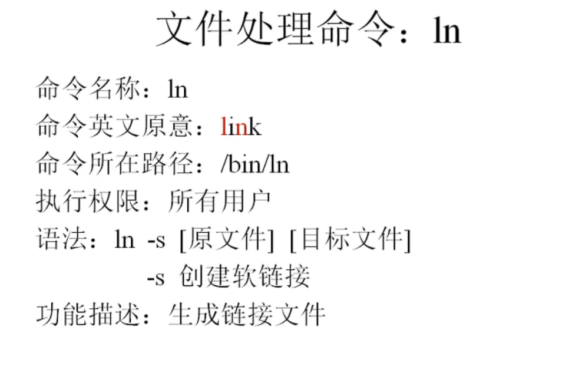

 软连接特点：和快捷方式差不多    

- 权限很高：l777
- 以l开头
- 文件大小很小，只是符号链接
- 箭头指向源文件

硬链接：几乎等于拷贝，但区别是 可以同步更新

- 不能跨分区
- 不能针对目录使用

如果删除了源文件：

- 软连接：也跟着删除
- 硬链接：不跟着删除

如何**判断哪个是硬链接**？

**使用i节点来判断**，硬链接的i节点与源文件相同。所以才可以同步更新。

### 2、权限管理命令

#### 改变文件或者目录权限命令：chmod


**需要注意的是：删除一个文件不是对一个文件有写权限。而是对目录有写权限，因为文件的写权限只能对内容进行操作，而目录的写权限是对文件有创建和删除命令的。**

简单来说就是：打狗看主人

#### 改变所有者命令：chown


在linux里面，改变文件的所有者，只有管理员root可以执行

#### 改变所属组命令：chgrp


#### 显示、设置文件的默认权限命令：umask


**注意：**在linux系统下，默认新建的**文件**是不具有可执行权限的（这样就可以阻止木马什么的病毒）

**0022**意思是：

### 3、文件搜索命令

#### 文件搜索命令:find


选项（有很多，只掌握最常用的就可以了）


**注意**搜索文件时，linux是严格区分大小写的，但是如果使用**-iname**选项的话，就不区分大小写

- 数据块是linux下存储文件的最小单位

  

- 需要使用数据块来查找


#### 其他文件搜索命令：locate


需要注意的是：这个资料库不是实时更新，而是隔一段时间更新。可以手动使用updatedb命令来更新。

如果文件存放在/tmp下面，使用locate也可能找不到。

#### 文件搜索命令：which


例如：


bin就是所有用户都能用，sbin的意思就是只有root用户可以使用。

#### 命令搜索命令：whereis


搜索出现命令所在的绝对路径以及帮助文档所在的绝对路径


#### 文件内容搜索命令：grep（常用）


意思是，把文件中带#的行都去掉，只剩下不带#的行

### 4、帮助命令

#### 查看命令详细信息的命令：man（非常重要）


需要了解的是在配置文档中，1   一般是命令的帮助      5 	配置文件的帮助


附加：whatis +命令名称=简短的命令信息

apropos +配置文件名称=简短的配置文件信息

#### 显示选项信息命令：--help

例如： ls --help


#### 帮助命令：help


### 5、用户管理命令

#### 用户管理命令：useradd（添加用户）


#### 用户管理命令：passwd（为用户添加密码）


#### 用户管理命令：who（查看登录用户信息）


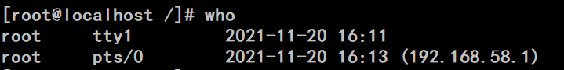


#### 用户登录命令：w（用户详细登录信息）


### 6、压缩解压命令

#### 压缩命令：gzip


需要注意的是：gzip只能压缩文件，不能压缩文件夹，压缩文件夹可以使用tar打包后压缩。而且不保存源文件

#### 解压缩命令：gunzip


或者gzip -d也可以解压缩

#### 压缩打包命令：tar（打包）

****

#### 解压命令：tar


需要注意的是：-z选项需要放到最前面

#### 压缩命令：zip


#### zip解压缩


#### 压缩命令：bzip2

****

与zip的区别：

- 可以保留源文件
- 压缩比 比较惊人

#### 解压缩命令：bunzip2


###  7、网络命令

#### 网络命令：write


一定要注意，是给在线用户发

#### 网络命令：wall


给所有在线的用户发送广播

#### 网络命令：ping


功能：看网络是否联通

#### 网络命令：ifconfig


#### 网络命令：mail


发：mail   用户名

收：mail

#### 网络命令：last


查看所有已经登录过的用户信息。

#### 网络命令：lastlog


查看用户最后一次登录的时间。

网络命令：traceroute（跟踪路由）


用来查看经过的路由节点。

网络命令：netstat（网络状态）（非常重要）


tcp：相当于手机，更安全

udp：相当于发短信，更快，但不安全

####  网络命令：setup


注意：这是redhat系列专有的命令。

#### 挂载命令：mount


### 8、关机重启命令

#### 关机重启命令：shutdown


## 三、文本编辑Vim


### 插入命令


### 定位命令


### 删除命令


### 复制命令


### 替换与取消命令


### 搜索和搜索替换命令


### 保存和退出命令


### Vim使用技巧

#### 1、导入文件内容

> ：r 文件名    #导入文件内容到光标所在位置


#### 2、在不退出Vim的情况下执行命令

> ：！命令      

可以与：r一起使用：

例如：

> :r !data   #将时间插入光标所在行


#### 3、定义快捷键


> :map  (ctrl+v+p)==^p   I#<ESC>   (意思是将ctrl+p定义成跳到行首插入一个#在进入插入模式      就是把这一行注释)


想要永久使用快捷键的话：需要去家目录下：例如

> /root/.vimrc

去定义快捷键，永久有效

## 四、软件包管理

### 1、软件包分类

- 源码包
  - 脚本安装包
  - 
  - 
- 二进制包（RPM包、系统默认包） 
  - 
  - 

### 2、rpm命令管理-包名名与依赖性

1. rpm包的命名规则

   

2. rpm包依赖性

   

### 3、rpm命令管理-安装升级与卸载

1. 包全名与包名

   

2. RPM安装

   

3. RPM升级

   

4. RPM卸载

   

### 3、rpm命令管理-查询

1. 查询是否安装

   

2. 查询软件包详细信息

   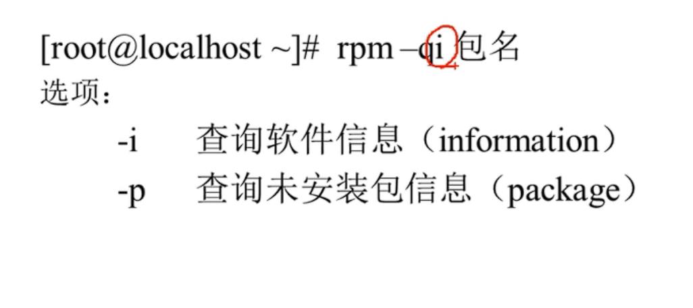

3. 查询软件包中文件安装位置

   

4. 查询系统文件属于哪个包

   

5. 查询软件包的依赖性

   

### 4、rpm命令管理-校验和文件提取

1. RPM包校验 

   

   意思就是，拿初始安装的与修改后的进行对比，看是否有问题

   

   

2. RPM包中文件提取

   

   有什么用呢？比如说，我在操作系统的时候，误删除了一个配置文件，现在不需要重新安装一个系统，只要知道这个配置文件属于哪一个包，提取出来，覆盖即可。

   操作示例：

   

   这个文件提前的操作，最主要的功能就是用来修补系统的错误。

### 5、yum在线管理-ip地址配置与网络yum源

如果访问内网，只需要ip与子网掩码即可。

如果要访问公网，还需要配置网关和DNS。

使用最简单的配置方法：setup

1. IP地址配置

   

2. 网络YUM源

   

### 6、yum命令

1. 常用yum命令

   

2. yum软件组管理管理命令

   

### 7、光盘yum源搭建 


### 8、源码包管理

#### 1、源码包和RPM包的区别

- 区别

  

- RPM包安装位置

  

- 源码包安装位置

  

- 安装位置不同带来的影响（源码包就不能使用service启动）

  

  

#### 2、源码包安装过程

1. 安装准备

   

2. 开始

   

   一般的源码包中，都会有INSTALL(安装说明)和README（使用说明）

3. 软件配置与检查

   

   

   安装路径一定要写！！！

   > ./configure --prefiax=/usr/local/自定义名称

4. make编译

   作用：调用gcc   把源码包翻译成为机器语言。

    到现在为止，还没有写入任何文件，只是产生了临时文件。

   如果在这两步报错，不需要执行任何操作，

   使用make clean来清除编译产生的临时文件。

5. make install进行安装即可

6. 卸载源码包

   直接使用

   > rm -rf 删除安装目录即可

#### 3、脚本安装包


1. Webmin的作用

   

2. Webmin的安装

   

3. 进入压缩目录之后，执行setup.sh


## 五、用户和用户组管理

### 5.1、用户配置文件

#### 5.1.1、用户信息文件/etc/passwd

1. 用户管理简介

   

2. /etc/passwd

   

   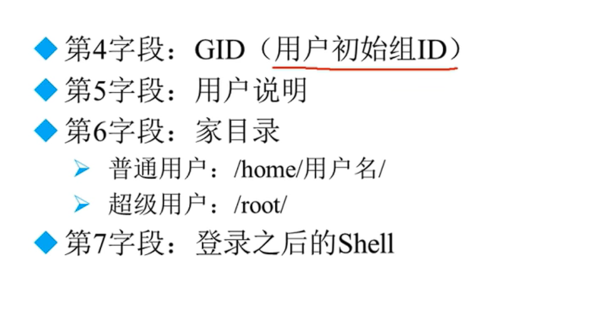

3. 初始组与附加组

   

4. shell是什么？

   

####  5.1.2、影子文件/etc/shadow


####  5.1.3、组信息文件/etc/group和组密码文件/etc/gshadow 

1. 组信息文件/etc/group

   


### 5.2、用户管理相关文件

#### 5.21、用户的家目录


#### 5.22、用户的邮箱


#### 5.33、用户模板目录


模板是什么意思？

例如，创建一个用户，他可能会自动在家目录创建一些文件，模板，就是来控制来创建哪些文件的。

### 5.3、用户管理命令

#### 5.3.1、useradd：添加用户

注意：如果添加一个用户不设置密码，是不完整的。是不能登录的。


添加完成用户以后，就可以在这几个文件中查询到sc用户的信息了。

**useradd用户命令格式：**


用户默认值文件：


另外一个用户配置文件：


#### 5.3.2、passwd：添加用户


超级用户可以改变任意用户的密码，普通用户只能修改自己的密码，即：passwd 

**查看密码状态：**


**锁定用户和解锁用户：**


使用字符串作为用户的密码：


#### 5.3.3、修改用户信息usermod


#### 5.3.4、修改用户密码状态chage


#### 5.3.5、删除用户userdel与切换用户su

删除用户选项


手动删除用户


查看用户id


 切换用户身份su


### 5.4、用户组管理命令

#### 5.4.1、添加用户组groupadd


#### 5.4.2、修改组groupmod


#### 5.4.3、删除组groupdel


如果用户组中有用户的话，可以删除吗？

如果组中有初始用户，那么这个组不能删，因为删了之后，初始组没地方放。

如果这个组里面没有初始用户，而是附加用户，那么可以删除。

#### 5.4.4、把用户添加入组或者从组中删除


## 六、权限管理

### 6.1、ACL权限

#### 6.1.1、ACL权限介绍


与windows类似，所有者、所属组、其他人。已经不够用了，所以单独给需要的用户添加权限。

#### 6.1.2、查看分区ACL权限是否开启


ACL权限是和分区相关的。默认分区都是开启ACL权限的。与ACL相关的是**挂载默认选项**。

#### 6.1.3、临时开启分区ACL权限


#### 6.1.4、永久开启分区ACL权限


#### 6.2、查看与设定ACL权限

#### 6.2.1、查看ACL命令getfacl


#### 6.2.2、设定ACL权限的命令setfacl


#### 6.2.3、给用户设定ACL2权限


#### 6.3、最大有限权限与删除ACL权限

#### 6.3.1、最大有效权限mask


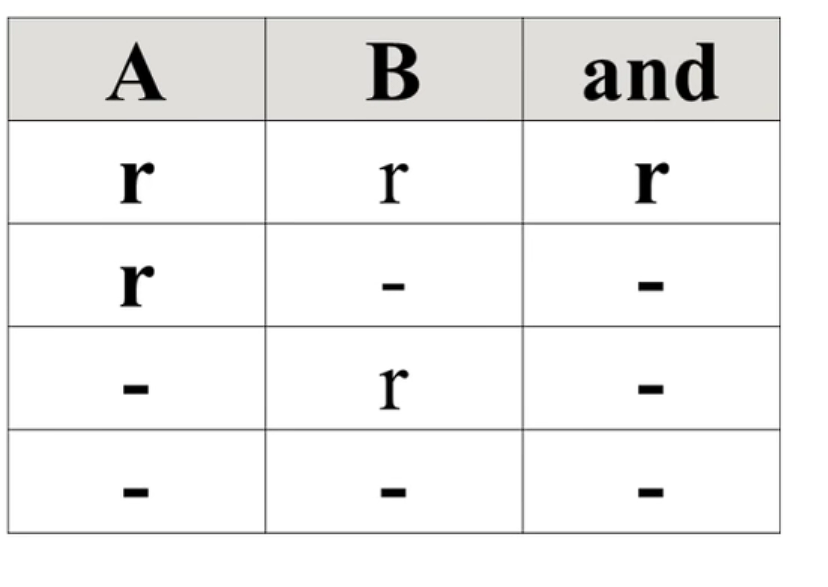


#### 6.3.2、删除ACL权限


#### 6.4、默认ACL权限和递归ACL权限

#### 6.4.1、递归ACL权限


#### 6.4.2、默认ACL权限

主要用来控制新创建或者新加入的文件的权限。


### 6.2、文件特殊权限

#### 6.2.1、SetUID的功能


设定SsetUID的方法


取消SetUID方法


危险的SetUID


总结：普通用户在执行拥有SUID的程序的时候，会暂时变身成为超级用户。

#### 6.2.2、SetGID的功能

1、SetGID针对文件的作用


举例：


2、SetGID针对目录的作用


意思就是赋予目录S权限之后，在目录中创建文件，文件的所属组会与父目录的s属组相同。

3、取消SetGID


#### 6.2.3、Sticky BIT

1. SBIT粘着位作用

   

2. 设置粘着位

   

3. 通俗来说，就是赋予粘着位之后，普通用户只能删除自己创建的文件，而不能删除其他用户创建的文件。

### 6.3、文件系统属性chattr权限

1. 命令格式

   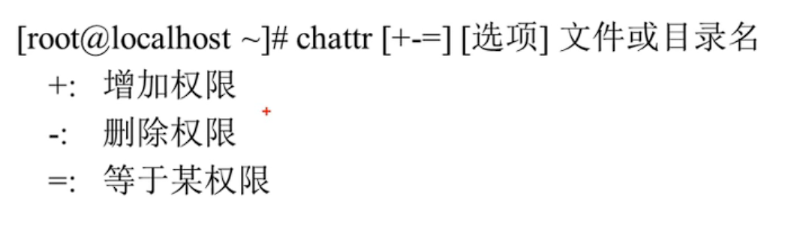

   选项：

   

   -i：意思就是说把文件锁起来，只能看不能改。连root用户也能被管控。对文件夹使用的话，就相当于租房子给别人，你可以使用和改变里面的东西，但是你不可以自己搬进来或者搬出去东西。

   -a：也都可以赋予文件或者目录，与i相比，i选项更加严格，而对文件操作 的时候，-

   a只能追加文件内容，而不可以修改与删除。对目录进行操作的时候，a选项可以修改和创建文件夹下的文件，但是不可以删除。

   **需要注意：**使用普通的ls命令是无法查看attr权限的。

2. 查看文件系统属性

   

3. 操作示例

   

   

### 6.4、系统命令权限（sudo）

1. 简介

   

2. sudo的使用

   

3. 演示

   

4. 普通用户执行sudo命令

   

## 七、文件系统管理

### 7.1、回顾分区和文件系统

1. 分区类型

   

2. 分区之后的设备名

   

   

3. 文件系统

   

   

### 7.2、文件系统常用命令

#### 7.2.1、df命令、du命令、fsck命令和dump2fs命令

##### 1、文件系统查看命令   df


##### 2、统计文件或者目录大小du


##### 3、df与du的区别

df：所有文件+系统+进程

du：所有文件


##### 3、文件修复命令fsck（不太推荐使用）


##### 4、显示磁盘状态命令dumpe2fs


#### 7.2.2、挂载命令

##### 1、查询与自动挂载

##### 2、挂载命令格式

-o：

示例：


#### 7.2.3、挂载U盘和光盘


挂载u盘


还有需要注意的一点，连接u盘或者移动硬盘，需要linux主机进行操作。

#### 7.2.4、支持NTFS文件系统

想要linux支持NTFS格式，两种方法：重新编译内核，或者下载软件。后者比较简单，选择后者。

1、下载NTFS-3G插件

2、安装NTFS-3G

3、使用

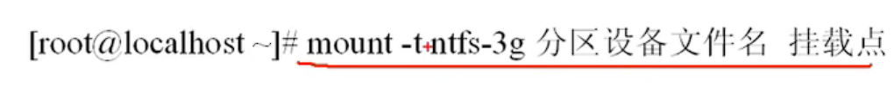

### 7.3、fdisk分区

1、添加新硬盘

2、查看新硬盘


3、使用fdisk命令进行分区


注意最后w保存之后，是需要重新启动来加载新的分区的。

4、重新读取分区信息


5、格式化分析


### 7.4、分区自动挂载与fstab文件修复

1、/etc/fstab文件


使用uuid有什么好处？在分区出现变化的时候，不会出现错误。

那么，如何获取分区的uuid呢？


2、分区自动挂载


3、/etc/fstab文件修复


如果在修改错误的情况下（前提是根分区没设置错误的情况下），可以使用这个命令来修复fstab的权限，因为fstab设置错误的话，开机会报错，使用此命令可以挽救一点。

所以在修改fstab文件的时候，需要仔细。

## 八、Shell基础

### 8.1、Shell概述

1、shell是什么？

层次关系

两个功能：

- 命令解释器，让用户有一个操作界面
- 支持强大的编程语言界面，允许用户编程

#### 2、shell的分类


#### 3、Linux支持的shell


### 8.2、脚本执行方式

1、echo输出命令


示例：

2、第一个脚本

3、执行脚本


如果是windows上的dos命令shell脚本，复制到linux上是不可以执行的，因为其中包含着特殊符号，需要转换-------使用dos2unix命令  转换就可以。

### 8.3、Bash的基本功能

#### 8.3.1、历史命令与命令补全

1、历史命令


历史命令的调用

2、命令与文件补全


#### 8.3.2、命令别名与常用快捷键

1、命令别名

2、命令执行顺序

简而言之：

执行顺序     绝对路径》相对路径》别名》bash内部命令》环境变量

比如定义vi="vim"   别名就会将vi这个命令覆盖，因为别名比vi本身的优先级高。

注意：这些赋值别名的操作只会临时生效，关机就会消失。

**让别名永久生效**


**删除别名**


3、Bash常用快捷键


#### 8.3.3、输入输出重定向

1、标准输入输出

2、输出重定向

上边的输出重定向有一个缺点，就是还需要自己判断语句的正确与错误。


而加上&之后，就无需判断语句的正确或者错误了，正确与错误都会输出到文件中去。

3、输入重定向


#### 8.3.4、多命令顺序执行与管道符

1、多命令顺序执行


分号的使用，意思是创建100M的文件需要的时间。（分号：连接多个命令）


2、管道符


需要注意的一点，命令1必须有正确的输出，否则命令2不能执行


#### 8.3.5、通配符与其他特殊符号

1、通配符

示例：

2、Bash中其他特殊符号


单引号和双引号：

示例：

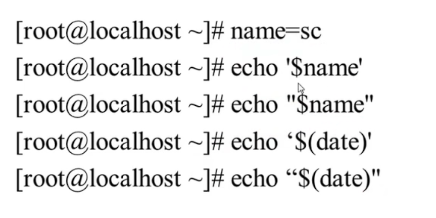

反引号与$()


### 8.4、Bash的变量

#### 8.4.1、用户自定义变量

1、什么是变量？

2、变量设置规则


3、变量分类


4、本地变量（用户自定义变量）


#### 8.4.2、环境变量

1、环境变量是什么？


环境变量与自定义变量的区别就是，作用范围，相当于环境变量是静态变量。

2、设置环境变量

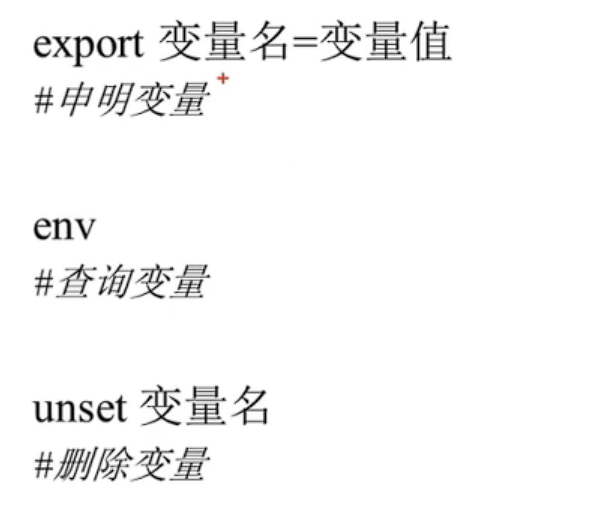

那么 如何查看shell的父类关系呢？

使用pstree命令。如下图：


系统定义的变量：


#### 8.4.3、位置参数变量

1、位置变量参数

$n 实际应用：

$*与$@ 实际应用：


$*与$@的区别：


#### 8.4.4、预定义变量

1、预定义变量($?,$$,$!)


2、接收键盘输入

示例：


### 8.5、Bash的运算符

#### 8.5.1、数值运算与运算符

1、declare声明变量属性


2、数值运算----方法1

方法2：expr或let数值运算工具

方法3："$((运算式))"或者"$[运算式]"   **推荐使用**


3、运算符


使用（）可以改变运算优先级


#### 8.5.2、变量测试与内容替换

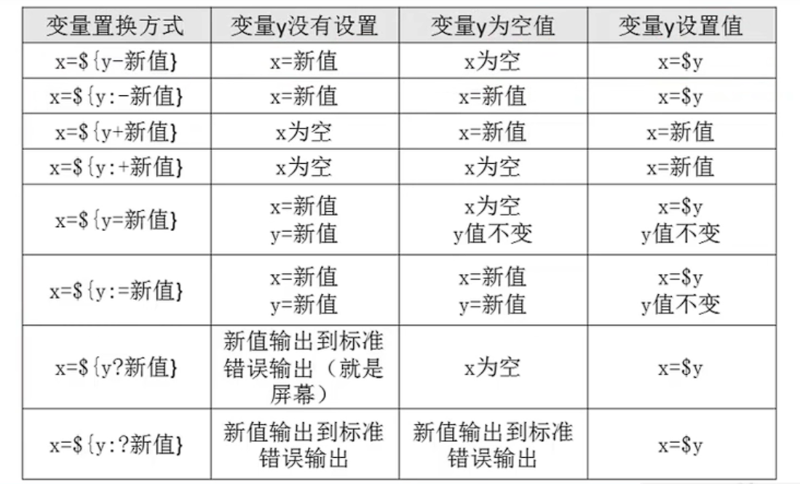

不推荐记下来，什么时候用，什么时候回头来找。

示例：

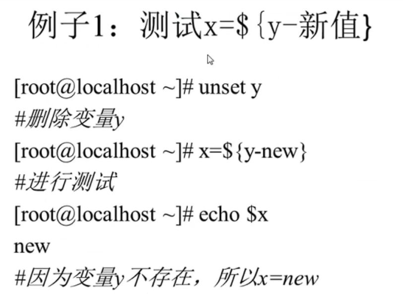


### 8.6、环境变量配置文件

#### 8.6.1、环境变量配置文件简介

为什么配置环境变量配置文件呢？因为不配置的话，设置的环境变量重启就会消失。

要想永久性的配置，必须要配置配置文件。

1、source命令

2、环境变量配置文件简介


系统环境变量有哪些配置文件呢？


主要是这五类。

#### 8.6.2、环境变量配置文件作用

注意：写在etc下的环境变量配置文件，对所有的用户都生效，而写在家目录下的配置文件只对此用户生效。

**配置文件调用顺序**


可以将需要更改的环境变量加到以上四个配置文件中，注意：/etc下的是对所有用户生效，~是当前用户。

##### 1、/etc/profile的作用（需要输入用户名密码）

2、~/.bash_profile的作用


##### 3、~/.bashrc的作用


##### 4、/etc/bashrc作用（不需要输入密码）


不和/etc/profile的定义冲突

#### 8.6.3、其他配置文件和登录信息

1、注销时生效的环境变量配置文件


2、其他配置文件（历史命令的保存文件）


3、shell登录信息

**本地**


**远程**


注意哦，转义符在。net文件中不能使用

**远程+本地：**

8.7、正则表达式

#### 8.7.1、基础正则表达式

1、正则表达式与通配符


其他语言中或许通配符是属于正则的，但是在shell中，正则是匹配文件中的内容的，通配符是匹配系统中的文件名的；

2、基础正则表达式（抄十遍--------一定要记住！！！很重要！）


*的作用：


.的作用：

^和$的作用：

[^]的作用：


\的作用：

匹配前面的字符恰好出现n次。


匹配前面的字符出现n-m次；


#### 8.7.2、字符截取命令

##### 8.7.2.1、cut字段提取命令

语法：


示例：


cut命令的局限：


##### 8.7.2.2、printf命令

语法：

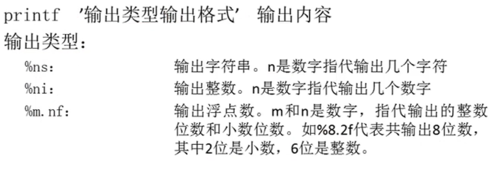


示例：


##### 8.7.2.3、awk命令

语法：


**BEGIN命令：**

作用，在读入数据之前，先输出BEGIN后面的指令。


**END命令：**

与BEGIN作用相反，在所有命令执行之后，输出，，，


**FS内置变量：**

作用：指定分隔符，一般与BEGIN一起使用，因为不使用BEGIN的话，有可能造成第一行来不及处理的bug。

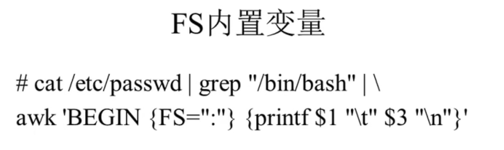


##### 8.7.2.4、sed命令

sed简介：


语法：


支持哪些动作？


示例：

行数据操作：


 第一个结果是输出两个第二行，因为sed命令会把所有的数据都输出到屏幕上，所以可以加上-n选项。

**删除行：**

需要注意的是，sed只是对输出到屏幕的数据进行了修改，而没有修改文件本身。

**追加：**


**替换：**


再次注意，这种替换是不影响文件本身的。

#### 8.7.3、字符处理命令

1、排序命令sort

语法：


示例：


2、统计命令wc


#### 8.7.4、条件判断

1、按照文件类型进行判断

两种判断格式：

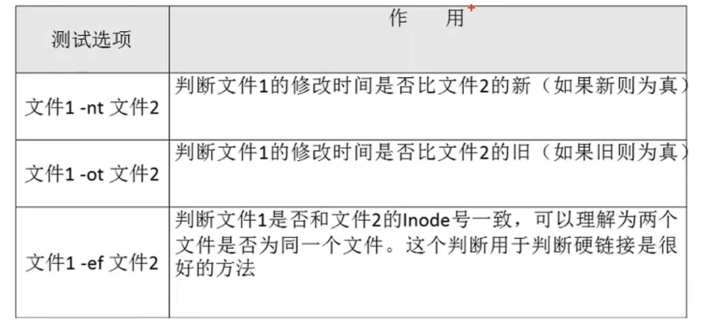

2、按照文件权限进行判断


3、两个文件进行比较


示例：

4、两个整数之间的比较


5、字符串的判断


示例：


6、多重条件判断


判断语句的结果不是给用户来看的，主要是给计算机看的。

与java判断语句有点差别，但是逻辑都是一样的！

#### 8.7.5、流程控制