简介：

非关系型数据库。Redis是一个开源（BSD许可），内存存储的数据结构服务器，可用作数据库，高速缓存和消息队列代理。它支持字符串、哈希表、列表、集合、有序集合，位图，hyperloglogs等数据类型。
<!--more-->
视频连接[【尚硅谷】Redis 6 入门到精通 超详细 教程_哔哩哔哩_bilibili](https://www.bilibili.com/video/BV1Rv41177Af?spm_id_from=333.337.search-card.all.click)


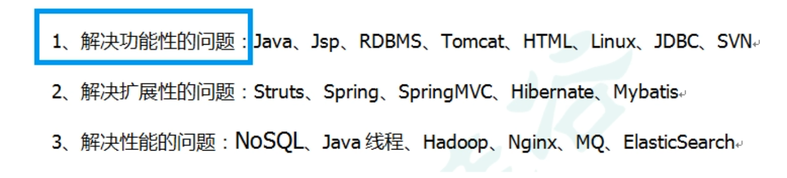

# 一、Redis简介

***Redis*** 是典型的 ***NoSQL*** 数据库。

***redis官网***：https://redis.io/download 

> - ***Redis*** 是一个开源的 ***key-value*** 存储系统。
> - 和 ***Memcached*** 类似，它支持存储的 ***value*** 类型相对更多，包括 ***string、list、set、zset、hash***。
> - 这些数据类型都支持 ***push/pop、add/remove*** 及取交集并集和差集及更丰富的操作，而且这些操作都是原子性的。
> - 在此基础上，***Redis*** 支持各种不同方式的排序。
> - 与 ***memcached***一样，为了保证效率，数据都是缓存在内存中。
> - 区别的是 ***Redis*** 会周期性的把更新的数据写入磁盘或者把修改操作写入追加的记录文件。
> - 并且在此基础上实现了***master-slave*** （主从）同步。
> - 单线程+多路IO复用

为什么要使用redis？

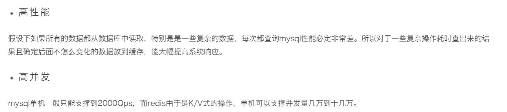

# 二、安装和启动

> 安装 ***C*** 语言的编译环境
>
> ```base
> yum install centos-release-scl scl-utils-build
> yum install -y devtoolset-8-toolchain
> scl enable devtoolset-8 bash
> ```
>
> 通过 ***wget*** 下载
>
> ```
> wget https://download.redis.io/releases/redis-6.2.6.tar.gz
> 
> // 下载路径：/opt
> ```
>
> 解压至当前目录
>
> ```
> tar -zxvf redis-6.2.6.tar.gz 
> ```
>
> 解压完成后进入目录
>
> ```
> cd redis-6.2.6
> ```
>
> 在当前目录下执行 ***make***
>
> ```
> make && make install
> ```
>
> 默认安装在 `/usr/local/bin`
>
> 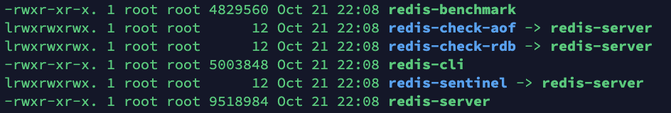
>
> ```
> redis-benchmark：性能测试工具，可以在自己本子运行，看看自己本子性能如何
> redis-check-aof：修复有问题的AOF文件，rdb和aof后面讲
> redis-check-dump：修复有问题的dump.rdb文件
> redis-sentinel：Redis集群使用
> redis-server：Redis服务器启动命令
> redis-cli：客户端，操作入口
> ```
>
> 
>
> 前台启动：***/usr/local/bin*** 目录下启动 ***redis***(不推荐)
>
> ```bash
> redis-server(前台启动)
> ```
>
> 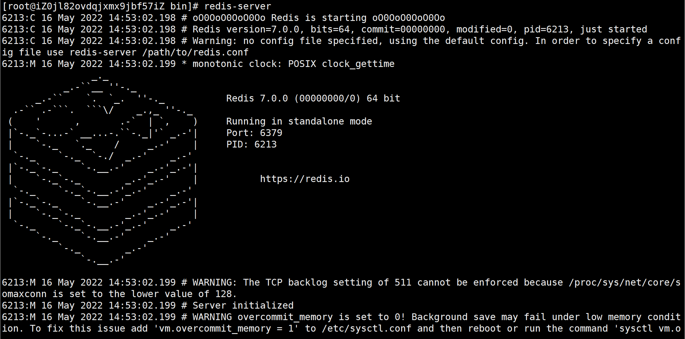
>
> 使用ctrl+c退出
>
> 后台启动：（推荐）
>
> - 安装 ***redis*** 的目录 ***/opt/redis-6.2.6*** 中将 ***redis.conf*** 复制到任意一个文件夹下
>
>   ```
>   cp redis.conf /etc/redis.conf
>   // 将redis.conf复制到/etc/下
>   ```
>
> - 修改 ***/etc/redis.conf*** 配置文件
>
>   ```bash
>   vim redis.conf
>   
>   # daemonize no 修改为 daemonize yes
>   ```
>
>   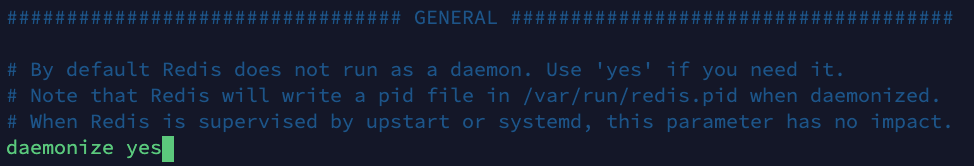***/usr/local/bin*** 目录下启动 ***redis***
>
>   ```bash
>   redis-server /etc/redis.conf
>   ```
>
>
> 查看进程：
>
> ```shell
> ps -ef | grep redis
> ```
>
> 启动客户端
>
> ```
> redis-cli
> ```
>
> 关闭 ***redis***
>
> - ***kill*** 进程
>
> - 命令 ***shutdown***
>
>   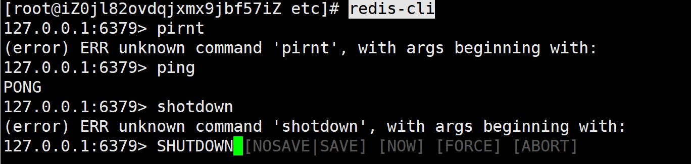


<u>**默认端口号：6379**</u>

端口号来源：

Merz的九键（女演员）

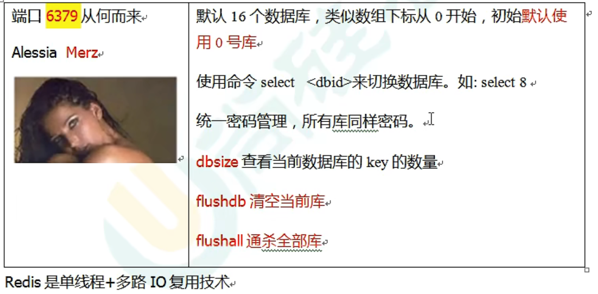

- Memcache支持单一数据类型，Redis支持多种数据类型
- 多线程+锁vs单线程+多路IO复用


# 三、NoSQL数据库

## 3.1、NoSQL数据库解决的问题

web2.0时代； 

- 解决 ***CPU*** 及内存压力

  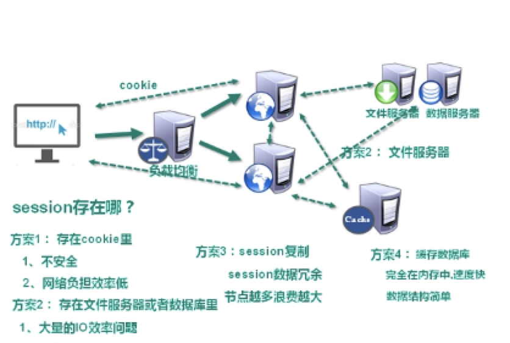

- 解决 ***IO*** 压力

  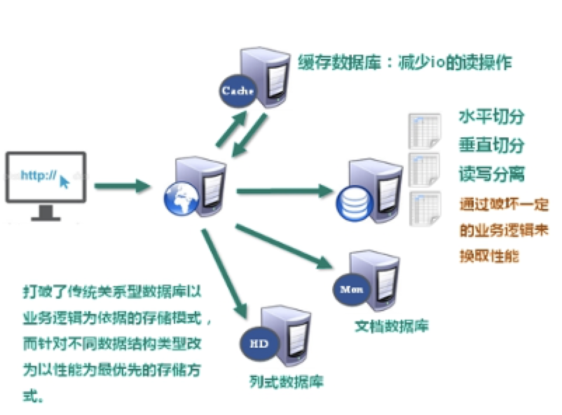

  **打破了传统关系型数据库以业务逻辑为依据的存储模式，而针对不同数据结构类型改为以性能为最优先的存储方式；**


***NoSQL（ NoSQL = Not Only SQL ）***，意即不仅仅是 ***SQL***，泛指非关系型的数据库。 

***NoSQL*** 不依赖业务逻辑方式存储，而以简单的 ***key-value*** 模式存储。因此大大的增加了数据库的扩展能力。

- 不遵循 ***SQL*** 标准。
- 不支持 ***ACID***。不是不支持事务
- 远超于 ***SQL*** 的性能。


## 3.2、适用于的场景

- 对数据高并发的读写；
- 海量数据的读写；
- 对数据高可扩展性的。

## 3.3、不适用的场景

- 需要事务支持；
- 基于 ***sql*** 的结构化查询存储，处理复杂的关系，需要即席查询。

==用不着sql和用了sql也不行的情况，考虑使用NoSQL==

## 3.4、常见的 ***NoSQL*** 数据库

- Redis
- MongoDB


大数据时代常用的数据库类型

- 行式数据库

  列式数据库

  


# 四、配置文件

***redis.conf***


## ***Units*** 

> 单位，配置大小单位，开头定义了一些基本的度量单位，只支持 ***bytes***，不支持 ***bit***。
>
> 大小写不敏感。

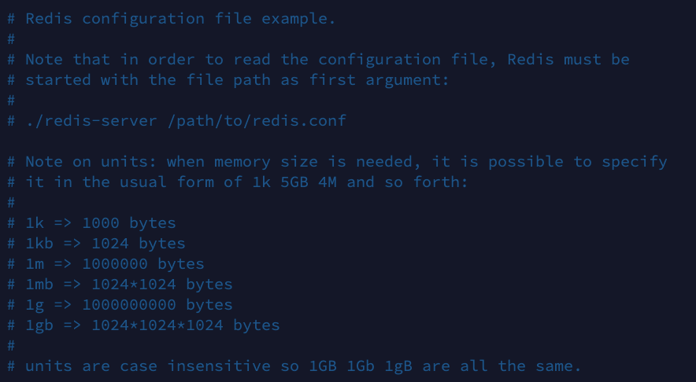


## ***INCLUDES***

> 包含，多实例的情况可以把公用的配置文件提取出来。

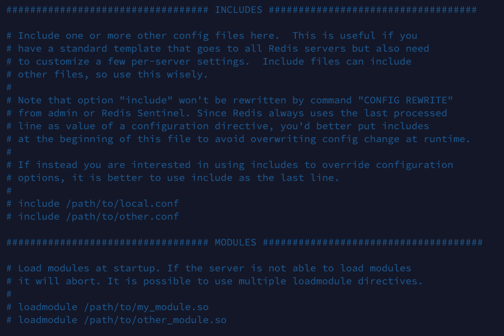


## ***NETWORK***

> 网络相关配置。
>
> 
>
> ***bind***
>
> 默认情况 `bind=127.0.0.1` 只能接受本机的访问请求。
>
> 不写的情况下，无限制接受任何 ***ip*** 地址的访问。
>
> 生产环境肯定要写你应用服务器的地址，服务器是需要远程访问的，*<u>所以需要将其注释掉</u>*。
>
> 如果开启了***protected-mode***，那么在没有设定 ***bind ip*** 且没有设密码的情况下，***Redis*** 只允许接受本机的响应。
>
> 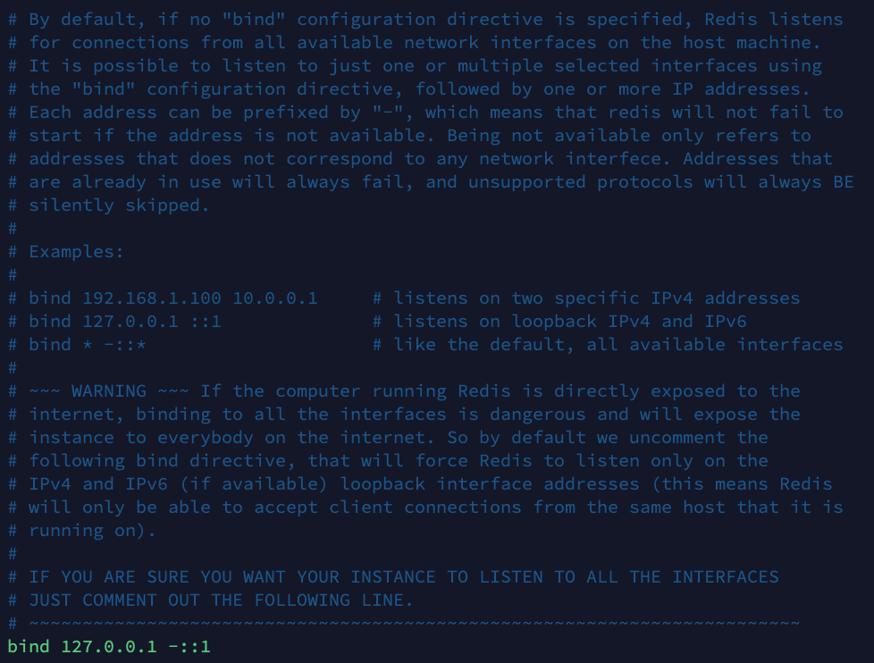
>
> 
>
> ***protected-mode***
>
> 将本机访问保护模式设置 ***no***。
>
> 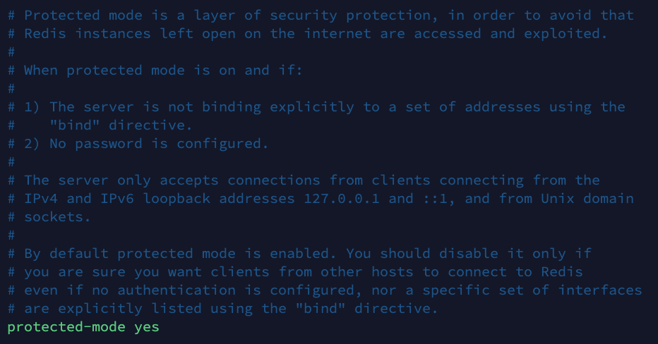
>
> 
>
> ***port***
>
> 端口号，默认 ***6379***。
>
> 
>
> 
>
> ***tcp-backlog***
>
> 设置 ***tcp*** 的 ***backlog***，***backlog*** 其实是一个连接队列，***backlog*** 队列总和 $=$ 未完成三次握手队列 $+$ 已经完成三次握手队列。
>
> 在高并发环境下你需要一个高 ***backlog*** 值来避免慢客户端连接问题。
>
> 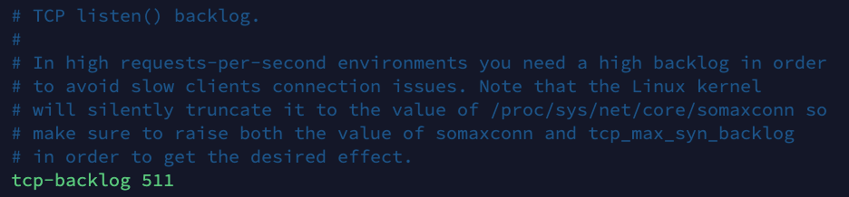
>
> 
>
> ***timeout***
>
> 一个空闲的客户端维持多少秒会关闭，0 表示关闭该功能。即永不关闭。
>
> 
>
> ***tcp-keepalive***
>
> 对访问客户端的一种心跳检测，每个 ***n*** 秒检测一次。
>
> 单位为秒，如果设置为 0，则不会进行 ***Keepalive*** 检测，建议设置成 60。
>
> 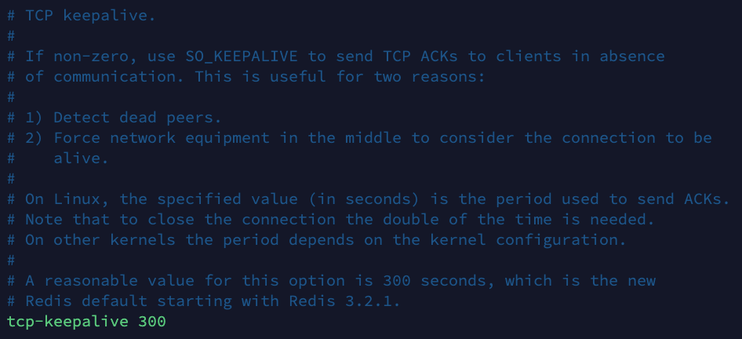


## ***GENERAL***

> 通用。
>
> 
>
> ***daemonize***
>
> 是否为后台进程，设置为 ***yes***。
>
> 守护进程，后台启动。
>
> 
>
> 
>
> ***pidfile***
>
> 存放 ***pid*** 文件的位置，每个实例会产生一个不同的 ***pid*** 文件。
>
> 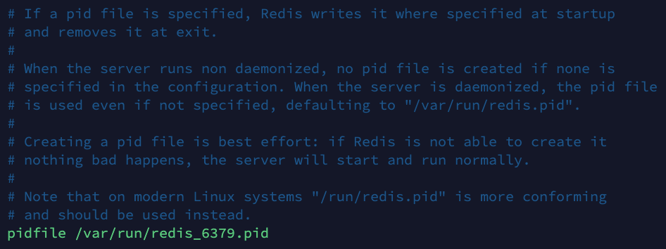
>
> 
>
> ***loglevel***
>
> 指定日志记录级别，***Redis*** 总共支持四个级别：***debug、verbose、notice、warning***，默认为 ***notice***。
>
> 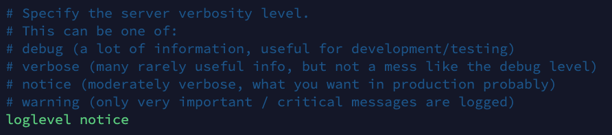
>
> 
>
> ***logfile***
>
> 日志文件名称。
>
> 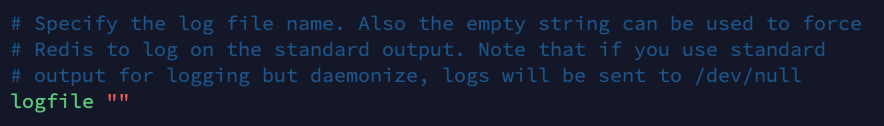
>
> 
>
> ***database***
>
> 设定库的数量 默认16，默认数据库为 0，可以使用 `SELECT <dbid>` 命令在连接上指定数据库 ***id***。
>
> 


## ***SECURITY***

> 安全。
>
> 访问密码的查看、设置和取消。
>
> 在命令中设置密码，只是临时的。重启 ***redis*** 服务器，密码就还原了。
>
> 永久设置，需要在配置文件中进行设置。


## ***LIMITS***

> 限制。
>
> 
>
> ***maxclients***
>
> 设置 ***redis*** 同时可以与多少个客户端进行连接。
>
> 默认情况下为 ***10000*** 个客户端。
>
> 如果达到了此限制，***redis*** 则会拒绝新的连接请求，并且向这些连接请求方发出 ***max number of clients reached*** 以作回应。
>
> 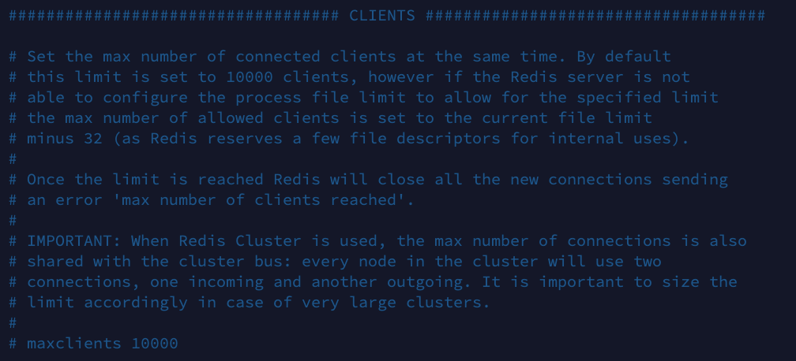
>
> ***maxmemory***
>
> 建议**必须设置**，否则，将内存占满，造成服务器宕机。
>
> 设置 ***redis*** 可以使用的内存量。一旦到达内存使用上限，***redis*** 将会试图移除内部数据，移除规则可以通过 ***maxmemory-policy*** 来指定。
>
> 如果 ***redis*** 无法根据移除规则来移除内存中的数据，或者设置了不允许移除，那么 ***redis*** 则会针对那些需要申请内存的指令返回错误信息，比如 ***SET、LPUSH*** 等。
>
> 但是对于无内存申请的指令，仍然会正常响应，比如 ***GET*** 等。如果你的 ***redis*** 是主 ***redis***（ 说明你的 ***redis*** 有从 ***redis*** ），那么在设置内存使用上限时，需要在系统中留出一些内存空间给同步队列缓存，只有在你设置的是“不移除”的情况下，才不用考虑这个因素。
>
> 
>
> 
>
> ***maxmemory-policy***
>
> ***volatile-lru***：使用 ***LRU*** 算法移除 ***key***，只对设置了过期时间的键（最近最少使用）。
>
> ***allkeys-lru***：在所有集合 ***key*** 中，使用 ***LRU*** 算法移除 ***key***。
>
> ***volatile-random***：在过期集合中移除随机的 ***key***，只对设置了过期时间的键。
>
> ***allkeys-random***：在所有集合 ***key*** 中，移除随机的 ***key***。
>
> ***volatile-ttl***：移除那些 ***TTL*** 值最小的 ***key***，即那些最近要过期的 ***key***。
>
> ***noeviction***：不进行移除。针对写操作，只是返回错误信息。
>
> 
>
> 
>
> ***maxmemory-samples***
>
> 设置样本数量，***LRU*** 算法和最小 ***TTL*** 算法都并非是精确的算法，而是估算值，所以你可以设置样本的大小，***redis*** 默认会检查这么多个 ***key*** 并选择其中 ***LRU*** 的那个。
>
> 一般设置 3 到 7 的数字，数值越小样本越不准确，但性能消耗越小。
>
> 


# 五、常用五大基本数据类型

说的这个类型是value的类型，而不是key的类型；

## 5.1、key操作

> `keys *`：查看当前库所有 ***key***   
>
> `exists key`：判断某个 ***key*** 是否存在
>
> `type key`：查看你的 ***key*** 是什么类型
>
> `del key` ：删除指定的 ***key*** 数据
>
> `unlink key`：根据 ***value*** 选择非阻塞删除，仅将 ***keys*** 从 ***keyspace*** 元数据中删除，真正的删除会在后续异步操作
>
> `expire key 10` ：为给定的 ***key*** 设置过期时间
>
> `ttl key`：查看还有多少秒过期，-1表示永不过期，-2表示已过期
>
> 
>
> `select`：命令切换数据库
>
> `dbsize`：查看当前数据库的 ***key*** 的数量
>
> `flushdb`：清空当前库
>
> `flushall`：通杀全部库


## 5.2、字符串（String）

***String*** 类型是二进制安全的。意味着 ***Redis*** 的 ***string*** 可以包含任何数据。比如 ***jpg*** 图片或者序列化的对象。

***String*** 类型是 ***Redis*** 最基本的数据类型，一个 ***Redis*** 中字符串 ***value*** 最多可以是 512M。


> `set <key><value>`：添加键值对
>
> `get <key>`：查询对应键值
>
> `append <key><value>`：将给定的 ***\<value>*** 追加到原值的末尾
>
> `strlen <key>`：获得值的长度
>
> `setnx <key><value>`：只有在 ***key*** 不存在时，设置 ***key*** 的值
>
> `incr <key>`：将 ***key*** 中储存的数字值增 1，只能对数字值操作，如果为空，新增值为 1（**<u>具有原子性</u>**）
>
> `decr <key>`：将 ***key*** 中储存的数字值减 1，只能对数字值操作，如果为空，新增值为 -1
>
> `incrby/decrby <key><步长>`：将 ***key*** 中储存的数字值增减。自定义步长
>
> 
>
> `mset <key1><value1><key2><value2>` ：同时设置一个或多个 ***key-value*** 对 
>
> `mget <key1><key2><key3>...`：同时获取一个或多个 ***value*** 
>
> `msetnx <key1><value1><key2><value2>... `：同时设置一个或多个 ***key-value*** 对，当且仅当所有给定 ***key*** 都不存在	
>
> `getrange <key><起始位置><结束位置>`：获得值的范围
>
> `setrange <key><起始位置><value>`：用 ***\<value>*** 覆写 ***\<key>*** 所储存的字符串值
>
> `setex <key><过期时间><value>`：设置键值的同时，设置过期时间，单位秒。
>
> `getset <key><value>`：以新换旧，设置了新值同时获得旧值。


**原子性**

比如使用msetnx进行设置多个值，那么要么都成功，要么都不成功；

所谓 **原子** 操作是指不会被线程调度机制打断的操作；

这种操作一旦开始，就一直运行到结束，中间不会有任何 ***context switch*** （切换到另一个线程）。

- 在单线程中， 能够在单条指令中完成的操作都可以认为是"原子操作"，因为中断只能发生于指令之间。

- 在多线程中，不能被其它进程（线程）打断的操作就叫原子操作。

***Redis*** 单命令的原子性主要得益于 ***Redis*** 的单线程。

**案例：**

java中的i++是否是原子性？

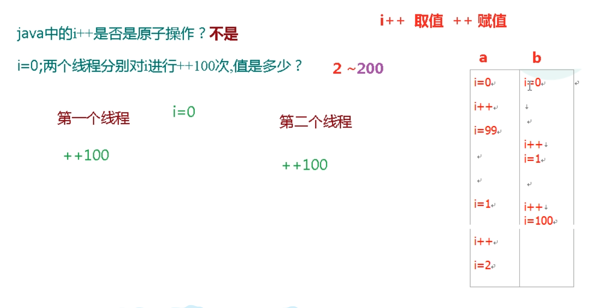

a在操作过程中，可能被b打断，b在操作过程中，可能被a打断。


**数据结构**

简单动态字符串

内部结构实现上类似于 ***Java*** 的 ***ArrayList***，采用预分配冗余空间的方式来减少内存的频繁分配.

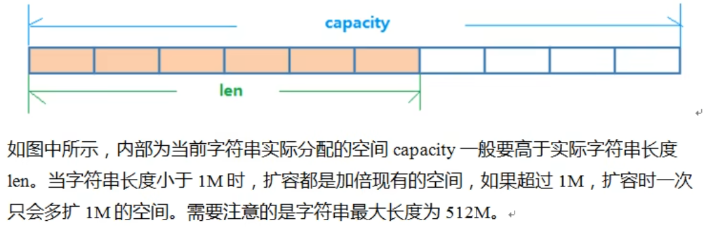


## 5.3、列表（List）

***Redis*** 列表是简单的字符串列表，按照插入顺序排序（有序）。你可以添加一个元素到列表的头部（左边）或者尾部（右边）。

它的底层实际是个双向链表，对两端的操作性能很高，通过索引下标的操作中间的节点性能会较差。


> `lpush/rpush <key><value1><value2><value3> ....`： 从左边/右边插入一个或多个值。
>
> ```
> lpush k1 v1 v2 v3
> lrange k1 0 -1
> 输出：v3 v2 v1
> 
> rpush k1 v1 v2 v3
> rrange k1 0 -1 
> 输出：v1 v2 v3
> ```
>
> `lpop/rpop <key>`：从左边/右边吐出一个值。值在键在，值光键亡。
>
> `rpoplpush <key1><key2>`：从 ***\<key1>*** 列表右边吐出一个值，插到 ***\<key2>*** 列表左边。
>
> `lrange <key><start><stop>`：按照索引下标获得元素（从左到右）
>
> `lrange mylist 0 -1  0`：左边第一个，-1右边第一个，（0 -1表示获取所有）
>
> `lindex <key><index>`：按照索引下标获得元素（从左到右）
>
> `llen <key>`：获得列表长度  
>
> 
>
> `linsert <key> before/after <value><newvalue>`：在 ***\<value>*** 的前面/后面插入 ***\<newvalue>*** 插入值
>
> `lrem <key><n><value>`：从左边删除 ***n*** 个 ***value***（从左到右）
>
> `lset<key><index><value>`：将列表 ***key*** 下标为 ***index*** 的值替换成 ***value***


**数据结构**

***List*** 的数据结构为快速链表 ***quickList***。

首先在列表元素较少的情况下会使用一块连续的内存存储，这个结构是 ***ziplist***，也即是压缩列表。

它将所有的元素紧挨着一起存储，分配的是一块连续的内存。

当数据量比较多的时候才会改成 ***quicklist***。

因为普通的链表需要的附加指针空间太大，会比较浪费空间。比如这个列表里存的只是 ***int*** 类型的数据，结构上还需要两个额外的指针 ***prev*** 和 ***next***。

***Redis*** 将链表和 ***ziplist*** 结合起来组成了 ***quicklist***。也就是将多个 ***ziplist*** 使用双向指针串起来使用。这样既满足了快速的插入删除性能，又不会出现太大的空间冗余。


## 5.4、Set（集合）

***Set*** 对外提供的功能与 ***List*** 类似列表的功能，特殊之处在于 ***Set*** 是可以 **<u>自动排重</u>** 的，当需要存储一个列表数据，又不希望出现重复数据时，***Set*** 是一个很好的选择，并且 ***Set*** 提供了判断某个成员是否在一个 ***Set*** 集合内的重要接口，这个也是 ***List*** 所不能提供的。

***Redis*** 的 ***Set*** 是 ***String*** 类型的无序集合。它底层其实是一个 ***value*** 为 ***null*** 的 ***hash*** 表，所以添加，删除，查找的复杂度都是 ***O(1)***。

一个算法，随着数据的增加，执行时间的长短，如果是 ***O(1)***，数据增加，查找数据的时间不变。


> `sadd <key><value1><value2> ..... `：将一个或多个 ***member*** 元素加入到集合 ***key*** 中，已经存在的 ***member*** 元素将被忽略
>
> `smembers <key>`：取出该集合的所有值。
>
> `sismember <key><value>`：判断集合 ***\<key>*** 是否为含有该 ***\<value>*** 值，有返回 1，没有返回 0
>
> `scard<key>`：返回该集合的元素个数。
>
> `srem <key><value1><value2> ....`：删除集合中的某个元素
>
> `spop <key>`：随机从该集合中吐出一个值
>
> `srandmember <key><n>`：随机从该集合中取出 ***n*** 个值，不会从集合中删除 
>
> `smove <source><destination>value`：把集合中一个值从一个集合移动到另一个集合
>
> `sinter <key1><key2>`：返回两个集合的交集元素
>
> `sunion <key1><key2>`：返回两个集合的并集元素
>
> `sdiff <key1><key2>`：返回两个集合的差集元素（***key1*** 中的，不包含 ***key2*** 中的）


**数据结构**

***Set*** 数据结构是字典，字典是用哈希表实现的。


## 5.5、Hash（哈希）

***Redis hash*** 是一个键值对集合。

***Redis hash*** 是一个 ***String*** 类型的 ***field*** 和 ***value*** 的映射表，***hash*** 特别适合用于存储对象。


> `hset <key><field><value>`：给 ***\<key>*** 集合中的 ***\<field>*** 键赋值 ***\<value>***
>
> `hget <key1><field>`：从 ***\<key1>*** 集合 ***\<field>*** 取出 ***value*** 
>
> `hmset <key1><field1><value1><field2><value2>...`： 批量设置 ***hash*** 的值
>
> `hexists <key1><field>`：查看哈希表 ***key*** 中，给定域 ***field*** 是否存在
>
> `hkeys <key>`：列出该 ***hash*** 集合的所有 ***field***
>
> `hvals <key>`：列出该 ***hash*** 集合的所有 ***value***
>
> `hincrby <key><field><increment>`：为哈希表 ***key*** 中的域 ***field*** 的值加上增量 1  -1
>
> `hsetnx <key><field><value>`：将哈希表 ***key*** 中的域 ***field*** 的值设置为 ***value*** ，当且仅当域 ***field*** 不存在


**数据结构**

***Hash*** 类型对应的数据结构是两种：***ziplist***（压缩列表），***hashtable***（哈希表）。

当 ***field-value*** 长度较短且个数较少时，使用 ***ziplist***，否则使用 ***hashtable***。


## 5.6、Zset（有序集合）

***Redis*** 有序集合 ***zset*** 与普通集合 ***set*** 非常相似，是一个没有重复元素的字符串集合。

不同之处是有序集合的每个成员都关联了一个评分（***score***）,这个评分（***score***）被用来按照从最低分到最高分的方式排序集合中的成员。集合的成员是唯一的，但是评分可以是重复的。

因为元素是有序的，所以可以很快的根据评分（***score***）或者次序（***position***）来获取一个范围的元素。

访问有序集合的中间元素也是非常快的，因此能够使用有序集合作为一个没有重复成员的智能列表。


> `zadd <key><score1><value1><score2><value2>…`：将一个或多个 ***member*** 元素及其 ***score*** 值加入到有序集 ***key*** 当中
>
> `zrange <key><start><stop> [WITHSCORES]  `：返回有序集 ***key*** 中，下标在 ***\<start>\<stop>*** 之间的元素
>
> 当带 ***WITHSCORES***，可以让分数一起和值返回到结果集
>
> `zrangebyscore key min max [withscores] [limit offset count]`：返回有序集 ***key*** 中，所有 ***score*** 值介于 ***min*** 和 ***max*** 之间（包括等于 ***min*** 或 ***max*** ）的成员。有序集成员按 ***score*** 值递增（从小到大）次序排列。
>
> `zrevrangebyscore key max min [withscores] [limit offset count] `：同上，改为从大到小排列
>
> `zincrby <key><increment><value>`：为元素的 ***score*** 加上增量
>
> `zrem <key><value>`：删除该集合下，指定值的元素
>
> `zcount <key><min><max>`：统计该集合，分数区间内的元素个数 
>
> `zrank <key><value>`：返回该值在集合中的排名，从 0 开始。


**数据结构**

***SortedSet（zset）***是 ***Redis*** 提供的一个非常特别的数据结构，一方面它等价于 ***Java*** 的数据结构 ***Map<String, Double>***，可以给每一个元素 ***value*** 赋予一个权重 ***score***，另一方面它又类似于 ***TreeSet***，内部的元素会按照权重 ***score*** 进行排序，可以得到每个元素的名次，还可以通过 ***score*** 的范围来获取元素的列表。

***zset*** 底层使用了两个数据结构

- ***hash***，***hash*** 的作用就是关联元素 ***value*** 和权重 ***score***，保障元素 ***value*** 的唯一性，可以通过元素 ***value*** 找到相应的 ***score*** 值

- 跳跃表，跳跃表的目的在于给元素 ***value*** 排序，根据 ***score*** 的范围获取元素列表

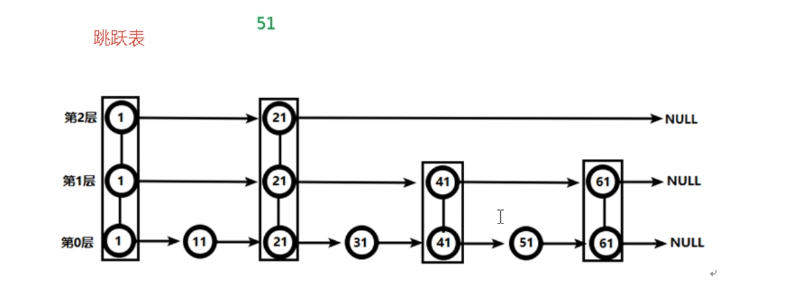

从上向下,使用跳跃表的目的是为了快速找到表中的元素。

# 六、Redis6新数据结构

## 6.1 Bitmaps

### 6.1.1 简介

>现代计算机用二进制（位） 作为信息的基础单位， 1个字节等于8位， 例如“abc”字符串是由3个字节组成， 但实际在计算机存储时将其用二进制表示， “abc”分别对应的ASCII码分别是97、 98、 99， 对应的二进制分别是01100001、 01100010和01100011，如下图
>
>
>
>合理地使用操作位能够有效地提高内存使用率和开发效率。

Redis提供了Bitmaps这个“数据类型”可以实现对位的操作：

1. Bitmaps本身不是一种数据类型， **实际上它就是字符串**（key-value） ， 但是它可以对字符串的位进行操作。

2. Bitmaps单独提供了一套命令，所以在中使用和使用字符串的方法不太相同。**可以把想象成一个以位为单位的数组，数组的每个单元只能存储0和1，数组的下标在中叫做偏移量**

   


### 5.1.2 命令

- **setbit**

语法

```shell
setbit<key><offset><value>设置Bitmaps中某个偏移量的值（0或1）# offset:偏移量从0开始
```

实例

每个独立用户是否访问过网站存放在Bitmaps中， 将访问的用户记做1， 没有访问的用户记做0， 用偏移量作为用户的id。

设置键的第offset个位的值（从0算起） ， 假设现在有20个用户，userid=1， 6， 11， 15， 19的用户对网站进行了访问， 那么当前Bitmaps初始化结果如图


users:20000911代表2000-09-11这天的独立访问用户的Bitmaps

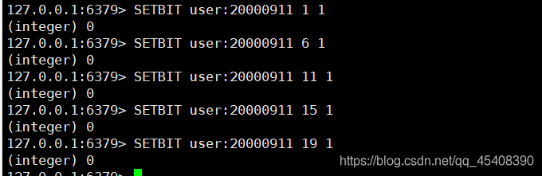

**注**：

> - 很多应用的用户id以一个指定数字（例如10000） 开头， 直接将用户id和Bitmaps的偏移量对应势必会造成一定的浪费， 通常的做法是每次做setbit操作时将用户id减去这个指定数字。
> - 在第一次初始化Bitmaps时， 假如偏移量非常大， 那么整个初始化过程执行会比较慢， 可能会造成Redis的阻塞。

- **getbit**

```
getbit<key><offset> # 获取Bitmaps中某个偏移量的值
```

**实例**

获取id=100的用户是否在这天访问过， 返回0说明没有访问过

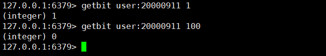

注：因为12根本不存在，所以也是返回0

- **bitcount**

>统计字符串被设置为1的bit数。一般情况下，给定的整个字符串都会被进行计数，通过指定额外的 start 或 end 参数，可以让计数只在特定的位上进行。start 和 end 参数的设置，都可以使用负数值：比如 -1 表示最后一个位，而 -2 表示倒数第二个位，start、end 是指bit组的字节的下标数，二者皆包含。

### 5.1.3 Bitmaps与set对比

假设网站有1亿用户， 每天独立访问的用户有5千万， 如果每天用集合类型和Bitmaps分别存储活跃用户可以得到表

| set和Bitmaps存储一天活跃用户对比 |                    |                  |                        |
| -------------------------------- | ------------------ | ---------------- | ---------------------- |
| 数据类型                         | 每个用户id占用空间 | 需要存储的用户量 | 全部内存量             |
| 集合类型                         | 64位               | 50000000         | 64位*50000000 = 400MB  |
| Bitmaps                          | 1位                | 100000000        | 1位*100000000 = 12.5MB |

很明显， 这种情况下使用Bitmaps能节省很多的内存空间， 尤其是随着时间推移节省的内存还是非常可观的

| set和Bitmaps存储独立用户空间对比 |        |        |       |
| -------------------------------- | ------ | ------ | ----- |
| 数据类型                         | 一天   | 一个月 | 一年  |
| 集合类型                         | 400MB  | 12GB   | 144GB |
| Bitmaps                          | 12.5MB | 375MB  | 4.5GB |

但Bitmaps并不是万金油， 假如该网站每天的独立访问用户很少， 例如只有10万（大量的僵尸用户） ， 那么两者的对比如下表所示， 很显然， 这时候使用Bitmaps就不太合适了， 因为基本上大部分位都是0。

| set和Bitmaps存储一天活跃用户对比（独立用户比较少） |                    |                  |                        |
| -------------------------------------------------- | ------------------ | ---------------- | ---------------------- |
| 数据类型                                           | 每个userid占用空间 | 需要存储的用户量 | 全部内存量             |
| 集合类型                                           | 64位               | 100000           | 64位*100000 = 800KB    |
| Bitmaps                                            | 1位                | 100000000        | 1位*100000000 = 12.5MB |

## 6.2 HyperLogLog

### 6.2.1 简介

在工作当中，我们经常会遇到与统计相关的功能需求，比如统计网站PV（PageView页面访问量）,可以使用Redis的incr、incrby轻松实现。但像UV（UniqueVisitor，独立访客）、独立IP数、搜索记录数等需要去重和计数的问题如何解决？这种求集合中不重复元素个数的问题称为基数问题。

解决基数问题有很多种方案：
（1）数据存储在MySQL表中，使用distinct count计算不重复个数

（2）使用Redis提供的hash、set、bitmaps等数据结构来处理

以上的方案结果精确，但随着数据不断增加，导致占用空间越来越大，对于非常大的数据集是不切实际的。

能否能够降低一定的精度来平衡存储空间？Redis推出了HyperLogLog

Redis HyperLogLog 是用来做基数统计的算法，HyperLogLog 的优点是，在输入元素的数量或者体积非常非常大时，计算基数所需的空间总是固定的、并且是很小的。

在 Redis 里面，每个 HyperLogLog 键只需要花费 12 KB 内存，就可以计算接近 2^64 个不同元素的基数。这和计算基数时，元素越多耗费内存就越多的集合形成鲜明对比。

但是，因为 HyperLogLog 只会根据输入元素来计算基数，而不会储存输入元素本身，所以**HyperLogLog 不能像集合那样，返回输入的各个元素。**

什么是基数?

比如数据集 {1, 3, 5, 7, 5, 7, 8}， 那么这个数据集的基数集为 {1, 3, 5 ,7, 8}, 基数(**不重复元素个数**)为5。 基数估计就是在误差可接受的范围内，快速计算基数。

### 6.2.2 命令

- **pfadd**
- **pfcount**

```
pfadd <key>< element> [element ...]   #添加指定元素到 HyperLogLog 中
pfcount<key> [key ...] # 计算HLL的近似基数，可以计算多个HLL，比如用HLL存储每天的UV，计算一周的UV可以使用7天的UV合并计算即可
```

实例


- **pfmerge**

  ```
  pfmerge<destkey><sourcekey> [sourcekey ...]  #将一个或多个HLL合并后的结果存储在另一个HLL中，比如每月活跃用户可以使用每天的活跃用户来合并计算可得
  ```

**实例**

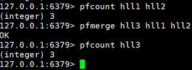

## 6.3 Geospatial

### 6.3.1 简介

Redis 3.2 中增加了对GEO类型的支持。GEO，Geographic，地理信息的缩写。该类型，就是元素的2维坐标，在地图上就是经纬度。redis基于该类型，提供了经纬度设置，查询，范围查询，距离查询，经纬度Hash等常见操作。

### 6.3.2 命令

- **geoadd**

```
geoadd<key>< longitude><latitude><member> [longitude latitude member...]  # 添加地理位置（经度，纬度，名称）
```

**实例**

```
geoadd china:city 121.47 31.23 shanghai
geoadd china:city 106.50 29.53 chongqing 114.05 22.52 shenzhen 116.38 39.90 beijing
```


>1. 两极无法直接添加，一般会下载城市数据，直接通过 Java 程序一次性导入。
>2. 有效的经度从 -180 度到 180 度。有效的纬度从 -85.05112878 度到 85.05112878 度。
>3. 当坐标位置超出指定范围时，该命令将会返回一个错误。
>4. 已经添加的数据，是无法再次往里面添加的。

- **geopos**

```
geopos  <key><member> [member...]  #获得指定地区的坐标值
```

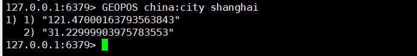

- **geodist**

```
geodist<key><member1><member2>  [m|km|ft|mi ]  #获取两个位置之间的直线距离
```

获取两个位置之间的直线距离


>单位：
>
>m 表示单位为米[默认值]。
>
>km 表示单位为千米。
>
>mi 表示单位为英里。
>
>ft 表示单位为英尺。
>
>如果用户没有显式地指定单位参数， GEODIST

- **georadius**

```
georadius<key>< longitude><latitude>radius  m|km|ft|mi   #以给定的经纬度为中心，找出某一半径内的元素 四个参数 -》经度 纬度 距离 单位
```


# 七、Redis的发布与订阅

***Redis*** 发布订阅（ ***pub/sub*** ）是一种消息通信模式：发送者（ ***pub*** ）发送消息，订阅者（ ***sub*** ）接收消息。

***Redis*** 客户端可以订阅任意数量的频道。


1. 客户端可以订阅频道


2. 当给这个频道发布消息后，消息就会发送给订阅的客户端


> ```
> subscribe channel # 订阅频道
> 
> publish channel hello # 频道发送信息
> ```


# 八、事务和锁机制

***Redis*** 事务是一个单独的隔离操作：事务中的所有命令都会序列化、按顺序地执行。事务在执行的过程中，不会被其他客户端发送来的命令请求所打断。

***Redis*** 事务的主要作用就是**串联多个命令**防止别的命令插队。


## *Multi*、*Exec*、*Discard*

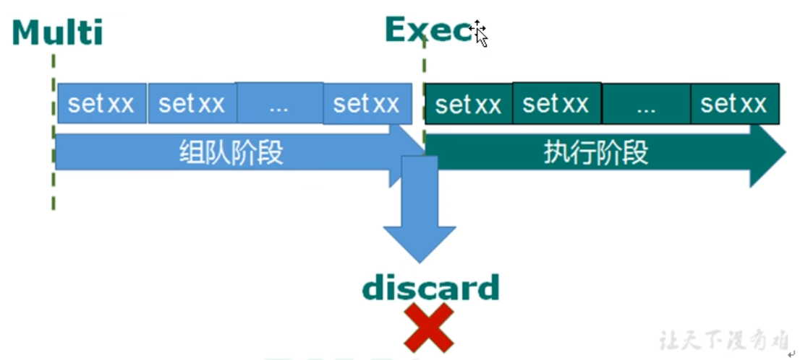

> ***Multi***
>
> ***Exec***
>
> ***Discard***	
>
> 从输入 ***Multi*** 命令开始，输入的命令都会依次进入命令队列中，但不会执行，直到输入 ***Exec*** 后，***Redis*** 会将之前的命令队列中的命令依次执行。
>
> 组队的过程中可以通过 ***Discard*** 来放弃组队。 


- 组队成功，提交成功

  

- 放弃组队

  

- **组队中有命令错误，不会执行**

  

- 组队中不报错，执行时报错

  


当组队中某个命令出现了报告错误，执行时整个的所有队列都会被取消。

组队中报错，则所有命令都不会执行，执行中报错，那么只有错的不会执行；

## 悲观锁

悲观锁（***Pessimistic Lock***），即每次去拿数据的时候都认为有其他线程会修改，所以每次在拿数据的时候都会上锁，这样其他线程想要拿到这个数据就会被 ***block*** 直到成功拿到锁。（效率低）

传统的关系型数据库中就用到了这种锁，比如行锁，表锁等，读锁写锁等，都是在操作之前先上锁；

## 乐观锁

乐观锁（***Optimistic Lock***），即每次去拿数据的时候都认为其他线程不会修改，所以不会上锁，但是在更新的时候会判断一下在此期间有没有其他线程去更新这个数据，可以使用版本号等机制。

**乐观锁适用于多读的应用类型，这样可以提高吞吐量**。

***Redis*** 就是利用这种 ***check-and-set*** 机制实现事务的。

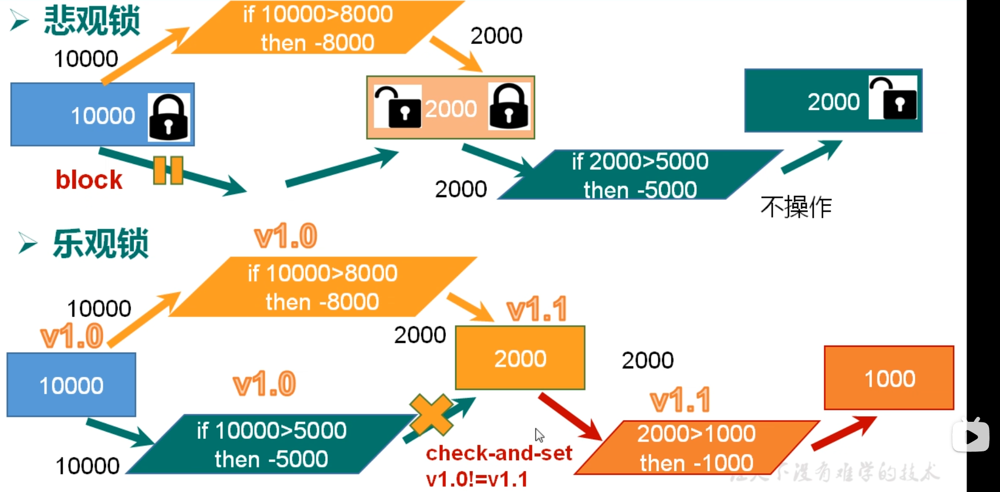

## *Watch、unwatch*

在执行 ***multi*** 之前，先执行 ***watch key1 [key2]***，可以监视一个（或多个 ）***key*** 。如果在事务执行之前这个 ***key*** **被其他命令所改动，那么事务将被打断**。

取消 ***WATCH*** 命令对所有 ***key*** 的监视。如果在执行 ***WATCH*** 命令之后，***EXEC*** 命令或 ***DISCARD*** 命令先被执行，那么就不需要再执行 ***UNWATCH*** 。


## 事务三特性

- 单独的隔离操作 

  事务中的所有命令都会序列化、按顺序地执行。事务在执行的过程中，不会被其他客户端发送来的命令请求所打断。 

- 没有隔离级别的概念 

  队列中的命令没有提交之前都不会实际被执行，因为事务提交前任何指令都不会被实际执行。

- 不保证原子性 

  事务中如果有一条命令执行失败，其后的命令仍然会被执行，没有回滚 。

# 九、事务案例（秒杀）

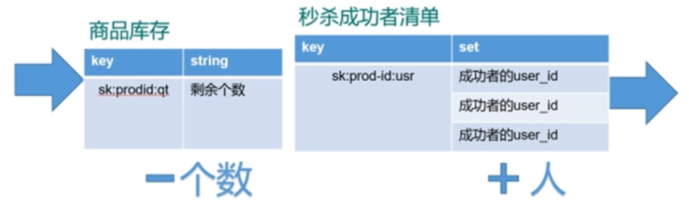


```java
//秒杀过程
    public boolean doSecKill(String uid,String prodid){
       //1.判断uid与prodid是否为空
        if(uid == null || prodid==null){
            return false;
        }
        //2连接redis
        Jedis jedis = new Jedis("8.130.19.148", 4314);
        //3.拼接key
        //3.1库存key
        String kcKey="sk:"+prodid+":qt";
        //3.2秒杀用户key
        String userKey="sk:"+prodid+":user";

        //4获取库存，如果库存null，秒杀还没开始
        String kc = jedis.get(kcKey);
        if(kc==null){
            System.out.println("秒杀还没开始，请等待");
            jedis.close();
            return false;
        }
        //5.判断用户是否重复秒杀操作
        if(jedis.sismember(userKey,uid)){
            System.out.println("已经秒杀成功了，请不要重复秒杀");
            jedis.close();
            return false;
        }
        //6.判断如果商品数量小于1，那么秒杀结束
        if(Integer.parseInt(kc)<=0){
            System.out.println("秒杀已经结束了");
            jedis.close();
            return false;
        }
        //7.秒杀过程
        //7.1库存-1
        jedis.decr(kcKey);
        //7.2 把秒杀成功的用户添加到清单中
        jedis.sadd(userKey,uid);
        jedis.close();
        return true;
    }
```


### Redis事务—秒杀并发模拟

> **使用工具ab模拟测试：**
>
> - CentOS6 默认安装
> - CentOS7需要手动安装

**通过ab测试**

im postfile 模拟表单提交参数， 以&符号结尾，存放当前目录。

内容：prodid=0101&

执行：ab -n 2000 -c 200 -k -p ~/postfile -T application/x-www-form-urlencoded

访问：http://192.168.2.115:8081/Seckill/doseckill

**超卖**，库存数量出现负数


### 超卖问题


**利用乐观锁淘汰用户，解决超卖问题。**

使用watch命令监视库存，然后加入事务；

**主要代码：**

```java
public class SecKill_redis {

	public static void main(String[] args) {
		Jedis jedis =new Jedis("192.168.44.168",6379);
		System.out.println(jedis.ping());
		jedis.close();
	}

	//秒杀过程
	public static boolean doSecKill(String uid,String prodid) throws IOException {
		//1 uid和prodid非空判断
		if(uid == null || prodid == null) {
			return false;
		}

		//2 连接redis
		//Jedis jedis = new Jedis("192.168.44.168",6379);
		//通过连接池得到jedis对象
		JedisPool jedisPoolInstance = JedisPoolUtil.getJedisPoolInstance();
		Jedis jedis = jedisPoolInstance.getResource();

		//3 拼接key
		// 3.1 库存key
		String kcKey = "sk:"+prodid+":qt";
		// 3.2 秒杀成功用户key
		String userKey = "sk:"+prodid+":user";

		//监视库存
		jedis.watch(kcKey);

		//4 获取库存，如果库存null，秒杀还没有开始
		String kc = jedis.get(kcKey);
		if(kc == null) {
			System.out.println("秒杀还没有开始，请等待");
			jedis.close();
			return false;
		}

		// 5 判断用户是否重复秒杀操作
		if(jedis.sismember(userKey, uid)) {
			System.out.println("已经秒杀成功了，不能重复秒杀");
			jedis.close();
			return false;
		}

		//6 判断如果商品数量，库存数量小于1，秒杀结束
		if(Integer.parseInt(kc)<=0) {
			System.out.println("秒杀已经结束了");
			jedis.close();
			return false;
		}

		//7 秒杀过程
		//使用事务
		Transaction multi = jedis.multi();

		//组队操作
		multi.decr(kcKey);
		multi.sadd(userKey,uid);

		//执行
		List<Object> results = multi.exec();

		if(results == null || results.size()==0) {
			System.out.println("秒杀失败了....");
			jedis.close();
			return false;
		}

		//7.1 库存-1
		//jedis.decr(kcKey);
		//7.2 把秒杀成功用户添加清单里面
		//jedis.sadd(userKey,uid);

		System.out.println("秒杀成功了..");
		jedis.close();
		return true;
	}
}
```


### 继续增加并发测试

**连接有限制**

增加-r参数，-r Don’t exit on socket receive errors。

**已经秒光，可是还有库存**

已经秒光，可是还有库存。原因：乐观锁导致很多请求都失败。先点的没秒到，后点的可能秒到了。


**连接超时，通过连接池解决**

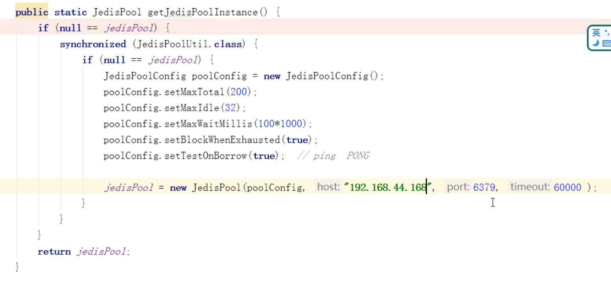

节省每次连接redis服务带来的消耗，把连接好的实例反复利用。通过参数管理连接的行为，代码见项目中：

连接池参数：

- MaxTotal：控制一个pool可分配多少个jedis实例，通过pool.getResource()来获取；如果赋值为-1，则表示不限制；如果pool已经分配了MaxTotal个jedis实例，则此时pool的状态为exhausted。
- maxIdle：控制一个pool最多有多少个状态为idle(空闲)的jedis实例；
- MaxWaitMillis：表示当borrow一个jedis实例时，最大的等待毫秒数，如果超过等待时间，则直接抛JedisConnectionException；
- testOnBorrow：获得一个jedis实例的时候是否检查连接可用性（ping()）；如果为true，则得到的jedis实例均是可用的。

### **解决库存遗留问题**

乐观锁造成的库存遗留问题

因为版本号进行更改，所以即使有库存，也无法进行购买；

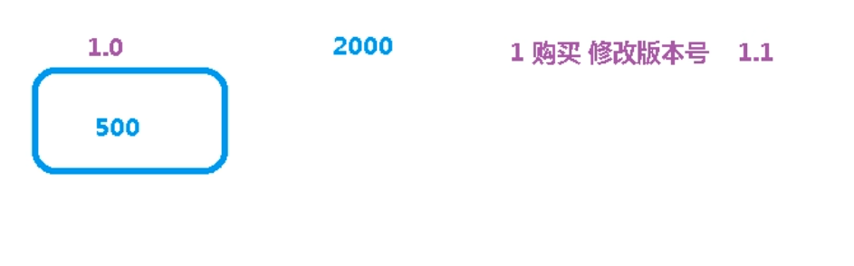

如何解决？

使用Lua脚本语言


**LUA脚本在Redis中的优势**

- 将复杂的或者多步的redis操作，写为一个脚本，一次提交给redis执行，减少反复连接redis的次数，提升性能。
- LUA脚本是类似redis事务，**有一定的原子性，不会被其他命令插队**，可以完成一些redis事务性的操作。
- 但是注意redis的lua脚本功能，只有在Redis 2.6以上的版本才可以使用。
- 利用lua脚本淘汰用户，解决超卖问题，redis 2.6版本以后，通过lua脚本解决**争抢问题**，实际上是**redis** **利用其单线程的特性，用任务队列的方式解决多任务并发问题**。

# 十、持久化

## 10.1、RDB

Redis DataBase

**什么是RDB？**

在**指定的时间间隔内将内存中的数据集快照写入磁盘**， 即 ***Snapshot*** 快照，恢复时是将快照文件直接读到内存里。


***Redis*** 会单独创建一个子进程（***fork***）来进行持久化。

先将数据写入到一个临时文件中，待持久化过程完成后，再将这个临时文件内容覆盖到 ***dump.rdb***。 

整个过程中，主进程是不进行任何 ***IO*** 操作的，这就确保了极高的性能。如果需要进行大规模数据的恢复，且对于数据恢复的完整性不是非常敏感，那 ***RDB*** 方式要比 ***AOF*** 方式更加的高效。

***RDB* 的缺点是最后一次持久化后的数据可能丢失**。

 

### Fork

- 作用是复制一个与当前进程一样的进程。新进程的所有数据（变量、环境变量、程序计数器等） 数值都和原进程一致，但是是一个全新的进程，并作为原进程的子进程

- 在 ***Linux*** 程序中，***fork()*** 会产生一个和父进程完全相同的子进程，但子进程在此后多会 ***exec*** 系统调用，出于效率考虑，***Linux*** 中引入了 **写时复制技术**

- **一般情况父进程和子进程会共用同一段物理内存**，只有进程空间的各段的内容要发生变化时，才会将父进程的内容复制一份给子进程


### 配置

> ***dump* 文件名字**
>
> 在 ***redis.conf*** 中配置文件名称，默认为 ***dump.rdb***。
>
> 
>
> 
>
> ***dump* 保存位置**
>
> ***rdb*** 文件的保存路径可以修改。默认为 ***Redis*** 启动时命令行所在的目录下。
>
> 
>
> 
>
> ***stop-writes-on-bgsave-error***
>
> 即当 ***redis*** 无法写入磁盘，关闭 ***redis*** 的写入操作。
>
> 
>
> 
>
> ***rdbcompression***
>
> 持久化的文件是否进行压缩存储。
>
> 
>
> 
>
> ***rdbchecksum***
>
> 完整性的检查，即数据是否完整性、准确性。
>
> 
>
> 
>
> ***save***
>
> 表示写操作的次数。
>
> ```
> 格式：save 秒 写操作次数
> ```
>
> 


### 优点

- 适合大规模的数据恢复；
- 对数据完整性和一致性要求不高更适合使用；
- 节省磁盘空间；
- 恢复速度快。


### 缺点

- ***Fork*** 的时候，内存中的数据被克隆了一份，大致 2 倍的膨胀性需要考虑；
- 虽然 ***Redis*** 在 ***fork*** 时使用了**写时拷贝技术**，但是如果数据庞大时还是比较消耗性能；
- 在备份周期在一定间隔时间做一次备份，所以如果 ***Redis*** 意外 ***down*** 掉的话，就会丢失最后一次快照后的所有修改。

### 备份

- 将rdb文件进行复制
- redis停重启
- 然后将复制的rdb文件改名回dump.rdb
- 启动redis，会直接加载rdb文件


## 10.2、AOF

Append Of File

以日志的形式来记录每个写操作（增量保存），将 ***Redis*** 执行过的所有**写指令记录下来**（读操作不记录）， <u>只许追加文件但不可以改写文件</u>，***Redis*** 启动之初会读取该文件重新构建数据，换言之，如果 ***Redis*** 重启就会根据日志文件的内容将写指令从前到后执行一次以完成数据的恢复工作。


**执行流程**

- 客户端的请求写命令会被 ***append*** 追加到 ***AOF*** 缓冲区内；

- ***AOF*** 缓冲区根据 ***AOF*** 持久化策略 `[always,everysec,no]` 将操作 ***sync*** 同步到磁盘的 ***AOF*** 文件中；

- ***AOF*** 文件大小超过重写策略或手动重写时，会对 ***AOF*** 文件 ***Rewrite*** 重写，压缩 ***AOF*** 文件容量；

- ***Redis*** 服务重启时，会重新 ***load*** 加载 ***AOF*** 文件中的写操作达到数据恢复的目的。


***AOF*** 和 ***RDB*** 同时开启时，系统默认读取 ***AOF*** 的数据（数据不会存在丢失）

### 配置

> ***AOF* 默认不开启** 
>
> 
>
> 
>
> **文件名字**
>
> 
>
> 
>
> ***AOF* 同步频率设置**
>
> 
>
> ***appendfsync always***
>
> 	始终同步，每次 ***Redis*** 的写入都会立刻记入日志；
> 	
> 	性能较差但数据完整性比较好。
>
> ***appendfsync everysec***
>
> 	每秒同步，每秒记入日志一次，如果宕机，本秒的数据可能丢失。
>
> ***appendfsync no***
>
> 	***Redis*** 不主动进行同步，把同步时机交给操作系统。
>
> 
>
> ***Rewrite* 压缩**
>
> 当 ***AOF*** 文件的大小超过所设定的阈值时，***Redis*** 就会启动 ***AOF*** 文件的内容压缩，只保留可以恢复数据的最小指令集。可以使用命令 ***bgrewriteaof***。
>
> 


### 优点

- 备份机制更稳健，丢失数据概率更低；

- 可读的日志文本，通过操作 ***AOF*** 稳健，可以处理误操作。

- 若aof文件损坏，会导致启动失败，可以使用

  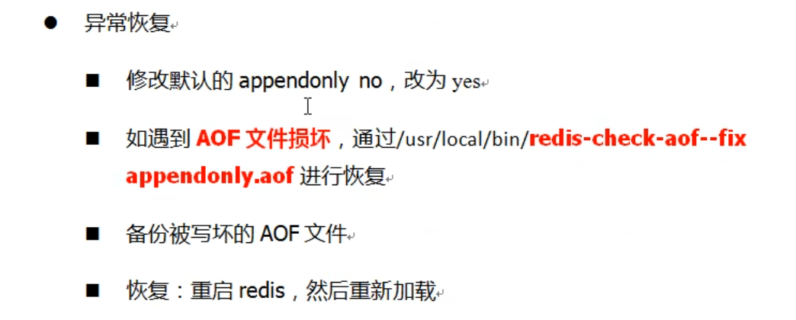

### 缺点

- 比起 ***RDB*** 占用更多的磁盘空间；
- 恢复备份速度要慢；
- 每次读写都同步的话，有一定的性能压力；
- 存在个别 ***Bug***，造成不能恢复。


## 10.3、选择

> 官方推荐两个都启用。
>
> 如果对数据不敏感，可以选单独用 ***RDB***。
>
> 不建议单独用 ***AOF***，因为可能会出现 ***Bug***。
>
> 如果只是做纯内存缓存，可以都不用。


# 十一、主从复制

主机数据更新后根据配置和策略， 自动同步到备机的 ***master/slaver*** 机制，***Master*** 以写为主，***Slaver*** 以读为主。


1. 读写分离，性能扩展
2. 容灾快速恢复（一台从挂了，可以从其他服务器中获得数据）
3. 一主多从！


## 搭建一主两从

1. 创建文件目录

```
/myredis
```

2. 将 ***redis.conf*** 复制到当前目录

```
cp /etc/redis.conf /myredis/
```

3. 创建 3 个 ***redis.conf*** 配置文件

```
redis6379.conf
redis6380.conf
redis6381.conf
```

```bash
# redis6379.conf
include /myredis/redis.conf
pidfile /var/run/redis_6379.pid
port 6379
dbfilename dump6379.rdb

# redis6380.conf
include /myredis/redis.conf
pidfile /var/run/redis_6380.pid
port 6380
dbfilename dump6380.rdb

# redis6381.conf
include /myredis/redis.conf
pidfile /var/run/redis_6381.pid
port 6381
dbfilename dump6381.rdb
```

4. 启动 3 台 ***redis*** 服务器


5. 查看主机运行情况

```
info replication
```


6. 配从不配主

```bash
slaveof  <ip><port>
# 成为某个实例的从服务器
```


7. 再次查看主机运行情况


成功搭建。


## 一主二仆

> 主机 ***6379***，从机 ***6380*** 和 ***6381***。
>
> 1. 假设从机 ***6380*** 挂掉。
>
> ```
> 当6380重启后，6380不再是6379的从机，而是作为新的master；
> 当再次把6380作为6379的从机加入后，从机会把数据从头到尾复制。
> ```
>
> 2. 假设主机 ***6379*** 挂掉。
>
> ```
> 6380和6381仍然是6379的从机，不会做任何事；
> 当6379重启后，既然是主服务器。
> ```


## 薪火相传


上一个 ***slave*** 可以是下一个 ***slave*** 的 ***master***，***slave*** 同样可以接收其他 ***slave***的连接和同步请求，那么该 ***slave*** 作为了链条中下一个的 ***master***，可以有效减轻 ***master*** 的写压力，去中心化降低风险。

```
slaveof <ip><port>
```

中途变更转向：会清除之前的数据，重新建立拷贝最新的。

当某个 ***slave*** 宕机，后面的 ***slave*** 都没法备份。

即当主机挂掉，从机还是从机，但是无法继续写数据。


## 反客为主

当一个 ***master*** 宕机后，后面的 ***slave*** 可以立刻升为 ***master***，其后面的 ***slave*** 不用做任何修改。

```
slaveof no one
```


## 哨兵模式

**反客为主的自动版**，即能够后台监控主机是否故障，如果故障了根据投票数自动将从库转换为主库。


1. 创建 ***sentinel.conf*** 文件

```
/myredis/sentinel.conf
```

2. 配置哨兵

```bash
sentinel monitor mymaster 172.16.88.168 6379 1

# mymaster：监控对象起的服务器名称
# 1：至少有多少个哨兵同意迁移的数量。 

#注意，，，还需要配置哨兵的端口，否则无法正常启动
protected-mode no
port 4320
```

3. 启动哨兵

   由于权限不够，启动前还需要执行

   ```
   echo 511 > /proc/sys/net/core/somaxconn
   ```

```
redis-sentinel  /myredis/sentinel.conf 
```


主机挂掉，会从机选举中产生新的主机。选举的规则。

当原来的主机重新上线后，也不会变成主机，因为新皇帝已经登基，原来的主机会变成从服务器。

### 选举规则

- 根据优先级别，***slave-priority/replica-priority***，优先选择优先级靠前的。越小等级越高

  

- 根据偏移量，优先选择偏移量大的。（偏移量指获得源主机数据最全的）

- 根据 ***runid***，优先选择最小的服务。（每个redis实例启动时都会自动生成一个40位的runid）


### 复制延时

由于所有的写操作都是先在 ***master*** 上操作，然后同步更新到 ***slave*** 上，所以从 ***master*** 同步到 ***slave*** 从机有一定的延迟，当系统很繁忙的时候，延迟问题会更加严重，***slave*** 机器数量的增加也会使这个问题更加严重。


## 复制原理

- ***slave*** 启动成功连接到 ***master*** 后会发送一个 ***sync*** 命令（同步命令）。

- ***master*** 接到命令启动后台的存盘进程，对数据进行持久化操作，同时收集所有接收到的用于修改数据集命令，在后台进程执行完毕之后，***master*** 将传送整个数据文件（***rdb***）到 ***slave***，以完成一次完全同步。

- 当主服务进行写操作后，和从服务器进行数据同步。
- 全量复制：而 ***slave*** 服务在接收到数据库文件数据后，将其存盘并加载到内存中。

- 增量复制：***master*** 继续将新的所有收集到的修改命令依次传给 ***slave***，完成同步。

- 只要是重新连接 ***master***，一次完全同步（全量复制）将被自动执行。

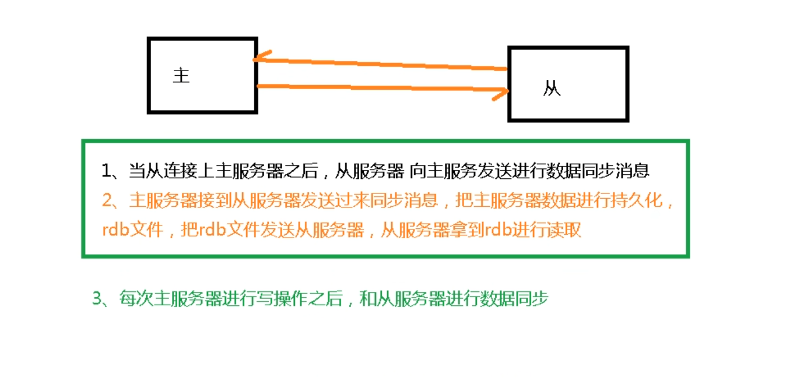

从服务器只在第一次主动向主服务器发送请求，之后主服务器进行写操作都是主服务器向从服务器发送同步。

# 十二、集群

容量不够，***redis*** 如何进行扩容？

并发写操作， ***redis*** 如何分摊？

主从模式，薪火相传模式，主机宕机，导致 ***ip*** 地址发生变化，应用程序中配置需要修改对应的主机地址、端口等信息。

解决方法：

- 代理主机（ ***之前*** ）

  

- 无中心化集群配置（ ***redis3.0*** ）


***Redis*** 集群实现了对 ***Redis*** 的水平扩容，即启动 ***N*** 个 ***Redis*** 节点，将整个数据库分布存储在这 ***N*** 个节点中，每个节点存储总数据的 ***1/N*** 。

***Redis*** 集群通过分区（***partition***）来提供一定程度的可用性（***availability***），即使集群中有一部分节点失效或者无法进行通讯， 集群也可以继续处理命令请求。


## 搭建 *Redis* 集群

1. 创建配置文件

```bash
# 以redis6379.conf为例
include /myredis/redis.conf
pidfile /var/run/redis_6379.pid # 更改
port 6379 # 更改
dbfilename dump6379.rdb # 更改
cluster-enabled yes # 打开集群模式
cluster-config-file nodes-6379.conf # 设置节点配置文件名称，需要更改
cluster-node-timeout 15000 # 设置节点失联事件，超过该时间（ms），集群自动进行主从切换
```


2. 启动


3. 将 6 个节点合成一个集群

```bash
# 组合之前请确保所有redis实例启动后，nodes-xxxx.conf文件都生成正常。
```


```bash
# 进入redis安装目录
/root/Java/Redis/redis-7.0.0/src

使用ifconfig -a查看ip
# 执行
redis-cli --cluster create --cluster-replicas 1 127.0.0.1:4314 127.0.0.1:4315 127.0.0.1:4316 127.0.0.1:4317 127.0.0.1:4318 127.0.0.1:4319
```


4. 采用集群策略连接

```bash
redis-cli -c -p port
cluster nodes # 命令查看集群信息
```


## 问题

### *redis cluster* 如何分配这六个节点?

> 一个集群至少要有三个主节点。
>
> 选项 `--cluster-replicas 1`，表示希望为集群中的每个主节点创建一个从节点。
>
> 分配原则尽量保证每个主数据库运行在不同的 ***IP*** 地址，每个从库和主库不在一个 ***IP*** 地址上。
>
> 


### 什么是 *slots*？


> 一个 ***Redis*** 集群包含 ***16384*** 个插槽（***hash slot***）， 数据库中的每个键都属于这 ***16384*** 个插槽的其中一个。
>
> 集群使用公式 ***CRC16(key) % 16384*** 来计算键 ***key*** 属于哪个槽， 其中 ***CRC16(key)*** 语句用于计算键 ***key*** 的 ***CRC16*** 校验和 。
>
> 集群中的每个节点负责处理一部分插槽。 例如， 如果一个集群可以有主节点， 其中：
>
> - 节点 ***A*** 负责处理 ***0*** 号至 ***5460*** 号插槽。
> - 节点 ***B*** 负责处理 ***5461*** 号至 ***10922*** 号插槽。
> - 节点 ***C*** 负责处理 ***10923*** 号至 ***16383*** 号插槽。


### 如何在集群中录入值？

> 在 ***redis-cli*** 每次录入、查询键值，***redis*** 都会计算出该 ***key*** 应该送往的插槽，如果不是该客户端对应服务器的插槽，***redis*** 会报错，并告知应前往的 ***redis*** 实例地址和端口。
>
> ***redis-cli*** 客户端提供了 ***–c*** 参数实现自动重定向。
>
> 例如 ***redis-cli -c –p 6379*** 登入后，再录入、查询键值对可以自动重定向。
>
> 就是在插入值的时候，会自动切换redis；


### 如何查询集群中的值？

> 每个主机只能查询自己范围内部的插槽。
>
> `cluster keyslot <key>`：查询某个 ***key*** 的 ***slot* **。
>
> `cluster countkeysinslot <slot>`：查询某个 ***slot*** 是否有值。
>
> `CLUSTER GETKEYSINSLOT <slot><count>`：返回 ***count*** 个 ***slot*** 槽中的键。


### 故障恢复？

> 如果主节点下线？从节点能否自动升为主节点？注意：***15*** 秒超时。
>
> 
>
> - 当 ***6379*** 挂掉后，***6389*** 成为新的主机。
>
> 
>
> 主节点恢复后，主从关系会如何？主节点回来变成从机。
>
> - 当 ***6379*** 重启后，***6379*** 成为 ***6389*** 的从机。
>
> 
>
> 如果所有某一段插槽的主从节点都宕掉，***redis*** 服务是否还能继续?
>
> - 如果某一段插槽的主从都挂掉，而 ***cluster-require-full-coverage=yes***，那么 ，整个集群都挂掉。
> - 如果某一段插槽的主从都挂掉，而 ***cluster-require-full-coverage=no***，那么，该插槽数据全都不能使用，也无法存储。
>
> `redis.conf` 中的参数 `cluster-require-full-coverage`


## 优点

- 实现扩容；
- 分摊压力；
- 无中心配置相对简单。(从任何一个节点可以切换到其他节点)


## 缺点

- 多键操作是不被支持的；
- 多键的 ***Redis*** 事务是不被支持的。***lua*** 脚本不被支持；
- 由于集群方案出现较晚，很多公司已经采用了其他的集群方案，而代理或者客户端分片的方案想要迁移至***redis cluster***，需要整体迁移而不是逐步过渡，复杂度较大。


# 十三、Jedis操作Redis

即 ***Java*** 操作 ***Redis***。

1. 依赖

```xml
<dependency>
  <groupId>redis.clients</groupId>
  <artifactId>jedis</artifactId>
  <version>3.2.0</version>
</dependency>
```

2. 连接 ***Redis***

```java
public class JedisDemo {
  public static void main(String[] args) {
    Jedis jedis = new Jedis("192.168.57.101", 6379);
    String pong = jedis.ping();
    System.out.println("连接成功：" + pong);
    jedis.close();
  }
}
```

需要注意，使用云服务器的话，需要更改端口号，然后配置安全组。虚拟机则需要防火墙开启端口号；

> ***Key***
>
> ```java
> //添加
> jedis.set("k1", "v1");
> jedis.set("k2", "v2");
> jedis.set("k3", "v3");
> //获取
> Set<String> keys = jedis.keys("*");
> System.out.println(keys.size());
> for (String key : keys) {
> System.out.println(key);
> }
> System.out.println(jedis.exists("k1"));
> System.out.println(jedis.ttl("k1"));                
> System.out.println(jedis.get("k1"));
> ```
>
> ***String***
>
> ```java
> jedis.mset("str1","v1","str2","v2","str3","v3");
> System.out.println(jedis.mget("str1","str2","str3"));
> ```
>
> ***List***
>
> ```java
> jedis.lpush("mylist","v1","v2","v3");
> List<String> list = jedis.lrange("mylist",0,-1);
> for (String element : list) {
> System.out.println(element);
> }
> ```
>
> ***Set***
>
> ```java
> jedis.sadd("orders", "order01");
> jedis.sadd("orders", "order02");
> jedis.sadd("orders", "order03");
> jedis.sadd("orders", "order04");
> Set<String> smembers = jedis.smembers("orders");
> for (String order : smembers) {
> System.out.println(order);
> }
> jedis.srem("orders", "order02");
> ```
>
> ***Hash***
>
> ```java
> jedis.hset("hash1","userName","lisi");
> System.out.println(jedis.hget("hash1","userName"));
> Map<String,String> map = new HashMap<String,String>();
> map.put("telphone","13810169999");
> map.put("address","atguigu");
> map.put("email","abc@163.com");
> jedis.hmset("hash2",map);
> List<String> result = jedis.hmget("hash2", "telphone","email");
> for (String element : result) {
> System.out.println(element);
> }
> ```
>
> ***zset***
>
> ```java
> jedis.zadd("zset01", 100d, "z3");
> jedis.zadd("zset01", 90d, "l4");
> jedis.zadd("zset01", 80d, "w5");
> jedis.zadd("zset01", 70d, "z6");
> 
> Set<String> zrange = jedis.zrange("zset01", 0, -1);
> for (String e : zrange) {
> System.out.println(e);
> }
> ```

## Jedis实例验证（手机验证码）

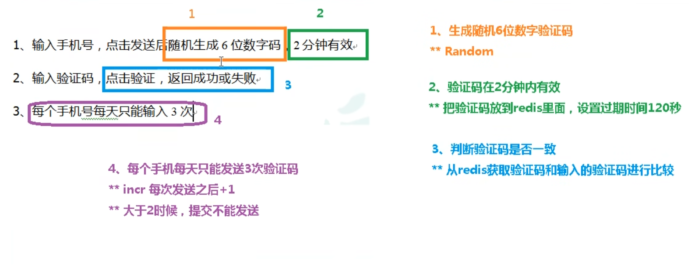

1、生成六位验证码

```java
//生成六位验证码
    public static String random(){

        String code="";
        Random random = new Random();
        for (int i = 0; i <6; i++) {
            int rand = random.nextInt(10);
            code+=rand;
        }

        return code;
    }
```

2、让每个手机每天只能发送三次，验证码放在redis中，设置过期时间；

```java
//设置每个手机每天只能发送三次，设置过期时间
    public static void verifyCode(String phone){
        //连接redis
        Jedis jedis = new Jedis("8.130.19.148",4314);
        //拼接key
        //手机发送次数key
        String countKey="VerifyCode"+phone+":count";
        //验证码key
        String codeKey="VerifyCode"+phone+":code";

        //每个手机每天只能发送三次
        String count = jedis.get("countKey");
        if(count==null){
            //等于空，表示还没有发送过
            //设置发送次数为1
            jedis.setex(countKey,24*60*60,"1");
        }else if(Integer.parseInt(count)<=2){
            //发送次数+1
            jedis.incr(countKey);
        }else if(Integer.parseInt(count)>2){
            //大于三次了
            System.out.println("今天发送次数已经超过三次了");
            jedis.close();
            return;
        }

        //将验证码放入redis中
        String vcode = random();
        jedis.setex(codeKey,120,vcode);
        jedis.close();


    }
```

3、验证码的校验

```java
//3验证码校验
    public static  void getRedisCode(String phone,String code){
        //连接redis
        Jedis jedis = new Jedis("8.130.19.148",4314);
        //验证码key
        String codeKey="VerifyCode"+phone+":code";
        String redisCode = jedis.get(codeKey);
        //判断
        if(redisCode.equals(code)){
            System.out.println("成功");
        }else {
            System.out.println("失败");
        }
        jedis.close();

    }

```

测试

```java
public static void main(String[] args) {
        //模拟验证码发送
//        verifyCode("17852407053");
        //验证
        getRedisCode("17852407053","2123");
    }
```


##  *Jedis* 主从复制

```java
private static JedisSentinelPool jedisSentinelPool=null;

public static  Jedis getJedisFromSentinel(){

  if(jedisSentinelPool==null){
    Set<String> sentinelSet=new HashSet<>();
    sentinelSet.add("172.16.88.168:26379"); // 端口为sentinal
    JedisPoolConfig jedisPoolConfig =new JedisPoolConfig();
    jedisPoolConfig.setMaxTotal(10); // 最大可用连接数
    jedisPoolConfig.setMaxIdle(5); // 最大闲置连接数
    jedisPoolConfig.setMinIdle(5); // 最小闲置连接数
    jedisPoolConfig.setBlockWhenExhausted(true); // 连接耗尽是否等待
    jedisPoolConfig.setMaxWaitMillis(2000); // 等待时间
    jedisPoolConfig.setTestOnBorrow(true); // 取连接的时候进行测试

    jedisSentinelPool=new JedisSentinelPool("mymaster",sentinelSet,jedisPoolConfig); // 服务主机名
    return jedisSentinelPool.getResource();
  }
  else {
    return jedisSentinelPool.getResource();
  }
}
```


## 集群的 *Jedis* 开发

即使连接的不是主机，集群会自动切换主机存储。主机写，从机读。

无中心化主从集群。无论从哪台主机写的数据，其他主机上都能读到数据。

```java
public class JedisClusterTest {
  public static void main(String[] args) { 
     Set<HostAndPort>set =new HashSet<HostAndPort>();
     set.add(new HostAndPort("172.16.88.168",6379)); // 任何一个端口
     JedisCluster jedisCluster = new JedisCluster(set);
     jedisCluster.set("k1", "v1");
     System.out.println(jedisCluster.get("k1"));
  }
}
```


# 十四、SpringBoot整合Redis

1. 依赖

```xml
<!-- redis -->
<dependency>
  <groupId>org.springframework.boot</groupId>
  <artifactId>spring-boot-starter-data-redis</artifactId>
</dependency>

<!-- spring2.X集成redis所需common-pool2-->
<dependency>
  <groupId>org.apache.commons</groupId>
  <artifactId>commons-pool2</artifactId>
  <version>2.6.0</version>
</dependency>
```

2. 配置文件配置 ***Redis***

```properties
#Redis服务器地址
spring.redis.host= ip
#Redis服务器连接端口
spring.redis.port=6379
#Redis数据库索引（默认为0）
spring.redis.database= 0
#连接超时时间（毫秒）
spring.redis.timeout=1800000
#连接池最大连接数（使用负值表示没有限制）
spring.redis.lettuce.pool.max-active=20
#最大阻塞等待时间(负数表示没限制)
spring.redis.lettuce.pool.max-wait=-1
#连接池中的最大空闲连接
spring.redis.lettuce.pool.max-idle=5
#连接池中的最小空闲连接
spring.redis.lettuce.pool.min-idle=0
```

3. ***Redis*** 配置类（需要继承 ***CachingConfigurerSupport***）

```java
@EnableCaching
@Configuration
public class RedisConfig extends CachingConfigurerSupport {
    @Bean
    public RedisTemplate<String, Object> redisTemplate(RedisConnectionFactory factory) {
        RedisTemplate<String, Object> template = new RedisTemplate<>();
        RedisSerializer<String> redisSerializer = new StringRedisSerializer();
        Jackson2JsonRedisSerializer jackson2JsonRedisSerializer = new Jackson2JsonRedisSerializer(Object.class);
        ObjectMapper om = new ObjectMapper();
        om.setVisibility(PropertyAccessor.ALL, JsonAutoDetect.Visibility.ANY);
        om.enableDefaultTyping(ObjectMapper.DefaultTyping.NON_FINAL);
        jackson2JsonRedisSerializer.setObjectMapper(om);
        template.setConnectionFactory(factory);
				// key序列化方式
        template.setKeySerializer(redisSerializer);
				// value序列化
        template.setValueSerializer(jackson2JsonRedisSerializer);
				// value hashmap序列化
        template.setHashValueSerializer(jackson2JsonRedisSerializer);
        return template;
    }

    @Bean
    public CacheManager cacheManager(RedisConnectionFactory factory) {
        RedisSerializer<String> redisSerializer = new StringRedisSerializer();
        Jackson2JsonRedisSerializer jackson2JsonRedisSerializer = new Jackson2JsonRedisSerializer(Object.class);
				// 解决查询缓存转换异常的问题
        ObjectMapper om = new ObjectMapper();
        om.setVisibility(PropertyAccessor.ALL, JsonAutoDetect.Visibility.ANY);
        om.enableDefaultTyping(ObjectMapper.DefaultTyping.NON_FINAL);
        jackson2JsonRedisSerializer.setObjectMapper(om);
				// 配置序列化（解决乱码的问题）,过期时间600秒
        RedisCacheConfiguration config = 
          RedisCacheConfiguration.defaultCacheConfig()
                .entryTtl(Duration.ofSeconds(600))
      .serializeValuesWith(RedisSerializationContext.SerializationPair.fromSerializer(jackson2JsonRedisSerializer))
                .disableCachingNullValues();
        RedisCacheManager cacheManager = RedisCacheManager.builder(factory)
                .cacheDefaults(config)
                .build();
        return cacheManager;
    }
}
```

## 测试

```java
@RestController
public class TestController {
    
    @Autowired
    private RedisTemplate redisTemplate;
    @GetMapping("/testRedis")
    public String testRedis(){
        redisTemplate.opsForValue().set("name","xuzhenbin");
        String name = (String) redisTemplate.opsForValue().get("name");
        return name;
    }
}
```


# 十五、应用问题解决

## 15.1、缓存穿透


### 现象

***key*** 对应的数据在数据源并不存在，每次针对此 ***key*** 的请求从缓存获取不到，请求都会压到数据源，从而可能压垮数据源。

比如用一个不存在的用户 ***id*** 获取用户信息，不论缓存还是数据库都没有，若黑客利用此漏洞进行攻击可能压垮数据库。

造成：

1. 应用服务器压力变大。
2. ***redis*** 命中率下降 $\longrightarrow$ 查询数据库 。


### 如何解决

- **对空值缓存**

  如果一个查询返回的数据为空（不管是数据是否不存在），仍然把这个空结果（***null***）进行缓存，设置空结果的过期时间会很短，最长不超过五分钟。

- **设置可访问的名单（白名单）：**

  使用 ***bitmaps*** 类型定义一个可以访问的名单，名单 ***id*** 作为 ***bitmaps*** 的偏移量，每次访问和 ***bitmap*** 里面的 ***id*** 进行比较，如果访问 ***id*** 不在 ***bitmaps*** 里面，进行拦截，则不允许访问。

- **采用布隆过滤器**

  布隆过滤器（***Bloom Filter***）是1970年由布隆提出的。它实际上是一个很长的二进制向量（位图）和一系列随机映射函数（哈希函数）。

  布隆过滤器可以用于检索一个元素是否在一个集合中。它的优点是空间效率和查询时间都远远超过一般的算法，缺点是有一定的误识别率和删除困难。

  将所有可能存在的数据哈希到一个足够大的 ***bitmaps*** 中，一个一定不存在的数据会被这个 ***bitmaps*** 拦截掉，从而避免了对底层存储系统的查询压力。

- **进行实时监控**

  当发现 ***Redis*** 的命中率开始急速降低，需要排查访问对象和访问的数据，和运维人员配合，可以设置黑名单限制服务。


## 15.2、缓存击穿


***key*** 对应的数据存在，但在 ***redis*** 中过期，此时若有大量并发请求过来，这些请求发现缓存过期一般都会从后端***DB*** 加载数据并回设到缓存，这个时候大并发的请求可能会瞬间把后端 ***DB*** 压垮。

1. 数据库访问压力瞬间增大。
2. ***redis*** 中没有出现大量 ***key*** 过期，***redis*** 正常运行。
3. （即某个经常访问的 ***key*** 过期，突然有大量访问这个数据）


### 如何解决

- 预先设置热门数据

  在 ***redis*** 高峰访问之前，把一些热门数据提前存入到 ***redis*** 里面，加大这些热门数据 ***key*** 的时长。

- 实时调整

  现场监控哪些数据热门，实时调整 ***key*** 的过期时长。

- 使用锁


## 15.3、缓存雪崩

***key*** 对应的数据存在，但在 ***redis*** 中过期，此时若有大量并发请求过来，这些请求发现缓存过期一般都会从后端***DB*** 加载数据并回设到缓存，这个时候大并发的请求可能会瞬间把后端 ***DB*** 压垮。

缓存雪崩与缓存击穿的区别在于这里针对很多 ***key*** 缓存，前者则是某一个 ***key***。

1. 数据库压力变大。
2. 即极少的时间段，查询大量 ***key*** 的集中过期情况。


### 如何解决

- **构建多级缓存架构**

  ***nginx*** 缓存 + ***redis*** 缓存 + 其他缓存（***ehcache***等）

- **使用锁或队列：**

  用加锁或者队列的方式保证来保证不会有大量的线程对数据库一次性进行读写，从而避免失效时大量的并发请求落到底层存储系统上。不适用高并发情况。

- **设置过期标志更新缓存：**

  记录缓存数据是否过期（设置提前量），如果过期会触发通知另外的线程在后台去更新实际 ***key*** 的缓存。

- **将缓存失效时间分散开：**

  比如我们可以在原有的失效时间基础上增加一个随机值，比如 1～5 分钟随机，这样每一个缓存的过期时间的重复率就会降低，就很难引发集体失效的事件。


## 15.4、分布式锁

#### 问题描述

随着业务发展的需要，原单体单机部署的系统被演化成分布式集群系统后，由于分布式系统多线程的特点以及分布在不同机器上，这将使原单机部署情况下的并发控制锁策略失效，单纯的Java API并不能提供分布式锁的能力。为了解决这个问题就需要一种跨JVM的互斥机制来控制共享资源的访问，这就是分布式锁要解决的问题！

**上锁之后，对集群中的机器都有效**

分布式锁主流的实现方案：

1. 基于数据库实现分布式锁
2. 基于缓存（Redis等）
3. 基于Zookeeper

根据实现方式，分布式锁还可以分为类CAS自旋式分布式锁以及event事件类型分布式锁：

- 类CAS自旋式分布式锁：询问的方式，类似java并发编程中的线程获询问的方式尝试加锁，如mysql、redis。
- 另外一类是event事件通知进程后续锁的变化，轮询向外的过程，如zookeeper、etcd。

每一种分布式锁解决方案都有各自的优缺点：

1. 性能：redis最高
2. 可靠性：zookeeper最高

#### **解决方案：使用redis实现分布式锁**


setnx：通过该命令尝试获得锁，没有获得锁的线程会不断等待尝试。可以使用del进行释放锁

set key ex 3000nx：设置过期时间，自动释放锁，**解决当某一个业务异常而导致锁无法释放的问题**。但是当业务运行超过过期时间时，开辟监控线程增加该业务的运行时间，直到运行结束，释放锁。

uuid：设置uuid，释放前获取这个值，判断是否自己的锁，防止误删锁，造成没锁的情况。

### RedLock

Redlock是一种算法，Redlock也就是 Redis Distributed Lock，可用实现多节点redis的分布式锁。RedLock官方推荐，Redisson完成了对Redlock算法封装。

此种方式具有以下特性：

- 互斥访问：即永远只有一个 client 能拿到锁。
- 避免死锁：最终 client 都可能拿到锁，不会出现死锁的情况，即使锁定资源的服务崩溃或者分区，仍然能释放锁。
- 容错性：只要大部分 Redis 节点存活（一半以上），就可以正常提供服务

RedLock原理（了解）

1. 获取当前Unix时间，以毫秒为单位。
2. 依次尝试从N个实例，使用相同的key和随机值获取锁。在步骤2，当向Redis设置锁时，客户端应该设置一个网络连接和响应超时时间，这个超时时间应该小于锁的失效时间。例如你的锁自动失效时间为10秒，则超时时间应该在5-50毫秒之间。这样可以避免服务器端Redis已经挂掉的情况下，客户端还在死死地等待响应结果。如果服务器端没有在规定时间内响应，客户端应该尽快尝试另外一个Redis实例。
3. 客户端使用当前时间减去开始获取锁时间（步骤1记录的时间）就得到获取锁使用的时间。当且仅当从大多数（这里是3个节点）的Redis节点都取到锁，并且使用的时间小于锁失效时间时，锁才算获取成功。
4. 如果取到了锁，key的真正有效时间等于有效时间减去获取锁所使用的时间（步骤3计算的结果）。
5. 如果因为某些原因，获取锁失败（没有在至少N/2+1个Redis实例取到锁或者取锁时间已经超过了有效时间），客户端应该在所有的Redis实例上进行解锁（即便某些Redis实例根本就没有加锁成功）。

# 十六、Redis IO多线程

### 简介

Redis6终于支撑多线程了，告别单线程了吗？

IO多线程其实指**客户端交互部分**的**网络IO**交互处理模块**多线程**，而非**执行命令多线程**。Redis6执行命令依然是单线程。

### 原理架构

Redis 6 加入多线程，但跟 Memcached 这种从 IO处理到数据访问多线程的实现模式有些差异。Redis 的多线程部分只是用来处理网络数据的读写和协议解析，执行命令仍然是单线程。之所以这么设计是不想因为多线程而变得复杂，需要去控制 key、lua、事务，LPUSH/LPOP 等等的并发问题。整体的设计大体如下:


另外，多线程IO默认也是不开启的，需要再配置文件中配置：

- io-threads-do-reads yes
- io-threads 4