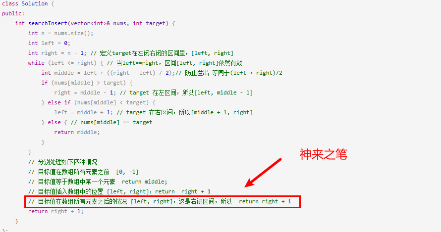
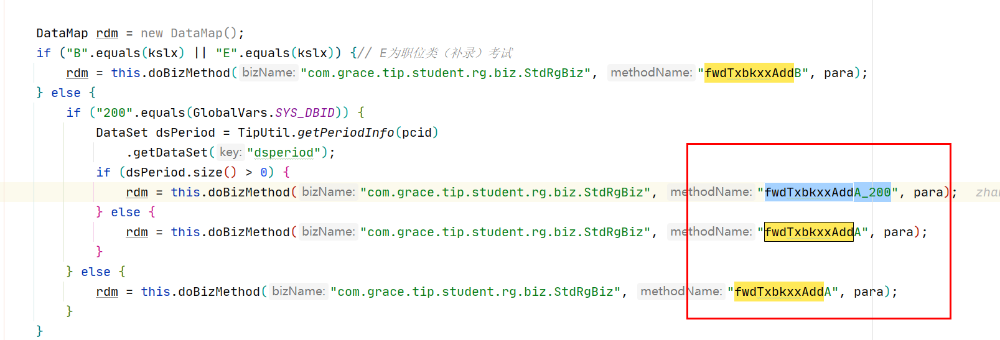
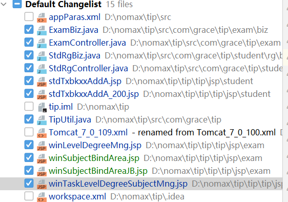
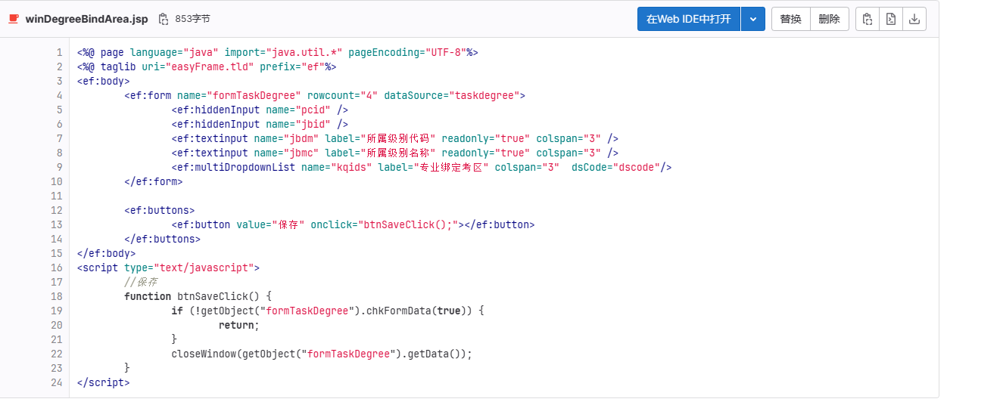
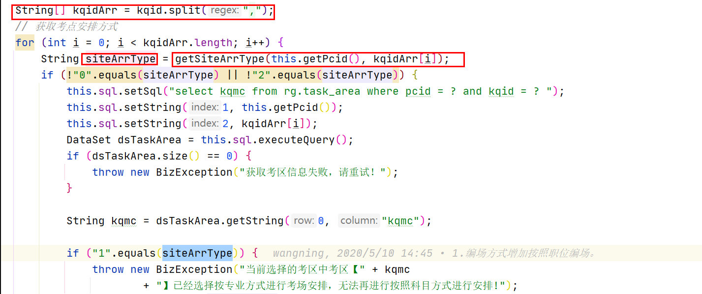
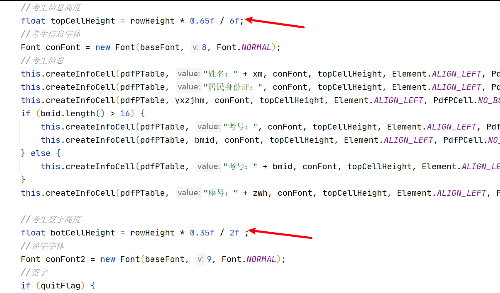
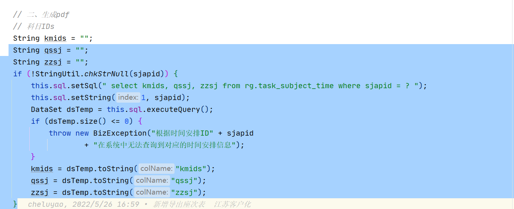

## 3.1

继续修改那个流程中的照片上传，将所有的客户化都改了，手机端先不动。

流程中的修改完了。

剩下一个登录时的。

feature/xzb-modStdPhotoProbelmZFB

想先去看个算法，再去弄。

第一步，增加系统参数。

增加参数之前，需要再新增一个code。

```SQL
--FW.CODE_LIST
INSERT INTO FW.CODE_LIST
(DMBH, DMMC, DMSM, DMSYFW)
VALUES('SYSZPCLFS', '系统照片处理方式', NULL, '30');
--FW.CODE_DOC
INSERT INTO FW.CODE_DOC
(DMBH, CODE, CONTENT, SM)
VALUES('SYSZPCLFS', '0', '无', NULL);
INSERT INTO FW.CODE_DOC
(DMBH, CODE, CONTENT, SM)
VALUES('SYSZPCLFS', '1', '中国人事网照片处理工具', NULL);
INSERT INTO FW.CODE_DOC
(DMBH, CODE, CONTENT, SM)
VALUES('SYSZPCLFS', '2', '诺码信照片处理工具', NULL);


--FW.CODE_CONFIG
INSERT INTO FW.CODE_CONFIG
(DBID, DMBH, CODE, CONTENT, XH)
SELECT DBID,'SYSZPCLFS', '0', '无', '1' FROM FW.DBID_INFO;
INSERT INTO FW.CODE_CONFIG
(DBID, DMBH, CODE, CONTENT, XH)
SELECT DBID,'SYSZPCLFS', '1', '中国人事网照片处理工具', '2' FROM FW.DBID_INFO;
INSERT INTO FW.CODE_CONFIG
(DBID, DMBH, CODE, CONTENT, XH)
SELECT DBID,'SYSZPCLFS', '2', '诺码信照片处理工具', '3' FROM FW.DBID_INFO;
```


```sql
INSERT INTO FW.SYS_PARA_DOC
(CSBH, CSMC, CSSM, CSSJLX, CSSJYM, CSSJCODE, XH)
VALUES('tip_kszpbdclgj', '考生照片比对处理工具', '0：不使用工具，1：中国人事网照片处理工具，2：诺码信照片处理工具，默认为0', 'code', NULL, 'SYSZPCLFS', NULL);


INSERT INTO FW.SYS_PARA_DOC
(CSBH, CSMC, CSSM, CSSJLX, CSSJYM, CSSJCODE, XH)
VALUES('tip_zpdsyq', '照片底色要求', '0-红、蓝、或白色，1-仅限白色，2-仅限蓝色，3-仅限红色', 'code', NULL, 'ZPDSYQ', NULL);
```


修改方法：

```
src/com/grace/tip/student/rg/biz/StdRgBiz.java    fwdStdLoginChkPhoto
src/com/grace/tip/student/rg/biz/StdRgBiz.java    savePersonPhoto
tip/tip/jsp/student/stdLoginUploadPhoto.jsp
```

思路：

1. 进入界面判断使用工具。
2. 点击上传，进行工具和支付宝的判断。


```jsp
//国家审核工具
<c:if test="${kszpshfs=='1'}">
    <c:if test="${zpdsyqcode=='WHITE'}">
        <a href="http://download.people.com.cn/zixun/two15392444531.rar"
           style="color:blue" target="_blank">照片审核处理工具（点击下载）</a>
    </c:if>
    <c:if test="${zpdsyqcode!='WHITE'}">
        <a href="http://download.people.com.cn/zhaopianshenhe.rar"
           style="color:blue" target="_blank">照片审核处理工具（点击下载）</a>
    </c:if>
    <span style="color:red;"><br> *注意：审核通过的照片大小在10K左右。
    </span>
</c:if>
```

进入页面的参数判断。

今天改了进入的页面，明天改保存和校验的逻辑。

## 3.2

每天早上先看算法。

二分查找



双指针

快慢指针与双向指针

照片对比：


保存的时候进行照片检测遇到报错无法解决 ，使用人脸识别库。

使用人脸库解决问题。

修改之前那个多批次人数统计的议题。

将一次性查询改为for循环的查询（没有提升效率，有可能还会变慢）；

首先第一步：

获取pcid；

## 3.3

将图床设置好了，有空去将所有的博客文章更新一下。

其实不更新也行，之后的文章都用图床，之前的就不用也行。

又来一个比较急得议题。

1、增加一个code

```sql
--FW.CODE_DOC
INSERT INTO FW.CODE_DOC
(DMBH, CODE, CONTENT, SM)
VALUES('KQXZFS', '3', '专业绑定考区', NULL);

--FW.CODE_CONFIG
INSERT INTO FW.CODE_CONFIG
(DBID, DMBH, CODE, CONTENT, XH)
SELECT DBID,'KQXZFS', '3', '专业绑定考区',null  FROM FW.DBID_INFO;

--修改批次参数类型
UPDATE RG.TASK_PARA_DOC
SET KSLX=NULL
WHERE CSBH='task_kqxzfs' ;
```

2、新增一个表

```SQL
-- Create table
create table RG.TASK_DEGREE_AREA
(
  pcid      VARCHAR2(20) not null,
  jbid       VARCHAR2(20) not null,
  zyid       VARCHAR2(20) not null,
  kqid       VARCHAR2(20) not null
)
tablespace TS_RG;
-- Add comments to the table 
comment on table RG.TASK_DEGREE_AREA
  is '专业考区信息表';
-- Add comments to the columns 
comment on column RG.TASK_DEGREE_AREA.pcid
  is '批次ID';
comment on column RG.TASK_DEGREE_AREA.jbid
  is '级别ID';
comment on column RG.TASK_DEGREE_AREA.zyid
  is '专业ID';
comment on column RG.TASK_DEGREE_AREA.kqid
  is '考区ID';

```

3、管理端页面增加功能按钮，进行专业绑定考区。

```
//修改
tip/tip/jsp/exam/winLevelDegreeMng.jsp
src/com/grace/tip/exam/biz/ExamBiz.java        fwdTaskLevelDegreeMng
//新增

src/com/grace/tip/exam/ExamController.java     fwdDegreeBindAreaMng
src/com/grace/tip/exam/ExamController.java     saveDegreeBindAreaBatch
src/com/grace/tip/exam/biz/ExamBiz.java        fwdDegreeBindAreaMng
src/com/grace/tip/exam/biz/ExamBiz.java        saveDegreeBindAreaBatch
tip/tip/jsp/exam/winDegreeBindArea.jsp
```

4、需要新增一个树，用来展示考区

树有点难。。。

第一步：先查询出来所有的下级考区

第二部：去查询对应表（进行回显）

第三步：对级别和专业进行区分。就是判断专业id是否为空。

## 3.4-3.5

臭娘们来了，休息了两天

## 3.6

继续做那个加急需求。

今天上午一定要把那个树搞完。


淦   都要改完了，又说不用。。。。


考生端

```
//修改
tip/tip/jsp/student/stdTxbkxxAddA.jsp
tip/tip/jsp/student/stdTxbkxxAddA_320.jsp
tip/tip/jsp/student/stdTxbkxxAddA_200.jsp
tip/tip/jsp/student/stdTxbkxxAddA_629.jsp
tip/tip/jsp/wechat/wechatTxbkxxAddA.jsp
tip/tip/jsp/wechat/wechatTxbkxxAddA_320.jsp
src/com/grace/tip/student/rg/biz/StdRgBiz.java     fwdTxbkxxAddA
src/com/grace/tip/student/rg/biz/StdRgBiz.java     fwdTxbkxxAddA_200

//新增
src/com/grace/tip/student/rg/StdRgController.java   queryTaskDegreeArea
src/com/grace/tip/student/rg/biz/StdRgBiz.java      queryTaskDegreeArea
src/com/grace/tip/student/rg/biz/StdRgBiz.java      checkTaskDegreeArea
src/com/grace/tip/TipUtil.java     TaskDegreeArea_Cache
src/com/grace/tip/TipUtil.java	   getTaskDegreeArea
src/com/grace/tip/TipUtil.java	   getTaskAreaNotCode
```

修改考试参数

```sql
UPDATE RG.TASK_PARA_DOC
SET CSMC='考区选择方式', CSSM='1职位绑定考区，0考生选择考区，默认为0', CSSJLX='code', CSSJYM=NULL, CSSJCODE='KQXZFS', XH=4, KSLX=NULL
WHERE CSBH='task_kqxzfs';
```


没有判断考区选择方式。

## 3.7

需要去修改资格类考试跳转填写报考信息的方法



```java
String kqxzfs = TipUtil.getPara(pcid, "task_kqxzfs", "0");
rdm.put("kqxzfs", kqxzfs);
```

剩下最后一个保存功能。


修改完成，测试暂时没发现问题。



做完了。

先去看两道算法，然后再做接下来的议题。

就做了一条议题


修改议题：

1. 管理端修改为多选展示，先删后增
2. 修改表，存多条
3. 考生端进页面用参数控制是否展示考区


```java
//获取多选数据
DataSet dsBmid = para.getDataSet("gridStd");
//仿照这个写
tip/tip/jsp/rg/pageFeeDerateCheckMng_200.jsp
```


管理端还剩个展示绑定的考区

## 3.8

管理端展示绑定考区的结果。


跳转到填写报考信息页面的时候需要做出判断。


微信端也需要改。


改完了  去看个算法。

判定一下空。


准备开始做密码修改那个议题，今天不准备写了，先创建个分支

feature/xzb-modPasswordStrengthByAdmin

## 3.9

先做一个小时算法，再工作。


滑动窗口


密码重置的议题：

分为两种情况：

1. 普通验证码登录
2. 手机短信登录
3. 两种都需要进行处理。


第一步：

管理端用户表新增一列：

```sql
ALTER TABLE FW.SYS_USER ADD MMXGSJ DATE NULL;
COMMENT ON COLUMN FW.SYS_USER.MMXGSJ IS '密码修改时间';
```

第二步：

登录时增加判断。


```
//新增
src/com/grace/frame/util/DateUtil.java    addMonth
src/com/grace/frame/login/LoginController.java   fwdSysModifyPwd
src/com/grace/frame/login/LoginBiz.java		fwdSysModifyPwd
tip/tip/jsp/sys/pageSysModifyPwd.jsp

src/com/grace/frame/login/LoginController.java    saveSysUserNewPwd
src/com/grace/frame/login/LoginBiz.java		saveSysUserNewPwd
//修改
src/com/grace/frame/login/LoginController.java   doLogin
src/com/grace/frame/urm/biz/SysUserMngBiz.java   saveSysUserAdd
src/com/grace/frame/urm/biz/SysUserMngBiz.java   saveSysUserPwdReset
src/com/grace/frame/login/LoginBiz.java     modifyMyPwd
src/com/grace/frame/login/LoginUtil.java
tip/index.jsp
tip/frame/jsp/urm/winSysUserResetPwd.jsp
tip/frame/jsp/user/winModifyMyPwd.jsp
tip/frame/jsp/urm/winSysUserAdd.jsp
```


前端修改完毕，就剩个保存!

## 3.10

老规矩，先看算法，今天把数组结束。

数组看完了

1. 二分查找
2. 双指针：左右指针、快慢指针
3. 滑动窗口

看完了，接下来去干活，

```js
  var re = "^(?=.*[a-z])(?=.*[A-Z])(?=.*\d)(?=.*[$@$!%*?&])[A-Za-z\d$@$!%*?&]{8,}";
        return re.test(str);

            message: "输入的内容必须是安全的密码字符(由大小写字母、数字、特殊字符组成，至少 8 位)格式."

```

## 3.11-3.12

平庸的周末；

## 3.13

将强制修改密码那个。还剩一个修改。

在新增用户的保存方法加上密码修改日期。

```
Sa12345@
```


```java
if (StringUtil.chkStrNull(ypwd)) {
			throw new BizException("传入的原始密码为空");
		}
		if (StringUtil.chkStrNull(xpwd)) {
			throw new BizException("传入的新密码为空");
		}
		if (xpwd.length() < 8) {
			throw new BizException("密码长度不足8位，请重新设置！");
		}
		if (xpwd.length() > 12) {
			throw new BizException("密码长度超过12位，请重新设置！");
		}
		if (!xpwd.matches("^.*([A-Z])+.*$")) {
			throw new BizException("密码中不包含大写字母，请重新设置！");
		}
		if (!xpwd.matches("^.*([a-z])+.*$")) {
			throw new BizException("密码中不包含小写字母，请重新设置！");
		}
		if (!xpwd.matches("^.*([0-9])+.*$")) {
			throw new BizException("密码中不包含数字，请重新设置！");
		}
		if (!xpwd.matches("^.*([#?!@$%^*-.])+.*$")) {
			throw new BizException("密码中不包含特殊符号，请重新设置！");
		}
```


出现问题，当放了那个session之后，可以跳过修改。需要进行优化。

## 3.14

来到先做两道算法。

1. 设计链表
2. 翻转链表

然后做一个深圳的小议题。


```sql
--管理端
UPDATE FW.FUNC a
SET a.GNMC='报考资格在线核查'
WHERE a.GNMC='考后资格审核';
--考生端
UPDATE bi.FUNC_CONFIG a
SET a.GNMC='报考资格在线核查'
WHERE a.GNMC='资&nbsp;格&nbsp;复&nbsp;核';
--考生微信端
UPDATE bi.FUNC_CONFIG a
SET a.GNMC='报考资格在线核查'
WHERE a.GNMC='资格复核';
```

```
tip/tip/jsp/ba/stdQualificationCheck.jsp
tip/tip/jsp/wechat/wechatStdQualificationCheck.jsp
tip/tip/jsp/wechat/wechatStdQualificationAppealQuery.jsp
tip/tip/jsp/ba/stdQualificationAppealQuery.jsp
tip/tip/jsp/ba/stdQualificationCheckAdd.jsp
tip/tip/jsp/wechat/wechatStdQualificationCheckAdd.jsp
```


继续看我的算法and数据库

删除倒数第N个节点

## 3.15

还是先看算法，今天准备将链表看完。


全是打电话的，还有就是更新了一下图床，这个图片太麻烦了。

正在考虑要不要留存本地的图片


继续修改强制修改密码那个议题，增加一个系统参数控制

```sql
INSERT INTO FW.SYS_PARA_DOC
(CSBH, CSMC, CSSM, CSSJLX, CSSJYM, CSSJCODE, XH)
VALUES('tip_sys_modpwd', '管理端强制修改密码间隔时间', '默认为0（不修改），单位天', 'number', '####0', NULL, 86);
```


```
src/com/grace/frame/login/LoginController.java   		doLogin
```


算法

1. 链表相交

## 3.16

先看算法

环形链表，太妙了

1、先判断是否有环

2、有环的话再去判断环的入口

哈希表：

在题目让你判断是否出现，或者是否包含的时候就可以考虑使用哈希表；

哈希表包括：数组、set、map


修改座次表那个议题：

feature/xzb-modPrintSeatTable

1、修改那个座次表排列方式

```
src/com/grace/tip/exam/biz/ArrangeRoom4WrittenBiz.java
tip/tip/jsp/exam/winPrintZcbPage.jsp
```

2、新增一个jsp页面用来控制

准备用那种回传数据的方法。

```js
//批量维护专业绑定考区
	function btnDegreeBindArea() {
		var grid = getObject("gridDegree");
		if (!grid.isSelectRow()) {
			alert("请先选择数据");
			return;
		}
		var pcid = getObject("pcid").getValue();
		var jbid = getObject("jbid").getValue();
		var url = new URL("exam.do", "fwdDegreeBindAreaMng");
		url.addPara("pcid", pcid);
		url.addPara("jbid", jbid);
		openWindow("批量维护专业绑定考区", url, "normal", function(data) {
			if (!chkObjNull(data)) {
				var map = new HashMap(data);
				var url = new URL("exam.do", "saveDegreeBindAreaBatch");
				url.addQueryGridSelectData("gridDegree", "zyid");
				url.addPara("pcid", pcid);
				url.addPara("jbid", jbid);
				url.addPara("kqids", map.get("kqids"));
				AjaxUtil.asyncBizRequestViaPgBar(url, "正在保存，请稍候...", function(
						data) {
					alert("保存成功!");
					AjaxUtil.asyncRefreshPage();
				});
			}
		});
	}

```




## 3.17

继续先看算法，但是觉得每天看点算法有点干，把pdf也看看，反正能学一点是一点。

咳，烦

算法：

1、两个数组相交（使用set的特性）

2、快乐数（一样使用哈希，注意审题）

3、两数之和（使用map，一个数减去另一个数，在map中判断结果是否存在。


## 3.18-3.19

周末加了一会班，然后剩下的时间就休息了。

## 3.20

老规矩，算法，然后pdf，最后才是议题。

今天上午把哈希表看完

1. 四数相加（类似两数之和，将两个数组看作一个，放入map，key放两数组和，value放出现的次数）
2. 赎金信（字母异位扩展，只需要判断b是否包含a，不需要判断a是否包含b）
3. 三数之和（哈希法非常的麻烦，可以使用双指针）
4. 四数之和


下午，继续做改造座次表的议题

只是样式不一样，但是改起来真的很麻烦

很麻烦很麻烦

明天再写

新增了一系列的方法

## 3.21

首先老规矩，算法

完成了哈希法的二刷：

- 数组
  - 适用于限制了范围，就是数值是受限制的，比如小写字母
- set
  - 用来快速判断是否出现过
- map
  - 判断是否出现，并且需要返回下标或者其他的数值，可以使用map

开始字符串。


然后将改造座次表的思路整理一下。


难点：

弄清楚，这些考区啥的到底是咋安排的；



缕一缕，准备一鼓作气拿下


思路清晰，明天拿下：

1. 首先先从批次-考点下-去重安排方式，存在多个就报错，这样就可以获得安排方式
2. 然后如果是专业选择科目进行导出，那么就先查询考试下的考试科目
3. 否则就先查询考场，然后再查询科目

## 3.22

准备休息一上午~摸鱼

```
//修改
tip/tip/jsp/student/winStdInfoPage.jsp
src/com/grace/tip/student/login/StdLoginController.java  getCheckByPhone
src/com/grace/tip/sys/workflow/TipGlobalVars.java
src/com/grace/tip/sys/workflow/TipStartUpHandler.java  deal
//新增
src/com/grace/tip/student/login/StdLoginController.java  chkStdXxckrzsjInfo
src/com/grace/tip/student/login/biz/StdLoginBiz.java    chkStdXxckrzsjInfo
```

```sql
alter table bi.person add xxckrzsj date; 
comment on column bi.person.xxckrzsj is '信息查看认证时间'; 
insert into fw.sys_para (dbid, csbh, csz) select a.dbid, 'sys_std_std_xxckrzyxsj', '' 
from fw.dbid_info a; 
insert into fw.sys_para_doc (csbh, csmc, cssm, cssjlx, cssjym, cssjcode, xh) values ('sys_std_std_xxckrzyxsj', '考生信息查看认证有效时间', '考生隐藏信息查看认证有效时间：单位天', 'number', '####1', '', 41);

```

 

准备写议题

测试出现问题，发现存的apfs为空，要去看一看三种安排方式

## 3.23

老规矩，先去看两道算法。

1. 替换空格
2. 翻转字符串中的单词

两个题做了一上午，下午要抓紧时间去做那个座次表，时间不短了。


修改考场安排时，修改apfs

```
//修改
src/com/grace/tip/exam/biz/ArrangeRoom4WrittenBiz.java   arrDegStd4ArrByHandFunc 专业
src/com/grace/tip/exam/biz/ArrangeRoom4WrittenBiz.java   arrSubStd4ArrByDegreeFunc


src/com/grace/tip/exam/biz/ArrangeRoom4WrittenBiz.java   arrSubStd4ArrBySubFunc  科目

src/com/grace/tip/exam/biz/ArrangeRoom4WrittenBiz.java   arrPosStd4ArrByHandFunc 职位
```


修改完了，开始测试。


## 3.24

算法

1、左旋转字符串

首先部分翻转，然后全部翻转即可实现。

2、

深圳的议题：

再将code加回去，服了

```sql
--删除
delete from fw.code_config where dmbh = 'YJZT';
delete from fw.code_doc where dmbh = 'YJZT'; 
delete from fw.code_list where dmbh = 'YJZT'; 

--FW.CODE_LIST
INSERT INTO FW.CODE_LIST
(DMBH, DMMC, DMSM, DMSYFW)
VALUES('YJZT', '邮寄状态', NULL, '30');
--FW.CODE_DOC
INSERT INTO FW.CODE_DOC
(DMBH, CODE, CONTENT, SM)
VALUES('YJZT', '0', '受理中', NULL);
INSERT INTO FW.CODE_DOC
(DMBH, CODE, CONTENT, SM)
VALUES('YJZT', '1', '已受理', NULL);
INSERT INTO FW.CODE_DOC
(DMBH, CODE, CONTENT, SM)
VALUES('YJZT', '2', '未邮寄', NULL);
INSERT INTO FW.CODE_DOC
(DMBH, CODE, CONTENT, SM)
VALUES('YJZT', '3', '已邮寄', NULL);

--FW.CODE_CONFIG
INSERT INTO FW.CODE_CONFIG
(DBID, DMBH, CODE, CONTENT, XH)
SELECT DBID,'YJZT', '0', '受理中', '1' FROM FW.DBID_INFO;
INSERT INTO FW.CODE_CONFIG
(DBID, DMBH, CODE, CONTENT, XH)
SELECT DBID,'YJZT', '1', '已受理', '2' FROM FW.DBID_INFO;
INSERT INTO FW.CODE_CONFIG
(DBID, DMBH, CODE, CONTENT, XH)
SELECT DBID,'YJZT', '2', '已受理', '3' FROM FW.DBID_INFO;
INSERT INTO FW.CODE_CONFIG
(DBID, DMBH, CODE, CONTENT, XH)
SELECT DBID,'YJZT', '3', '已邮寄', '4' FROM FW.DBID_INFO;
```


正则表达式

```js
if (!/^(?![a-zA-Z]+$)(?![A-Z0-9]+$)(?![A-Z\W_]+$)(?![a-z0-9]+$)(?![a-z\W_]+$)(?![0-9\W_]+$)[a-zA-Z0-9\W_]{8,12}$/.test(yhmm)) {
			alert("密码必须是由大写字母、小写字母、数字、特殊字符组成(至少满足三种规则)，8-12 位！");
			return;
		}
```


```
//修改
tip/tip/jsp/sys/pageSysModifyPwd.jsp
tip/frame/jsp/urm/winSysUserAdd.jsp
tip/frame/jsp/urm/winSysUserResetPwd.jsp
tip/frame/jsp/user/winModifyMyPwd.jsp
tip/tip/jsp/ba/stdQualificationAppealQuery.jsp
tip/tip/jsp/ba/stdQualificationAppeal.jsp
tip/tip/jsp/wechat/wechatStdQualificationAppeal.jsp

src/com/grace/frame/login/LoginBiz.java    saveSysUserNewPwd
src/com/grace/frame/urm/biz/SysUserMngBiz.java   saveSysUserPwdReset
src/com/grace/frame/login/LoginBiz.java   modifyMyPwd
src/com/grace/frame/urm/biz/SysUserMngBiz.java   saveSysUserAdd
```


更新节点中的名称

```sql
UPDATE FW.FUNC a
SET a.GNMC='报考资格在线核查'
WHERE a.GNID ='ba0203';
```


修改完毕，继续去修改那个座次表的改造。

导出来考生在表格之外的问题解决。

就是调整一下考生信息的高度



## 3.25-3.26

去青州

## 3.27-3.28

回家处理学校事情

## 3.29

继续修改那个座次表。

今天先不看新算法了，先把之前的算法复习一下

先干活吧


今天把那个是否显示时间加上


```
String qssj = "";
String zzsj = "";
if (!StringUtil.chkStrNull(sjapid)) {
    this.sql.setSql(" select kmids, qssj, zzsj from rg.task_subject_time where sjapid = ? ");
    this.sql.setString(1, sjapid);
    DataSet dsTemp = this.sql.executeQuery();
    if (dsTemp.size() <= 0) {
        throw new BizException("根据时间安排ID" + sjapid
                + "在系统中无法查询到对应的时间安排信息");
    }
    kmids = dsTemp.toString("kmids");
    qssj = dsTemp.toString("qssj");
    zzsj = dsTemp.toString("zzsj");
}
```



```
                String kssj = DateUtil.dateToString(DateUtil.stringToDate(qssj), "yyyy年MM月dd日") + DateUtil.dateToString(DateUtil.stringToDate(qssj), "hh:mm:ss") + "-" + DateUtil.dateToString(DateUtil.stringToDate(zzsj), "hh:mm:ss");

```

将是否显示考试时间弄好了。


```
//新增
tip/tip/jsp/exam/winTaskZcbArgsChoose.jsp

src/com/grace/tip/exam/ExamController.java   fwdTaskZcbArgsChoose
src/com/grace/tip/exam/biz/ArrangeRoom4WrittenBiz.java  createInfoCell
src/com/grace/tip/exam/biz/ArrangeRoom4WrittenBiz.java  createFoot
src/com/grace/tip/exam/biz/ArrangeRoom4WrittenBiz.java  createCellTable
src/com/grace/tip/exam/biz/ArrangeRoom4WrittenBiz.java  createTableField
src/com/grace/tip/exam/biz/ArrangeRoom4WrittenBiz.java  createBody
src/com/grace/tip/exam/biz/ArrangeRoom4WrittenBiz.java  createHeader
//修改
tip/tip/jsp/exam/winPrintZcbPage.jsp
src/com/grace/tip/exam/biz/ArrangeRoom4WrittenBiz.java  createOneSiteZcbPdfFile

//删除
src/com/grace/tip/exam/biz/ArrangeRoom4WrittenBiz.java   genZcbPdfFileFunc_320
src/com/grace/tip/exam/biz/ArrangeRoom4WrittenBiz.java   createOneSiteZcbPdfFile_320
src/com/grace/tip/exam/biz/ArrangeRoom4WrittenBiz.java   getStdIndoIndexByZcbPosIndexPlfs
```

出现问题，导出时候，按照科目安排的考场，选择一个会导出所有

思路：

直接去查询考场身上的安排方式，当考场身上的安排方式为1的时候，才可以对科目和专业进行选择，否则直接导出即可。


导出的问题基本解决，还差一个打印，看一下打印要怎么弄。


删除江苏客户化

```sql

DELETE FROM FW.LOCAL_CONFIG
WHERE JBJGID='320' AND BZJM='com.grace.tip.exam.biz.ArrangeRoom4WrittenBiz.genZcbPdfFileFunc';

DELETE FROM FW.LOCAL_DOC
WHERE BZJM='com.grace.tip.exam.biz.ArrangeRoom4WrittenBiz.genZcbPdfFileFunc' AND BDHM='com.grace.tip.exam.biz.ArrangeRoom4WrittenBiz.genZcbPdfFileFunc_320';
```

## 3.30

先把座次表的代码提交上

然后开始看算法

复习之前看的算法。

做了一个深圳的小议题

今天下午把KMP算法理清楚

有点小难

最长公共前后缀，后缀匹配失败，就跳到前缀相同的地方

难点：

构造前缀表，有点绕，不知道为什么要进行-1；就不减一，就用初始的next


## 3.31

今天先去把那个照片比对的议题收一下尾，然后再去写算法

```
tip/tip/jsp/rg/winStdPhotoModify.jsp

src/com/grace/tip/rg/biz/RegistrationBiz.java    fwdPerStdPhotoModify
src/com/grace/tip/rg/biz/RegistrationBiz.java    saveStdPhotoMod
```


下午接着看算法，昨天看的kmp算法再进行一下巩固。


## 月底总结

从月初看算法数组、链表、哈希表、字符串；

技术栈扩展了：RabbitMQ、Nginx、Dubbo（一半）

这个月其实也没有那么用工，半躺平状态，下个月再接再励

下月计划：

- 算法
  - 栈与队列
  - 二叉树
- 技术栈
  - SpringCloud
  - Dubbo
- 书籍
  - 深入理解虚拟机

