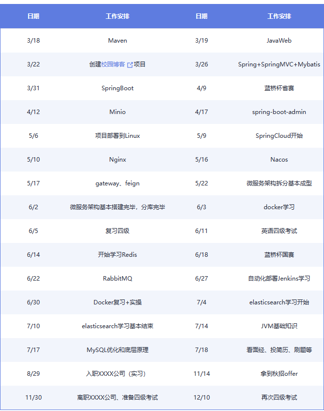
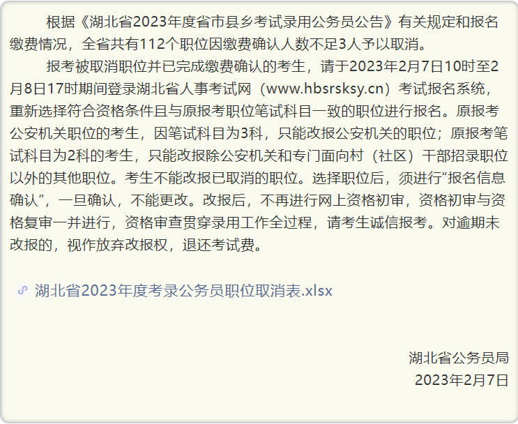
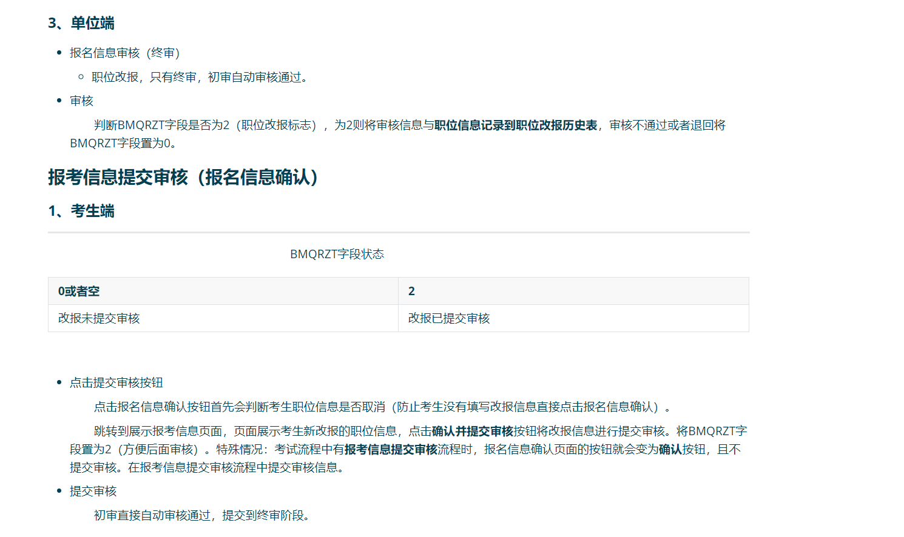
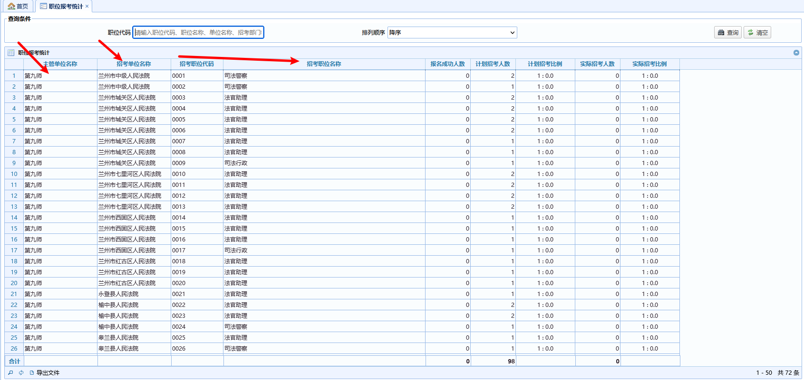
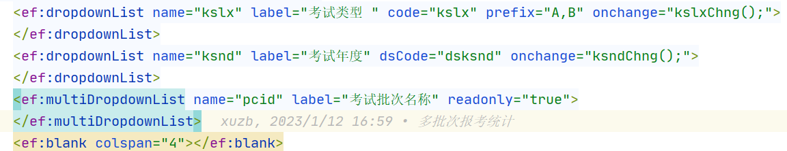
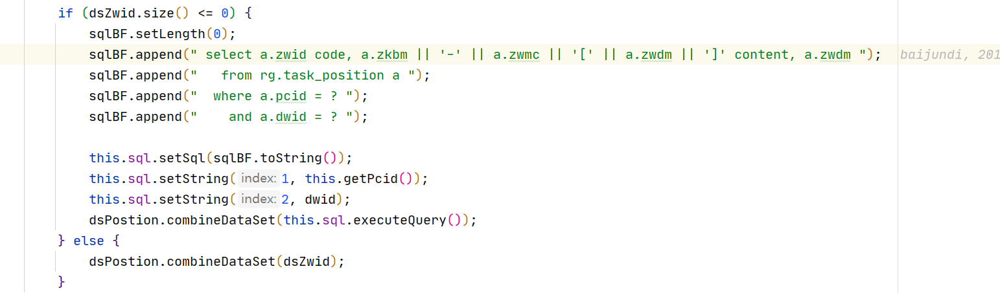
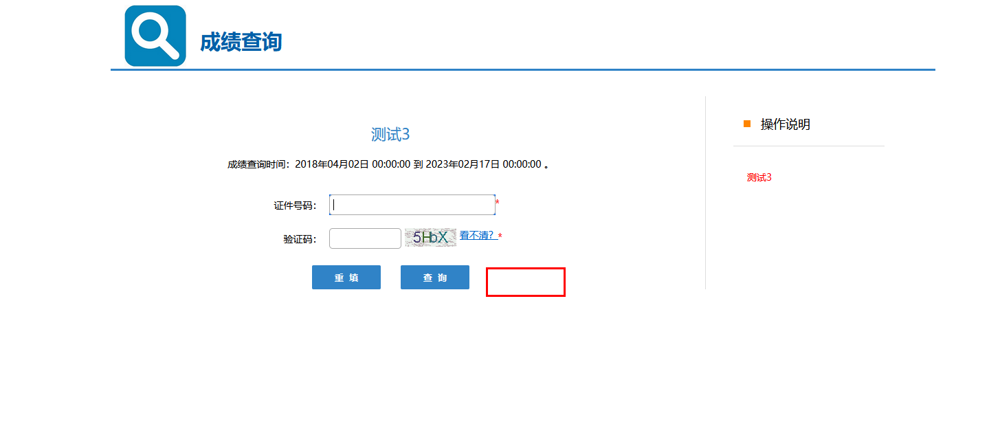
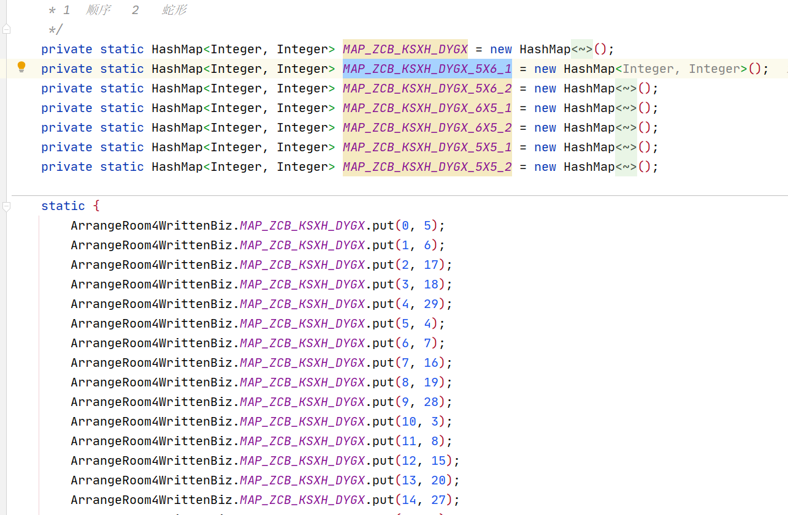
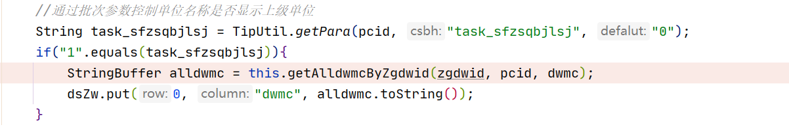
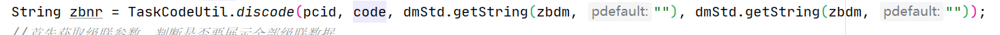

2023年2月

<!--more-->

## 2.1

新任务，去tiputil中修改关于通过身份证获取年龄的方法，新增一个批次参数控制年月日精度。

```sql
--新增考试参数
INSERT INTO RG.TASK_PARA_DOC
(CSBH, CSMC, CSSM, CSSJLX, CSSJYM, CSSJCODE, XH, KSLX)
VALUES('task_tgsfzhmhqnl', '通过身份证号码获取年龄', 'year-年，month-月，day-日，默认为年', 'code', NULL, 'SJDW', 65, NULL);

--新增code

--FW.CODE_LIST
INSERT INTO FW.CODE_LIST
(DMBH, DMMC, DMSM, DMSYFW)
VALUES('SJDW', '时间单位', NULL, '30');
--FW.CODE_DOC
INSERT INTO FW.CODE_DOC
(DMBH, CODE, CONTENT, SM)
VALUES('SJDW', 'year', '年', NULL);
INSERT INTO FW.CODE_DOC
(DMBH, CODE, CONTENT, SM)
VALUES('SJDW', 'month', '月', NULL);
INSERT INTO FW.CODE_DOC
(DMBH, CODE, CONTENT, SM)
VALUES('SJDW', 'day', '日', NULL);


--FW.CODE_CONFIG
INSERT INTO FW.CODE_CONFIG
(DBID, DMBH, CODE, CONTENT, XH)
SELECT DBID,'SJDW', 'year', '年', '1' FROM FW.DBID_INFO;
INSERT INTO FW.CODE_CONFIG
(DBID, DMBH, CODE, CONTENT, XH)
SELECT DBID,'SJDW', 'month', '月', '2' FROM FW.DBID_INFO;
INSERT INTO FW.CODE_CONFIG
(DBID, DMBH, CODE, CONTENT, XH)
SELECT DBID,'SJDW', 'day', '日', '3' FROM FW.DBID_INFO;

```

```
src/com/grace/tip/exam/biz/ExamBiz.java     getAgedByStdSfzhm
src/com/grace/tip/student/rg/biz/StdRgBiz.java		getAgedByStdSfzhm
src/com/grace/tip/rg/biz/RegistrationBiz.java       getAgedByStdSfzhm
src/com/grace/tip/rg/biz/RegistrationBiz.java    savePerChngDeclMod
```

不能这样了，明天没事情的话，要开始看算法与pdf了，这样浪费时间，有点不太好。

## 2.2

今天早上看到一篇文章



应届生学了八个月java，北京18k值得我学习。

学习他的思路，先确定一个项目，然后慢慢将学习到的技术栈融入到项目中，然后开始慢慢投简历。

是真的厉害，不是学习厉害，是规划能力，执行能力。值得我学习与反思。


又有一个新议题，先干活吧，唉


```
tip/tip/jsp/or/winOrgnUserAdd.jsp

src/com/grace/tip/or/biz/OrgnRightBiz.java    saveOrgnUserAdd


//新增方法
src/com/grace/tip/or/OrgnRightController.java  getYhbhByYhmc
src/com/grace/tip/or/biz/OrgnRightBiz.java     getYhbhByYhmc


单位端
tip/tip/jsp/orgn/urm/winOrgnUserAdd.jsp
src/com/grace/tip/orgn/login/biz/OrgnURMBiz.java   saveOrgnUserAdd

src/com/grace/tip/orgn/login/OrgnLoginController.java  getYhbhByYhmc
src/com/grace/tip/orgn/login/biz/OrgnURMBiz.java   getYhbhByYhmc
```


完活！

打工人永不加班！

## 2.3

今天干点什么呢？

先把那个数据级联的议题看一看，然后开始学习，先从两道算法开始。


新议题

单位账号管理权限分配问题修改

feature/xzb-modPermissionAssignmentProblem 

```
tip/jsp/orgn/urm/winOrgnUserAdd.jsp

src/com/grace/tip/orgn/login/biz/OrgnURMBiz.java	saveOrgnUserAdd
src/com/grace/tip/orgn/login/biz/OrgnURMBiz.java	saveOrgnUserPostionRight
```

 完活

## 2.4-2.5

种了两天的地，唉


## 2.6

做新议题，数据级联问题。

这个不怎么好做

```
//修改
src/com/grace/tip/student/rg/biz/StdRgBiz.java     getPosition4Stdnt

//新增
src/com/grace/tip/student/rg/biz/StdRgBiz.java     getAlldwmcByZgdwid
```


第一步增加一个考试参数，用来控制级联展示最后一级，还是展示全部。

```sql
--新增考试参数
INSERT INTO RG.TASK_PARA_DOC
(CSBH, CSMC, CSSM, CSSJLX, CSSJYM, CSSJCODE, XH, KSLX)
VALUES('task_sfzsqbjlsj', '是否展示全部级联数据', '0-否，1-是，默认为0', 'code', NULL, 'SHF', 66, NULL);
```

第二部在展示页面进行参数的判断。


第三步新增一个查询级联数据的方法


报考信息查看是访问的这个方法`getPosition4Stdnt`

星露谷是真的好玩

## 2.7

bas做一个小议题

feature/xzb-modStdDisplayInfo

```sql
UPDATE BI.FUNC_CONFIG
SET GNMC='甘肃省内电子证书'WHERE DBID='620' AND GNID='std19' AND GNWZ='PC';
```


级联位置：

```
管理端
考生报考数据管理
考生报考数据导出

考生段
打印报名表

单位端

审核报考信息


```


将级联的议题先放一放

先写个方案，就是将已有的功能做一下修改。

## 2.8

今天主要任务就是将那个方案写完



## 2.9

职位改报的方案写完了。

搞一下gpt

gpt真是厉害，

修改一下改报方案

 方案大改：


- 需求描述不要进行详细描述取消原因
- 管理端可指定改报职位
- 取消报考信息确认，用提交报考信息审核来代替
- 取消改报开启参数，只有缴费的考生才可以进行改报
- 指定改报参数分为两种，一种是随便改报，一种是只能改报为科目相同的职位。随便改报就只能先退费，再缴费。改报为相同科目的职位，不需要考虑退费的因素。

## 2.10

继续改方案 



记录思路，方便以后写代码

> 考生改报保存时，就记录改报前与改报后的职位信息，将审核状态改为未审核，当提交报考信息的时候，将审核状态改为已提交审核。提交审核之后将BMQRZT置为2，用作单位端标志。
>
> 还有个难点，就是，记录完成之后，如果考生再对职位进行更改，这样就比较麻烦了。
>
> 还是在审核完成的时候记录更改后的职位。


又新增一个参数，用来控制审核不通过之后是否可以继续改报。

这个参数不好判断的话，就用改报时间来限制他，改报肯定是在报名成功之后，所以使用改报时间来限制这个参数。


办理安居卡，机器坏了。淦。申请住房补贴

## 2.11

臭娘们来，去趵突泉和爬千佛山。腿软T-T

## 2.12

躺平一天

## 2.13

又是周一，先将博客整理一下，好久没发日记了。将日记整理一下发出去。

先写方案！成绩复查设计方案


方案搁置，来了个比较急一点的议题，先写议题。



按照这个页面展示方法来展示三级单位。

中午办了安居卡and领了12瓶可乐。

```sql
INSERT INTO RG.ORGN_FUNC
(DBID, GNID, GNMC, FGN, GNSJ, GNLX, SXH, GNTB, BZ)
SELECT DBID , 'tj07', '职位信息查询', 'tj', 'url:orgnrg.do?method=fwdPositionQuery', 'C', 7, 'icon-magnifier', NULL
FROM fw.DBID_INFO ;
```

```
//增加方法
src/com/grace/tip/orgn/rg/OrgnRgController.java     fwdPositionQuery
src/com/grace/tip/orgn/rg/OrgnRgController.java     queryPosition

src/com/grace/tip/orgn/rg/biz/OrgnRgBiz.java        fwdPositionQuery
src/com/grace/tip/orgn/rg/biz/OrgnRgBiz.java        queryPosition
//新增jsp
tip/jsp/orgn/rg/pagePositionInfoQuery.jsp
//修改jsp
tip/tip/jsp/orgn/rg/pageStdntInfoCountQuery.jsp
tip/tip/jsp/orgn/rg/pageStdntInfoCountQuery_629.jsp
```


这个查询功能其实最主要的就是将上级单位查询出来。

还是要用递归。

首先将单位查询出来。

然后取出单位中的数据，调用递归方法，然后查询出三级单位的内容，没有显示无。

这样查询效率肯定不行，但是没办法。只能这样。

## 2.14

哈哈哈，昨天那个议题，只要仿照一个其他功能就行了。

简单的很。

修改一下查询条件，在选择报考单位的时候，去更新报考职位。

将那个查询框实时更新的前端方法记录一下。



```js

// 选择年月在后遍历出考试信息
function ksndChng() {
    var pcid = getObject("pcid");
    pcid.setReadOnly(false);
    var ssny = getObject("ksnd").getValue();
    var kslx = getObject("kslx").getValue();
    if (chkObjNull(ssny) && chkObjNull(kslx)) {//考试类型与所属年月都没选择的话，就加载所有考试
        allPcid();
        return;
    }
    if (chkObjNull(ssny)){//只有考试类型为空则刷新
        kslxChng();
        return;
    }
    var url = new URL("rg.do", "queryTaskExamInfoByKsnd");
    url.addPara("ksnd", ssny);
    url.addPara("kslx", kslx);
    var data = AjaxUtil.syncBizRequest(url);
    var datacode = new HashMap(data);
    getObject("pcid").reloadOpt(datacode.get("dsksinfo"));
}

// 首次进页面加载所有考试
function allPcid() {
    var pcid = getObject("pcid");
    pcid.setReadOnly(false);
    var ssny = getObject("ksnd").getValue();
    var kslx = getObject("kslx").getValue();
    var url = new URL("rg.do", "queryTaskExamInfoByKsnd");
    url.addPara("ksnd", ssny);
    url.addPara("kslx", kslx);
    var data = AjaxUtil.syncBizRequest(url);
    var datacode = new HashMap(data);
    getObject("pcid").reloadOpt(datacode.get("dsksinfo"));
}
```

查询职位信息的sql




 不改了

去写那个方案。


撤  吃 鸡叉骨

## 2.15

接着写成绩复审的方案

是否要换40系列呢，感觉没必要吧，6666能把拯救者卖出去的话，就买



将这个成绩查询管理都进行描述一下。

## 2.16

今天将方案写完。

考场排列方式那个议题有点毛病，写完方案去改一下。

看了一下，好像没啥毛病

5*6顺序  1

5*6蛇形  2

6*5顺序  3

6*5蛇形  4



这玩意弄反了。。。。。。

后面要是改就改

```
src/com/grace/tip/exam/biz/ArrangeRoom4WrittenBiz.java
```


方案新思路：

1. 不增加记录表
2. 只有一个申请表
3. 申请表加入一个是否已出复查结果，用来考生查询时只查询这一个字段就可以判断结果
4. 第二次或者已撤销的申请，会覆盖之前的申请，就是说一个考生只有一条申请，不管你申请多少次。

开始！！

算法！

八股文！


又tm改那个座次表

改tm一百遍了


那个多批次统计

1. 清空时候再走一遍all
2. 增加防超时进度条

## 2.17

大早上一来就发现挂载的网盘挂了。

捣鼓了一上午，重装了sharelist发现有可能是阿里接口的问题

我这个服务器的环境已经不行了，拖一拖吧，拖到换服务器


还要重新设置sharelist，烦


还有一大堆工单没改。


修改方案

1. 导入两次，第一次导入哪些考生可以复查
2. 第二次导入复查成绩
3. 新增一个科目表
4. 第一次导入成绩查询的数据
5. 第二次导入成绩复查的数据，获取可复查科目信息
6. 然后将复查科目信息存入科目表中，科目表需要加一个标志，标志是否勾选了科目
7. 导入成绩复查信息的模版是固定的，固定km1，kmcj1，用来后台获取数据
8. 导入成绩复查成绩时按照导出的成绩复查申请作为模板
9. 复查与成绩查询完全独立，新增一个主表
10. 主表用来放考生信息。以及关联科目表
11. 一个申请时间，一个查询时间
12. 独立的网址。
13. 在考试列表上再增加一个复查按钮。
14. 登录固定字段，姓名、身份证号码。

## 2.18-2.19

种地，再有一个周就结档了。

## 2.20

还有好多议题，先把那个方案改完，然后就改议题。

那个notion挺好用的，感觉比我自己的那个网站方便，看看能不能慢慢改成那个网站记录笔记，然后博客写文章。

修改多批次职位查询那个议题

1. 将清空按钮绑定也绑定上查询所有职位
2. 增加防超时进度条


防止超时进度条：

```java
ProgressBar pgBar = ProgressBar.getProgressBarFromPara(para);
//获取导入考生的 bmid和 kqid
int dsDataSize = dsData.size();
if (dsDataSize <=0){
    throw new BizException("未获取到上传的材料信息，请上传材料后查询！");
}
pgBar.setMsg("正在处理导入的人员信息...请稍候...");
pgBar.setSum(dsDataSize);
int sum = 1;
pgBar.setMsg("正在查询【" + xm + "】的信息...(" + (sum++) + "/" + dsDataSize + ")...");
pgBar.addProgress(1);

if (pgBar.isCanceled()) {
    throw new BizException("操作人工终止...");
}
```

mole一下午，下班，冲冲冲

## 2.21

修改那个单位权限越权的议题。

议题问题说平级单位还是有权限问题。

原因是我在代码中做了判断，当前登录用户不是新增用户的单位，才复制权限。

这样就有一个问题，平级单位是当前单位，所以没有复制权限。


继续修改数据级联的问题




```java
public final StringBuffer getAlldwmcByZgdwid(String zgdwid, String pcid, String dwmc) throws Exception {
    StringBuffer sqlBF = new StringBuffer();
    StringBuffer allDwmc = new StringBuffer();

    sqlBF.setLength(0);
    sqlBF.append(" select dwid, dwmc, zgdwid ");
    sqlBF.append("    from rg.task_orgn  ");
    sqlBF.append("  where pcid = ? ");
    sqlBF.append("    and dwid = ? ");

    this.sql.setSql(sqlBF.toString());
    this.sql.setString(1, pcid);
    this.sql.setString(2, zgdwid);

    DataSet dsZgdw = this.sql.executeQuery();

    if (dsZgdw.size() != 0) {
        allDwmc.append(dsZgdw.getString(0, "dwmc")).append("_").append(dwmc);
        //判断主管单位id是否为空，不为空则进行递归
        String zgdwidTemp = dsZgdw.getString(0, "zgdwid");
        if (!StringUtil.chkStrNull(zgdwidTemp)) {
            allDwmc = this.getAlldwmcByZgdwid(zgdwidTemp, pcid, allDwmc.toString());
        }
    }
    return allDwmc;
}
```

用的递归调用

还剩下这几个位置没有改

```
管理端
考生报考数据管理
考生报考数据导出

考生段
打印报名表

单位端

审核报考信息
```


职位改报方案修改：

1. 新增一个主表，用来记录哪些考生可以进行改报，可以用来控制职位改报按钮
2. 考生历史表：记录考生改报的历史记录
3. 职位改报范围表：记录可以改报的范围，如果是没有记录默认就是全部。
4. 新增一个职位改报考生查询功能，可对改报考生信息进行导出


淦！

合并分支合并错了。

src/com/grace/tip/rg/biz/RegistrationBiz.java


## 2.22

分支代码提交错了。

新建一个分支，将代码提交上去。

然后去修改方案。

然后去写个议题。

方案改完了，将一些细节记录在了notion中。

然后下午改一个简单的议题。

## 2.23

先看算法！

二分算法

两种方法，[),[]


这个数据级联有点多，都得改！

管理端和单位端搞完了，还有考生端没搞。明天再弄。

## 2.24

继续搞数据级联，首先先看几篇文章和写个算法。

看了一篇双亲委派机制。

算法下午再看，先把那个议题写完。

淦  改了两天改错了t'X

只修改采集字段上的级联信息。

```
//修改
src/com/grace/tip/student/rg/biz/StdRgBiz.java		getPosition4Stdnt    //考生端
src/com/grace/tip/student/rg/biz/StdRgBiz.java      fwdTxbkxxViewB //修改填写报考信息查看
src/com/grace/tip/student/rg/biz/StdRgBiz.java      fwdTxbkxxViewA
src/com/grace/tip/student/rg/biz/StdRgBiz.java      fwdTxbkxxViewA_200
src/com/grace/tip/student/rg/biz/StdRgBiz.java      fwdBkxxTjshPageB//填写报考信息提交审核
src/com/grace/tip/student/rg/biz/StdRgBiz.java      fwdBkxxTjshPageA
//增加
src/com/grace/tip/student/rg/biz/StdRgBiz.java	    getAlldwmcByZgdwid
src/com/grace/tip/student/rg/biz/StdRgBiz.java      getCjxjlBySjcode
```

艹  没研究明白



下周再写，通过这个zbnr获取到最底层的code

然后从底层查上去。

## 2.25-2.26

过生日啊，24了。呜呜呜

吃了臭娘们的蛋糕，真好

## 2.27

新的一周

想弄图床，很麻烦，回头有需求再弄吧

修改其他展示采集字段的页面，不要只修改职位考试，资格考试也要修改。

做新议题


先做这个

考生端照片处理工具：

- 将支付宝照片比对增加照片处理工具的判断
- 将流程中上传照片加上支付宝的处理逻辑
- 增加一个系统参数，获取照片处理方式

## 2.28

呦西呦西，这个月最后一天

考生端照片处理工具

```
//考试流程中
feature/xzb-modStdPhotoProbelm     


//登录时
feature/xzb-modStdPhotoProbelmZFB

fwdStdLoginChkPhoto//登录时上传照片方法
```


将这一部分分为两个工单，一个是流程中的，一个是支付宝的。

先去改流程中的。

将上传，重新上传，确认使用都加上照片比对。


```
//确认使用照片
savePhotoFromPer

//重新上传
fwdStdUploadPhotoChkPhoto
saveUploadPhoto
```

   

重新上传这个好像是没有判断是否开启比对这个参数。

```
CREATE SEQUENCE BA.SEQ_PRZSID INCREMENT BY 1 MINVALUE 10000000000 MAXVALUE 99999999999 CYCLE NOCACHE NOORDER ;

CREATE SEQUENCE BA.SEQ_ZMBH INCREMENT BY 1 MINVALUE 1000000000 MAXVALUE 9999999999 CYCLE NOCACHE NOORDER ;

```


还需要增加一个照片底色的系统级别参数。

第一步，增加参数：

```sql
INSERT INTO FW.SYS_PARA_DOC
(CSBH, CSMC, CSSM, CSSJLX, CSSJYM, CSSJCODE, XH)
VALUES('tip_zpshfs', '照片审核方式', '移动端是否照片处理工具认证', 'code', NULL, 'SHF', NULL);

```

不对不对，增加系统参数只有在支付宝照片比对的时候用的到。


思路：

```
doSczp
```

修改这个方法，把之前的是否开启照片比对的判断去了，所有的判断都放进这个方法里面，上传就是重新上传，用一个方法。

判断参数是否开启：

```java
String tip_aliphoto_compare = TipGlobalVars.TIP_ALIPHOTO_COMPARE;
```


修改方法：

```
//修改
src/com/grace/tip/student/rg/biz/StdRgBiz.java			doSczp
src/com/grace/tip/student/rg/biz/StdRgBiz.java          savePhotoFromPer
tip/tip/jsp/student/stdSczpAdd_200.jsp
tip/tip/jsp/student/stdSczpAdd.jsp
tip/tip/jsp/student/stdSczpAdd_100.jsp
tip/tip/jsp/student/stdSczpAdd_120.jsp
tip/tip/jsp/student/stdSczpAdd_629.jsp
tip/tip/jsp/student/stdSczpAdd_901.jsp
```


确认照片的时候，去数据库中将照片取出来，然后再进行比对。

取出来是字符串类型的，如何转换成他需要的呢。

有方法可以直接获取字节文件。


支付宝照片比对代码

```java
//先取出上传的，如果没有上传再取考生身上的
            this.sql.setSql("select wjid from rg.task_stdnt_photo where bmid = ?");
            this.sql.setString(1, bmid);
            DataSet dsStdntPhoto = this.sql.executeQuery();

            String zpwjid = "";
            if (dsStdntPhoto.size() > 0) {// 如果考生已上传照片
                zpwjid = dsStdntPhoto.getString(0, "wjid");
            }else{
                this.sql.setSql("select wjid from bi.per_photo where ryid = ?");
                this.sql.setString(1, ryid);
                DataSet dsRyPhoto = this.sql.executeQuery();
                if (dsRyPhoto.size() > 0) {
                    zpwjid = dsRyPhoto.getString(0, "wjid");
                }
            }
			if (StringUtil.chkStrNull(zpwjid)) {
				throw new BizException("操作失败，请重试。");
			}
			String zpshfs = TipUtil.getPara(pcid, "task_kszpshfs", "0");
			DataMap pdm = new DataMap();

            //照片比对-只能放在审核上面，放在审核下面需要回滚
            String tip_aliphoto_compare = TipGlobalVars.TIP_ALIPHOTO_COMPARE;
            if("1".equals(tip_aliphoto_compare)){
                // 获取人员信息
                DataMap vdm = TipUtil.getPersonInfoByRyid(ryid);
                byte[] imgByte = DocUtil.getWjnrByWjid2Byte(zpwjid);
                String zpgs = DocUtil.getWjgsByWjid(zpwjid);

                AlipayClient alipayClient = new DefaultAlipayClient(SysParaUtil.getPara("ali_serverurl", ""), SysParaUtil.getPara("ali_appid", ""), SysParaUtil.getPara("ali_private_key", ""), "json", "GBK", SysParaUtil.getPara("alipay_public_key", ""), "RSA2");
                AlipayUserCertifyOpenInitializeRequest request = new AlipayUserCertifyOpenInitializeRequest();
                // 构造身份信息json对象
                JSONObject identityObj = new JSONObject();
                // 身份类型，必填，详细取值范围请参考接口文档说明
                identityObj.put("identity_type", "CERT_INFO");
                // 证件类型，必填，详细取值范围请参考接口文档说明
                identityObj.put("cert_type", "IDENTITY_CARD");
                // 真实姓名，必填
                identityObj.put("cert_name", vdm.getString("xm"));
                // 证件号码，必填
                identityObj.put("cert_no", vdm.getString("yxzjhm"));
                // 活体人脸，base64后传入
                identityObj.put("facial_picture_front", Base64.encodeBase64String(imgByte));
                // 构造商户配置json对象
                JSONObject merchantConfigObj = new JSONObject();
                // 回跳地址，需要设置，可以空字符串
                merchantConfigObj.put("return_url", "");
                // 构造身份认证初始化服务业务参数数据
                JSONObject bizContentObj = new JSONObject();
                // 商户请求的唯一标识，推荐为uuid，必填
                String wybs = SeqUtil.getId("rg.seq_bmid");
                bizContentObj.put("outer_order_no", wybs);
                bizContentObj.put("biz_code", "FACE_API");
                bizContentObj.put("identity_param", identityObj);
                bizContentObj.put("merchant_config", merchantConfigObj);
                request.setBizContent(bizContentObj.toString());
                // 发起请求
                AlipayUserCertifyOpenInitializeResponse response = alipayClient.execute(request);
                if (response.isSuccess()) {
                    // 接口调用成功，从返回对象中获取certify_id
                    String certifyId = response.getCertifyId();
                    // 执行后续流程...
                    AlipayClient alipayClient2 = new DefaultAlipayClient(SysParaUtil.getPara("ali_serverurl", ""), SysParaUtil.getPara("ali_appid", ""), SysParaUtil.getPara("ali_private_key", ""), "json", "GBK", SysParaUtil.getPara("alipay_public_key", ""), "RSA2");
                    AlipayUserCertifyOpenQueryRequest request2 = new AlipayUserCertifyOpenQueryRequest();
                    // 设置certifyId
                    JSONObject bizContentObj2 = new JSONObject();
                    bizContentObj2.put("certify_id", certifyId);
                    request2.setBizContent(bizContentObj2.toString());
                    // 发起请求
                    AlipayUserCertifyOpenQueryResponse response2 = alipayClient2.execute(request2);
                    if (response2.isSuccess()) {
                        String data  = response2.getBody();
                        DataMap dmData = DataMap.fromObject(data);
                        DataMap dmPara = dmData.getDataMap("alipay_user_certify_open_query_response");
                        String passed = dmPara.getString("passed");
                        // 接口调用成功后，再判断认证是否通过
                        if (!StringUtil.chkStrNull(passed) && "T".equals(passed)) {
                            // 执行后续流程...
                            // 更新基本信息库中人员照片
                            pdm.clear();
                            pdm.put("ryid", ryid);
                            pdm.put("ryzp", imgByte);
                            pdm.put("zpgs", zpgs);
                            pdm.put("zprzbz", "1");// 照片认证标志
                            this.doBizMethod("com.grace.tip.bi.per.biz.BiPerDaoBiz", "saveBiPerInfo", pdm);

                            sczp = "1";
                            msg = "";
                        } else {
                            throw new BizException("上传的照片与支付宝认证照片对比失败，请重新上传照片或重新进行身份认证操作！");
                        }
                    } else {
                        throw new BizException("上传的照片与支付宝认证照片对比失败，请重新上传照片或重新进行身份认证操作！");
                    }
                } else {
                    throw new BizException("调用照片比对服务失败！");
                }
            }
```

在这里修改了，上传、重新上传、确认使用。加上了

改是改完了，怎么测试呢


