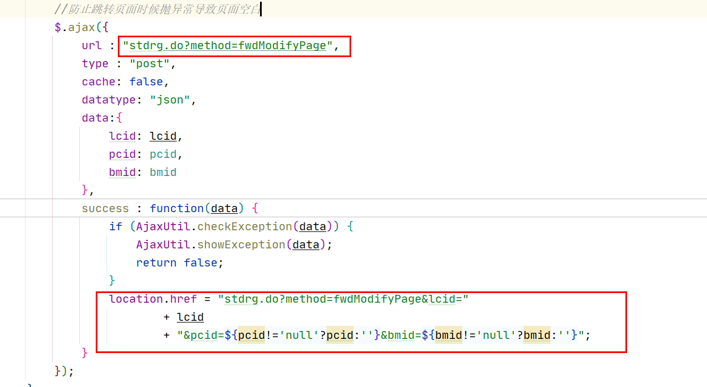
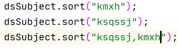

2023年5月

<!--more-->

## 月初计划

### 1、算法

- [ ] 二叉树
- [ ] 复习之前算法

### 2、书籍

- [ ] 小林coding mysql45讲

### 3、技术栈

- [ ] springcloud

### 4、八股文

- [ ] 每日最少一题

## 5.1-5.3

五一假期

## 5.4

又开始上班了，烦

测试一下假期之前做的议题。

照片比对那个


页面跳转的议题，使用href跳转只要是调用的页面中抛异常，就会空白页面。

思路：

使用ajax请求进行先校验一下方法，因为ajax不会跳转页面。



使用这种方法确实可以解决这种问题，但是不让用。。。。不知道为啥


重新写一个照片的校验方法


麻烦死了。


```
//新增

src/com/grace/tip/student/rg/StdRgController.java    chkSczpException
src/com/grace/tip/student/rg/biz/StdRgBiz.java   chkSczpException

//修改
tip/tip/jsp/student/stdFlow.jsp
```

## 5.5

老规矩，先做两道算法，然后去看小林

将昨天的那个检测与跳转页面分开，做一个专门的照片修改跳转

```
//add
src/com/grace/tip/student/rg/StdRgController.java    fwdSczpEnter
src/com/grace/tip/student/rg/biz/StdRgBiz.java   fwdSczpEnter

```

修改完成，接着去看mysql

## 5.6

继续老规矩，先看算法

看了算法之后继续看小林的mysql

mysql为什么用b+tree  因为较少的io操作，以及很快的查询以及删除速度。


## 5.7

休息了。

switch

奥德赛，还算好玩吧，时间长了就不好玩了 ，偶尔玩一局。

## 5.8


看会面经，然后算法。

面经：

1. 进程与线程的区别
2. 为什么要使用多线程
3. 说说mysql索引

算法：

还是二叉树

- 112 路径总和


改一个简单的议题；

先把工单写了

feature/xzb-modPrintAdmissionTicketProblem


```
//修改
src/com/grace/tip/student/rg/biz/StdRgBiz.java   dealStdntKwInfo
src/com/grace/tip/exam/biz/ArrangeRoom4WrittenBiz.java  fwdDealSite4Arr
src/com/grace/tip/exam/biz/ArrangeRoom4WrittenBiz.java  winDealSite4TypePosArr
src/com/grace/tip/exam/biz/ArrangeRoom4WrittenBiz.java  exportSpotArrData
```

## 5.9

一样，先看面经然后算法，

开始准备做职位改报


feature/xzb-addPositionChange

摸了一天   嘎嘎嘎


晚上看漫长的季节了，没学习，唉

电视剧这个东西不能看，上瘾

## 5.10

感觉八股还是看的有点早，还不如去复习之前的笔记。

先看算法，然后每天复习复习笔记拉到

对了 还有小林的图解系列


下午开始干活

今天将工单提交，并且将表设计出来

主表

TASK_POSITION_CHANGE_STD

| 列名称 | 数据类型      | 注释         |
| ------ | ------------- | ------------ |
| BMID   | varchar2(20)  | 报名ID       |
| PCID   | varchar2(20)  | 批次ID       |
| XM     | varchar2(100) | 姓名         |
| YXZJHM | varchar2(50)  | 有效证件号码 |
| ZWID   | varchar2(20)  | 职位ID       |
| ZWDM   | varchar2(20)  | 职位代码     |
| ZWMC   | varchar2(200) | 职位名称     |
| GBQSSJ | date          | 改报起始时间 |
| GBZZSJ | date          | 改报终止时间 |
| GBZT   | varchar2(3)   | 改报状态     |
| GBCS   | NUMBER(8,0)   | 改报次数     |

历史表

TASK_POSITION_CHANGE_LOG

| 列名称   | 数据类型      | 注释             |
| -------- | ------------- | ---------------- |
| SHID     | varchar2(20)  | 审核ID           |
| BMID     | varchar2(20)  | 报名ID           |
| GBQZWDM  | varchar2(20)  | 改报前职位代码   |
| GBQZWMC  | varchar2(200) | 改报前职位名称   |
| SQGBZWDM | varchar2(20)  | 申请改报职位代码 |
| SQGBZWMC | varchar2(200) | 申请改报职位名称 |
| SHZT     | varchar2(3)   | 审核状态         |
| SHRXM    | varchar2(100) | 审核人姓名       |
| SHSJ     | date          | 审核时间         |
| SHBTGYY  | varchar2(200) | 审核不通过原因   |
| SHYJ     | varchar2(200) | 审核意见         |
| BZ       | varchar2(200) | 备注             |

范围表

TASK_POSITION_CHANGE_SCOPE

| 列名称  | 数据类型     | 注释         |
| ------- | ------------ | ------------ |
| ZWID    | varchar2(20) | 职位id       |
| PCID    | varchar2(20) | 批次id       |
| KGBZWID | varchar2(20) | 可改报职位id |

当前的按钮限制不住改报。

所以新增一个表，用来存储可以改报的考生。

若审核不通过，则判断批次参数，若允许重复报名，则继续显示改报按钮。


那么这样的话，单位端审核也需要进行修改。

单位端审核时候要去判断一下是否是职位改报的考生，也很简单只需要去主表中进行查询即可。


明天继续写，反正效率挺慢的。


## 5.11

先看算法，

二叉搜索树使用中序遍历是有序的数组，所以做什么都比较好做。


修改准考证的议题

```
//新增
src/com/grace/tip/exam/biz/ArrangeRoom4WrittenBiz.java   checkSubjectTimeInfo
```



设计好了表，准备开始做

```sql
CREATE TABLE RG.TASK_POSITION_CHANGE_STD (
	BMID VARCHAR2(20) NOT NULL,
    ZWID VARCHAR2(20) NOT NULL,
	PCID VARCHAR2(20) NOT NULL,
	XM VARCHAR2(100) NOT NULL,
	YXZJHM VARCHAR2(50) NOT NULL,
	ZWDM VARCHAR2(20) NULL,
	ZWMC VARCHAR2(200) NULL,
	GBQSSJ DATE NULL,
	GBZZSJ DATE NULL,
	GBZT VARCHAR2(3) NULL,
	GBCS NUMBER(8,0) NULL,
	CONSTRAINT PK_TASK_POSITION_CHANGE_STD PRIMARY KEY (BMID,ZWID)
)
TABLESPACE TS_RG;
COMMENT ON TABLE RG.TASK_POSITION_CHANGE_STD IS '可改报考生表';
COMMENT ON COLUMN RG.TASK_POSITION_CHANGE_STD.BMID IS '报名ID';
COMMENT ON COLUMN RG.TASK_POSITION_CHANGE_STD.PCID IS '批次ID';
COMMENT ON COLUMN RG.TASK_POSITION_CHANGE_STD.XM IS '姓名';
COMMENT ON COLUMN RG.TASK_POSITION_CHANGE_STD.YXZJHM IS '有效证件号码';
COMMENT ON COLUMN RG.TASK_POSITION_CHANGE_STD.ZWID IS '职位ID';
COMMENT ON COLUMN RG.TASK_POSITION_CHANGE_STD.ZWDM IS '职位代码';
COMMENT ON COLUMN RG.TASK_POSITION_CHANGE_STD.ZWMC IS '职位名称';
COMMENT ON COLUMN RG.TASK_POSITION_CHANGE_STD.GBQSSJ IS '改报起始时间';
COMMENT ON COLUMN RG.TASK_POSITION_CHANGE_STD.GBZZSJ IS '改报终止时间';
COMMENT ON COLUMN RG.TASK_POSITION_CHANGE_STD.GBZT IS '改报状态';
COMMENT ON COLUMN RG.TASK_POSITION_CHANGE_STD.GBCS IS '改报次数';
```

## 5.12

看一篇文章，然后去看算法

这篇文章是掘金的LinkedList讲解。

[LinkedList 的作者：我写了 LinkedList，但我自己都不用！ - 掘金 (juejin.cn)](https://juejin.cn/post/7231902909993615420)


去把剩下的两个表也建了

```sql
CREATE TABLE RG.TASK_POSITION_CHANGE_LOG (
	SHID VARCHAR2(20) NOT NULL,
	BMID VARCHAR2(20) NOT NULL,
    GBQZWDM VARCHAR2(20) NOT NULL,
    GBQZWMC VARCHAR2(200) NOT NULL,
    SQGBZWDM VARCHAR2(20) NOT NULL,
    SQGBZWMC VARCHAR2(200) NOT NULL,
	SHZT VARCHAR2(3) NULL,
	SHRXM VARCHAR2(100) NULL,
	SHSJ DATE NULL,
	SHBTGYY VARCHAR2(200) NULL,
	SHYJ VARCHAR2(200) NULL,
	BZ VARCHAR2(200) NULL,
	CONSTRAINT PK_TASK_POSITION_CHANGE_LOG PRIMARY KEY (SHID,BMID)
)
TABLESPACE TS_RG;
COMMENT ON TABLE RG.TASK_POSITION_CHANGE_LOG IS '职位改报历史记录表';
COMMENT ON COLUMN RG.TASK_POSITION_CHANGE_LOG.SHID IS '审核ID';
COMMENT ON COLUMN RG.TASK_POSITION_CHANGE_LOG.BMID IS '报名ID';
COMMENT ON COLUMN RG.TASK_POSITION_CHANGE_LOG.GBQZWDM IS '改报前职位代码';
COMMENT ON COLUMN RG.TASK_POSITION_CHANGE_LOG.GBQZWMC IS '改报前职位名称';
COMMENT ON COLUMN RG.TASK_POSITION_CHANGE_LOG.SQGBZWDM IS '申请改报职位代码';
COMMENT ON COLUMN RG.TASK_POSITION_CHANGE_LOG.SQGBZWMC IS '申请改报职位名称';
COMMENT ON COLUMN RG.TASK_POSITION_CHANGE_LOG.SHZT IS '审核状态';
COMMENT ON COLUMN RG.TASK_POSITION_CHANGE_LOG.SHRXM IS '审核人姓名';
COMMENT ON COLUMN RG.TASK_POSITION_CHANGE_LOG.SHSJ IS '审核时间';
COMMENT ON COLUMN RG.TASK_POSITION_CHANGE_LOG.SHBTGYY IS '审核不通过原因';
COMMENT ON COLUMN RG.TASK_POSITION_CHANGE_LOG.SHYJ IS '审核意见';
COMMENT ON COLUMN RG.TASK_POSITION_CHANGE_LOG.BZ IS '备注';

```


```sql
CREATE TABLE RG.TASK_POSITION_CHANGE_SCOPE (
	ZWID VARCHAR2(20) NOT NULL,
	PCID VARCHAR2(20) NOT NULL,
	KGBZWID VARCHAR2(20) NOT NULL,
    CONSTRAINT PK_TASK_POSITION_CHANGE_SCOPE PRIMARY KEY (ZWID,PCID,KGBZWID)
)
TABLESPACE TS_RG;
COMMENT ON TABLE RG.TASK_POSITION_CHANGE_SCOPE IS '职位改报范围表';
COMMENT ON COLUMN RG.TASK_POSITION_CHANGE_SCOPE.ZWID IS '职位ID';
COMMENT ON COLUMN RG.TASK_POSITION_CHANGE_SCOPE.PCID IS '批次ID';
COMMENT ON COLUMN RG.TASK_POSITION_CHANGE_SCOPE.KGBZWID IS '可改报职位ID';

```


思路：

1、先增加按钮，职位改报（相同专业）、职位改报（任意改报）


新框架出来了，抓紧把这个议题做完他


## 5.13-5.14

周末。臭娘们来找我，给他炖的排骨，炒饼，还有西瓜

然后他又走了，烦人


## 5.15

不着急不着急

先看两道算法加一篇文章。

慢慢积累

。。。

分支改错了


抓紧做一会职位改报，先不着急修改之前原有的代码，先去新增新功能

```
//修改
tip/tip/jsp/exam/pageTaskPosAdjustMng.jsp

//新增
tip/tip/jsp/exam/winTaskSameSubjectAdjust.jsp   //相同科目改报
tip/tip/jsp/exam/winTaskAnyPosAdjust.jsp       //任意职位改报
```


明天改一下进入的方法，查询出来符合要求的职位，然后将职位写入范围表中。


## 5.16

后面这个sb我真是服了，回头辞职我就说受不了这个逼咳嗽，真是哕了

[《如何超过大多数人》——陈皓（左耳朵耗子） - 掘金 (juejin.cn)](https://juejin.cn/post/7207648496978870333)

非常不错的文章，收益良多。

要学会学习，学会自律，学会总结，而不是一味的看完就是学会。

确定好学习路线，而不是资料收集达人。

从现在就开始，而不是明天。

知道自己需要什么，寻求更高效的方法。


看会算法，二叉搜索树的删除节点，异常麻烦

- 没找到删除节点--返回空
- 找到删除节点
  - 第二种情况：左右孩子都为空，直接删除
  - 第三种情况：删除节点的左孩子不为空，右孩子为空，左孩子补位，返回左孩子为根节点
  - 第四种情况：删除节点的右孩子不为空，左孩子为空，右孩子补位，返回右孩子为根节点
  - 第五种情况：左右孩子都不为空，将左孩子移动到右孩子的最左边，然后右孩子补位。

第五种情况动画：


修改之前工作单


开始做职位改报！！！！！

```
//新增

src/com/grace/tip/exam/ExamController.java   fwdTaskAnyPosAdjust
src/com/grace/tip/exam/ExamController.java   fwdTaskSameSubPosAdjust
src/com/grace/tip/exam/biz/ExamBiz.java      fwdTaskAnyPosAdjust
src/com/grace/tip/exam/biz/ExamBiz.java      fwdTaskSameSubPosAdjust

src/com/grace/tip/exam/ExamController.java   saveTaskAnyPosAdjust
src/com/grace/tip/exam/biz/ExamBiz.java      saveTaskAnyPosAdjust
src/com/grace/tip/exam/ExamController.java   saveTaskSameSubPosAdjust
src/com/grace/tip/exam/biz/ExamBiz.java      saveTaskSameSubPosAdjust
```


改报保存时候，需要将改报考生导入改报名单表中，还有将改报范围存放到改报范围表中。

## 5.17

每日一文

算法

blog图片没了，去找点图片

[美团二面：聊聊ConcurrentHashMap的存储流程 - 掘金 (juejin.cn)](https://juejin.cn/post/7233758531378397240)

这个博主写的源码解析挺不错的，每天都要看一篇。

源码太难理解。

先去做算法吧

## 5.18

好像要二🐏

终于 把二叉树看完了，复习一遍

任意职位改报修改完成，接下来编写相同科目得按钮。


怎么还有专业！


人格测试


https://www.16personalities.com/

## 5.19

昨天连那个sql都没写明白

今天抓紧时间，先把那个sql写了！

新鲜出炉，查询与当前职位拥有相同科目的职位信息。

```sql
select a.zwid, a.dwmc, a.zkbm, a.zwdm, a.zwmc, a.jhzkrs,a.sjzkrs, a.zwzt, a.gbqssj, a.gbzzsj
from rg.task_position a
where a.zyid in ( select b.zyid
		from rg.task_level_degree_subject b
		where b.kmid in(select c.kmid
						from rg.task_level_degree_subject c
						where c.pcid = '20022032310000000412'
						and c.jbid = '20022032310000000449'
						and c.zyid = '20022032310000001025'							
		)
		and b.pcid = '20022032310000000412'
		and b.zyid <> '20022032310000001025' 
		group by b.zyid
		)
and  a.pcid = '20022032310000000412'
and a.ZWZT = '1'
group by  a.zwid, a.dwmc, a.zkbm, a.zwdm, a.zwmc, a.jhzkrs,a.sjzkrs,  a.zwzt, a.gbqssj, a.gbzzsj;
```


艹，发烧了


没办法喝酒了


任意职位改报以及相同科目改报的按钮以及做完了，下一步，修改取消按钮。

