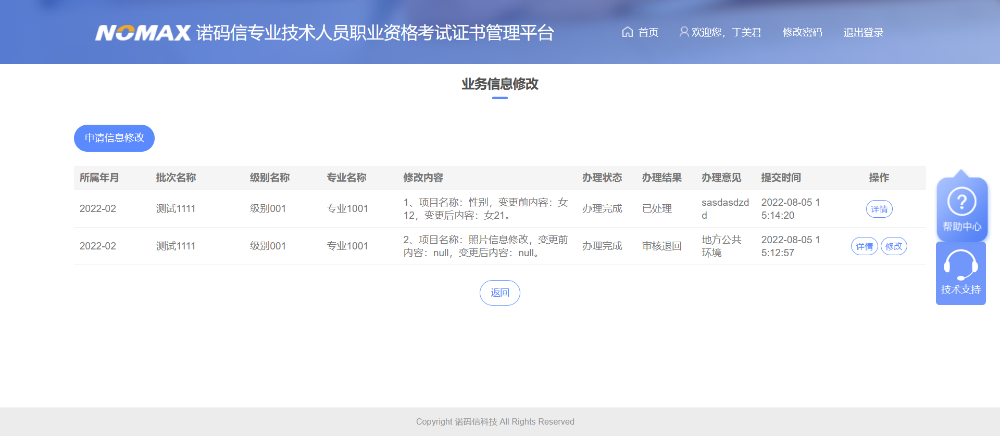

## 8.1

### 密码重置

#### 1、设置材料页面-修改


```js

// 修改
function btnModClick(rowid) {
    var grid = getObject("gridInfo");

    var url = new URL("pwd.do", "fwdPwdMeterialModify");
    url.addPara("mmczclpzid", grid.getCell(rowid, "mmczclpzid"));
    openWindow("材料修改", url, "normal", function(data) {
        AjaxUtil.asyncRefreshPage();
    });
}
```


```java
/**
     * 密码重置管理——修改界面
     *
     * @author xzb
     * @date 创建时间 2022-8-1
     * @since V1.0
     */
public ModelAndView fwdPwdMeterialModify(HttpServletRequest request,
                                         HttpServletResponse response, DataMap para) throws Exception {
    DataMap rdm = this.doBizMethod("com.grace.bas.pwd.biz.PwdBiz", "fwdPwdMeterialModify", para);
    return new ModelAndView("bas/jsp/pwd/winPwdMeterialModify.jsp", rdm);
}


/**
     * 密码重置管理——修改界面
     *
     * @author xzb
     * @date 创建时间 2022-8-1
     * @since V1.0
     */
public final DataMap fwdPwdMeterialModify(final DataMap para) throws Exception {
    StringBuffer sqlBF = new StringBuffer();

    String mmczclpzid = para.getString("mmczclpzid");

    if (StringUtil.chkStrNull(mmczclpzid)) {
        throw new BizException("传入的密码重置材料配置ID为空！");
    }

    // 查询材料的信息
    sqlBF.setLength(0);
    sqlBF.append(" select a.mmczclpzid, a.cllx, a.clsm, ");
    sqlBF.append("        a.wjdx, a.wjsl, a.sfzs, a.sfbl, a.bz ");
    sqlBF.append("   from bi.pass_reset_material_config a, ");
    sqlBF.append("  where a.mmczclpzid = ? ");
    sqlBF.append("  group by a.mmczclpzid, a.cllx, a.clmc, a.clsm, a.wjdx, a.wjsl, a.sfzs, a.sfbl, a.bz ");

    this.sql.setSql(sqlBF.toString());
    this.sql.setString(1, mmczclpzid);
    DataSet dsPwdMeterial = this.sql.executeQuery();

    // 判空
    if (dsPwdMeterial.size() == 0) {
        throw new BizException("根据密码重置材料配置ID" + mmczclpzid + "未查询到材料信息，请联系系统管理员！");
    }

    DataMap rdm = new DataMap();
    rdm.put("dspwdmeterial", dsPwdMeterial.getRow(0));
    return rdm;
}


```

修改页面-保存

```js
// 保存
    function btnSaveClick() {
        var form = getObject("formInfo");
        if (!form.chkFormData(true)) {
            return;
        }
        var url = new URL("pwd.do", "savePwdMeterialModify");
        url.addForm("formInfo");
        var data = AjaxUtil.syncBizRequest(url);
        if (AjaxUtil.checkIsGoOn(data)) {
            alert("保存成功！");
            closeWindow(true);
        }
    }
```

```java
/**
* 密码重置管理——保存修改
*
* @author xzb
* @date 创建时间 2022-8-1
* @since V1.0
*/
public ModelAndView savePwdMeterialModify(HttpServletRequest request,
                                          HttpServletResponse response, DataMap para) throws Exception {
    this.doBizMethod("com.grace.bas.pwd.biz.PwdBiz", "savePwdMeterialModify", para);
    return null;
}

/**
     * 密码重置管理——保存修改
     *
     * @author xzb
     * @date 创建时间 2022-8-1
     * @since V1.0
     */
public final void savePwdMeterialModify(final DataMap para) throws Exception {
    StringBuffer sqlBF = new StringBuffer();

    // 获取参数值
    String mmczclpzid = para.getStr("mmczclpzid", FieldValidation.Default());
    String clmc = para.getStr("clmc", FieldValidation.Default());
    String cllx = para.getStr("cllx", FieldValidation.Default());
    String clsm = para.getStr("clsm", FieldValidation.Default());
    String wjdx = para.getStr("wjdx", FieldValidation.Default());
    String wjsl = para.getStr("wjsl", FieldValidation.Default());
    String sfzs = para.getStr("sfzs", FieldValidation.Default());
    String sfbl = para.getStr("sfbl", FieldValidation.Default());
    String bz = para.getStr("bz", FieldValidation.Default());

    // 判空
    if (StringUtil.chkStrNull(mmczclpzid)) {
        throw new BizException("传入的密码重置材料配置ID不能为空！");
    }
    if (StringUtil.chkStrNull(clmc)) {
        throw new BizException("传入的材料名称字段不能为空！");
    }
    if (StringUtil.chkStrNull(cllx)) {
        throw new BizException("传入的材料类型字段不能为空！");
    }
    if (StringUtil.chkStrNull(wjdx)) {
        throw new BizException("传入的文件大小字段不能为空！");
    }
    if (StringUtil.chkStrNull(wjsl)) {
        throw new BizException("传入的文件数量字段不能为空！");
    }
    if (StringUtil.chkStrNull(sfzs)) {
        throw new BizException("传入的是否展示字段不能为空！");
    }
    if (StringUtil.chkStrNull(sfbl)) {
        throw new BizException("传入的是否必录字段不能为空！");
    }


    // 判断材料名称是否重复
    this.sql.setSql(" select 1 from bi.pass_reset_material_config where clmc = ? and mmczclpzid <> ? ");
    this.sql.setString(1, clmc);
    this.sql.setString(2, mmczclpzid);
    DataSet dsTemp = this.sql.executeQuery();

    if (dsTemp.size() > 0) {
        throw new BizException("新增的材料名称已存在，请重新输入！");
    }

    // 更新材料信息
    sqlBF.setLength(0);
    sqlBF.append(" update bi.pass_reset_material_config a ");
    sqlBF.append("    set a.clmc    = ?, ");
    sqlBF.append("        a.cllx    = ?, ");
    sqlBF.append("        a.clsm    = ?, ");
    sqlBF.append("        a.wjdx    = ?, ");
    sqlBF.append("        a.wjsl    = ?, ");
    sqlBF.append("        a.sfzs = ?, ");
    sqlBF.append("        a.sfbl = ?, ");
    sqlBF.append("        a.zhxgrid  = ?, ");
    sqlBF.append("        a.zhxgrmc  = ?, ");
    sqlBF.append("        a.zhxgsj  = sysdate, ");
    sqlBF.append("        a.bz      = ?, ");
    sqlBF.append("  where mmczclpzid = ? ");

    this.sql.setSql(sqlBF.toString());
    this.sql.setString(1, clmc);
    this.sql.setString(2, cllx);
    this.sql.setString(3, clsm);
    this.sql.setString(4, wjdx);
    this.sql.setString(5, wjsl);
    this.sql.setString(6, sfzs);
    this.sql.setString(7, sfbl);

    this.sql.setString(8, this.getYhid());
    this.sql.setString(9, this.getYhmc());
    this.sql.setString(10, bz);
    this.sql.setString(11, mmczclpzid);
    this.sql.executeUpdate();


    this.log("BAS-H-MMCZCLXG", "密码重置材料修改", "H", mmczclpzid, "BCCLXG", "保存材料修改", "保存材料修改", "clmc = "
             + clmc + ",clsm=" + clsm + ",wjdx=" + wjdx + ",wjsl=" + wjsl);
}


```


#### 2、设置材料页面-删除

```js
 // 删除
    function btnDelClick(rowid) {
        var grid = getObject("gridInfo");
        if(!confirm("是否确定要删除该材料？【警告：删除后无法恢复，请谨慎操作。】")){
            return;
        }

        var url = new URL("pwd.do", "fwdPwdMeterialDelete");
        url.addPara("mmczclpzid", grid.getCell(rowid, "mmczclpzid"));
        var data = AjaxUtil.syncBizRequest(url);
        if (AjaxUtil.checkIsGoOn(data)) {
            alert("删除成功");
            btnQueryClick();
        }
    }
```


```java
 /**
     * 密码重置管理——删除材料
     *
     * @author xzb
     * @date 创建时间 2022-8-1
     * @since V1.0
     */
    public final DataMap fwdPwdMeterialDelete(final DataMap para) throws Exception {
        StringBuffer sqlBF = new StringBuffer();

        String mmczclpzid = para.getString("mmczclpzid");

        if (StringUtil.chkStrNull(mmczclpzid)) {
            throw new BizException("传入的密码重置材料配置ID为空。");
        }

        // 判断表中是否存在此材料
        sqlBF.setLength(0);
        sqlBF.append(" select clmc ");
        sqlBF.append("   from bi.pass_reset_material_config ");
        sqlBF.append("  where mmczclpzid = ? ");

        this.sql.setSql(sqlBF.toString());
        this.sql.setString(1, mmczclpzid);
        DataSet dsMeterial = this.sql.executeQuery();

        if (dsMeterial.size() <= 0) {
            throw new BizException("未查询到ID为（" + mmczclpzid + "）的材料信息，请重试。");
        }


        // 删除操作
        this.sql.setSql(" delete from bi.pass_reset_material_config where mmczclpzid = ? ");
        this.sql.setString(1, mmczclpzid);
        this.sql.executeUpdate();

        // 日志
        this.log("BAS-H-MMCZCLSC", "密码重置材料删除", "H", mmczclpzid, "密码重置材料删除", "mmczclpzid=" + mmczclpzid);

        return null;
    }

```

#### 3、写工单

```sql
--创建表到指定的表空间TS_BI中
create table BI.RC_SITE  (
   KDID                 VARCHAR2(20)                    not null,
   KDDM                 VARCHAR2(200),
   KDMC                 VARCHAR2(200),
   KDDZ                 VARCHAR2(500),
   XZQHDM               VARCHAR2(20),
   JBR                  VARCHAR2(50),
   JBSJ                 DATE,
   BZ                   VARCHAR2(600)
)tablespace TS_BI;

comment on table BI.RC_SITE is
'考点资源';

comment on column BI.RC_SITE.KDID is
'考点ID';

comment on column BI.RC_SITE.KDDM is
'考点代码';

comment on column BI.RC_SITE.KDMC is
'考点名称';

comment on column BI.RC_SITE.KDDZ is
'考点地址';

comment on column BI.RC_SITE.XZQHDM is
'行政区划代码';

comment on column BI.RC_SITE.JBR is
'经办人';

comment on column BI.RC_SITE.JBSJ is
'经办时间';

comment on column BI.RC_SITE.BZ is
'备注';

--将kdid作为主键,创建主键到表空间TSI_BI中,主键名称命名规则为PK_用户名_表名
alter table BI.RC_SITE
  add constraint PK_BI_RC_SITE primary key (KDID)
  using index 
  tablespace TSI_BI;
--将XZQHDM字段设置为索引字段,创建索引到表空间TSI_BI中,索引命名规则为用户名.表名$索引字段名称
create index BI.RC_SITE$XZQHDM on BI.RC_SITE (XZQHDM)
  tablespace TSI_BI;
  
  
--创建序列,命名规则为用户名.SEQ_XXXX
create sequence EO.SEQ_PCKDID
minvalue 10000000000
maxvalue 99999999999
start with 10000000001
increment by 1
nocache
cycle;
```

```sql
--创建BI.PASS_RESET_MATERIAL_CONFIG表到指定的表空间TS_BI中
CREATE TABLE BI.PASS_RESET_MATERIAL_CONFIG (
	MMCZCLPZID VARCHAR2(20) NOT NULL,
	CLID VARCHAR2(20) NULL,
    CLMC VARCHAR2(100) NULL,
	CLLX VARCHAR2(20) NULL,
	CLSM VARCHAR2(500) NULL,
	WJDX VARCHAR2(20) NULL,
	SFZS VARCHAR2(3) NULL,
	SFBL VARCHAR2(3) NULL,
	WJSL VARCHAR2(20) NULL,
	JBRID VARCHAR2(20) NULL,
	JBRMC VARCHAR2(50) NULL,
	JBSJ DATE NULL,
	ZHXGRID VARCHAR2(20) NULL,
	ZHXGRMC VARCHAR2(50) NULL,
	ZHXGSJ DATE NULL,
	BZ VARCHAR2(200) NULL,
	CONSTRAINT PK_PASS_RESET_MATERIAL_CONFIG_MMCZCLPZID PRIMARY KEY (MMCZCLPZID)
)
TABLESPACE TS_BI;
COMMENT ON TABLE BI.PASS_RESET_MATERIAL_CONFIG IS '密码重置材料配置表';
COMMENT ON COLUMN BI.PASS_RESET_MATERIAL_CONFIG.MMCZCLPZID IS '密码重置材料配置ID';
COMMENT ON COLUMN BI.PASS_RESET_MATERIAL_CONFIG.CLID IS '材料ID';
COMMENT ON COLUMN BI.PASS_RESET_MATERIAL_CONFIG.CLMC IS '材料名称';
COMMENT ON COLUMN BI.PASS_RESET_MATERIAL_CONFIG.CLLX IS '材料类型';
COMMENT ON COLUMN BI.PASS_RESET_MATERIAL_CONFIG.CLSM IS '材料说明';
COMMENT ON COLUMN BI.PASS_RESET_MATERIAL_CONFIG.WJDX IS '文件大小';
COMMENT ON COLUMN BI.PASS_RESET_MATERIAL_CONFIG.SFZS IS '是否展示';
COMMENT ON COLUMN BI.PASS_RESET_MATERIAL_CONFIG.SFBL IS '是否必录';
COMMENT ON COLUMN BI.PASS_RESET_MATERIAL_CONFIG.WJSL IS '文件数量';
COMMENT ON COLUMN BI.PASS_RESET_MATERIAL_CONFIG.JBRID IS '经办人ID';
COMMENT ON COLUMN BI.PASS_RESET_MATERIAL_CONFIG.JBRMC IS '经办人名称';
COMMENT ON COLUMN BI.PASS_RESET_MATERIAL_CONFIG.JBSJ IS '经办时间';
COMMENT ON COLUMN BI.PASS_RESET_MATERIAL_CONFIG.ZHXGRID IS '最后修改人ID';
COMMENT ON COLUMN BI.PASS_RESET_MATERIAL_CONFIG.ZHXGRMC IS '最后修改人名称';
COMMENT ON COLUMN BI.PASS_RESET_MATERIAL_CONFIG.ZHXGSJ IS '最后修改时间';
COMMENT ON COLUMN BI.PASS_RESET_MATERIAL_CONFIG.BZ IS '备注';

--创建BI.PASS_RESET_CONFIG表到指定的表空间TS_BI中
CREATE TABLE BI.PASS_RESET_CONFIG (
	YWLSH VARCHAR2(20) NOT NULL,
	XTLX VARCHAR2(20) NULL,
	KQID VARCHAR2(20) NULL,
	KQMC VARCHAR2(200) NULL,
	JBRID VARCHAR2(20) NULL,
	JBRMC VARCHAR2(100) NULL,
	JBSJ DATE NULL,
	ZHXGRID VARCHAR2(20) NULL,
	ZHXGRMC VARCHAR2(100) NULL,
	ZHXGSJ DATE NULL,
	BZ VARCHAR2(500) NULL,
	CONSTRAINT PK_PASS_RESET_CONFIG PRIMARY KEY (YWLSH)
)
TABLESPACE TS_BI;
COMMENT ON TABLE BI.PASS_RESET_CONFIG IS '新建密码重置配置表';
COMMENT ON COLUMN BI.PASS_RESET_CONFIG.YWLSH IS '业务流水号';
COMMENT ON COLUMN BI.PASS_RESET_CONFIG.XTLX IS '系统类型';
COMMENT ON COLUMN BI.PASS_RESET_CONFIG.KQID IS '考区ID';
COMMENT ON COLUMN BI.PASS_RESET_CONFIG.KQMC IS '考区名称';
COMMENT ON COLUMN BI.PASS_RESET_CONFIG.JBRID IS '经办人ID';
COMMENT ON COLUMN BI.PASS_RESET_CONFIG.JBRMC IS '经办人名称';
COMMENT ON COLUMN BI.PASS_RESET_CONFIG.JBSJ IS '经办时间';
COMMENT ON COLUMN BI.PASS_RESET_CONFIG.ZHXGRID IS '最后修改人ID';
COMMENT ON COLUMN BI.PASS_RESET_CONFIG.ZHXGRMC IS '最后经办人名称';
COMMENT ON COLUMN BI.PASS_RESET_CONFIG.ZHXGSJ IS '最后修改时间';
COMMENT ON COLUMN BI.PASS_RESET_CONFIG.BZ IS '备注';

--新增系统类型code
INSERT INTO FW.CODE_LIST
(DMBH, DMMC, DMSM)
VALUES('xtlx', '系统类型', NULL);

INSERT INTO FW.CODE_DOC
(DMBH, CODE, CONTENT, SM)
VALUES('xtlx', 'A', 'bas', NULL);
INSERT INTO FW.CODE_DOC
(DMBH, CODE, CONTENT, SM)
VALUES('xtlx', 'B', 'tip', NULL);

INSERT INTO FW.CODE_CONFIG
(DBID, DMBH, CODE, CONTENT, XH)
VALUES('000', 'XTLX', 'A', 'tip', 1);
INSERT INTO FW.CODE_CONFIG
(DBID, DMBH, CODE, CONTENT, XH)
VALUES('000', 'XTLX', 'B', 'bas', 2);

--创建序列,命名规则为用户名.SEQ_XXXX
create sequence BI.SEQ_MMCZCLPZID
minvalue 10000000000
maxvalue 99999999999
start with 10000000001
increment by 1
nocache
cycle;
```


## 8.2-8.7

出差

## 8.8

### 密码重置申请

#### 考生端

##### 参考功能 

仿照信息修改页面进行新建密码重置申请


```
http://127.0.0.1:8080/bas/ba.do?method=fwdMockLogin&dlyhbh=632127199211170284
```



```java
/**
	 * 进入信息修改页面
	 * 
	 * @author wn
	 * @date 创建时间 2018-09-21
	 * @since V1.0
	 */
public final DataMap fwdMessageChangePage(final DataMap para) throws Exception {
    StringBuffer sqlBF = new StringBuffer();

    sqlBF.setLength(0);
    sqlBF.append(" select a.pcmc, to_char(to_date(a.ssny, 'yyyymm'), 'yyyy-mm') ssny, a.zymc, ");
    sqlBF.append("        a.jbmc, b.ywblzt, b.ywbljg, a.spyj, to_char(b.ywtjsj, 'yyyy-MM-dd HH24:mi:ss') ywtjsj, ");
    sqlBF.append("        b.ywblyj, a.ywlsh, a.spzt, a.xmmc, a.bgqnr, ");
    sqlBF.append("        a.bghnr ");
    sqlBF.append("   from ba.message_change a, ");
    sqlBF.append("        ba.state_release b ");
    sqlBF.append("  where a.ywlsh = b.ywlsh ");
    sqlBF.append("    and a.ryid = ? ");
    sqlBF.append("    and b.ywid = 'XXXG' ");

    this.sql.setSql(sqlBF.toString());
    this.sql.setString(1, this.getStdRyid());
    DataSet dsMessage = this.sql.executeQuery();

    for (int i = 0; i < dsMessage.size(); i++) {
        String xgnr = "";
        String xmmc = dsMessage.getString(i, "xmmc");
        String bgqnr = dsMessage.getString(i, "bgqnr");
        String bghnr = dsMessage.getString(i, "bghnr");

        xgnr += (i + 1 + "、项目名称：" + xmmc + "，变更前内容：" + bgqnr + "，变更后内容："
                 + bghnr + "。<br/>");
        dsMessage.put(i, "xgnr", xgnr);
    }

    DataMap rdm = new DataMap();
    rdm.put("dsmessage", dsMessage);
    return rdm;
}
```

##### 新建数据库表

```sql
CREATE TABLE BI.STD_PASS_RESET_BUS (
	YWLSH VARCHAR2(20) NOT NULL,
	RYID VARCHAR2(20) NULL,
	XM VARCHAR2(40) NULL,
	YXZJLX VARCHAR2(10) NULL,
	YXZJHM VARCHAR2(50) NULL,
	SJHM VARCHAR2(20) NULL,
	SJHMSYC VARCHAR2(36) NULL,
    XTLX VARCHAR2(20) NULL,
	KQID VARCHAR2(20) NULL,
	YWBLZT VARCHAR2(3) NULL,
	SPZT VARCHAR2(3) NULL,
	SPYJ VARCHAR2(300) NULL,
	NETXYWBLZT VARCHAR2(3) NULL,
	NEXTSPZT VARCHAR2(3) NULL,
	BLFS VARCHAR2(3) NULL,
	JBRID VARCHAR2(20) NULL,
	JBRMC VARCHAR2(50) NULL,
	JBSJ DATE NULL,
	ZHXGRID VARCHAR2(20) NULL,
	ZHXGRMC VARCHAR2(50) NULL,
	ZHXGSJ DATE NULL,
	BZ VARCHAR2(500) NULL
)
TABLESPACE TS_BI;
COMMENT ON TABLE BI.STD_PASS_RESET_BUS IS '密码重置业务表';
COMMENT ON COLUMN BI.STD_PASS_RESET_BUS.YWLSH IS '业务流水号';
COMMENT ON COLUMN BI.STD_PASS_RESET_BUS.RYID IS '人员ID';
COMMENT ON COLUMN BI.STD_PASS_RESET_BUS.XM IS '姓名';
COMMENT ON COLUMN BI.STD_PASS_RESET_BUS.YXZJLX IS '有效证件类型';
COMMENT ON COLUMN BI.STD_PASS_RESET_BUS.YXZJHM IS '有效证件号码';
COMMENT ON COLUMN BI.STD_PASS_RESET_BUS.SJHM IS '手机号码';
COMMENT ON COLUMN BI.STD_PASS_RESET_BUS.SJHMSYC IS '手机号码索引串';
COMMENT ON COLUMN BI.STD_PASS_RESET_BUS.XTLX IS '系统类型';
COMMENT ON COLUMN BI.STD_PASS_RESET_BUS.KQID IS '考区ID';
COMMENT ON COLUMN BI.STD_PASS_RESET_BUS.YWBLZT IS '业务办理状态';
COMMENT ON COLUMN BI.STD_PASS_RESET_BUS.SPZT IS '审批状态';
COMMENT ON COLUMN BI.STD_PASS_RESET_BUS.SPYJ IS '审批意见';
COMMENT ON COLUMN BI.STD_PASS_RESET_BUS.NETXYWBLZT IS '下一步业务办理状态';
COMMENT ON COLUMN BI.STD_PASS_RESET_BUS.NEXTSPZT IS '下一步审批状态';
COMMENT ON COLUMN BI.STD_PASS_RESET_BUS.BLFS IS '办理方式';
COMMENT ON COLUMN BI.STD_PASS_RESET_BUS.JBRID IS '经办人ID';
COMMENT ON COLUMN BI.STD_PASS_RESET_BUS.JBRMC IS '经办人名称';
COMMENT ON COLUMN BI.STD_PASS_RESET_BUS.JBSJ IS '经办时间';
COMMENT ON COLUMN BI.STD_PASS_RESET_BUS.ZHXGRID IS '最后修改人ID';
COMMENT ON COLUMN BI.STD_PASS_RESET_BUS.ZHXGRMC IS '最后修改人名称';
COMMENT ON COLUMN BI.STD_PASS_RESET_BUS.ZHXGSJ IS '最后修改时间';
COMMENT ON COLUMN BI.STD_PASS_RESET_BUS.BZ IS '备注';

--将YWLSH作为主键,创建主键到表空间TS_BI中,主键名称命名规则为PK_用户名_表名
alter table BI.STD_PASS_RESET_BUS
  add CONSTRAINT PK_STD_PASS_RESET_BUS PRIMARY KEY (YWLSH)
  using index 
  tablespace TS_BI;

```

##### 写工单

>1、新建表（bi.pass_reset_bus）密码重置业务表
>2、在（bi.func_config）表中添加密码重置功能记录
>3、考生密码重置申请页面展示字段：所属年月、系统类别、考区名称、办理状态、办理结果、办理意见、提交时间；
>4、密码重置新增页面字段：考生姓名、证件号码、手机号码、系统类别、考区名称、以及需要上传的材料
>5、密码重置修改页面字段：考生姓名、证件号码、手机号码、系统类别、考区名称、以及需要上传的材料
>6、密码重置申请详细页面：考生姓名、证件号码、手机号码、系统类别、考区名称、以及需要上传的材料

##### 添加密码重置申请功能

```sql
INSERT INTO BI.FUNC_CONFIG 
values('000','std28','密码重置','stdroot','stdrg.do?method=fwdPasswordResetPage','B','student_kqccjg.png','','26','PC','student_kqccjgsh.png')
```

##### 密码重置考生页面

```java
/**
	 * 进入密码重置页面
	 *
	 * @author xzb
	 * @date 创建时间 2022-08-08
	 * @since V1.0
	 */
public ModelAndView fwdPasswordResetPage(HttpServletRequest request,
                                         HttpServletResponse response, DataMap para) throws Exception {
    DataMap rdm = this.doBizMethod("com.grace.bas.student.rg.biz.StdRgBiz", "fwdPasswordResetPage", para);
    return new ModelAndView("bas/jsp/student/stdPasswordResetMng.jsp", rdm);
}
```

biz

```java
/**
	 * 进入密码重置页面
	 *
	 * @author xzb
	 * @date 创建时间 2022-08-08
	 * @since V1.0
	 */
public final DataMap fwdPasswordResetPage(final DataMap para) throws Exception {
    StringBuffer sqlBF = new StringBuffer();

    sqlBF.setLength(0);
    sqlBF.append(" select a.xtlx, c.kqmc, b.ywblzt, ");
    sqlBF.append("        b.ywbljg, b.ywblyj, to_char(b.ywtjsj, 'yyyy-MM-dd HH24:mi:ss') ywtjsj, ");
    sqlBF.append("        a.ywlsh, a.spzt");
    sqlBF.append("   from bi.std_pass_reset_bus a, ");
    sqlBF.append("        ba.state_release b,  ");
    sqlBF.append("        ba.area c  ");
    sqlBF.append("  where a.ywlsh = b.ywlsh ");
    sqlBF.append("    and a.ryid = ? ");
    sqlBF.append("    and a.kqid = c.kqid ");
    sqlBF.append("    and b.ywid = 'MMCZ' ");

    this.sql.setSql(sqlBF.toString());
    this.sql.setString(1, this.getStdRyid());
    DataSet dsPassword = this.sql.executeQuery();

    DataMap rdm = new DataMap();
    rdm.put("dspassword", dsPassword);
    return rdm;
}

```

密码重置管理页面

```jsp
<%@ page language="java" import="java.util.*" pageEncoding="UTF-8"%>
<%@ taglib prefix="c" uri="http://java.sun.com/jsp/jstl/core"%>
<%@ taglib prefix="fmt" uri="http://java.sun.com/jsp/jstl/fmt"%>
<%@ page import="com.grace.bas.sys.workflow.BasGlobalVars"%>
<%
	//如果不允许考生登录，直接跳转到错误页面
	if (!BasGlobalVars.IS_ALLOW_STD_LOGIN) {
		response.sendRedirect("error.html");
	}
%>
<!DOCTYPE html>
<html>

<head>
<title>密码重置</title>
<jsp:include page="/bas/jsp/student/layout/header.jsp" flush="true" />
<link href="bas/css/bootstrap.css" rel="stylesheet">
<link href="bas/css/caidan.css" rel="stylesheet" type="text/css">
</head>
<body>
<div class="zym">
<span class="bt-tb">密码重置申请 <br>

</span>
	<div class="main layui-clear">
		<div class="wrap">
			<button class="btn-main" onclick="btnAddClick();">申请密码重置</button>
			<table class="table table-hover table-light">
				<colgroup>
 					<col width="15%">
					<col width="15%">
					<col width="10%">
 					<col width="10%">
 					<col width="15%">
 					<col width="20%">
 					<col width="15%">
				</colgroup>
				<tbody>
					<tr class="uppercase">
					<th>系统类型</th>
					<th>考区名称</th>
					<th>办理状态</th>
					<th>办理结果</th>
					<th>办理意见</th>
					<th>提交时间</th>
					<th style="text-align:center">操作</th>
					</tr>
					<c:forEach items="${dspassword}" var="dsmessage">
						<tr>
							<td>${dspassword.xtlx}</td>
							<td>${dspassword.kqmc}</td>
							<td><c:if test="${dspassword.ywblzt == 0}">
										办理中
								</c:if> <c:if test="${dspassword.ywblzt == 1}">
										办理完成
								</c:if></td>
							<td>${dspassword.ywbljg}</td>
							<td>${dspassword.ywblyj}</td>
							<td>${dspassword.ywtjsj}</td>
							<td style="text-align:center">
							<a class="btn-table" onclick="btnDetailsClick('${dspassword.ywlsh}')">详情</a>
							<c:if test="${dspassword.spzt == '21'}">
							<a class="btn-table" onclick="btnModifyClick('${dspassword.ywlsh}')">修改</a>
							</c:if></td>
						</tr>
					</c:forEach>
				</tbody>
			</table>
		</div>
	</div>
	<div style="width: 100%;text-align: center; margin-top: 30px;padding-bottom:55px">            
        <a class="btn-fh" href="stdlogin.do?method=fwdMenuPage"> 返回</a>
    </div>
    </div>
	<jsp:include page="/bas/jsp/student/layout/footer.jsp" flush="true" />
	<script type="text/javascript" src="frame/js/util/URL.js?version=1.0"></script>
	<jsp:include page="/bas/jsp/student/stdFoot.jsp" flush="true" />
	<script>
		// 进入信息修改新增页面
		function btnAddClick() {
			var url = new URL("stdrg.do", "fwdPasswordResetAdd");
			var data = AjaxUtil.syncBizRequest(url);
			if (AjaxUtil.checkIsGoOn(data)) {
				location.href = "stdrg.do?method=fwdPasswordResetAdd";
			}
		}
		
		//修改
		function btnModifyClick(ywlsh) {
			location.href = "stdrg.do?method=fwdPasswordResetModify&ywlsh="
					+ ywlsh;
		}

		//详情
		function btnDetailsClick(ywlsh) {
		    location.href = "stdrg.do?method=fwdPasswordResetDet&ywlsh="
					+ ywlsh;
		}
	</script>
</body>

</html>

```

##### 密码重置新增页面

```js
// 进入信息修改新增页面
function btnAddClick() {
    var url = new URL("stdrg.do", "fwdPasswordResetAdd");
    var data = AjaxUtil.syncBizRequest(url);
    if (AjaxUtil.checkIsGoOn(data)) {
        location.href = "stdrg.do?method=fwdPasswordResetAdd";
    }
}
```


## 8.9

### 思路

新增、修改、还有详情页面，都去管理端设置的那个材料表中查询需要上传那些材料。

然后直接显示出来，不使用脚本触发动态jsp页面；

直接按照那个修改页面来；

### 密码重置申请

新增页面

```java
/**
	 * 进入密码重置新增页面
	 *
	 * @author xzb
	 * @date 创建时间 2022-08-08
	 * @since V1.0
	 */
public ModelAndView fwdPasswordResetAdd(HttpServletRequest request,
                                        HttpServletResponse response, DataMap para) throws Exception {
    DataMap rdm = this.doBizMethod("com.grace.bas.student.rg.biz.StdRgBiz", "fwdPasswordResetAdd", para);
    return new ModelAndView("bas/jsp/student/stdPasswordResetAdd.jsp", rdm);
}
```

```java
/**
	 * 进入密码重置新增页面
	 *
	 * @author xzb
	 * @date 创建时间 2022-08-09
	 * @since V1.0
	 */
public final DataMap fwdPasswordResetAdd(final DataMap para) throws Exception {
    StringBuffer sqlBF = new StringBuffer();
    sqlBF.setLength(0);
    //获取可进行密码重置的系统类型
    sqlBF.append(" select  xtlx from bi.pass_reset_config group by xtlx");
    this.sql.setSql(sqlBF.toString());
    DataSet dsXtlx = this.sql.executeQuery();
    if (dsXtlx.size() == 0) {
        throw new BizException("暂无可申请密码重置的系统类型！");
    }
    String sfsmsccl = SysParaUtil.getPara("scan_upload_material", "0");
    //查询需要上传的资料
    DataMap rdm = this.getPwdMaterial(para);
    rdm.put("dsxtlx", dsXtlx);
    rdm.put("sfsmsccl", sfsmsccl);
    return rdm;
}
```

查询材料方法

```java
/**
	 * 获取密码重置所需材料信息材料信息
	 *
	 * @author xzb
	 * @date 创建时间 2022-08-09
	 * @since V1.0
	 */
public final DataMap getPwdMaterial(final DataMap para) throws Exception {
    StringBuffer sqlBF = new StringBuffer();
    String ywlsh = para.getStr("ywlsh", "");
    // 查询该批次需要提交的材料
    sqlBF.setLength(0);
    sqlBF.append(" select mmczclpzid clid, clmc, cllx, clsm, sfbl, ");
    sqlBF.append("        wjdx, wjsl ");
    sqlBF.append("   from bi.pass_reset_material_config ");
    sqlBF.append("  where sfzs = 1 ");
    this.sql.setSql(sqlBF.toString());
    DataSet dsMaterial = this.sql.executeQuery();
    if (!StringUtil.chkStrNull(ywlsh)) {
        for (int i = 0; i < dsMaterial.size(); i++) {
            String clid = dsMaterial.getString(i, "clid");
            sqlBF.setLength(0);
            sqlBF.append(" select wjid, wjgs, xh ");
            sqlBF.append("   from ba.task_material ");
            sqlBF.append("  where ywlsh = ? ");
            sqlBF.append("    and clpzid = ? ");

            this.sql.setSql(sqlBF.toString());
            this.sql.setString(1, ywlsh);
            this.sql.setString(2, clid);
            DataSet dsfiles = this.sql.executeQuery();
            dsfiles.sort("xh");
            dsMaterial.put(i, "dsfiles", dsfiles);
        }
    }
    DataMap rdm = new DataMap();
    rdm.put("dsmaterial", dsMaterial);
    return rdm;
}
```


选择系统类型之后，会去查询该系统类型下的所有考区；

```java
/**
	 * 根据xtlx查询该系统类型下的考区信息
	 *
	 * @author xzb
	 * @date 创建时间 2022-08-09
	 * @since V1.0
	 */
public final DataMap queryBusKqByXtlx(final DataMap para) throws Exception {
    StringBuffer sqlBF = new StringBuffer();
    String xtlx = para.getStr("xtlx", FieldValidation.Default());

    sqlBF.setLength(0);
    sqlBF.append(" select kqid, kqmc ");
    sqlBF.append("   from bi.pass_reset_config ");
    sqlBF.append("  where xtlx = ? ");
    this.sql.setSql(sqlBF.toString());
    this.sql.setString(1, xtlx);
    DataSet dsArea = this.sql.executeQuery();
    if (dsArea.size() == 0) {
        throw new BizException("该系统类型下无可重置密码的考区！");
    }
    DataMap rdm = new DataMap();
    rdm.put("dsarea", dsArea);
    return rdm;
}
```

```js
$(function() {
    var form = layui.form, layer = layui.layer, laydate = layui.laydate, DANGER = 'layui-form-danger';
    // layer.open({
    // 	type : 2,
    // 	title : '申请须知',
    // 	closeBtn : false,
    // 	area : [ '50%', '480px' ],
    // 	id : 'LAY_layuiChck', 
    // 	content : 'stdrg.do?method=fwdMessageChangeNotice'
    // });
    // 绑定选择级别事件
    form.on('select(xtlx)',function(data) {
        if (chkObjNull(data.value)) {
            layer.alert("请选择系统类型！", {icon: 2, title: '提示'});
            return;
        }
        $.ajax({
            url: "stdrg.do?method=queryBusKqByXtlx",
            type: "post",
            async: true,
            data: {
                "xtlx":data.value,
                "ywid":"MMCZ"
            },
            dataType: "text",
            success: function(data) {
                if (AjaxUtil.checkException(data)) {
                    AjaxUtil.showException(data);
                    return;
                }
                var map = new HashMap(data);
                var dsArea = map.get("dsarea");
                var arr = [];
                arr.push("<option value=''>请选择</option>");
                for (var i = 0;i < dsArea.length;i++){
                    arr.push("<option value='"+dsArea[i]['kqid']+"'>"+dsArea[i]['kqmc']+"</option>");
                }
                document.getElementById("kqmc").innerHTML = arr.join('');
                form.render();
            }
        });
        $("#modifyinfo").html("");
    });
});
```


## 8.10

### 保存密码重置新增

保存提交的材料，重写此方法；

```java
/**
	 * 保存考生申请的密码重置
	 *
	 * @author xzb
	 * @date 创建时间 2022-08-09
	 * @since V1.0
	 */
public final DataMap savePasswordResetAdd(final DataMap para) throws Exception {
    StringBuffer sqlBF = new StringBuffer();
    String ryid = this.getStdRyid();
    String xm = para.getStr("xm", FieldValidation.Default());
    String pcid = para.getStr("pcid", "");
    String yxzjhm = para.getStr("yxzjhm", FieldValidation.Default());
    String sjhm = para.getStr("sjhm", FieldValidation.Default());
    String xtlx = para.getStr("xtlx", FieldValidation.Default());
    String kqmc = para.getStr("kqmc", FieldValidation.Default());

    //判断该考区是否支持密码重置
    sqlBF.setLength(0);
    sqlBF.append(" select xtlx, kqmc, kqid ");
    sqlBF.append("   from bi.pass_reset_config ");
    sqlBF.append("  where xtlx = ? ");
    sqlBF.append("  and kqmc = ? ");

    this.sql.setSql(sqlBF.toString());
    this.sql.setString(1, xtlx);
    this.sql.setString(2, kqmc);

    DataSet dsAreaInfo = this.sql.executeQuery();
    if (dsAreaInfo.size() == 0) {
        throw new BizException("该考区不支持密码重置功能，请联系系统管理员！");
    }
    //获得考区id
    String kqid=dsAreaInfo.getString(0,"kqid");
    //判断该系统类型下该考区是否已经进行申请（并且办理状态是未办结的情况下）
    sqlBF.setLength(0);
    sqlBF.append(" select xm, yxzjhm ");
    sqlBF.append("   from bi.std_pass_reset_bus ");
    sqlBF.append("  where xm = ? ");
    sqlBF.append("  and yxzjhm = ? ");
    sqlBF.append("  and xtlx = ? ");
    sqlBF.append("  and kqid = ? ");
    sqlBF.append("  and ywblzt != '03' ");

    this.sql.setSql(sqlBF.toString());
    this.sql.setString(1, xm);
    this.sql.setString(2, yxzjhm);
    this.sql.setString(3, xtlx);
    this.sql.setString(4, kqid);

    DataSet dsExist = this.sql.executeQuery();
    if (dsExist.size() > 0) {
        throw new BizException("您在该系统下的该考区已经申请密码重置，请勿重复申请！");
    }
    //获取当前登录用户信息
    DataMap dmPerson = BasUtil.getPersonInfoByRyid(ryid);
    if (null == dmPerson) {
        throw new BizException("未查询到人员信息！");
    }
    String yhyxzjhm = dmPerson.getString("yxzjhm");
    String yhxm = dmPerson.getString("xm");
    //判断输入的姓名与证件号码是否与已登录用户的信息相匹配
    if(!yxzjhm.equals(yhyxzjhm)||!xm.equals(yhxm)){
        throw new BizException("输入的信息与当前登录用户信息不匹配，请重新输入。");
    }

    String sjhmsyc = "";// 手机号码索引串
    if (!StringUtil.chkStrNull(sjhm)) {
        String desType = SysParaUtil.getPara("phone_number_encryption_type", "0");// 手机号码加密方式，0不加密，1软加密
        if (!"0".equals(desType)) {// 软加密
            String[] arrSjhm = BasUtil.encodePhoneNumber(sjhm);
            sjhm = arrSjhm[0];
            sjhmsyc = arrSjhm[1];
        }
    }

    String ywlsh = SeqUtil.getId(" ba.seq_ywlsh");
    sqlBF.setLength(0);
    sqlBF.append(" insert into bi.std_pass_reset_bus ");
    sqlBF.append("   (ywlsh, ryid, xm, yxzjlx, yxzjhm, ");
    sqlBF.append("    sjhm, sjhmsyc, xtlx, kqid, ywblzt, ");
    sqlBF.append("    spzt, spyj, blfs, jbrid, jbrmc, ");
    sqlBF.append("    jbsj, zhxgrid, zhxgrmc, zhxgsj, bz)  ");
    sqlBF.append(" values ");
    sqlBF.append("   (?, ?, ?, ?, ?, ");
    sqlBF.append("    ?, ?, ?, ?, '01', ");
    sqlBF.append("    '00', '', '20', ?, ?, ");
    sqlBF.append("    sysdate, ?, ?, sysdate, '') ");

    this.sql.setSql(sqlBF.toString());
    this.sql.setString(1, ywlsh);
    this.sql.setString(2, ryid);
    this.sql.setString(3, xm);
    this.sql.setString(4, "A");
    this.sql.setString(5, yxzjhm);

    this.sql.setString(6, sjhm);
    this.sql.setString(7, sjhmsyc);
    this.sql.setString(8, xtlx);
    this.sql.setString(9, kqid);
    this.sql.setString(10, ryid);

    this.sql.setString(11, this.getYhmc());
    this.sql.setString(12, ryid);
    this.sql.setString(13, this.getYhmc());
    this.sql.executeUpdate();

    sqlBF.setLength(0);
    sqlBF.append(" insert into ba.state_release ");
    sqlBF.append("   (ywlsh, ryid, pcid, pcmc, ssny, ");
    sqlBF.append("    ywid, ywmc, ywblzt, ywtjsj, zhxgsj) ");
    sqlBF.append(" values ");
    sqlBF.append("   (?, ?, ?, ?, ?, ");
    sqlBF.append("    ?, ?, ?, sysdate, sysdate ) ");

    this.sql.setSql(sqlBF.toString());
    this.sql.setString(1, ywlsh);
    this.sql.setString(2, ryid);
    this.sql.setString(3, "");
    this.sql.setString(4, "");
    this.sql.setString(5, "");

    this.sql.setString(6, "MMCZ");
    this.sql.setString(7, "密码重置");
    this.sql.setString(8, "0");
    this.sql.executeUpdate();

    // 保存提交材料
    para.put("ywid", "MMCZ");
    para.put("ywlsh", ywlsh);
    this.savePwdMaterialChange(para);

    DataMap rdm = new DataMap();
    //jsp需要使用xxxggzr来设置提示信息
    rdm.put("xxxggzr", "");

    this.log("STD-K-BCMMCZXZ", "保存密码重置新增", "K", ywlsh, "保存密码重置新增", "ywlsh="
             + ywlsh + ",pcid=" + pcid + ",czr=" + this.getStdRyid());
    return rdm;
}
/**
	 * 保存密码重置材料变更
	 *
	 * @author wkx
	 * @date 创建时间 2019-8-8
	 * @since V1.0
	 */
private void savePwdMaterialChange(DataMap para) throws Exception {
    StringBuffer sqlBF = new StringBuffer();
    DataMap pdm = new DataMap();
    DataSet dsAdd = new DataSet();
    DataSet dsDel = new DataSet();

    DataSet dsImg = para.getDataSet("dsimg");
    String ywlsh = para.getStr("ywlsh", "");
    String pcid = para.getStr("pcid", FieldValidation.Default());
    String ywid = para.getStr("ywid", FieldValidation.Default());
    String jbdm = para.getStr("jbdm", "");

    for (int i = 0; i < dsImg.size(); i++) {
        String wjid = dsImg.getString(i, "wjid");
        String lsid = dsImg.getString(i, "lsid");

        // lsid不为空,说明对这个文件进行过操作
        if (!StringUtil.chkStrNull(lsid)) {
            // wjid为空且lsid不是remove,表示此文件为本次新增的文件且没有被删除
            if (StringUtil.chkStrNull(wjid) && !"remove".equals(lsid)) {
                dsAdd.add(dsImg.getRow(i));
            } else if (!StringUtil.chkStrNull(wjid)
                       && "remove".equals(lsid)) {
                // wjid不为空且lsid为remove,表示此文件在本次操作中被删除
                dsDel.add(dsImg.getRow(i));
            }
        }
    }

    sqlBF.setLength(0);
    sqlBF.append(" select mmczclpzid, clmc, cllx, clsm, sfbl, ");
    sqlBF.append("        wjdx, mmczclpzid clid ");
    sqlBF.append("   from bi.pass_reset_material_config");
    sqlBF.append("  where sfzs = 1 ");

    this.sql.setSql(sqlBF.toString());

    DataSet dsMaterial = this.sql.executeQuery();

    DataMap dmMaterial = new DataMap();
    for (int i = 0; i < dsMaterial.size(); i++) {
        String clid = dsMaterial.getString(i, "clid");
        String clmc = dsMaterial.getString(i, "clmc");

        dmMaterial.put(clid, clmc);

        // 由于扫码上传后可能还会对文件进行操作,所以先保存扫码上传的文件
        String addwjid = para.getStr("addwjid_" + clid);

        if (!StringUtil.chkStrNull(addwjid)) {
            String[] addarr = addwjid.split(",");
            for (int j = 0; j < addarr.length; j++) {
                String wjid = addarr[j];
                if (StringUtil.chkStrNull(wjid)) {
                    continue;
                }
                sqlBF.setLength(0);
                sqlBF.append(" select wjmc, wjgs ");
                sqlBF.append("   from doc.files ");
                sqlBF.append("  where wjid = ? ");

                this.sql.setSql(sqlBF.toString());
                this.sql.setString(1, wjid);
                DataSet dsfile = this.sql.executeQuery();
                if (dsfile.size() < 1) {
                    continue;
                }

                sqlBF.setLength(0);
                sqlBF.append(" insert into ba.task_material ");
                sqlBF.append("   (ywlsh, clpzid, wjid, wjmc, wjgs, ");
                sqlBF.append("    xh) ");
                sqlBF.append(" values ");
                sqlBF.append("   (?, ?, ?, ?, ?,");
                sqlBF.append("    ?)");

                this.sql.setSql(sqlBF.toString());
                this.sql.setString(1, ywlsh);
                this.sql.setString(2, clid);
                this.sql.setString(3, wjid);
                this.sql.setString(4, clmc);
                this.sql.setString(5, dsfile.getString(0, "wjgs"));
                this.sql.setInt(6, 0);
                this.sql.executeUpdate();
            }
        }

        // 删除文件
        String deletewjid = para.getStr("deletewjid_" + clid);
        String[] deletearr = deletewjid.split(",");
        for (int j = 0; j < deletearr.length; j++) {
            String wjid = deletearr[j];
            if (StringUtil.chkStrNull(wjid)) {
                continue;
            }
            pdm.clear();
            pdm.put("wjid", wjid);
            this.saveBusMaterialDel(pdm);
        }
    }
    // 保存新增的文件
    for (int i = 0; i < dsAdd.size(); i++) {
        String clid = dsAdd.getString(i, "clid");
        String lsid = dsAdd.getString(i, "lsid");
        String clmc = dmMaterial.getString(clid);
        // 从session中取出文件并保存
        byte[] wjnr = (byte[]) this.getRequest()
            .getSession()
            .getAttribute("file_" + lsid);
        String wjmc = (String) this.getRequest()
            .getSession()
            .getAttribute("name_" + lsid);

        if ("证件照片".equals(clmc) && "620".equals(GlobalVars.SYS_DBID)) {
            if (!BasUtil.isPassedByPhotoCheckTools(wjnr)) {
                throw new BizException("上传的照片不符合规则，请按照要求使用图片处理工具处理后重新上传。");
            }
        }
        pdm.clear();
        pdm.put("wjmc", wjmc);
        pdm.put("wjnr", wjnr);
        DataMap dmFile = this.doBizMethod("com.grace.bas.doc.biz.DocBiz", "saveFileAdd", pdm);

        String wjid = dmFile.getString("wjid");
        String wjgs = dmFile.getString("wjgs");

        sqlBF.setLength(0);
        sqlBF.append(" insert into ba.task_material ");
        sqlBF.append("   (ywlsh, clpzid, wjid, wjgs, xh, ");
        sqlBF.append("    cllx, wjmc )");
        sqlBF.append(" values ");
        sqlBF.append("   (?, ?, ?, ?, ?, ");
        sqlBF.append("    ?, ? )");

        this.sql.setSql(sqlBF.toString());
        this.sql.setString(1, ywlsh);
        this.sql.setString(2, clid);
        this.sql.setString(3, wjid);
        this.sql.setString(4, wjgs);
        this.sql.setInt(5, 0);
        this.sql.setString(6, "0");
        this.sql.setString(7, clmc);

        this.sql.executeUpdate();
    }

    for (int i = 0; i < dsDel.size(); i++) {
        String wjid = dsDel.getString(i, "wjid");
        if (StringUtil.chkStrNull(wjid)) {
            continue;
        }
        pdm.clear();
        pdm.put("wjid", wjid);
        this.saveBusMaterialDel(pdm);
    }

    this.log("STD-K-BCMMCZCL", "保存密码重置材料", "K", ywlsh, "保存密码重置材料", "ywlsh="
             + ywlsh + ",czr=" + this.getStdRyid());
}
```


完成了一部分


### 密码重置申请详情页面

```java
/**
	 * 进入信息修改查看详情页面
	 *
	 * @author wn
	 * @date 创建时间 2018-09-26
	 * @since V1.0
	 */
public ModelAndView fwdPasswordResetDet(HttpServletRequest request,
                                        HttpServletResponse response, DataMap para) throws Exception {
    DataMap rdm = this.doBizMethod("com.grace.bas.student.rg.biz.StdRgBiz", "fwdPasswordResetDet", para);
    request.getSession()
        .setAttribute("dspasswordreset", rdm.getDataMap("dspasswordreset")
                      .toJsonString());
    return new ModelAndView("bas/jsp/student/stdPasswordResetDetail.jsp", rdm);
}
```


```java
/**
	 * 进入密码重置查看详情页面
	 *
	 * @author xzb
	 * @date 创建时间 2022-08-10
	 * @since V1.0
	 */
public final DataMap fwdPasswordResetDet(final DataMap para) throws Exception {
    StringBuffer sqlBF = new StringBuffer();

    String ywlsh = para.getStr("ywlsh", FieldValidation.Default());
    String ryid = this.getStdRyid();

    sqlBF.setLength(0);
    sqlBF.append(" select ywlsh, ryid, xm, sjhm, sjhmsyc, ");
    sqlBF.append("        xtlx, kqid, yxzjhm ");
    sqlBF.append("   from bi.std_pass_reset_bus ");
    sqlBF.append("  where ywlsh = ? ");
    sqlBF.append("    and ryid = ? ");

    this.sql.setSql(sqlBF.toString());
    this.sql.setString(1, ywlsh);
    this.sql.setString(2, ryid);
    DataSet dsPasswordReset = this.sql.executeQuery();

    if (dsPasswordReset.size() == 0) {
        throw new BizException("未查询到申请信息");
    }

    for (int i = 0; i < dsPasswordReset.size(); i++) {
        if (!StringUtil.chkStrNull(dsPasswordReset.getString(i, "sjhmsyc"))) {
            String sjhm = BasUtil.decryptPhoneNumber(dsPasswordReset.getString(i, "sjhmsyc"), dsPasswordReset.getString(i, "sjhm"));
            dsPasswordReset.put(i, "sjhm", sjhm);
        }
    }

    String kqid = dsPasswordReset.getString(0, "kqid");
    //获取考区名称
    sqlBF.setLength(0);
    sqlBF.append(" select kqmc from ba.area where kqid = ?");

    this.sql.setSql(sqlBF.toString());
    this.sql.setString(1, kqid);
    DataSet dsArea = this.sql.executeQuery();

    String kqmc = dsArea.getString(0, "kqmc");
    dsPasswordReset.put(0,"kqmc",kqmc);

    DataMap pdm = new DataMap();
    pdm.clear();
    pdm.put("ywlsh", ywlsh);
    pdm.put("ywid", "MMCZ");

    DataMap rdm = new DataMap();
    rdm.put("dspasswordreset", dsPasswordReset.getRow(0));
    rdm.put("ywlsh", ywlsh);
    rdm.put("dsmaterial", this.getPwdMaterial(pdm).getDataSet("dsmaterial"));
    return rdm;
}
```

```jsp
<%@page import="com.grace.frame.util.DataSet"%>
<%@ page language="java" import="java.util.*" pageEncoding="UTF-8"%>
<%@ taglib prefix="c" uri="http://java.sun.com/jsp/jstl/core"%>
<%@ taglib prefix="fmt" uri="http://java.sun.com/jsp/jstl/fmt"%>
<%@ page import="com.grace.bas.sys.workflow.BasGlobalVars"%>
<%
	//如果不允许考生登录，直接跳转到错误页面
	if (!BasGlobalVars.IS_ALLOW_STD_LOGIN) {
		response.sendRedirect("error.html");
	}
	String dspasswordreset = (String) request.getSession().getAttribute(
			"dspasswordreset");
%>
<!DOCTYPE html>
<html>
<head>
<title>信息修改</title>
<jsp:include page="/bas/jsp/student/layout/header.jsp" flush="true" />
<link href="bas/css/caidan.css" rel="stylesheet" type="text/css">
<style type="text/css">
.input {
	cursor: not-allowed;
}
.input {
	cursor: not-allowed;
}
#LAY_layuiChck iframe {
	height: 426px !important;
}
.file_hide {
	display: none;
}

.img_hide {
	display: none;
}
#LAY_layuiChck iframe{
height:426px !important;
}
</style>
</head>
<body>
<div class="zym">
<span class="bt-xq">信息修改</span>
	<div class="main layui-clear">
		<div class="wrap">
			<form class="layui-form" method="post" id="signupForm"
				enctype="multipart/form-data">
				<input type="hidden" id="clcount" name="clcount" value="${dsmaterial.size()}"/>
                <input type="hidden" id="wjzzid" name="wjzzid" >
                <input type="hidden" id="ywlsh" name="ywlsh" value="${ywlsh}" >
				<div class="layui-row div-jj">
					<div class="layui-col-sm12">
						<label class="layui-form-label">姓名<span
								style='color:red'>*</span></label>
						<div class="layui-input-block">
							<input type="text" id="xm" name="xm"
								   value="${dspasswordreset.xm }"
								   class="layui-input" readonly="true">
						</div>
					</div>
				</div>
				<div class="layui-row div-jj">
					<div class="layui-col-sm12">
						<label class="layui-form-label">证件号码<span
								style='color:red'>*</span></label>
						<div class="layui-input-block">
							<input type="text" id="yxzjhm" name="yxzjhm"
								   value="${dspasswordreset.yxzjhm }"
								   class="layui-input" readonly="true">
						</div>
					</div>
				</div>
				<div class="layui-row div-jj">
					<div class="layui-col-sm12">
						<label class="layui-form-label">手机号码<span
								style='color:red'>*</span></label>
						<div class="layui-input-block">
							<input type="text" id="sjhm" name="sjhm"
								   value="${dspasswordreset.sjhm }" maxlength="11"
								   class="layui-input" readonly="true">
						</div>
					</div>
				</div>
				<div class="layui-row div-jj">
					<div class="layui-col-sm12">
						<div class="layui-form-item" style="margin:5px 0;">
							<label class="layui-form-label">系统类型<span
								style='color:red'>*</span></label>
							<div class="layui-input-block input-bk">
								<input type="text" id="xtlx" name="xtlx" readonly="true"
									value="${dspasswordreset.xtlx }" class="layui-input input">
							</div>
						</div>
					</div>
				</div>
				<div class="layui-row div-jj">
					<div class="layui-col-sm12">
						<div class="layui-form-item" style="margin:5px 0;">
							<label class="layui-form-label">考区名称<span
									style='color:red'>*</span></label>
							<div class="layui-input-block input-bk">
								<input type="text" id="kqmc" name="kqmc" readonly="true"
									   value="${dspasswordreset.kqmc }" class="layui-input input">
							</div>
						</div>
					</div>
				</div>
				<div id="modifyinfo"></div>
				<div  id="filefield">
				<span class="bt-xq">材料信息</span>
				<p style="font-size:12px;color:red;">
					注：1.材料需要上传  jpg，png，bmp，jpeg，gif，tif 格式的文件。  <br/>
					&nbsp;&nbsp;&nbsp;&nbsp;&nbsp;&nbsp;&nbsp;2.点击缩略图即可对图片进行预览，删除等操作。<br/>			   
				</p>
				<div class="layui-row">	
				<div class="layui-col-sm9">					
				<table class="table table-hover table-light">
						<tbody>
							<c:forEach items="${dsmaterial}" var="dmmaterial" varStatus="statusmaterial">
								<tr style="text-align:left">
									<td style="text-align:left;border:none">材料名称&nbsp;&nbsp;&nbsp;&nbsp;${statusmaterial.index+1 }.${dmmaterial.clmc}
										<c:if test="${dmmaterial.sfbl == 1 }">
											(<span style="color: red;">*必填</span>)
										</c:if>
									</td>
									<tr>
									<tr style="text-align:left">
									<td style="text-align:left;border:none">
									材料说明&nbsp;&nbsp;&nbsp;&nbsp;
										<c:if test="${not empty dmmaterial.clsm }">
											${dmmaterial.clsm };
										</c:if>
										<c:if test="${!empty dmmaterial.wjdx && dmmaterial.wjdx>0}">
											图片大小不能大于${dmmaterial.wjdx }KB;
										</c:if>
										<c:if test="${!empty dmmaterial.wjsl && dmmaterial.wjsl>0}">
											图片数量不能超过${dmmaterial.wjsl }个
										</c:if>
									</td>
									</tr>
									<input type="hidden" class="clid"
										value="${dmmaterial.clid }" />
									<input type="hidden" id="clmc_${dmmaterial.clid }"
										value="${dmmaterial.clmc }" />
									<input type="hidden" id="wjdx_${dmmaterial.clid }"
										value="${dmmaterial.wjdx }" />
									<input type="hidden" id="wjsl_${dmmaterial.clid }"
										value="${dmmaterial.wjsl }" />
									<input type="hidden" id="sfbl_${dmmaterial.clid }"
										value="${dmmaterial.sfbl }" />
									<input type="hidden" id="addwjid_${dmmaterial.clid }"
										name="addwjid_${dmmaterial.clid }" value="" />
									<input type="hidden" id="deletewjid_${dmmaterial.clid }"
										name="deletewjid_${dmmaterial.clid }" value="" />								
								<tr>
									<td style="text-align:left">
										<div id="imgs_${dmmaterial.clid }">
											<c:forEach items="${dmmaterial.dsfiles }" var="dmfile">
												<div class="div-img">
													
												</div>
											</c:forEach>
										</div>
									</td>
								</tr>
							</c:forEach>
						</tbody>
					</table>
					</div>	
					</div>						
				</div>
				<br>
				<br />
			</form>
		</div>
	</div>
	</div>
	<div style="text-align:center;padding-bottom:55px;margin-top:30px">
	<a class="btn-fh" onclick="btnBackClick()" style="margin-left:30px">返回</a>					
	</div>	
	<jsp:include page="/bas/jsp/student/layout/footer.jsp" flush="true" />
	<jsp:include page="/bas/jsp/student/stdFoot.jsp" flush="true" />
	<script>
		  var form = layui.form;
		//返回
		function btnBackClick() {
			location.href = "stdrg.do?method=fwdPasswordResetPage";
		}
		//查看详情
		function showBigView (e) {
			var imgid = e.id;
			layer.open({
				type : 2,
				title : '材料详情',
				area : [ '90%', '90%' ],
				id : 'LAY_layuiImg2', //设定一个id，防止重复弹出
				content: 'stdrg.do?method=fwdMeaterialQuery&imgid=' + imgid,
				btn : ['关闭'],
			});
		}
	</script>
</body>

</html>

```

### 密码重置申请修改页面

```java
/**
	 * 进入信息修改修改页面
	 *
	 * @author wn
	 * @date 创建时间 2018-09-26
	 * @since V1.0
	 */
public ModelAndView fwdPasswordResetModify(HttpServletRequest request,
                                           HttpServletResponse response, DataMap para) throws Exception {
    DataMap rdm = this.doBizMethod("com.grace.bas.student.rg.biz.StdRgBiz", "fwdPasswordResetModify", para);
    request.getSession()
        .setAttribute("dspasswordreset", rdm.getDataMap("dspasswordreset")
                      .toJsonString());
    return new ModelAndView("bas/jsp/student/stdPasswordResetModify.jsp", rdm);
}
```

​     

```java
/**
	 * 进入密码重置修改页面
	 *
	 * @author xzb
	 * @date 创建时间 2022-08-10
	 * @since V1.0
	 */
public final DataMap fwdPasswordResetModify(final DataMap para) throws Exception {
    StringBuffer sqlBF = new StringBuffer();
    String sfsmsccl = SysParaUtil.getPara("scan_upload_material", "0");
    String ywlsh = para.getStr("ywlsh", FieldValidation.Default());
    String ryid = this.getStdRyid();

    sqlBF.setLength(0);
    sqlBF.append(" select ywlsh, ryid, xm, yxzjhm, sjhm, ");
    sqlBF.append("        sjhmsyc, xtlx, kqid  ");
    sqlBF.append("   from bi.std_pass_reset_bus ");
    sqlBF.append("  where ywlsh = ? ");
    sqlBF.append("    and ryid = ? ");

    this.sql.setSql(sqlBF.toString());
    this.sql.setString(1, ywlsh);
    this.sql.setString(2, ryid);
    DataSet dsPasswordReset = this.sql.executeQuery();

    if (dsPasswordReset.size() == 0) {
        throw new BizException("未查询到申请信息");
    }

    for (int i = 0; i < dsPasswordReset.size(); i++) {
        if (!StringUtil.chkStrNull(dsPasswordReset.getString(i, "sjhmsyc"))) {
            String sjhm = BasUtil.decryptPhoneNumber(dsPasswordReset.getString(i, "sjhmsyc"), dsPasswordReset.getString(i, "sjhm"));
            dsPasswordReset.put(i, "sjhm", sjhm);
        }
    }
    String xtlx = dsPasswordReset.getString(0, "xtlx");
    DataMap pdm = new DataMap();

    //获取系统类型与考区
    DataSet dsXtlx = this.fwdPasswordResetAdd(pdm).getDataSet("dsxtlx");
    pdm.clear();
    pdm.put("xtlx", xtlx);
    DataSet dsArea = this.queryBusKqByXtlx(pdm).getDataSet("dsarea");

    pdm.clear();
    pdm.put("ywlsh", ywlsh);
    pdm.put("ywid", "XXXG");

    DataMap rdm = new DataMap();
    rdm.put("dspasswordreset", dsPasswordReset.getRow(0));
    rdm.put("dsxtlx", dsXtlx);
    rdm.put("dsarea", dsArea);
    rdm.put("sfsmsccl", sfsmsccl);
    rdm.put("ywlsh", ywlsh);
    rdm.put("dsmaterial", this.getPwdMaterial(pdm).getDataSet("dsmaterial"));
    return rdm;
}
```


```jsp
<span class="bt-xq">密码重置</span>
<div class="main layui-clear">
    <div class="wrap">
        <form class="layui-form" method="post" id="signupForm"
              enctype="multipart/form-data">
            <input type="hidden" id="clcount" name="clcount" value="${dsmaterial.size()}"/>
            <input type="hidden" id="sfsmsccl" name="sfsmsccl" value="${sfsmsccl }">
            <input type="hidden" id="wjzzid" name="wjzzid" >
            <input type="hidden" id="ywlsh" name="ywlsh" value="${ywlsh}" >
            <div class="layui-row div-jj">
                <div class="layui-col-sm12">
                    <label class="layui-form-label">姓名<span
                                                            style='color:red'>*</span></label>
                    <div class="layui-input-block input-bk">
                        <input type="text" name="xm" id="xm" class="layui-input input"
                               readonly="true" value="${dspasswordreset.xm}">
                    </div>
                </div>
            </div>
            <div class="layui-row div-jj">
                <div class="layui-col-sm12">
                    <label class="layui-form-label">证件号码<span
                                                              style='color:red'>*</span></label>
                    <div class="layui-input-block input-bk">
                        <input type="text" name="yxzjhm" id="yxzjhm" class="layui-input input" readonly="true"
                               value="${dspasswordreset.yxzjhm}">
                    </div>
                </div>
            </div>
            <div class="layui-row div-jj">
                <div class="layui-col-sm12">
                    <label class="layui-form-label">手机号码<span
                                                              style='color:red'>*</span></label>
                    <div class="layui-input-block input-bk">
                        <input type="text" id="sjhm" name="sjhm"
                               value="${dspasswordreset.sjhm }" maxlength="11"
                               class="layui-input input" readonly="true" >
                    </div>
                </div>
            </div>
            <div class="layui-row div-jj">
                <div class="layui-col-sm12">
                    <label class="layui-form-label">系统类型<span
                                                              style='color:red'>*</span></label>
                    <div class="layui-input-block">
                        <select id="xtlx" name="xtlx" lay-filter="xtlx" lay-verify="required">
                            <option value="">请选择</option>
                            <c:forEach items="${dsxtlx}" var="ds">
                                <c:choose>
                                    <c:when test="${dspasswordreset.xtlx==ds.xtlx}">
                                        <option selected='selected' value="${ds.xtlx}">${ds.xtlx}</option>
                                    </c:when>
                                    <c:when test="${dspasswordreset.xtlx!=ds.xtlx}">
                                        <option value="${ds.xtlx}">${ds.xtlx}</option>
                                    </c:when>
                                </c:choose>
                            </c:forEach>
                        </select>
                    </div>
                </div>
            </div>
            <div class="layui-row div-jj">
                <div class="layui-col-sm12">
                    <label class="layui-form-label">考区名称<span
                                                              style='color:red'>*</span></label>
                    <div class="layui-input-block">
                        <select id="kqmc" name="kqmc" lay-filter="kqmc" class="layui-input">
                            <option value="">请选择</option>
                            <c:forEach items="${dsarea}" var="ds">
                                <c:choose>
                                    <c:when test="${dspasswordreset.kqid==ds.kqid}">
                                        <option selected='selected' value="${ds.kqmc}">${ds.kqmc}</option>
                                    </c:when>
                                    <c:when test="${dspasswordreset.kqid!=ds.kqid}">
                                        <option value="${ds.kqmc}">${ds.kqmc}</option>
                                    </c:when>
                                </c:choose>
                            </c:forEach>
                        </select>
                    </div>
                </div>
            </div>
            <div id="modifyinfo"></div>
            <div  id="filefield">
                <span class="bt-xq">材料信息</span>
                <p style="font-size:12px;color:red;">
                    注：1.材料需要上传  jpg，png，bmp，jpeg，gif，tif 格式的文件。  <br/>
                    &nbsp;&nbsp;&nbsp;&nbsp;&nbsp;&nbsp;&nbsp;2.点击缩略图即可对图片进行预览，删除等操作。<br/>			   
                    <c:if test="${sfsmsccl=='1' }">
                        &nbsp;&nbsp;&nbsp;&nbsp;&nbsp;&nbsp;&nbsp;3.点击右侧扫码上传按钮可使用手机（微信）扫描二维码上传文件。<br/>
                    </c:if>
                </p>
                <div class="layui-row">	
                    <div class="layui-col-sm9">					
                        <table class="table table-hover table-light">
                            <tbody>
                                <c:forEach items="${dsmaterial}" var="dmmaterial" varStatus="statusmaterial">
                                    <tr style="text-align:left">
                                        <td style="text-align:left;border:none">材料名称&nbsp;&nbsp;&nbsp;&nbsp;${statusmaterial.index+1 }.${dmmaterial.clmc}
                                            <c:if test="${dmmaterial.sfbl == 1 }">
                                                (<span style="color: red;">*必填</span>)
                                            </c:if>
                                        </td>
                                    <tr>
                                    <tr style="text-align:left">
                                        <td style="text-align:left;border:none">
                                            材料说明&nbsp;&nbsp;&nbsp;&nbsp;
                                            <c:if test="${not empty dmmaterial.clsm }">
                                                ${dmmaterial.clsm };
                                            </c:if>
                                            <c:if test="${!empty dmmaterial.wjdx && dmmaterial.wjdx>0}">
                                                图片大小不能大于${dmmaterial.wjdx }KB;
                                            </c:if>
                                            <c:if test="${!empty dmmaterial.wjsl && dmmaterial.wjsl>0}">
                                                图片数量不能超过${dmmaterial.wjsl }个
                                            </c:if>
                                        </td>
                                    </tr>
                                    <input type="hidden" class="clid"
                                           value="${dmmaterial.clid }" />
                                    <input type="hidden" id="clmc_${dmmaterial.clid }"
                                           value="${dmmaterial.clmc }" />
                                    <input type="hidden" id="wjdx_${dmmaterial.clid }"
                                           value="${dmmaterial.wjdx }" />
                                    <input type="hidden" id="wjsl_${dmmaterial.clid }"
                                           value="${dmmaterial.wjsl }" />
                                    <input type="hidden" id="sfbl_${dmmaterial.clid }"
                                           value="${dmmaterial.sfbl }" />
                                    <input type="hidden" id="addwjid_${dmmaterial.clid }"
                                           name="addwjid_${dmmaterial.clid }" value="" />
                                    <input type="hidden" id="deletewjid_${dmmaterial.clid }"
                                           name="deletewjid_${dmmaterial.clid }" value="" />								
                                    <tr>
                                        <td style="text-align:left">
                                            <div id="imgs_${dmmaterial.clid }">
                                                <c:forEach items="${dmmaterial.dsfiles }" var="dmfile">
                                                    <div class="div-img">
                                                        
                                                    </div>
                                                </c:forEach>
                                            </div> <a class="file" type="button"
                                                      id="file_${dmmaterial.clid }" style="float:left;width:60px;padding:0;height:60px;border:1px solid #ddd;background:#fff;">
                                            <span style="color:#666;font-size:50px;line-height:0;position: absolute;margin-top: 20px;margin-left: 15px;">+</span><br />
                                            <span style="color:#666;position: absolute;margin-top:16px">点击上传</span>
                                            <input type="file" style="height: 60px;width:60px;right: 0;margin-top: -40px;opacity: 0;"
                                                   data-clid="${dmmaterial.clid  }"  accept="image/*" onchange='fileAdd(this)' /> </a>
                                        </td>
                                    </tr>
                                </c:forEach>
                            </tbody>
                        </table>
                    </div>	
                    <c:if test="${sfsmsccl=='1' }">
                        <div class="layui-col-sm3" style="float:right;" id="smsc">
                            <p style="color: red;font-size: 12px;text-align: left;width: 80%;margin-left: 30px;margin-top: 40px;">注：点击下方扫码上传按钮可使用手机（微信）扫描二维码上传文件。</p>
                            <div style="text-align:center;width:100%;margin:20px auto">
                                
                            </div>	
                            <div style="text-align:center;width:100%;">
                                <a class="btn-main" onclick="showCodeImg();">扫码上传</a>	
                            </div>	
                        </div>
                    </c:if>											
                </div>						
            </div>
            <br>
            <br />
        </form>
    </div>
</div>
</div>
<div style="text-align:center;padding-bottom:55px;margin-top:30px">
    <a class="btn-main" lay-filter="formSign" onclick="btnSubmitClick();">保存</a>
    <a class="btn-fh" onclick="btnBackClick()" style="margin-left:30px">返回</a>					
</div>	
<jsp:include page="/bas/jsp/student/layout/footer.jsp" flush="true" />
<jsp:include page="/bas/jsp/student/stdFoot.jsp" flush="true" />
<script>
    var form = layui.form;
    $(function() {
        var form = layui.form, layer = layui.layer, laydate = layui.laydate, DANGER = 'layui-form-danger';
        // 绑定选择级别事件
        form.on('select(xtlx)',function(data) {
            if (chkObjNull(data.value)) {
                layer.alert("请选择系统类型！", {icon: 2, title: '提示'});
                return;
            }
            $.ajax({
                url: "stdrg.do?method=queryBusKqByXtlx",
                type: "post",
                async: true,
                data: {
                    "xtlx":data.value,
                    "ywid":"MMCZ"
                },
                dataType: "text",
                success: function(data) {
                    if (AjaxUtil.checkException(data)) {
                        AjaxUtil.showException(data);
                        return;
                    }
                    var map = new HashMap(data);
                    var dsArea = map.get("dsarea");
                    var arr = [];
                    arr.push("<option value=''>请选择</option>");
                    for (var i = 0;i < dsArea.length;i++){
                        arr.push("<option value='"+dsArea[i]['kqmc']+"'>"+dsArea[i]['kqmc']+"</option>");
                    }
                    document.getElementById("kqmc").innerHTML = arr.join('');
                    form.render();
                }
            });
            $("#modifyinfo").html("");
        });
    });


    // 验证
    function btnSubmitClick() {
        if (StdUtil.isNull($("#xtlx").val())) {
            layer.alert("系统类型为必选项，不能为空！");
            return false;
        }
        if (StdUtil.isNull($("#kqmc").val())) {
            layer.alert("考区名称为必选项，不能为空！");
            return false;
        }
        var isSave = true;
        //判断必传材料是否都已上传
        $(".clid").each(function () {
            var clid = this.value;
            var sfbl = $("#sfbl_"+clid).val();
            if("1" == sfbl){
                var liNumber = $("#imgs_"+clid).find("img").length;
                var hideNumber = $("#imgs_"+clid).find(".img_hide").length;
                if(liNumber - hideNumber == 0){
                    layer.alert( $("#clmc_"+clid).val()+"为必填项，不能为空！", {icon: 2, title: '提示'});
                    isSave = false;
                    return false;
                }
            }
        });
        if (isSave) {
            layer.confirm("请确认提交材料无误！是否现在提交？", {icon: 3, title:'提示'}, function(index) {
                layer.close(index);
                layer.confirm("提交后无法修改,确认要提交？", {icon: 3, title:'提示'}, function(index) {
                    layer.close(index);
                    saveClick();
                    return false;
                },function(index){
                    layer.close(index);
                    return false;
                });
            },function(index){
                layer.close(index);
                return false;
            });
        }
    }

    function saveClick() {
        var formdata = new FormData(document.getElementById("signupForm"));
        var submitLoading = layer.msg("您的申请信息正在提交中，请稍候...", {
            icon: 16,
            shade: [0.5, "#f5f5f5"],
            scrollbar: false,
            time: 100000
        });
        var imgList = [];
        $(".file_img").each(function () {
            var imgData = {};
            var clid = this.dataset.clid;
            var wjid = this.dataset.wjid;
            var lsid = this.dataset.lsid;

            imgData.clid = clid;
            imgData.wjid = wjid;
            imgData.lsid = lsid;
            imgList.push(imgData);
        });
        formdata.append("__grid_dsimg", JSON.stringify({
            griddata : imgList
        }));
        $.ajax({
            url : "stdrg.do?method=saveMessageChangeModify",
            type : "post",
            cache: false,
            async: true,
            processData: false,
            contentType: false,
            data: formdata,
            success : function(data) {
                layer.close(submitLoading);
                if (AjaxUtil.checkException(data)) {
                    AjaxUtil.showException(data);
                    return false;
                }

                var map = new HashMap(data);
                var xxxggzr = map.get("xxxggzr");	
                if(xxxggzr == null){
                    xxxggzr = "";
                } 

                if(xxxggzr == ""||xxxggzr == "0"){
                    layer.alert("申请成功!", {icon: 1, title: '提示'}, function() {
                        location.href = "stdrg.do?method=fwdPasswordResetPage";
                    });
                }else{
                    layer.alert("申请成功!您可以在受理结束的" + xxxggzr + "个工作日后查看信息修改结果!", {icon: 1, title: '提示'}, function() {
                        location.href = "stdrg.do?method=fwdPasswordResetPage";
                    });
                }
            },
            error : function() {
                layer.close(submitLoading);
                layer.alert("申请失败，请重新申请！", {icon: 2, title: '提示'});
            }
        });		
    }
```

### 保存密码重置修改

```java
/**
	 * 保存密码重置修改
	 *
	 * @author xzb
	 * @date 创建时间 2022-08-10
	 * @since V1.0
	 */
public ModelAndView savePasswordResetModify(HttpServletRequest request,
                                            HttpServletResponse response, DataMap para) throws Exception {
    DataMap rdm = this.doBizMethod("com.grace.bas.student.rg.biz.StdRgBiz", "savePasswordResetModify", para);
    ActionUtil.writeDataMapToResponse(response, rdm);
    return null;
}
```

```java
/**
	 * 保存信息修改修改
	 *
	 * @author xzb
	 * @date 创建时间 2022-08-10
	 * @since V1.0
	 */
public final DataMap savePasswordResetModify(final DataMap para) throws Exception {
    String pcid = para.getStr("pcid", FieldValidation.Default());
    String ryid = this.getStdRyid();
    String xtlx = para.getStr("xtlx", FieldValidation.Default());
    //jsp页面下拉框kqmc传递的数值是kqid
    String kqid = para.getStr("kqmc", FieldValidation.Default());
    String ywlsh = para.getStr("ywlsh", FieldValidation.Default());
    StringBuffer sqlBF = new StringBuffer();

    // 判断填写信息内容
    if (StringUtil.chkStrNull(xtlx)) {
        throw new BizException("请选择系统类型！");
    }
    if (StringUtil.chkStrNull(kqid)) {
        throw new BizException("请选择考区名称！");
    }

    // 查询出处理中的数据
    sqlBF.setLength(0);
    sqlBF.append(" select a.ywlsh ");
    sqlBF.append("    from bi.std_pass_reset_bus a, ");
    sqlBF.append("    	   ba.state_release b ");
    sqlBF.append("   where a.ywlsh = b.ywlsh ");
    sqlBF.append("     and a.ryid = ? ");
    sqlBF.append("     and (b.ywblzt = '0' or a.spzt = '21') ");
    sqlBF.append("     and a.ywlsh <> ? ");

    this.sql.setSql(sqlBF.toString());
    this.sql.setString(1, ryid);
    this.sql.setString(2, ywlsh);
    DataSet dsPasswordReset = this.sql.executeQuery();

    for (int i = 0; i < dsPasswordReset.size(); i++) {
        String vywlsh = dsPasswordReset.getString(i, "ywlsh");

        sqlBF.setLength(0);
        sqlBF.append(" select a.ywlsh, a.ryid, a.xtlx, a.kqid ");
        sqlBF.append("   from bi.std_pass_reset_bus a ");
        sqlBF.append("  where a.ywlsh = ? ");

        this.sql.setSql(sqlBF.toString());
        this.sql.setString(1, vywlsh);
        DataSet dsPasswordResetDetl = this.sql.executeQuery();

        // 判断要申请密码重置的用户中是否存在相同要修改的系统和考区
        String xtlx1 = dsPasswordResetDetl.getString(0, "xtlx");
        String kqid1 = dsPasswordResetDetl.getString(0, "kqid");
        if(xtlx.equals(xtlx1)&&kqid.equals(kqid1)){
            throw new BizException("您已在"+xtlx1+"系统，"+kqid1+"考区申请密码重置申请，请勿重复申请！");
        }
    }

    sqlBF.setLength(0);
    sqlBF.append(" select xtlx, kqid, kqmc  ");
    sqlBF.append("   from bi.pass_reset_config ");
    sqlBF.append("  where xtlx = ?  ");
    sqlBF.append("    and kqid = ? ");


    this.sql.setSql(sqlBF.toString());
    this.sql.setString(1, xtlx);
    this.sql.setString(2, kqid);

    DataSet dsTask = this.sql.executeQuery();
    if (dsTask.size() == 0) {
        throw new BizException("此考区不支持密码重置，请联系系统管理员!");
    }
    String kqmc = dsTask.getString(0, "kqmc");


    sqlBF.setLength(0);
    sqlBF.append(" update bi.std_pass_reset_bus ");
    sqlBF.append("    set xtlx = ?, kqid = ?,  spzt = '00', zhxgsj = sysdate");
    sqlBF.append("  where ywlsh = ? ");

    this.sql.setSql(sqlBF.toString());
    this.sql.setString(1, xtlx);
    this.sql.setString(2, kqid);
    this.sql.setString(3, ywlsh);

    this.sql.executeUpdate();

    sqlBF.setLength(0);
    sqlBF.append(" update ba.state_release ");
    sqlBF.append("    set ywblzt = '0',  ");
    sqlBF.append("        ywbljg = null,  ");
    sqlBF.append("        ywblyj = null,  ");
    sqlBF.append("        zhxgsj = sysdate, ");
    sqlBF.append("        ywtjsj = sysdate ");
    sqlBF.append("  where ywlsh = ? ");
    this.sql.setSql(sqlBF.toString());
    this.sql.setString(1, ywlsh);
    this.sql.executeUpdate();

    // 保存材料变更
    para.put("ywid", "XXXG");
    this.savePwdMaterialChange(para);
    DataMap rdm = new DataMap();
    rdm.put("xxxggzr", "");

    this.log("STD-K-BCMMCZXG", "保存密码重置修改", "K", ywlsh, "保存密码重置修改", "ywlsh="
             + ywlsh +  ",czr=" + this.getStdRyid());
    return rdm;
}
```


### 密码重置管理端-删除

```js
// 删除
function btnDelClick() {
    var grid = getObject("gridPwdResetManage");
    if (!grid.isSelectOneRow()) {
        alert("请先选择一条要删除的项目信息。");
        return;
    }
    if (!confirm("确定要删除选中的考区吗？")) {
        return;
    }
    var url = new URL("pwd.do", "fwdPwdResetDel");
    url.addPara("ywlsh", grid.getCell(grid.getSelectedRow(), "ywlsh"));
    var data = AjaxUtil.syncBizRequest(url);
    if (AjaxUtil.checkIsGoOn(data)) {
        alert("删除成功！");
        btnQueryClick();
    }
}
```

```java
/**
     * 密码重置项删除
     *
     * @author xzb
     * @date 创建时间 2022-08-10
     * @since V1.0
     */
public final DataMap fwdPwdResetDel(final DataMap para) throws Exception {
    StringBuffer sqlBF = new StringBuffer();
    String ywlsh = para.getString("ywlsh");

    if (StringUtil.chkStrNull(ywlsh)) {
        throw new BizException("业务员流水号不能为空！");
    }

    sqlBF.setLength(0);
    sqlBF.append(" select kqid, xtlx ");
    sqlBF.append("   from bi.pass_reset_config ");
    sqlBF.append("  where ywlsh = ? ");

    this.sql.setSql(sqlBF.toString());
    this.sql.setString(1, ywlsh);
    DataSet dsKqid = this.sql.executeQuery();

    String kqid = dsKqid.getString(0, "kqid");
    String xtlx = dsKqid.getString(0, "xtlx");

    sqlBF.setLength(0);
    sqlBF.append(" select 1 ");
    sqlBF.append("   from bi.std_pass_reset_bus ");
    sqlBF.append("  where kqid = ? ");
    sqlBF.append("    and xtlx = ? ");

    this.sql.setSql(sqlBF.toString());
    this.sql.setString(1, kqid);
    this.sql.setString(2, xtlx);
    DataSet dsPwdReset = this.sql.executeQuery();
    if (dsPwdReset.size() > 0) {
        throw new BizException("该密码重置区域已被考生使用无法删除！");
    }

    sqlBF.setLength(0);
    sqlBF.append(" delete bi.pass_reset_config where ywlsh = ? ");

    this.sql.setSql(sqlBF.toString());
    this.sql.setString(1, ywlsh);
    this.sql.executeUpdate();

    // 记录日志
    this.log("BA-P-SCMMCZ", "删除密码重置", "P", ywlsh, "删除密码重置", "ywlsh=" + ywlsh);
    return null;
}
```

## 8.11

休息

## 8.12

整理工单，以及检查代码规范


### 增加新的功能节点

```sql
--功能菜单
INSERT INTO FW.FUNC
(DBID, GNID, GNMC, FGN, GNSJ, GNLX, SXH, GNTB, BZ, YWLB)
VALUES('000', 'bar010h', '密码重置', 'bar01', NULL, 'C', 12, NULL, NULL, 'bas');
--功能按钮  密码重置受理
INSERT INTO FW.FUNC
(DBID, GNID, GNMC, FGN, GNSJ, GNLX, SXH, GNTB, BZ, YWLB)
VALUES('000', 'bar010h01', '密码重置受理', 'bar010h', 'url:pwd.do?method=fwdPasswordResetSlPage', 'C', 0, 'icon-user-suit', NULL, 'bas');
--功能按钮  密码重置受理
INSERT INTO FW.FUNC
(DBID, GNID, GNMC, FGN, GNSJ, GNLX, SXH, GNTB, BZ, YWLB)
VALUES('000', 'bar010h02', '密码重置办理', 'bar010h', 'url:pwd.do?method=fwdPasswordResetCLPage', 'C', 1, 'icon-user-red', NULL, 'bas');

--功能按钮  密码重置办结
INSERT INTO FW.FUNC
(DBID, GNID, GNMC, FGN, GNSJ, GNLX, SXH, GNTB, BZ, YWLB)
VALUES('000', 'bar010h03', '密码重置办结', 'bar010h', 'url:pwd.do?method=fwdPasswordResetBJPage', 'C', 2, 'icon-user-orange', NULL, 'bas');


INSERT INTO FW.FUNC_DOC
(GNID, GNMC, FGN, GNSJ, GNLX, GNTB, BZ)
VALUES('bar010h', '密码重置', 'bar01', NULL, 'C', NULL, NULL);

INSERT INTO FW.FUNC_DOC
(GNID, GNMC, FGN, GNSJ, GNLX, GNTB, BZ)
VALUES('bar010h01', '密码重置受理', 'bar010h', 'url:pwd.do?method=fwdPasswordResetSlPage', 'C', 'icon-user-suit', NULL);

INSERT INTO FW.FUNC_DOC
(GNID, GNMC, FGN, GNSJ, GNLX, GNTB, BZ)
VALUES('bar010h02', '密码重置办理', 'bar010h', 'url:pwd.do?method=fwdPasswordResetCLPage', 'C', 'icon-user-red', NULL);

INSERT INTO FW.FUNC_DOC
(GNID, GNMC, FGN, GNSJ, GNLX, GNTB, BZ)
VALUES('bar010h03', '密码重置办结', 'bar010h', 'url:pwd.do?method=fwdPasswordResetBJPage', 'C', 'icon-user-orange', NULL);


INSERT INTO FW.FUNC_UNION
(DBID, GNID, GNMC, JBJGFW, BZ)
VALUES('000', 'bar010h', '密码重置', '*', NULL);

INSERT INTO FW.FUNC_UNION
(DBID, GNID, GNMC, JBJGFW, BZ)
VALUES('000', 'bar010h01', '密码重置受理', '*', NULL);

INSERT INTO FW.FUNC_UNION
(DBID, GNID, GNMC, JBJGFW, BZ)
VALUES('000', 'bar010h02', '密码重置办理', '*', NULL);

INSERT INTO FW.FUNC_UNION
(DBID, GNID, GNMC, JBJGFW, BZ)
VALUES('000', 'bar010h03', '密码重置办结', '*', NULL);

```


### 密码重置受理

进入密码重置受理页面

```java
/**
     * 进入密码重置受理页面
     *
     * @author xzb
     * @date 创建时间 2022-08-12
     * @since V1.0
     */
public ModelAndView fwdPasswordResetSlPage(HttpServletRequest request,
                                           HttpServletResponse response, DataMap para) throws Exception {
    DataMap rdm = this.doBizMethod("com.grace.bas.pwd.biz.PwdBiz", "fwdPasswordResetSlPage", para);
    return new ModelAndView("bas/jsp/pwd/pagePasswordResetSlMng.jsp", rdm);
}
```

```java
 /**
     * 进入密码重置受理页面
     *
     * @author xzb
     * @date 创建时间 2022-08-12
     * @since V1.0
     */
    public final DataMap fwdPasswordResetSlPage(final DataMap para) throws Exception {
        StringBuffer sqlBF = new StringBuffer();

        sqlBF.setLength(0);//查询kqmc下拉框数据
        sqlBF.append(" select kqid code, kqmc content ");
        sqlBF.append("   from  ba.area ");
        sqlBF.append("   group by kqmc, kqid ");

        this.sql.setSql(sqlBF.toString());

        DataSet dsKqmc = this.sql.executeQuery();

        DataMap rdm = new DataMap();
        rdm.put("dskqmc", dsKqmc);
        return rdm;
    }
```

进入页面比较简单，只需要传递一个kqmc下拉框的数值即可


#### 查询

```java
 /**
     * 查询密码重置申请
     *
     * @author xzb
     * @date 创建时间 2022-08-12
     * @since V1.0
     */
    public ModelAndView queryPasswordReset(HttpServletRequest request,
                                           HttpServletResponse response, DataMap para) throws Exception {
        DataMap rdm = this.doBizMethod("com.grace.bas.pwd.biz.PwdBiz", "queryPasswordReset", para);
        return this.refreshData(response, rdm);
    }
```


```java
/**
     * 查询密码重置申请
     *
     * @author xzb
     * @date 创建时间 2022-08-12
     * @since V1.0
     */
    public final DataMap queryPasswordReset(final DataMap para) throws Exception {
        StringBuffer sqlBF = new StringBuffer();
        String xm = para.getTrimString("xm");
        String ywblzt = para.getString("ywblzt", "");
        String spzt = para.getString("spzt", "");
        String xtlx = CodeUtil.discode("XTLX", para.getString("xtlx", ""));
        String kqid = para.getString("kqid", "");

        String sqkssj = para.getString("sqkssj");
        String sqjssj = para.getString("sqjssj");
        xm = "%" + xm + "%";

        if (StringUtil.chkStrNull(sqkssj)) {
            sqkssj = "19000101000000";
        }
        if (StringUtil.chkStrNull(sqjssj)) {
            sqjssj = "50001231000000";
        }

        sqlBF.setLength(0);
        sqlBF.append(" select ywlsh, ryid, xm, yxzjhm, sjhm, ");
        sqlBF.append("        sjhmsyc, xtlx, kqid, ywblzt, spzt, ");
        sqlBF.append("        blfs, blfs, jbsj, bz ");
        sqlBF.append("   from bi.std_pass_reset_bus ");
        sqlBF.append("  where (xm like ? or yxzjhm like ?) ");
        sqlBF.append("    and to_char(jbsj,'yyyymmddhh24miss') between ? and ? ");
        sqlBF.append("    and ywblzt = ? ");
        sqlBF.append("    and spzt = ? ");
        sqlBF.append("    and xtlx = nvl(?, xtlx) ");
        sqlBF.append("    and kqid = nvl(?, kqid) ");

        //如果审批状态为未审，取并集
        if ("00".equals(spzt)) {
            sqlBF.append(" union ");
            sqlBF.append(" select ywlsh, ryid, xm, yxzjhm, sjhm, ");
            sqlBF.append("        sjhmsyc, xtlx, kqid, ywblzt, '00' spzt, ");
            sqlBF.append("        blfs, blfs, jbsj, bz ");
            sqlBF.append("   from bi.std_pass_reset_bus ");
            sqlBF.append("  where (xm like ? or yxzjhm like ?) ");
            sqlBF.append("    and to_char(jbsj,'yyyymmddhh24miss') between ? and ? ");
            sqlBF.append("    and nextywblzt = ? ");
            sqlBF.append("    and nextspzt = ? ");
            sqlBF.append("    and xtlx = nvl(?, xtlx) ");
            sqlBF.append("    and kqid = nvl(?, kqid) ");
        }
        this.sql.setSql(sqlBF.toString());
        this.sql.setString(1, xm);
        this.sql.setString(2, xm);
        this.sql.setString(3, sqkssj);
        this.sql.setString(4, sqjssj);
        this.sql.setString(5, ywblzt);

        this.sql.setString(6, spzt);
        this.sql.setString(7, xtlx);
        this.sql.setString(8, kqid);
        if ("00".equals(spzt)) {
            this.sql.setString(9, xm);
            this.sql.setString(10, xm);
            this.sql.setString(11, sqkssj);
            this.sql.setString(12, sqjssj);
            this.sql.setString(13, ywblzt);

            this.sql.setString(14, spzt);
            this.sql.setString(15, xtlx);
            this.sql.setString(16, kqid);
        }
        DataSet dsPasswordReset = this.sql.executeQuery();

        for (int i = 0; i < dsPasswordReset.size(); i++) {
            if (!StringUtil.chkStrNull(dsPasswordReset.getString(i, "sjhmsyc"))) {
                String sjhm = BasUtil.decryptPhoneNumber(dsPasswordReset.getString(i, "sjhmsyc"), dsPasswordReset.getString(i, "sjhm"));
                dsPasswordReset.put(i, "sjhm", sjhm);
            }
            //获取考区名称
            String kqmc = this.queryKqmcByKqid(dsPasswordReset.getString(i, "kqid"));
            dsPasswordReset.put(i,"kqmc",kqmc);
        }
        DataMap rdm = new DataMap();
        rdm.put("dspasswordreset", dsPasswordReset);
        return rdm;
    }
```


通过考区id获得考区名称

```java
/**
     * 通过考区id获取考区名称
     *
     * @author xzb
     * @date 创建时间 2022-08-12
     * @since V1.0
     */
public final String queryKqmcByKqid(final String kqid) throws Exception {
    StringBuffer sqlBF = new StringBuffer();

    sqlBF.setLength(0);
    sqlBF.append(" select kqmc ");
    sqlBF.append("   from  ba.area ");
    sqlBF.append("   where kqid = ? ");

    this.sql.setSql(sqlBF.toString());
    this.sql.setString(1, kqid);

    DataSet dsKqmc = this.sql.executeQuery();
    String kqmc = dsKqmc.getString(0, "kqmc");

    return kqmc;
}
```


#### 详情

```jsp
<ef:body>
	<ef:layout>
		<ef:centerLayoutPanel>
			<ef:tab>
				<ef:tabPage title="申请信息">
					<ef:form name="formPasswordReset" dataSource="dspasswordreset"
						title="密码重置申请信息" titleAlign="center">
						<ef:hiddenInput name="ywlsh" />
						<ef:hiddenInput name="ryid" />
						<ef:textinput name="xm" label="考生姓名" readonly="true" />
						<ef:textinput name="yxzjhm" label="有效证件号码" readonly="true" />
						<ef:textinput name="sjhm" label="手机号码" readonly="true" />
						<ef:textinput name="xtlx" label="系统类型" readonly="true" />
						<ef:textinput name="kqmc" label="考区名称" readonly="true" />
						<ef:textinput name="jbrmc" label="经办人名称" readonly="true" />
						<ef:textinput name="jbsj" label="经办时间" readonly="true"
							dataType="date" sourceMask="yyyyMMdd" mask="yyyy-MM-dd" />
						<ef:dropdownList name="blfs" label="办理方式" code="YWBLFS"
							readonly="true">
						</ef:dropdownList>
						<ef:dropdownList name="ywblzt" label="业务办理状态" code="YWBLZT"
							readonly="true">
						</ef:dropdownList>
					</ef:form>
					<jsp:include page="/bas/jsp/ba/inBusMaterial.jsp" flush="true"></jsp:include>
				</ef:tabPage>
				<ef:tabPage title="审批历史信息">
					<ef:queryGrid name="gridCheckHis" dataSource="dscheckhis">
						<ef:columnDropDown name="ywblzt" label="业务办理状态" width="7"
							code="YWBLZT">
						</ef:columnDropDown>
						<ef:columnDropDown name="spzt" label="审批状态" width="7" code="SHZT">
						</ef:columnDropDown>
						<ef:columnText name="spyj" label="审批意见" />
						<ef:columnText name="spr" label="审批人" />
						<ef:columnText name="spsj" label="审批时间" width="12" dataType="date"
							mask="yyyy-MM-dd hh:mm:ss" sourceMask="yyyyMMddhhmmss" />
					</ef:queryGrid>
				</ef:tabPage>
			</ef:tab>
		</ef:centerLayoutPanel>
		<ef:bottomLayoutPanel height="40">
			<ef:buttons></ef:buttons>
		</ef:bottomLayoutPanel>
	</ef:layout>
</ef:body>
```

```java
/**
     * 进入密码重置详情页面
     *
     * @author xzb
     * @date 创建时间 2022-08-12
     * @since V1.0
     */
public ModelAndView fwdPasswordResetDet(HttpServletRequest request,
                                        HttpServletResponse response, DataMap para) throws Exception {
    DataMap rdm = this.doBizMethod("com.grace.bas.pwd.biz.PwdBiz", "queryPasswordResetDet", para);
    return new ModelAndView("bas/jsp/pwd/winPasswordResetDet.jsp", rdm);
}
```

```java
/**
     * 查询密码重置详细信息
     *
     * @author xzb
     * @date 创建时间 2022-08-12
     * @since V1.0
     */
public final DataMap queryPasswordResetDet(final DataMap para) throws Exception {
    StringBuffer sqlBF = new StringBuffer();
    String ywlsh = para.getString("ywlsh", "");
    String ywblzt = para.getString("ywblzt", "");

    if (StringUtil.chkStrNull(ywlsh)) {
        throw new BizException("传入的业务流水号为空!");
    }

    // 查询审批历史信息
    sqlBF.setLength(0);
    sqlBF.append(" select ywlsh, ywblzt, spzt, spyj, spr, ");
    sqlBF.append("        spsj ");
    sqlBF.append("   from ba.check_history ");
    sqlBF.append("  where ywlsh = ? ");

    this.sql.setSql(sqlBF.toString());
    this.sql.setString(1, ywlsh);
    DataSet dsCheckHis = this.sql.executeQuery();
    dsCheckHis.sort("spsj");
    BasUtil.genYhxxDataSet(dsCheckHis, "spr", "sprbh", "spr");

    DataMap rdm = this.queryPasswordResetByYwlsh(para);

    rdm.put("dscheckhis", dsCheckHis);
    rdm.put("ywblzt", ywblzt);
    return rdm;
}

/**
     * 根据ywlsh查询信息修改信息
     *
     * @author wn
     * @date 创建时间 2018-09-26
     * @since V1.0
     */
public final DataMap queryPasswordResetByYwlsh(final DataMap para) throws Exception {
    String ywlsh = para.getString("ywlsh");
    String ryid = para.getString("ryid");
    String kqmc = para.getString("kqmc");
    StringBuffer sqlBF = new StringBuffer();

    sqlBF.setLength(0);
    sqlBF.append(" select ywlsh, ryid, yxzjlx, yxzjhm, sjhm, ");
    sqlBF.append("        sjhmsyc, xtlx, kqid kqmc, ywblzt, spzt, ");
    sqlBF.append("        spyj, nextywblzt, nextspzt, blfs, jbrmc, ");
    sqlBF.append("        to_char(jbsj,'yyyymmddhh24miss') jbsj, zhxgrmc, to_char(zhxgsj,'yyyymmddhh24miss') zhxgsj, bz ");
    sqlBF.append("   from bi.std_pass_reset_bus ");
    sqlBF.append("  where ywlsh = ? ");

    this.sql.setSql(sqlBF.toString());
    this.sql.setString(1, ywlsh);

    DataSet dsPasswordReset = this.sql.executeQuery();

    if (dsPasswordReset.size() == 0) {
        throw new BizException("未查询到当前考生密码重置信息！");
    }

    for (int i = 0; i < dsPasswordReset.size(); i++) {
        if (!StringUtil.chkStrNull(dsPasswordReset.getString(i, "sjhmsyc"))) {
            String sjhm = BasUtil.decryptPhoneNumber(dsPasswordReset.getString(i, "sjhmsyc"), dsPasswordReset.getString(i, "sjhm"));
            dsPasswordReset.put(i, "sjhm", sjhm);
        }
        dsPasswordReset.put(i, "kqmc", kqmc);
    }
    DataMap pdm = new DataMap();
    pdm.put("ywlsh", ywlsh);
    pdm.put("ryid", ryid);
    DataSet dsBusMaterial = this.queryMaterialByYwlsh(pdm);

    DataMap rdm = new DataMap();
    rdm.put("dspasswordreset", dsPasswordReset.getRow(0));
    rdm.put("dsbusmaterial", dsBusMaterial);
    return rdm;
}
/**
     * 根据ywlsh查询材料信息
     *
     * @author cqh
     * @date 创建时间 2018-8-20
     * @since V1.0
     */
public final DataSet queryMaterialByYwlsh(final DataMap para) throws Exception {
    String ywlsh = para.getString("ywlsh");
    StringBuffer sqlBF = new StringBuffer();

    // 查询材料信息
    sqlBF.setLength(0);
    sqlBF.append(" select a.wjid, a.wjgs, xh, cllx, wjmc ");
    sqlBF.append("   from ba.task_material a");
    sqlBF.append("  where a.ywlsh = ? ");

    this.sql.setSql(sqlBF.toString());
    this.sql.setString(1, ywlsh);
    DataSet dsBusMaterial = this.sql.executeQuery();

    dsBusMaterial.sort("xh");

    return dsBusMaterial;
}
```


## 8.13-8.14

周末

## 8.15

### 密码重置管理-受理

#### 受理

受理页面

```java
/**
 * 进入密码重置受理页面
 *
 * @author xzb
 * @date 创建时间 2022-08-15
 * @since V1.0
 */
public ModelAndView fwdPasswordResetSl(HttpServletRequest request,
                                       HttpServletResponse response, DataMap para) throws Exception {
    DataMap rdm = this.doBizMethod("com.grace.bas.pwd.biz.PwdBiz", "queryPasswordResetDet", para);
    return new ModelAndView("bas/jsp/pwd/winPasswordResetSl.jsp", rdm);
}
```

没有新建查询方法，因为这些页面几乎都一样，所以直接使用页面详情方法

>bas/bas/jsp/pwd/winPasswordResetSl.jsp

保存审核

```js
// 审核
	function btnCheckClick() {
		if (!getObject("formCheck").chkFormData(true)) {
			return;
		}
		var url = new URL("pwd.do", "savePasswordResetSp");
		url.addPara("ywblzt", getObject("formCheck.ywblzt").getValue());
		url.addPara("ywlsh", getObject("formPasswordReset.ywlsh").getValue());
		url.addPara("ryid", getObject("formPasswordReset.ryid").getValue());
		url.addPara("spzt", getObject("formCheck.spzt").getValue());
		url.addPara("spyj", getObject("formCheck.spyj").getValue());
		AjaxUtil.syncBizRequest(url, function(data) {
			alert("审批成功!");
			closeWindow(true);
		});
	}
```

```java
 /**
     * 保存密码重置审批结果
     *
     * @author xzb
     * @date 创建时间 2022-08-15
     * @since V1.0
     */
    public ModelAndView savePasswordResetSp(HttpServletRequest request,
                                            HttpServletResponse response, DataMap para) throws Exception {
        this.doBizMethod("com.grace.bas.pwd.biz.PwdBiz", "savePasswordResetSp", para);
        return null;
    }
```

```java
/**
         * 保存密码重置审批结果
         *
         * @author xzb
         * @date 创建时间 2022-08-15
         * @since V1.0
         */
public final DataMap savePasswordResetSp(final DataMap para) throws Exception {
    StringBuffer sqlBF = new StringBuffer();

    String ywblzt = para.getString("ywblzt", "");
    String ywlsh = para.getString("ywlsh", "");
    String spzt = para.getString("spzt", "");
    String spyj = para.getString("spyj", "");

    if (StringUtil.chkStrNull(ywlsh)) {
        throw new BizException("业务流水号不能为空");
    }
    if (StringUtil.chkStrNull(spzt)) {
        throw new BizException("审批状态不能为空");
    }
    if (StringUtil.chkStrNull(ywblzt)) {
        throw new BizException("业务办理状态不能为空");
    }

    //获取操作过后的ywblzt和spzt
    DataMap dmtmp = BaUtil.getCzhYwzt("MMCZ", ywblzt, spzt);
    String czhywblzt = dmtmp.getString("czhywblzt");
    String czhspzt = dmtmp.getString("czhspzt");

    // 修改业务状态
    sqlBF.setLength(0);
    sqlBF.append(" update bi.std_pass_reset_bus ");
    sqlBF.append("    set ywblzt = ?, ");
    sqlBF.append("          spzt = ?, ");
    sqlBF.append("          spyj = ?, ");
    sqlBF.append("    nextywblzt = ?, ");
    sqlBF.append("      nextspzt = ?, ");
    sqlBF.append("          jbsj = sysdate ");
    sqlBF.append("   where ywlsh = ? ");

    this.sql.setSql(sqlBF.toString());
    this.sql.setString(1, ywblzt);
    this.sql.setString(2, spzt);
    this.sql.setString(3, spyj);
    this.sql.setString(4, czhywblzt);
    this.sql.setString(5, czhspzt);

    this.sql.setString(6, ywlsh);
    this.sql.executeUpdate();

    // 记录审核历史表
    sqlBF.setLength(0);
    sqlBF.append(" insert into ba.check_history ");
    sqlBF.append("   (ywlsh, ywblzt, spzt, spyj, spr, ");
    sqlBF.append("    spsj, bz) ");
    sqlBF.append(" values ");
    sqlBF.append("   (?, ?, ?, ?, ?, ");
    sqlBF.append("    sysdate, ?) ");

    this.sql.setSql(sqlBF.toString());
    this.sql.setString(1, ywlsh);
    this.sql.setString(2, ywblzt);
    this.sql.setString(3, spzt);
    this.sql.setString(4, spyj);
    this.sql.setString(5, this.getYhid());
    this.sql.setString(6, "");
    this.sql.executeUpdate();

    // 回退时，直接改变当前考生申请中的状态,并发送短信通知考生
    if ("21".equals(spzt)) {
        sqlBF.setLength(0);
        sqlBF.append(" update ba.state_release ");
        sqlBF.append("    set ywbljg = '审核退回', ywblzt = '1', ywblyj = ?  ");
        sqlBF.append("  where ywlsh = ? ");

        this.sql.setSql(sqlBF.toString());
        this.sql.setString(1, spyj);
        this.sql.setString(2, ywlsh);
        this.sql.executeUpdate();
    } else if ("03".equals(ywblzt)) {
        sqlBF.setLength(0);
        sqlBF.append(" update ba.state_release ");
        sqlBF.append("    set ywbljg = '已处理', ywblzt = '1', ywblyj = ?  ");
        sqlBF.append("  where ywlsh = ? ");

        this.sql.setSql(sqlBF.toString());
        this.sql.setString(1, spyj);
        this.sql.setString(2, ywlsh);
        this.sql.executeUpdate();
    }

    this.log("BA-K-MMCZSP", "密码重置审批", "K", ywlsh, "密码重置审批", "ywlsh="
             + ywlsh + ",spzt=" + spzt + ",spyj=" + spyj);
    return null;
}
```

需要在BA.APV_CONFIG表中添加数据，这样才能获取处理后的状态码，也就是nextywblzt

```sql
INSERT INTO BA.APV_CONFIG
(YWLX, CZQYWBLZT, CZQSPZT, CZHYWBLZT, CZHSPZT)
VALUES('MMCZ', '01', NULL, '01', '00');
INSERT INTO BA.APV_CONFIG
(YWLX, CZQYWBLZT, CZQSPZT, CZHYWBLZT, CZHSPZT)
VALUES('MMCZ', '01', '30', NULL, NULL);
INSERT INTO BA.APV_CONFIG
(YWLX, CZQYWBLZT, CZQSPZT, CZHYWBLZT, CZHSPZT)
VALUES('MMCZ', '01', '21', NULL, NULL);
INSERT INTO BA.APV_CONFIG
(YWLX, CZQYWBLZT, CZQSPZT, CZHYWBLZT, CZHSPZT)
VALUES('MMCZ', '01', '20', NULL, NULL);
INSERT INTO BA.APV_CONFIG
(YWLX, CZQYWBLZT, CZQSPZT, CZHYWBLZT, CZHSPZT)
VALUES('MMCZ', '01', '10', '02', '00');
INSERT INTO BA.APV_CONFIG
(YWLX, CZQYWBLZT, CZQSPZT, CZHYWBLZT, CZHSPZT)
VALUES('MMCZ', '02', NULL, '02', '00');
INSERT INTO BA.APV_CONFIG
(YWLX, CZQYWBLZT, CZQSPZT, CZHYWBLZT, CZHSPZT)
VALUES('MMCZ', '02', '20', NULL, NULL);
INSERT INTO BA.APV_CONFIG
(YWLX, CZQYWBLZT, CZQSPZT, CZHYWBLZT, CZHSPZT)
VALUES('MMCZ', '02', '10', '03', '00');
INSERT INTO BA.APV_CONFIG
(YWLX, CZQYWBLZT, CZQSPZT, CZHYWBLZT, CZHSPZT)
VALUES('MMCZ', '02', '21', NULL, NULL);
INSERT INTO BA.APV_CONFIG
(YWLX, CZQYWBLZT, CZQSPZT, CZHYWBLZT, CZHSPZT)
VALUES('MMCZ', '03', NULL, '03', '00');
INSERT INTO BA.APV_CONFIG
(YWLX, CZQYWBLZT, CZQSPZT, CZHYWBLZT, CZHSPZT)
VALUES('MMCZ', '03', '30', NULL, NULL);
INSERT INTO BA.APV_CONFIG
(YWLX, CZQYWBLZT, CZQSPZT, CZHYWBLZT, CZHSPZT)
VALUES('MMCZ', '03', '21', NULL, NULL);
INSERT INTO BA.APV_CONFIG
(YWLX, CZQYWBLZT, CZQSPZT, CZHYWBLZT, CZHSPZT)
VALUES('MMCZ', '03', '20', NULL, NULL);
INSERT INTO BA.APV_CONFIG
(YWLX, CZQYWBLZT, CZQSPZT, CZHYWBLZT, CZHSPZT)
VALUES('MMCZ', '03', '10', NULL, NULL);

```

下载图片

直接搬用信息修改的图片下载，几乎没改，试试有没有错误

```js
function btnDowloadClick() {
    var ywlsh = getObject("ywlsh").getValue();
    var ryid = getObject("ryid").getValue();
    var url = new URL("pwd.do", "dowloadMaterialByYwlsh");
    url.addPara("ywlsh", ywlsh);
    url.addPara("ryid", ryid);
    AjaxUtil.asyncBizRequestViaPgBar(url, "正在处理，请稍候...", function(data) {
        if (AjaxUtil.checkIsGoOn(data)) {
            var url = new URL("pwd.do", "dowloadMaterial");
            downloadFile2Form(url);
        }
    });
}
```

下载图片功能正常

#### 批量受理

```js
//批量受理
function btnCheckBatchClick() {
    var grid = getObject("gridPasswordReset");
    if (!grid.isSelectRow()) {
        alert("请选择要审核的申请信息。");
        return;
    }
    var url = new URL("pwd.do", "fwdCheckBatchPage");
    url.addPara("ywid", "MMCZ");
    url.addQueryGridSelectData("gridPasswordReset", "spzt");
    openWindow("批量审核", url, "small", function(data) {
        if (!chkObjNull(data)) {
            var map = new HashMap(data);
            var url = new URL("pwd.do", "savePasswordResetCheckBatch");
            url.addQueryGridSelectData("gridPasswordReset", "ywlsh,ryid,xm");
            url.addPara("spzt", map.get("spzt"));
            url.addPara("spyj", map.get("spyj"));
            url.addPara("ywblzt", "01");
            AjaxUtil.asyncBizRequestViaPgBar(url, "正在处理，请稍候...", function(
                                             data) {
                alert("审核成功!");
                btnQueryClick();
            });
        }
    });
}
```

```java
/**
     * 进入批量审核页面
     *
     * @author xzb
     * @date 创建时间 2022-08-15
     * @since V1.0
     */
public ModelAndView fwdCheckBatchPage(HttpServletRequest request,
                                      HttpServletResponse response, DataMap para) throws Exception {
    this.doBizMethod("com.grace.bas.pwd.biz.PwdBiz", "fwdCheckBatchPage", para);
    return new ModelAndView("bas/jsp/pwd/winCheckBatch.jsp");
}
/**
     * 批量审核信息修改
     *
     * @author xzb
     * @date 创建时间 2022-08-15
     * @since V1.0
     */
public ModelAndView savePasswordResetCheckBatch(HttpServletRequest request,
                                                HttpServletResponse response, DataMap para) throws Exception {
    this.doBizMethod("com.grace.bas.pwd.biz.PwdBiz", "savePasswordResetCheckBatch", para);
    return null;
}
```

```java
/**
     * 批量审核信息修改
     *
     * @author xzb
     * @date 创建时间 2022-08-15
     * @since V1.0
     */
public final DataMap savePasswordResetCheckBatch(final DataMap para) throws Exception {
    DataSet dsRefund = para.getDataSet("gridPasswordReset");
    String spzt = para.getString("spzt");
    String spyj = para.getString("spyj");
    String ywblzt = para.getString("ywblzt");
    ProgressBar pgBar = ProgressBar.getProgressBarFromPara(para);

    DataMap pdm = new DataMap();
    for (int i = 0; i < dsRefund.size(); i++) {
        String ywlsh = dsRefund.getString(i, "ywlsh");
        String ryid = dsRefund.getString(i, "ryid");
        String xm = dsRefund.getString(i, "xm");
        pgBar.addProgress(1);
        pgBar.setMsg("正在审核【" + xm + "】信息！");

        pdm.clear();
        pdm.put("ywlsh", ywlsh);
        pdm.put("ryid", ryid);
        pdm.put("xm", xm);
        pdm.put("spzt", spzt);
        pdm.put("spyj", spyj);
        pdm.put("ywblzt", ywblzt);

        this.savePasswordResetSp(pdm);

        if (pgBar.isCanceled()) {
            throw new BizException("操作已取消！");
        }
    }
    return null;
}
```

#### 撤回受理

```js
//撤销受理
	function btnPerChngDeclCancelSl() {
		var grid = getObject("gridPasswordReset");
		if (!grid.isSelectOneRow()) {
			alert("请选择一条申请信息。");
			return;
		}
		var spzt = grid.getCell(grid.getSelectedRow(), "spzt");
		if (spzt == "00") {
			alert("不能对待审的申请进行操作");
			return;
		}
		if (spzt == "21") {
			alert("不能对退回的申请进行操作");
			return;
		}
		var url = new URL("pwd.do", "fwdCancelReason");
		openWindow("撤销原因", url, "small", savePerChngDeclCancelSl);
	}

	function savePerChngDeclCancelSl(data) {
		var grid = getObject("gridPasswordReset");
		var url = new URL("pwd.do", "savePasswordResetCancel");
		url.addPara("ywlsh", grid.getCell(grid.getSelectedRow(), "ywlsh"));
		url.addPara("ywblzt", "01");
		url.addPara("spyj", data);

		var data = AjaxUtil.syncBizRequest(url);
		if (AjaxUtil.checkIsGoOn(data)) {
			alert("撤销成功。");
			btnQueryClick();
		}
	}
```

```java
/**
 * 进入撤销原因填写页面
 *
 * @author xzb
 * @date 创建时间 2022-08-15
 * @since V1.0
 */
public ModelAndView fwdCancelReason(HttpServletRequest request,
                                    HttpServletResponse response, DataMap para) throws Exception {
    return new ModelAndView("bas/jsp/pwd/winCancelReason.jsp");
}

/**
 * 保存信息修改撤销审批
 *
 * @author xzb
 * @date 创建时间 2022-08-15
 * @since V1.0
 */
public ModelAndView savePasswordResetCancel(HttpServletRequest request,
                                            HttpServletResponse response, DataMap para) throws Exception {
    this.doBizMethod("com.grace.bas.pwd.biz.PwdBiz", "savePasswordResetCancel", para);
    return null;
}
```

```java
/**
     * 保存信息修改撤销审批
     *
     * @author xzb
     * @date 创建时间 2022-08-15
     * @since V1.0
     */
    public final DataMap savePasswordResetCancel(final DataMap para) throws Exception {
        StringBuffer sqlBF = new StringBuffer();
        String ywlsh = para.getString("ywlsh", "");
        String ywblzt = para.getString("ywblzt", "");
        String spyj = para.getString("spyj", "");
        if (StringUtil.chkStrNull(ywlsh)) {
            throw new BizException("前台传入业务流水号为空，请联系系统管理员！");
        }
        if (StringUtil.chkStrNull(ywblzt)) {
            throw new BizException("前台传入业务办理状态为空，请联系系统管理员！");
        }
        sqlBF.setLength(0);
        sqlBF.append(" select ywblzt, spzt ");
        sqlBF.append("   from bi.std_pass_reset_bus ");
        sqlBF.append("  where ywlsh = ? ");

        this.sql.setSql(sqlBF.toString());
        this.sql.setString(1, ywlsh);
        DataSet dsTemp = this.sql.executeQuery();

        String ywblztdb = dsTemp.getString(0, "ywblzt");
        String spztdb = dsTemp.getString(0, "spzt");
        if (("00".equals(spztdb)) || (!(ywblztdb.equals(ywblzt)))
                || ("21".equals(spztdb))) {
            throw new BizException("当前申请信息的业务办理状态为["
                    + CodeUtil.discode("YWBLZT", ywblztdb) + "]，审批状态为["
                    + CodeUtil.discode("SHZT", spztdb) + "]，不能进行此操作！");
        }

        DataMap dmTemp = BaUtil.getCzhYwzt("MMCZ", ywblzt, "");
        String czhywblzt = dmTemp.getString("czhywblzt");
        String czhspzt = dmTemp.getString("czhspzt");

        sqlBF.setLength(0);
        sqlBF.append(" update bi.std_pass_reset_bus ");
        sqlBF.append("    set ywblzt = ?, spzt = ?, spyj = '', nextywblzt = '', nextspzt = '' ");
        sqlBF.append("  where ywlsh = ? ");

        this.sql.setSql(sqlBF.toString());
        this.sql.setString(1, czhywblzt);
        this.sql.setString(2, czhspzt);
        this.sql.setString(3, ywlsh);
        int count = this.sql.executeUpdate();
        if (count == 0) {
            throw new BizException("撤销业务出错，请联系系统管理员！");
        }

        sqlBF.setLength(0);
        sqlBF.append(" update ba.state_release ");
        sqlBF.append("    set ywbljg = '', ywblzt = '0', ywblyj = ''  ");
        sqlBF.append("  where ywlsh = ? ");

        this.sql.setSql(sqlBF.toString());
        this.sql.setString(1, ywlsh);
        this.sql.executeUpdate();

        sqlBF.setLength(0);
        sqlBF.append(" insert into ba.check_history ");
        sqlBF.append("   (ywlsh, ywblzt, spzt, spyj, spr, ");
        sqlBF.append("    spsj) ");
        sqlBF.append(" values ");
        sqlBF.append("   (?, ?, ?, ?, ?, ");
        sqlBF.append("    sysdate )");

        this.sql.setSql(sqlBF.toString());
        this.sql.setString(1, ywlsh);
        this.sql.setString(2, czhywblzt);
        this.sql.setString(3, czhspzt);
        this.sql.setString(4, spyj);
        this.sql.setString(5, this.getYhid());
        this.sql.executeUpdate();

        this.log("BA-K-MMCZCXSP", "密码重置撤销审批", "k", ywlsh, "密码重置撤销审批", "ywlsh="
                + ywlsh);
        return null;
    }
```


### 处理-办理

处理和办理的页面一模一样，使用的方法也是使用受理的方法，只是修改ywblzt  受理 01  处理 02  办结  03

```java
/**
     * 进入密码重置处理页面
     *
     * @author xzb
     * @date 创建时间 2022-08-15
     * @since V1.0
     */
public ModelAndView fwdPasswordResetClPage(HttpServletRequest request,
                                           HttpServletResponse response, DataMap para) throws Exception {
    DataMap rdm = this.doBizMethod("com.grace.bas.pwd.biz.PwdBiz", "fwdPasswordResetSlPage", para);
    return new ModelAndView("bas/jsp/pwd/pagePasswordResetClMng.jsp", rdm);
}

/**
     * 进入密码重置办结页面
     *
     * @author xzb
     * @date 创建时间 2022-08-15
     * @since V1.0
     */
public ModelAndView fwdPasswordResetBjPage(HttpServletRequest request,
                                           HttpServletResponse response, DataMap para) throws Exception {
    DataMap rdm = this.doBizMethod("com.grace.bas.pwd.biz.PwdBiz", "fwdPasswordResetSlPage", para);
    return new ModelAndView("bas/jsp/pwd/pagePasswordResetBJMng.jsp", rdm);
}
```

发现一个问题，就是受理之后，如果再被处理，之后再回退，那么受理之中审核通过将不存在这个审核通过的。

## 8.16

修复审核不通过，业务还在继续的bug，只需要在审核的方法上再加一个判断即可，判断spzt为不通过时，直接修改结果表中的审核状态。


### 修改密码重置

```
create sequence BA.SEQ_XTID
minvalue 10000000000
maxvalue 99999999999
start with 10000000001
increment by 1
nocache
cycle;
```


管理端做了新增、修改、查询

明天做添加材料；

## 8.17

继续做密码重置的修改，唉，

修改了表，所以大部分都要重做；

管理端修改完成

接下来就是考生端

```js
success: function(data) {
    if (AjaxUtil.checkException(data)) {
        AjaxUtil.showException(data);
        return;
    }
    var map = new HashMap(data);
    var dsArea = map.get("dsarea");
    var arr = [];
    arr.push("<option value=''>请选择</option>");
    for (var i = 0;i < dsArea.length;i++){
        arr.push("<option value='"+dsArea[i]['kqmc']+"'>"+dsArea[i]['kqmc']+"</option>");
    }
    document.getElementById("kqmc").innerHTML = arr.join('');
    form.render();
}
```

考生端剩余一个修改

## 8.18

考生端-修改

修改页面备份

```jsp
<form class="layui-form" method="post" id="signupForm"
      enctype="multipart/form-data">
    <input type="hidden" id="clcount" name="clcount" value="${dsmaterial.size()}"/>
    <input type="hidden" id="sfsmsccl" name="sfsmsccl" value="${sfsmsccl }">
    <input type="hidden" id="wjzzid" name="wjzzid" >
    <input type="hidden" id="ywlsh" name="ywlsh" value="${ywlsh}" >
    <div class="layui-row div-jj">
        <div class="layui-col-sm12">
            <label class="layui-form-label">姓名<span
                                                    style='color:red'>*</span></label>
            <div class="layui-input-block input-bk">
                <input type="text" name="xm" id="xm" class="layui-input input"
                       readonly="true" value="${dspasswordreset.xm}">
            </div>
        </div>
    </div>
    <div class="layui-row div-jj">
        <div class="layui-col-sm12">
            <label class="layui-form-label">证件号码<span
                                                      style='color:red'>*</span></label>
            <div class="layui-input-block input-bk">
                <input type="text" name="yxzjhm" id="yxzjhm" class="layui-input input" readonly="true"
                       value="${dspasswordreset.yxzjhm}">
            </div>
        </div>
    </div>
    <div class="layui-row div-jj">
        <div class="layui-col-sm12">
            <label class="layui-form-label">手机号码<span
                                                      style='color:red'>*</span></label>
            <div class="layui-input-block input-bk">
                <input type="text" id="sjhm" name="sjhm"
                       value="${dspasswordreset.sjhm }" maxlength="11"
                       class="layui-input input" readonly="true" >
            </div>
        </div>
    </div>
    <div class="layui-row div-jj">
        <div class="layui-col-sm12">
            <label class="layui-form-label">系统类型<span
                                                      style='color:red'>*</span></label>
            <div class="layui-input-block">
                <select id="xtlx" name="xtlx" lay-filter="xtlx" lay-verify="required">
                    <option value="">请选择</option>
                    <c:forEach items="${dsxtlx}" var="ds">
                        <c:choose>
                            <c:when test="${dspasswordreset.xtlx==ds.xtlx}">
                                <option selected='selected' value="${ds.xtlx}">${ds.xtlx}</option>
                            </c:when>
                            <c:when test="${dspasswordreset.xtlx!=ds.xtlx}">
                                <option value="${ds.xtlx}">${ds.xtlx}</option>
                            </c:when>
                        </c:choose>
                    </c:forEach>
                </select>
            </div>
        </div>
    </div>
    <div class="layui-row div-jj">
        <div class="layui-col-sm12">
            <label class="layui-form-label">考区名称<span
                                                      style='color:red'>*</span></label>
            <div class="layui-input-block">
                <select id="kqmc" name="kqmc" lay-filter="kqmc" class="layui-input">
                    <option value="">请选择</option>
                    <c:forEach items="${dsarea}" var="ds">
                        <c:choose>
                            <c:when test="${dspasswordreset.kqid==ds.kqid}">
                                <option selected='selected' value="${ds.kqid}">${ds.kqmc}</option>
                            </c:when>
                            <c:when test="${dspasswordreset.kqid!=ds.kqid}">
                                <option value="${ds.kqid}">${ds.kqmc}</option>
                            </c:when>
                        </c:choose>
                    </c:forEach>
                </select>
            </div>
        </div>
    </div>
    <div id="modifyinfo"></div>
    <div  id="filefield">
        <span class="bt-xq">材料信息</span>
        <p style="font-size:12px;color:red;">
            注：1.材料需要上传  jpg，png，bmp，jpeg，gif，tif 格式的文件。  <br/>
            &nbsp;&nbsp;&nbsp;&nbsp;&nbsp;&nbsp;&nbsp;2.点击缩略图即可对图片进行预览，删除等操作。<br/>			   
            <c:if test="${sfsmsccl=='1' }">
                &nbsp;&nbsp;&nbsp;&nbsp;&nbsp;&nbsp;&nbsp;3.点击右侧扫码上传按钮可使用手机（微信）扫描二维码上传文件。<br/>
            </c:if>
        </p>
        <div class="layui-row">	
            <div class="layui-col-sm9">					
                <table class="table table-hover table-light">
                    <tbody>
                        <c:forEach items="${dsmaterial}" var="dmmaterial" varStatus="statusmaterial">
                            <tr style="text-align:left">
                                <td style="text-align:left;border:none">材料名称&nbsp;&nbsp;&nbsp;&nbsp;${statusmaterial.index+1 }.${dmmaterial.clmc}
                                    <c:if test="${dmmaterial.sfbl == 1 }">
                                        (<span style="color: red;">*必填</span>)
                                    </c:if>
                                </td>
                            <tr>
                            <tr style="text-align:left">
                                <td style="text-align:left;border:none">
                                    材料说明&nbsp;&nbsp;&nbsp;&nbsp;
                                    <c:if test="${not empty dmmaterial.clsm }">
                                        ${dmmaterial.clsm };
                                    </c:if>
                                    <c:if test="${!empty dmmaterial.wjdx && dmmaterial.wjdx>0}">
                                        图片大小不能大于${dmmaterial.wjdx }KB;
                                    </c:if>
                                    <c:if test="${!empty dmmaterial.wjsl && dmmaterial.wjsl>0}">
                                        图片数量不能超过${dmmaterial.wjsl }个
                                    </c:if>
                                </td>
                            </tr>
                            <input type="hidden" class="clid"
                                   value="${dmmaterial.clid }" />
                            <input type="hidden" id="clmc_${dmmaterial.clid }"
                                   value="${dmmaterial.clmc }" />
                            <input type="hidden" id="wjdx_${dmmaterial.clid }"
                                   value="${dmmaterial.wjdx }" />
                            <input type="hidden" id="wjsl_${dmmaterial.clid }"
                                   value="${dmmaterial.wjsl }" />
                            <input type="hidden" id="sfbl_${dmmaterial.clid }"
                                   value="${dmmaterial.sfbl }" />
                            <input type="hidden" id="addwjid_${dmmaterial.clid }"
                                   name="addwjid_${dmmaterial.clid }" value="" />
                            <input type="hidden" id="deletewjid_${dmmaterial.clid }"
                                   name="deletewjid_${dmmaterial.clid }" value="" />								
                            <tr>
                                <td style="text-align:left">
                                    <div id="imgs_${dmmaterial.clid }">
                                        <c:forEach items="${dmmaterial.dsfiles }" var="dmfile">
                                            <div class="div-img">
                                                
                                            </div>
                                        </c:forEach>
                                    </div> <a class="file" type="button"
                                              id="file_${dmmaterial.clid }" style="float:left;width:60px;padding:0;height:60px;border:1px solid #ddd;background:#fff;">
                                    <span style="color:#666;font-size:50px;line-height:0;position: absolute;margin-top: 20px;margin-left: 15px;">+</span><br />
                                    <span style="color:#666;position: absolute;margin-top:16px">点击上传</span>
                                    <input type="file" style="height: 60px;width:60px;right: 0;margin-top: -40px;opacity: 0;"
                                           data-clid="${dmmaterial.clid  }"  accept="image/*" onchange='fileAdd(this)' /> </a>
                                </td>
                            </tr>
                        </c:forEach>
                    </tbody>
                </table>
            </div>	
            <c:if test="${sfsmsccl=='1' }">
                <div class="layui-col-sm3" style="float:right;" id="smsc">
                    <p style="color: red;font-size: 12px;text-align: left;width: 80%;margin-left: 30px;margin-top: 40px;">注：点击下方扫码上传按钮可使用手机（微信）扫描二维码上传文件。</p>
                    <div style="text-align:center;width:100%;margin:20px auto">
                        
                    </div>	
                    <div style="text-align:center;width:100%;">
                        <a class="btn-main" onclick="showCodeImg();">扫码上传</a>	
                    </div>	
                </div>
            </c:if>											
        </div>						
    </div>
    <br>
    <br />
</form>


// 绑定选择级别事件
		  form.on('select(xtlx)',function(data) {
			  if (chkObjNull(data.value)) {
				  layer.alert("请选择系统类型！", {icon: 2, title: '提示'});
				  return;
			  }
			  $.ajax({
				  url: "stdrg.do?method=queryBusKqByXtlx",
				  type: "post",
				  async: true,
				  data: {
					  "xtlx":data.value,
					  "ywid":"MMCZ"
				  },
				  dataType: "text",
				  success: function(data) {
					  if (AjaxUtil.checkException(data)) {
						  AjaxUtil.showException(data);
						  return;
					  }
					  var map = new HashMap(data);
					  var dsArea = map.get("dsarea");
					  var arr = [];
					  arr.push("<option value=''>请选择</option>");
					  for (var i = 0;i < dsArea.length;i++){
						  arr.push("<option value='"+dsArea[i]['kqmc']+"'>"+dsArea[i]['kqmc']+"</option>");
					  }
					  document.getElementById("kqmc").innerHTML = arr.join('');
					  form.render();
				  }
			  });
			  $("#modifyinfo").html("");
		  });
```

```java
/**
	 * 获取材料信息
	 * 
	 * @author wn
	 * @date 创建时间 2018-08-27
	 * @since V1.0
	 */
	public final DataMap getMaterial(final DataMap para) throws Exception {
		StringBuffer sqlBF = new StringBuffer();
		String pcid = para.getStr("pcid", FieldValidation.Default());
		String ywid = para.getStr("ywid", "");
		String ywlsh = para.getStr("ywlsh", "");
		String jbdm = para.getStr("jbdm", "");
		// 查询该批次需要提交的材料
		sqlBF.setLength(0);
		sqlBF.append(" select clpzid, clmc, cllx, clsm, sfbl, ");
		sqlBF.append("        xh, wjdx, clpzid clid, wjsl ");
		sqlBF.append("   from ba.task_material_rela ");
		sqlBF.append("  where pcid = ? ");
		sqlBF.append("    and ywid = ? ");
		sqlBF.append("    and sfzs = 1 ");
		if (!StringUtil.chkStrNull(jbdm)) {
			sqlBF.append("    and jbdm = ? ");
		}
		this.sql.setSql(sqlBF.toString());
		this.sql.setString(1, pcid);
		this.sql.setString(2, ywid);
		if (!StringUtil.chkStrNull(jbdm)) {
			this.sql.setString(3, jbdm);
		}
		DataSet dsMaterial = this.sql.executeQuery();
		dsMaterial.sort("xh");
		if (!StringUtil.chkStrNull(ywlsh)) {
			for (int i = 0; i < dsMaterial.size(); i++) {
				String clid = dsMaterial.getString(i, "clid");
				sqlBF.setLength(0);
				sqlBF.append(" select wjid, wjgs, xh ");
				sqlBF.append("   from ba.task_material ");
				sqlBF.append("  where ywlsh = ? ");
				sqlBF.append("    and clpzid = ? ");

				this.sql.setSql(sqlBF.toString());
				this.sql.setString(1, ywlsh);
				this.sql.setString(2, clid);
				DataSet dsfiles = this.sql.executeQuery();
				dsfiles.sort("xh");
				dsMaterial.put(i, "dsfiles", dsfiles);
			}
		}

		DataMap rdm = new DataMap();
		rdm.put("dsmaterial", dsMaterial);
		return rdm;
	}
```

完成！！！！暂时没发现bug

## 8.19

成绩复审添加一个批量受理

- mysql
- 微服务

## 8.20-8.21

周末

## 8.22

新的一周；

每个新的功能都需要重新新建一个分支，将密码重置分支上边的添加批量审核按钮功能给删除，然后新加一个分支，将批量审核按钮功能添加到新的分支；

do

```

	/**
	 * 批量审核密码重置
	 *
	 * @author xzb
	 * @date 创建时间 2022-08-19
	 * @since V1.0
	 */
	public ModelAndView saveResultCheckBatch(HttpServletRequest request,
													HttpServletResponse response, DataMap para) throws Exception {
		this.doBizMethod("com.grace.bas.ba.biz.BaBiz", "saveResultCheckBatch", para);
		return null;
	}

```

biz

```

    /**
     * 批量审核密码重置
     *
     * @author xzb
     * @date 创建时间 2022-08-19
     * @since V1.0
     */
    public final DataMap saveResultCheckBatch(final DataMap para) throws Exception {
        DataSet dsRefund = para.getDataSet("gridResultCheck");
        String spzt = para.getString("spzt");
        String spyj = para.getString("spyj");
        String ywblzt = para.getString("ywblzt");
        ProgressBar pgBar = ProgressBar.getProgressBarFromPara(para);

        DataMap pdm = new DataMap();
        for (int i = 0; i < dsRefund.size(); i++) {
            String ywlsh = dsRefund.getString(i, "ywlsh");
            String ryid = dsRefund.getString(i, "ryid");
            String xm = dsRefund.getString(i, "xm");
            pgBar.addProgress(1);
            pgBar.setMsg("正在审核【" + xm + "】信息！");

            pdm.clear();
            pdm.put("ywlsh", ywlsh);
            pdm.put("ryid", ryid);
            pdm.put("xm", xm);
            pdm.put("spzt", spzt);
            pdm.put("spyj", spyj);
            pdm.put("ywblzt", ywblzt);

            this.saveResultCheckSp(pdm);

            if (pgBar.isCanceled()) {
                throw new BizException("操作已取消！");
            }
        }
        return null;
    }

```


```
 if("CJFH".equals(ywid)){
            dsCheck = para.getDataSet("gridResultCheck");
        }
```

```
//批量受理
	// function btnCheckBatchClick() {
	// 	var grid = getObject("gridResultCheck");
	// 	if (!grid.isSelectRow()) {
	// 		alert("请选择一条要需要审核的申请信息。");
	// 		return;
	// 	}
	// 	var url = new URL("ba.do", "fwdCheckBatchPage");
	// 	url.addPara("ywid", "CJSH");
	// 	openWindow("批量审核", url, "small", function (data) {
	// 		if (!chkObjNull(data)) {
	// 			var map = new HashMap(data);
	// 			var url = new URL("ba.do", "saveResultCheckBatch");
	// 			url.addQueryGridSelectData("gridResultCheck", "ywlsh,ryid,xm");
	// 			url.addPara("spzt", map.get("spzt"));
	// 			url.addPara("spyj", map.get("spyj"));
	// 			url.addPara("ywblzt", "01");
	// 			AjaxUtil.asyncBizRequestViaPgBar(url, "正在处理，请稍候...", function (data) {
	// 				alert("审核成功!");
	// 				btnQueryClick();
	// 			});
	// 		}
	// 	});
	// }
```

## 8.23

继续捣鼓typecho

## 8.24

博客基本搭建完成。

修改密码重置考生端，将考区改为审核点，如果只有一个审核点，那么就自动选择；

## 8.25

上传文章到博客

软考计算机系统p1-p20

## 8.26

一周都没活干了，心慌

继续学习软考。

...大意了。

密码重置审核时需要判断审核人的权限。


密码重置考生修改页面，可以选择审核点。


```
fwdPasswordResetModify方法增加查询审核点字段

public final DataMap fwdPasswordResetModify(final DataMap para) throws Exception {
		StringBuffer sqlBF = new StringBuffer();
		String sfsmsccl = SysParaUtil.getPara("scan_upload_material", "0");
		String ywlsh = para.getStr("ywlsh", FieldValidation.Default());
		String ryid = this.getStdRyid();

		sqlBF.setLength(0);
		sqlBF.append(" select a.ywlsh, a.xm, a.yxzjhm, a.sjhm, a.sjhmsyc, ");
		sqlBF.append("        b.xtmc, c.kqmc, a.xtid ");
		sqlBF.append("   from ba.std_pass_reset    a, ");
		sqlBF.append("        ba.pass_reset_config b, ");
		sqlBF.append("        ba.area c ");
		sqlBF.append("  where ywlsh = ? ");
		sqlBF.append("    and ryid = ? ");
		sqlBF.append("    and a.xtid = b.xtid ");
		sqlBF.append("    and a.jbjgid = c.jbjgid ");

		this.sql.setSql(sqlBF.toString());
		this.sql.setString(1, ywlsh);
		this.sql.setString(2, ryid);
		DataSet dsPasswordReset = this.sql.executeQuery();

		if (dsPasswordReset.size() == 0) {
			throw new BizException("未查询到申请信息");
		}

		for (int i = 0; i < dsPasswordReset.size(); i++) {
			if (!StringUtil.chkStrNull(dsPasswordReset.getString(i, "sjhmsyc"))) {
				String sjhm = BasUtil.decryptPhoneNumber(dsPasswordReset.getString(i, "sjhmsyc"), dsPasswordReset.getString(i, "sjhm"));
				dsPasswordReset.put(i, "sjhm", sjhm);
			}
		}
		String xtid = dsPasswordReset.getString(0, "xtid");

		para.put("xtid",xtid);
		//查询此系统下所有的审核点
		DataMap dmTemp = this.queryBusPasswordResetMaterial(para);
		DataSet dsArea = (DataSet) dmTemp.get("dsarea");


		DataMap pdm = new DataMap();
		pdm.clear();
		pdm.put("ywlsh", ywlsh);
		pdm.put("xtid", xtid);
		pdm.put("ywid", "XXXG");

		DataMap rdm = new DataMap();
		rdm.put("dspasswordreset", dsPasswordReset.getRow(0));
		rdm.put("sfsmsccl", sfsmsccl);
		rdm.put("dsarea", dsArea);
		rdm.put("ywlsh", ywlsh);
		rdm.put("dsmaterial", this.getPwdMaterial(pdm).getDataSet("dsmaterial"));
		return rdm;
	}

```

### 考生身份证明文显示

创建分支


修改方法：

```
src/com/grace/tip/student/rg/biz/StdRgBiz.java    fwdMineInfoPage  我的信息
src/com/grace/tip/student/login/biz/StdLoginBiz.java  fwdStdInfoPage  考生信息展示
```

```
String[] arrSjhm = TipUtil.encodePhoneNumber(sjhm);
				sjhm = arrSjhm[0];
				sjhmsyc = arrSjhm[1];
```

将邮箱也解密；


## 8.27-8.28

周末喝酒+修仙传完结，烂尾，确实是成仙了，成仙之后没有了后续。

正好没有消遣时间的项目了，开始准备软考了。

## 8.29

- 上午

  无任务：准备看软考。

  还是修改密码重置的细节，唉

- 下午

  软考计算机系统p83

## 8.30

又没啥事。

看b站看到一个up主，写了java的后续学习。

分别是：

- java类库
  - 工具库：guava、apache、comments
  - 缓存库：jedis、caffeine
- 并发编程
- JVM
- 源码
- JAVA特性

五个方便来进行进阶学习。

那就先去看Java类库呗。发现java类库不就是java常用类吗。。。。需要自己看API文档

- 优化博客访问速度。
- 从宝塔设置网站自动备份，以及数据库备份


## 8.31

八月的尾巴。

没工作，做一下阿帕奇的开源项目，不知道电脑上的虚拟机能不能跑起来。

血坑，弄了一天的Doris。啥也没弄会。