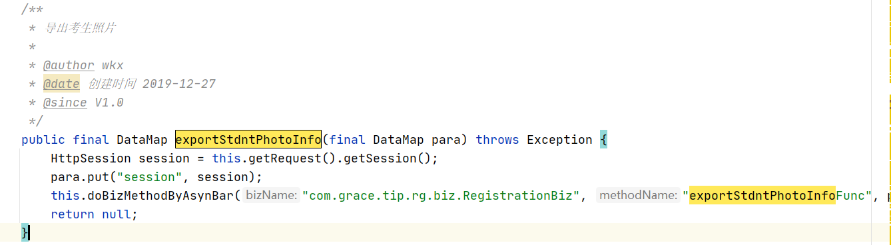
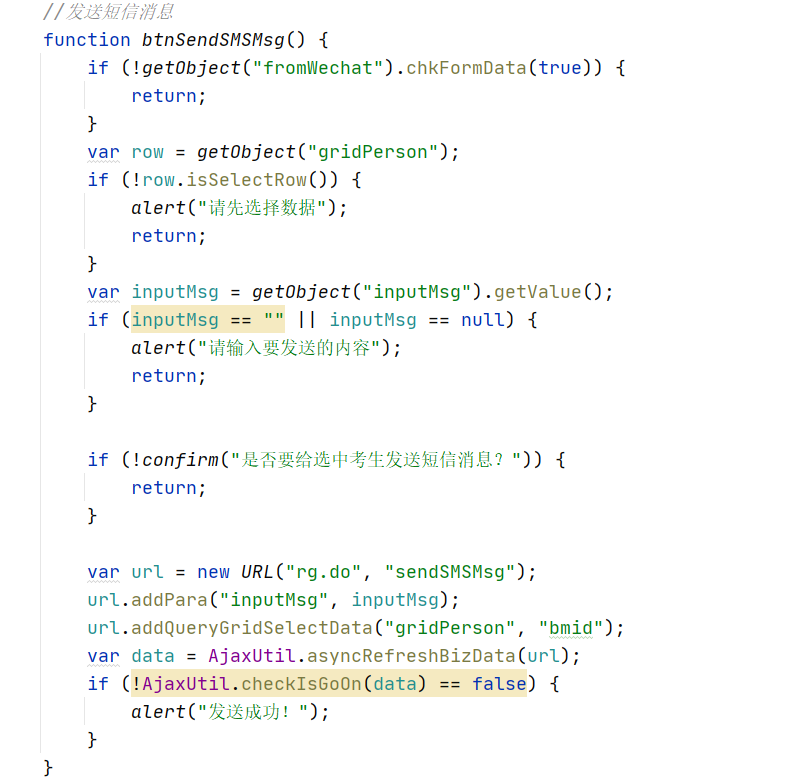
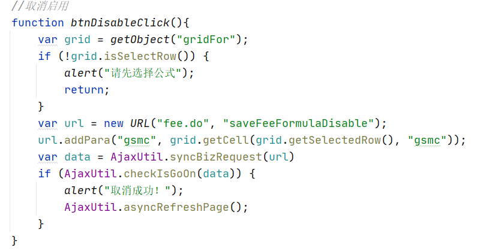
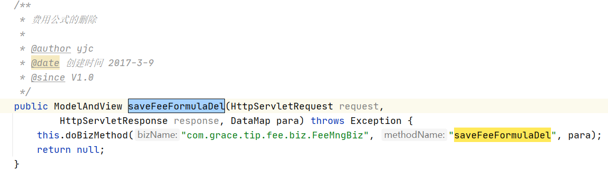
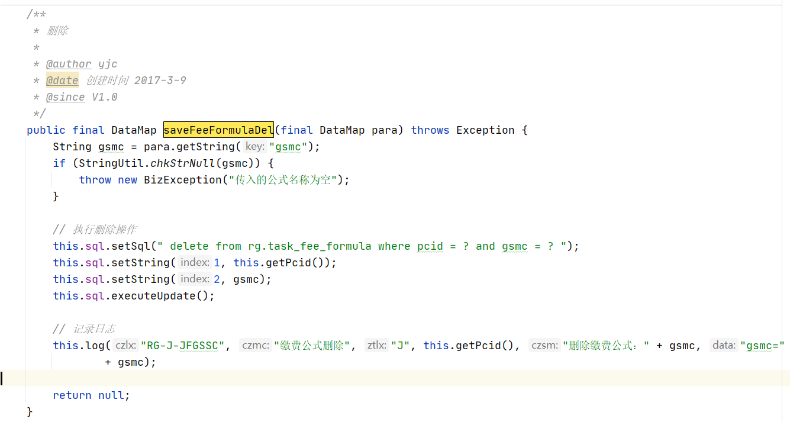

# 新手任务

## 6.15  增  查

- 第三天
- 新电脑装环境
- 完善功能

对考生信息进行增删改查

1、首先是创建考生表

| 字段名称     | 数据类型 | 规则                     |
| ------------ | -------- | ------------------------ |
| 人员ID       | 字符串   | 使用序列，主键           |
| 姓名         | 字符串   |                          |
| 姓名拼音     | 字符串   | 拼音简写                 |
| 性别         | 字符串   | 使用字典：XB             |
| 有效证件类型 | 字符串   | 使用字典：YXZJLX         |
| 有效证件号码 | 字符串   | 增加索引                 |
| 年龄         | 整型数字 | 只能输入整型数字         |
| 联系电话     | 数字     |                          |
| 手机号码     | 数字     | 符合手机号码验证规则     |
| 家庭住址     | 字符串   |                          |
| 补助金额     | 浮点型   | 四位小数                 |
| 入职日期     | 字符串   | 前台展示为yyyy-MM-dd格式 |
| 信息更新时间 | 日期     | 数据库时间               |

```sql
--设置fw用户默认使用的数据库
alter user fw default tablespace ts_fw;
--创建考生表

create table fw.std_info(
	ryid varchar2(20) not null,
	xm varchar2(20) not null,
	xmpy varchar2(10) not null,
	xb varchar2(2) not null,
	yxzjlx varchar2(3) not null,
	yxzjhm varchar2(50),
	nl integer,
	lxdh varchar2(11),
	sjhm varchar2(11),
	jtzz varchar2(200),
	bzje number(38,4),
	rzrq varchar2(20),
	xxgxsj date
) tablespace ts_fw;
--主键
alter table fw.std_info 
add constraint pk_std_info primary key (ryid) 
using index
tablespace tsi_fw;
--添加索引
create index fw.std_info$yxzjhm
on fw.std_info(yxzjhm)
tablespace tsi_fw;
--序列
create sequence fw.sq_ryid
increment by 1
start with 10000000000
minvalue 10000000000
maxvalue 99999999999
cycle
nocache;
序列的使用
语法：
序列名.[currval/nextval]
currval：表示当前值，新序列若没使用过nextval不能直接使用当前值，会报错；
nextval：表示序列的下一个值
 
例：查询序列的值
select seq_name.nextval from dual; 
--序列seq_name的下一个值
例：SQL语句中使用序列
insert into 表名 value（seq_name.currval）

comment on table fw.std_info is '考生表'; 
comment on column fw.std_info.ryid is '人员ID';
comment on column fw.std_info.xm is '姓名';
comment on column fw.std_info.xmpy is '姓名拼音';
comment on column fw.std_info.xb is '性别';
comment on column fw.std_info.yxzjlx is '有效证件类型';
comment on column fw.std_info.yxzjhm is '有效证件号码';
comment on column fw.std_info.nl is '年龄';
comment on column fw.std_info.lxdh is '联系电话';
comment on column fw.std_info.sjhm is '手机号码';

comment on column fw.std_info.bzje is '补助金额';
comment on column fw.std_info.rzrq is '入职日期';
comment on column fw.std_info.xxgxsj is '信息更新时间';

```

手机号码验证无需考虑，直接使用以下代码即可。

```jsp
<ef:textinput name="sjhm" label="手机号码" validType="mobile" />
```

oracle使用序列

https://jingyan.baidu.com/article/4f7d57127394ba5a201927a3.html


业务还挺麻烦，动态功能列表，需要先加一个功能。

```sql
INSERT INTO fw.func ("DBID", "GNID", "GNMC", "FGN", "GNSJ", "GNLX", "SXH", "GNTB", "BZ", "YWLB") 
VALUES ('000','sys0103','考生管理','sys01','url:urm.do?method=fwdStdUserMng','C','1','','','');
commit;

--子功能
INSERT INTO fw.func ("DBID", "GNID", "GNMC", "FGN", "GNSJ", "GNLX", "SXH", "GNTB", "BZ", "YWLB") 
VALUES ('000','sys010301','新增考生','sys0103','','D','0','','','');
commit;

INSERT INTO fw.func ("DBID", "GNID", "GNMC", "FGN", "GNSJ", "GNLX", "SXH", "GNTB", "BZ", "YWLB") 
VALUES ('000','sys010302','考生信息修改','sys0103','','D','0','','','');
commit;
INSERT INTO fw.func ("DBID", "GNID", "GNMC", "FGN", "GNSJ", "GNLX", "SXH", "GNTB", "BZ", "YWLB") 
VALUES ('000','sys010303','考生信息删除','sys0103','','D','0','','','');
commit;
```

用户添加

1. 先在功能表中加入功能页面
2. 复制原来的功能页面
3. 更改添加页面
4. 提交页面

主要代码如下：

```java
public class StdUserMngBiz extends Biz {
    /**
     * 进入考生新增
     *  暂时没用
     * @author yjc
     * @date 创建时间 2015-8-7
     * @since V1.0
     */
    public final DataMap fwdStdUserAdd(final DataMap para) throws Exception {
        DataMap dm = new DataMap();
        return dm;
    }
    /**
     * 保存用户新增。
     *
     * @author yjc
     * @date 创建时间 2015-8-7
     * @since V1.0
     */
    public final DataMap saveStdUserAdd(final DataMap para) throws Exception {
        String xm = para.getString("xm");// 考生姓名
        String xb = para.getString("xb");// 考生性别
        String yxzjlx = para.getString("yxzjlx");// 有效证件类型
        String yxzjhm = para.getString("yxzjhm");// 有效证件号码
        Integer nl = Integer.valueOf(para.getString("nl"));// 年龄
        String lxdh = para.getString("lxdh");// 联系电话
        String sjhm = para.getString("sjhm");// 手机号码
        Float bzje = Float.valueOf(para.getString("bzje"));// 补助金额
        String rzrq = para.getString("rzrq");// 入职日期
        String jtzz = para.getString("jtzz");// 入职日期
        SimpleDateFormat formatter= new SimpleDateFormat("yyyy-MM-dd 'at' HH:mm:ss z");
        Date date = new Date(System.currentTimeMillis());
        String xxgxsj = formatter.format(date);//信息更新时间
        if (StringUtil.chkStrNull(xm)) {
            throw new BizException("考生姓名为空");
        }

        if (StringUtil.chkStrNull(xb)) {
            throw new BizException("性别为空");
        }
        if (StringUtil.chkStrNull(yxzjhm)) {
            throw new BizException("证件号码为空");
        }
        String xmpy = StringUtil.getPy(xm);
        if (StringUtil.chkStrNull(xmpy)) {
            throw new BizException("姓名拼音为空");
        }
        // 检查用户证件号是否已经存在了
        this.sql.setSql(" select yxzjhm from fw.std_info where yxzjhm = ? ");
        this.sql.setString(1, yxzjhm);
        DataSet dsTemp = this.sql.executeQuery();
        if (dsTemp.size() > 0) {
            throw new BizException("该考生已经存在无法再次新增");
        }

        String ryid = SeqUtil.getId("fw.sq_ryid");// 考生ID  使用序列
        StringBuffer sqlBF = new StringBuffer();
        sqlBF.append(" insert into fw.std_info ");
        sqlBF.append("   (ryid, xm, xmpy, xb, yxzjlx, ");
        sqlBF.append("    yxzjhm, nl, lxdh, sjhm, jtzz, ");
        sqlBF.append("    bzje, rzrq, xxgxsj)");
        sqlBF.append(" values ");
        sqlBF.append("   (?, ?, ?, ?, ?, ");
        sqlBF.append("    ?, ?, ?, ?, ?, ");
        sqlBF.append("    ?,?, ?) ");

        this.sql.setSql(sqlBF.toString());
        this.sql.setString(1, ryid);
        this.sql.setString(2, xm);
        this.sql.setString(3, xmpy);
        this.sql.setString(4, xb);
        this.sql.setString(5, yxzjlx);

        this.sql.setString(6, yxzjhm);
        this.sql.setInt(7, nl);
        this.sql.setString(8, lxdh);
        this.sql.setString(9, sjhm);
        this.sql.setString(10, jtzz);

        this.sql.setDouble(11, bzje);
        this.sql.setString(12, rzrq);
        this.sql.setDate(13, date);
        this.sql.executeUpdate();


        // 记录日志
//        this.log("SYS-A-YHXZ", "考生新增", "A", yhid, "新增用户ID:" + yhid + ",用户编号:"
//                + yhbh + ",用户名称:" + yhmc, "yhid=" + yhid + ",yhbh=" + yhbh
//                + ",yhmc=" + yhmc + ",yhlx:" + yhlx + ",sjqxpz:" + sjqxpz);

        DataMap rdm = new DataMap();
        rdm.put("ryid", ryid);
        rdm.put("xmpy", xmpy);
        rdm.put("yxzjhm", yxzjhm);
        return rdm;
    }
```

新添加的jsp页面为：pageStdUserMng.jsp   winStdUserAdd.jsp


查询用户

```java
//搜索
function xmSearch() {
    var url = new URL("urm.do", "fwdChooseStdUser");
    url.addPara("xm", getObject("xm").getValue());
    openWindow("选择用户", url, "normal", chooseOneUserAction);
}
```


```java
 /**
     * 选择考生
     *
     * @author yjc
     * @date 创建时间 2015-8-7
     * @since V1.0
     */
    public final DataMap fwdChooseStdUser(final DataMap para) throws Exception {
        String xm = para.getString("xm");
        StringBuffer sqlBF = new StringBuffer();
        if (StringUtil.chkStrNull(xm)) {
            xm = "%";
        } else {
            xm = "%" + xm + "%";
        }
        sqlBF.setLength(0);
        sqlBF.append(" select ryid, xm, xmpy, xb, yxzjlx, ");
        sqlBF.append("        yxzjhm, nl, lxdh, sjhm, jtzz, ");
        sqlBF.append("        bzje, rzrq, xxgxsj ");
        sqlBF.append("   from fw.std_info a ");
        sqlBF.append("  where a.xm like ? ");
        sqlBF.append("     or a.xmpy like ? ");
        sqlBF.append("     or a.yxzjhm like ? ");

        this.sql.setSql(sqlBF.toString());
        this.sql.setString(1, xm);
        this.sql.setString(2, xm);
        this.sql.setString(3, xm);
        DataSet dsUser = this.sql.executeQuery();

        dsUser.sort("xm");// 增加默认排序


        DataMap dm = new DataMap();
        //将信息显示到查询页面
        dm.put("dsuser", dsUser);
        return dm;
    }
```


- 复制一个页面 winChooseStdUser.jsp


完成了  增 查  剩余删和改

## 6.16

- 找到对应的页面，复制出来一个进行修改
- 由于功能之间关联太多，适当删去一些功能。

### 增删改查

全部完成，没什么可记录的难点，只不过是为了熟悉框架。

### 文件下载

出现问题，一下午没找到解决办法


## 6.17

回学校

## 6.18

## 6.19

双休，双休是真的舒服！

## 6.20

继续弄文件下载与上传

改了三天的导出文件，原来是日期格式问题！！！！（rzrq有问题，改成DateUtil能够识别的就可以了；）

### 导出文件

步骤：

1、首先根据查询，将数据放入内存

2、exportGridData.jsp   导出数据窗口。

3、具体怎么导出：QueryGridObj.js

4、TaglibController  将数据传递到导出窗口

```java
/**
	 * 导出数据的窗口
	 * 
	 * @author yjc
	 * @date 创建时间 2015-7-12
	 * @since V1.0
	 */
public ModelAndView fwdQueryGridExportData(HttpServletRequest request,
                                           HttpServletResponse response, DataMap para) throws Exception {
    System.out.println(para.toString());
    return new ModelAndView("frame/jsp/taglib/exportGridData.jsp");
}

```

- 接下来要对功能进行完善，将日期型改成yyyy-MM-dd hh:mm:ss
- 将数字类型保留两位小数


找到了修改日期格式的地方，暂时不做修改，因为有两种日期格式，一种是yyyyMMdd 一种是yyyyMMddhhmmss，第二种符合要求，只不过第一种不符合。

- 数字保留两位有效小数位（四舍五入）


只需要在sql语句中使用round函数即可，需要注意的是，round函数对小数位为0无效；


### 考生信息导入


将导入的excel表格中的数据，导入到数据库

功能都已经给出，只是没有引用罢了，等出差回来，一天弄完

## 6.21

出差，在车上；


## 6.28

出差完毕

准备新手任务的最后一个任务，文件上传与解析

首先增加一个文件上传的页面

```sql
INSERT INTO fw.func ("DBID", "GNID", "GNMC", "FGN", "GNSJ", "GNLX", "SXH", "GNTB", "BZ", "YWLB") 
VALUES ('000','sys0105','考生文件管理','sys01','url:debug.do?method=fwdFileModelMng1','C','1','','','');
commit;

```


复制模板添加页面的jsp；

然后在biz\FileModelMngBiz.java中添加一个方法saveFileModelAdd1


```java
//将文件添加进入数据库
//首先读取excel中的数据
ExcelUtil excelUtil = new ExcelUtil();
DataSet tableInfo = new DataSet();
DataSet set = excelUtil.parseExcel2DataSet(file, tableInfo);
//将每一行的数据都读出来
for (int i = 0; i < set.size(); i++) {
    DataMap paras = new DataMap();
    paras.add("xm",set.getString(i,"考生姓名"));
    paras.add("xb",set.getString(i,"性别"));
    paras.add("yxzjlx",set.getString(i,"证件类型"));
    paras.add("yxzjhm",set.getString(i,"证件号码"));
    paras.add("nl",String.valueOf(set.getInt(i,"年龄")));
    paras.add("lxdh",String.valueOf(set.getInt(i,"联系电话")));
    paras.add("sjhm",String.valueOf(set.getInt(i,"手机号码")));
    paras.add("jtzz",set.getString(i,"家庭住址"));
    paras.add("bzje",String.valueOf(set.getDouble(i,"补助金额")));
    //			paras.add("rzrq",String.valueOf(set.getDate(i,"入职日期","yyyy-MM-dd")));
    paras.add("rzrq",set.getDateToString(i,"入职日期","yyyy-MM-dd"));
    StdUserMngBiz stdUserMngBiz = new StdUserMngBiz();
    stdUserMngBiz.saveStdUserAdd(paras);

}
```


导入文件成功，按照excelUtil中给的parseExcel2DataSet方法，来读取excel中的数据，然后调用新增用户的方法，来将表格中的数据添加到数据库中。


新手任务，全部完成！！！

几乎都是现成的功能，只需要找到调用即可。


晚上回去看虚拟机，以及四大名著，还有分布式；


# tip

[熟悉项目 - 知乎 (zhihu.com)](https://zhuanlan.zhihu.com/p/532801516)

要求：

> 可以参考使用说明做业务
> 然后看代码位置，看表结构，数据流向

步骤：

1、了解项目的业务特性：项目是用来做什么的？   考生报名

2、了解项目的角色和用户：项目是给谁用的？  给考生、还有管理人员

3、了解项目的组织架构图：项目包括哪些功能模块？ 

4、了解项目的技术栈：项目是用哪些技术实现的？

## 6.28

新任务：tip

```
http://localhost:8015/tip/loginPage.jsp
管理端
http://localhost:8015/tip/orgnLogin.jsp
单位端
http://localhost:8015/tip/stdLogin.jsp
考生端
```

首先改一下端口号


熟悉流程：

### 网上报名系统

#### 1.1、网上报名数据管理

##### 1.1.1、测试用户管理

###### 查询

****

首先点击左侧菜单栏的测试用户管理，跳转至pageSpeclistMng.jsp页面；

点击页面的查询按钮：流程如下

```jsp
//根据条件查询
function btnSpeclistQuery() {
	var url = new URL("rg.do", "querySpeclist");
	url.addForm("formQuery");
	AjaxUtil.syncRefreshBizData(url, "gridSpeclist:dsspeclist");
	getObject("yxzjhm").focus();
}
```

携带表单数据跳转到querySpeclist方法


再跳转到RegistrationBiz的querySpeclist方法；

在biz中书写sql语句

sql语句的书写使用StringBuffer，因为可以更改字符串长度。而且线程安全。

###### 增加用户

还是在pageSpeclistMng.jsp页面，点击新增按钮，跳转至


RegistrationController的fwdSpeclistAdd方法；


点击保存，会跳转到rg.do的保存新增用户的方法。


然后跳转到biz的saveSpeclistAdd保存新增用户方法；（编写sql语句，以及判断用户是否存在于数据库中）


###### 修改用户


###### 删除用户


需要多次确定，以及填写删除原因；

熟悉了一下业务，框架太老！

## 6.29

### 1.1.2、考生批量打印

找到批量打印的页面，pageStdntBulkPrint.jsp

点击查询触发事件


使用ajax异步刷新页面进行查询；

一样的流程


携带参数转到biz的queryStdnt4BatchPrint方法


查询0-5000条的数据

查询完成之后，可以批量选择数据；

选择之后，点击打印按钮；


选择数据之后，获取数据id，然后js判断是否为null

为null则提示“请选择数据”；

不为空则跳转到控制层的doPrintStdnt方法


携带参数跳转到biz的doPrintStdnt方法；

基本上都是公司自己封装的工具，需要看一下源码进行了解一下；


执行biz的方法；

选择多个考生，然后在biz中获取考生的信息（DateSet），然后进行判断是点击的哪一个批量按钮


最后跳转到tip/jsp/rg/winPrintStdnt.jsp页面，


jsp页面动态获取是什么信息例如：报名表、准考证、成绩单、审核表。

### 1.1.3、考生密码重置

没找到在哪，找到了前端页面，一样


将考生信息传递至后端；


传递至biz，查看biz中的逻辑代码；


这个只是回显数据，不是保存。


获取表单信息，如果表单信息中的数据符合要求，再进行下一步操作，否则直接返回。


将参数传递给biz


修改密码很简单，获取人员id与用户id就可以了；

### 1.1.4、考生报考数据导入导出


jsp中的js按钮脚本；

跳转到控制层


从biz的一个方法跳转到另一个方法；


a long，a long   看不下去，直接下一个；

导出考生照片


点击按钮，触发点击事件，跳转至rg.do的exportStdntPhotoInfo方法


然后再跳转至biz中的exportStdntPhotoInfo方法



和上面的导出数据一样，biz中的方法也跳转到另一个方法，应该是为了方便复用；


也是很长，截取一部分

太长。

## 数据流向：

> 大概是：
>
> 1. 首先页面点击功能按钮、
> 2. 跳转到对应的功能页面
> 3. 功能页面会有各种功能按钮以及需要填写或者显示的数据
> 4. 触发点击事件，携带参数或者数据跳转到对应的控制层
> 5. 控制层再将参数传递到biz业务处理层
> 6. 在业务处理层进行sql语句的编写，以及逻辑的判断
> 7. 最后返回不返回数据就看业务需求
> 8. 然后控制层使用modelandview返回前端页面（应该是使用的视图渲染器）

## 查看表结构：

1. 链接数据库

   修改plsql的配置文件

   ```orm
   # tnsnames.ora Network Configuration File: D:\oracle\product\10.2.0\db_1\network\admin\tnsnames.ora
   # Generated by Oracle configuration tools.
   
   ORCL =
     (DESCRIPTION =
       (ADDRESS = (PROTOCOL = TCP)(HOST = DESKTOP-RQ6GUCE)(PORT = 1521))
       (CONNECT_DATA =
         (SERVER = DEDICATED)
         (SERVICE_NAME = orcl)
       )
     )
     
   tip =
     (DESCRIPTION =
       (ADDRESS = (PROTOCOL = TCP)(HOST = 192.168.200.201)(PORT = 1521))
       (CONNECT_DATA =
   	  (SID = tip)
         (SERVICE_NAME = tip)
       )
     )
   
   
   EXTPROC_CONNECTION_DATA =
     (DESCRIPTION =
       (ADDRESS_LIST =
         (ADDRESS = (PROTOCOL = IPC)(KEY = EXTPROC1))
       )
       (CONNECT_DATA =
         (SID = PLSExtProc)
         (PRESENTATION = RO)
       )
     )
   
   
   ```

   修改监听器

   ```
   # listener.ora Network Configuration File: D:\oracle\product\10.2.0\db_1\network\admin\listener.ora
   # Generated by Oracle configuration tools.
   
   SID_LIST_LISTENER =
     (SID_LIST =
       (SID_DESC =
         (SID_NAME = PLSExtProc)
         (ORACLE_HOME = D:\oracle\product\10.2.0\db_1)
         (PROGRAM = extproc)
       )
   	(SID_DESC =
         (SID_NAME = tip)
         (ORACLE_HOME = D:\oracle\product\10.2.0\db_1)
         (GLOBAL_DBNAME = tip)
       )
   	
     )
   
   LISTENER =
     (DESCRIPTION_LIST =
       (DESCRIPTION =
         (ADDRESS = (PROTOCOL = IPC)(KEY = EXTPROC1))
         (ADDRESS = (PROTOCOL = TCP)(HOST = DESKTOP-RQ6GUCE)(PORT = 1521))
   	  
       )
   	(DESCRIPTION =
   	  (ADDRESS = (PROTOCOL = TCP)(HOST = 192.168.200.201)(PORT = 1521))
   	)
     )
   
   ```

2. ```xml
   <property name="connection.url">jdbc:oracle:thin:@192.168.200.201:1521:tip</property>
   <property name="connection.username">system</property>
   <property name="connection.password">oracle_tip</property>
   ```

3. 使用plsql进行登录，角色使用normal就可以

链接数据库参考：https://blog.csdn.net/Nightwish5/article/details/108879343

配合sql语句来分析表结构

## 6.30

没有找到照片重新上传的位置；

下一个功能；

### 1.1.5、考生报考信息管理

文档与现在的程序有出入

/pagePersonManage.jsp页面


点击搜索按钮，触发点击事件；

跳转到控制层的fwdChoosePerson方法；


一样的流程，带着数据进入biz的fwdChoosePerson


去查看一下相关的表结构


点击考生报考信息管理，打开pagePersonManage.jsp页面


基本上的流程其实都差不多；

### 1.1.6、考生报考职位改报

没找到位置

### 1.1.7、给考生发信息


左侧菜单栏，其实就是跳转到控制层的方法，然后再跳转至对应的jsp页面

发送短信消息




表结构


发送消息之后，不会跳转到其他页面或者弹出窗口，而是直接刷新此页面；


发送微信消息


biz跳转至另一个biz


### 1.2、缴费管理

### 1.2.1、费用公式

FeeController=fee.do

找到前端页面的jsp


表结构


#### 新增公式


跳转到tip/jsp/fee/winFeeFormulaAdd.jsp页面；


保存公式新增

#### 修改公式


修改页面

winFeeFormulaModify.jsp

点击保存修改，触发点击事件


#### 启用公式


取消启用




#### 删除






### 1.2.2、商户设置

点击菜单栏商户设置，进行跳转


进入到pageTaskMerchantMng.jsp页面

双击进入详情


商户详细页面调用---》获取商户信息


然后跳转到winMerchantDetlView.jsp


配置商户


#### 商户设置查询

页面查询按钮触发点击事件


 

查询依旧使用的是模糊查询；

查询之后依旧是刷新页面；


#### 上移下移


#### 

使用js实现


保存商户设置


几乎是一样的流程，只不过是sql语句与逻辑代码的不同；

下班！！!

