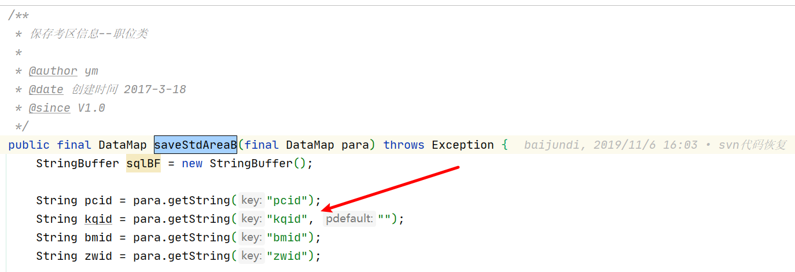

2022年11月

<!--more-->

## 11.1

### 打印座次表

将按钮改为点击出来一列

```jsp
<ef:button value="导出座次表" iconCls="icon-attach" type="menu">
    <ef:menu width="190">
        <ef:menuItem value="5X6顺序型" onclick="btnDownloadZcbClick(1);"></ef:menuItem>
        <ef:menuItem value="5X6蛇型"   onclick="btnDownloadZcbClick(2);"></ef:menuItem>
        <ef:menuItem value="6X5顺序型"   onclick="btnDownloadZcbClick(3);"></ef:menuItem>
        <ef:menuItem value="6X5蛇型"   onclick="btnDownloadZcbClick(4);"></ef:menuItem>
        <ef:menuItem value="5X5顺序型"   onclick="btnDownloadZcbClick(5);"></ef:menuItem>
        <ef:menuItem value="5X5蛇型"   onclick="btnDownloadZcbClick(6);"></ef:menuItem>
    </ef:menu>
</ef:button>

//导出座次表
	function btnDownloadZcbClick(id) {
		if (!getObject("gridSite").isSelectRow()) {
			alert("请先选择考点后进行导出");
			return;
		}
		var url = new URL("exam.do", "genZcbPdfFile");
		url.addQueryGridSelectData("gridSite");
		url.addPara("zcbplfs",id);
		AjaxUtil.asyncBizRequestViaPgBar(url, "正在生成座次表，请稍候", function(data) {
			data = new HashMap(data);
			var uiid = data.get("uiid");
			if (chkObjNull(uiid)) {
				alert("操作已取消");
				return;
			}
			var downUrl = new URL("exam.do", "downloadZcbByPdfFile");
			downUrl.addPara("uiid", data.get("uiid"));
			downloadFile2Form(downUrl);
		});
	}
```

```java
src/com/grace/tip/exam/biz/ArrangeRoom4WrittenBiz.java    
 修改方法
    createOneSiteZcbPdfFile  增加一个参数
//判断参数  
 createOneSiteZcbPdfFile_320
 genZcbPdfFileFunc_320
 genZcbPdfFileFunc
    
    新增方法		getStdIndoIndexByZcbPosIndexPlfs
    
```

现在还不清楚客户化的是否需要改，先改了再说，不需要的话再回退就好了


导出座次表暂时弄完了，没有数据库没办法测试。

下载座次表也没办法弄。


```sql
 --想要实现
 select * from 表名
where (
    (id = 1 and name in ('悟空','唐僧','八戒') or
    (id = 2 and name in ('刘备','张飞','关羽') or
    (id = 3 and name in ('小三','王五','王八') or
    ……
)

```

```java
Map<String,List<String>> map = new HashMap<>();
List<String> nameList = new ArrayList<>();
nameList.add("悟空");
nameList.add("唐僧");
nameList.add("八戒");
map.put("1",nameList);

nameList = new ArrayList<>();
nameList.add("刘备");
nameList.add("张飞");
nameList.add("关羽");
map.put("2",nameList);

```

```sql
SELECT * FROM 表名
WHERE 
<foreach collection="paramsMap" index="key"  item="value" open="(" separator="OR" close=")">
    (id = #{key} AND name in
    <foreach collection = "value" item="name" separator="," open="(" close=")">
        #{name}
    </foreach>
    )
</foreach>

```

## 11.2

导入本地数据库

```
imp  system/root@tip file='C:\Users\nomax\Desktop\tip_201\tip_201_20221031.dmp' full=y
```

导出座次表已经解决，但是打印座次表是需要再改

## 11.3

### 打印座次表

是要维护多个模版嘛？

好像只有这一个办法了。。。。

先将模版弄好再说吧。

修改方法位置

```
src/com/grace/tip/exam/biz/ArrangeRoom4WrittenBiz.java			fwdPrintZcbOprate
```

### 襄阳上传文件

摆烂

数据库中没有襄阳客户化的数据，手动加上

```sql
INSERT INTO FW.LOCAL_DOC
(BZJM, BDHM, BDHSM)
VALUES('tip/jsp/student/stdBkxxTjshAddA.jsp', 'tip/jsp/student/stdBkxxTjshAddA_426.jsp', '襄阳报考信息提交审核');
INSERT INTO FW.LOCAL_CONFIG
(JBJGID, BZJM, BDHM)
VALUES('426', 'tip/jsp/student/stdBkxxTjshAddA.jsp', 'tip/jsp/student/stdBkxxTjshAddA_426.jsp');
```

没有发现议题上说的情况，联系议题作者，询问情况。

## 11.4

干完活了，充电。

图解设计模式。

第一章：迭代器模式

## 11.5-11.6

周末：夏日再现，塞尔达

## 11.7

上午看了一下Adaptor模式，就是将原有的接口进行复用，实现在新环境也能用之前环境的接口。

关闭tip议题

- 26
- 85

明天再去修改，导入职位权限，用户角色哪里

## 11.8

修改导入职位权限


增加用户角色批量导入。

### 将桌贴、座次表、门贴全部改为按照考区划分文件夹

#### 生成门贴

只需要修改生成pdf文件的方法即可。

```
src/com/grace/tip/exam/biz/ArrangeRoom4WrittenBiz.java		createOneSiteMtPdfFile4TypeSub  //科目
src/com/grace/tip/exam/biz/ArrangeRoom4WrittenBiz.java		createOneSiteMtPdfFile4TypeDeg  //专业
```

#### 生成桌贴

```
src/com/grace/tip/exam/biz/ArrangeRoom4WrittenBiz.java      createZtPdfFile
```

#### 导出座次表

```
src/com/grace/tip/exam/biz/ArrangeRoom4WrittenBiz.java      createOneSiteZcbPdfFile
```

### 解决导出超时问题

示例

```java
/**
     * 生成座次表
     *
     * @author wn
     * @date 创建时间 2020-9-30
     * @since V1.0
     */
public final DataMap genZcbPdfFile(final DataMap para) throws Exception {
    HttpSession session = this.getRequest().getSession();
    para.put("session", session);
    //这个调用biz的方法，就是为了不超时
    this.doBizMethodByAsynBar("com.grace.tip.exam.biz.ArrangeRoom4WrittenBiz", "genZcbPdfFileFunc", para);
    return null;
}
```

#### 桌贴增加防止超时

```java
src/com/grace/tip/exam/biz/ArrangeRoom4WrittenBiz.java		exportZtFileFunc

    /**
     * 生成桌贴
     *
     * @author xzb
     * @date 创建时间 2022-11-8
     * @since V1.0
     */
    public final DataMap exportZtFile(final DataMap para) throws Exception {
    HttpSession session = this.getRequest().getSession();
    para.put("session", session);
    this.doBizMethodByAsynBar("com.grace.tip.exam.biz.ArrangeRoom4WrittenBiz", "exportZtFileFunc", para);
    return null;
}

```

#### 门贴增加防止超时

新增

```java
src/com/grace/tip/exam/biz/ArrangeRoom4WrittenBiz.java		genMtPdfFileFunc
```

#### 下载考场安排表增加防止超时

下载考场的有点区别，要先尝试将下载方法分成两个。


## 11.9

新增考场安排表下载方法

```
src/com/grace/tip/exam/ExamController.java		downloadKcapbFile
src/com/grace/tip/exam/ExamController.java		getKcapbFileF
```

```
修改
src/com/grace/tip/exam/ExamController.java      getKcapbFile
```

设计模式第三章，Template Method模式，父类中规定子类实现方法执行逻辑。

## 11.10

修改导入职位权限

设计模式

- Template Method模式
- Factory Method模式
- Singleton模式


## 11.11

设计模式

- Prototype模式

  复制实例

## 11.12-11.13

躺平

这样可不行！！！

又是半个月，真是废物

## 11.14

设计模式

- Builder模式
- Abstract Method模式

## 11.15

设计模式

- Bridge模式

## 11.16

设计模式

- Composite模式
- Strategy模式

## 11.17

开始准备面经，牛客网，掘金。

复习博客内容。

1. stream流操作
2. 序列化与反序列化


自己找议题：

### 管理后台 考生缴费状态显示问题

思路：

1. 判断用户订单数量为一条还是多条
2. 只有一条订单直接取出即可
3. 多条订单的情况下，需要判断订单中是否存在已缴费和已对账的账单
4. 存在则显示已缴费或者已对账
5. 不存在则取经办时间最近的一条订单的状态

feature/xzb-modStdPaymentStatus 

## 11.18

先将议题做了，然后去看设计模式

只修改了一个方法：src/com/grace/tip/rg/biz/RegistrationBiz.java	 fwdTaskStdntInfoPage

设计模式：

- Decorator模式 装饰模式

## 11.19-11.20

又躺平了

## 11.21

复习了以下图解设计模式

准备学习图解MySQL

### 执行一条sql语句需要那些步骤：

1. 首先建立连接，管理链接，验证用户。
2. 查询缓存，如果之前有执行过此条语句，那么就直接拿过来之前缓存的记录即可，mysql8.0删除缓存模块，因为比较鸡肋，缓存数据所涉及的表如果有更新，那么就会清空缓存。
3. 解析sql，通过解析器对sql语句进行词法分析、语法分析，以及构建语法树，方便后续模块的使用。
4. 执行sql，执行阶段分为预处理阶段，优化阶段，执行阶段，
   - 预处理阶段判断表或者字段是否存在，将select *  的* 解析为对应的列。
   - 优化阶段，基于查询成本的考虑，选择使用查询成本最低的执行计划
   - 执行阶段，根据执行计划执行sql，从存储引擎读取数据，返回给客户端。

### MyISAM与InnoDB的区别？

1. 参照完整性，InnoDB表中外键关联的另一张表发生变化，这个表也会收牵连
2. 事务，MyISAM不支持事务
3. 表锁和行锁，MyISAM是表锁，InnoDB是行锁。

### B+Tree树：

- 多叉树
- 只在叶子节点存储数据，非叶子节点只存放索引。

主键索引和二级索引默认使用B+tree


### 索引的分类：

- 按照数据结构分类
  - B+Tree索引
  - Hush索引
  - Full -text索引
- 按照物理存储分类
  - 主键索引（聚簇索引）
  - 二级索引（非聚簇索引）
- 按照字段特性分类
  - 主键索引
  - 唯一索引
  - 普通索引
  - 前缀索引
- 按照字段个数分类
  - 单列索引
  - 联合索引

## 11.22

### 左耳


### MyBatis-Plus

## 11.23

左耳

mybatis


## 11.24

他妈的，疫情这么严重还不居家。

做议题，做完歇着。

```sql
--插入单职位隐藏职位信息参数
INSERT INTO RG.TASK_PARA_DOC
(CSBH, CSMC, CSSM, CSSJLX, CSSJYM, CSSJCODE, XH, KSLX)
VALUES('task_dzwsfyczwxx', '单职位是否隐藏职位信息', '0-否，1-是，默认为0', 'code', NULL, 'SHF', 56, NULL);

--插入单考区隐藏考区信息参数
INSERT INTO RG.TASK_PARA_DOC
(CSBH, CSMC, CSSM, CSSJLX, CSSJYM, CSSJCODE, XH, KSLX)
VALUES('task_dkqsfyckqxx', '单考区是否隐藏考区信息', '0-否，1-是，默认为0', 'code', NULL, 'SHF', 57, NULL);
```

参数控制

 思路：

1. 先增加参数
2. 去职位类填写报考信息页面，先查询报考单位和职位信息是否唯一，唯一则隐藏，并且展示是否上传材料
3. 


考区和职位信息都在这三个中，只要对这三个信息进行判断即可。

20022112410000000471

查询当前批次下的职位

若只有一个，则直接隐藏

20022032310000000412

```java
if ("1".equals(dzwsfyczwxx)) {
    if (dsPos.size() == 1) {//只有一个单位
        DataMap dmDw = dsPos.getRow(0);
        DataSet dscode = dmDw.getDataSet("dscode");
        if (dscode.size() == 1) {//单位下只有一个职位
            yczwxx = "1";
        }
    }
}
```

接下来要开始判断该批次下的职位是否只有一个，只有一个的话，将参数置为1，控制

## 11.25

抓紧时间完成这个议题再说。


找到考生报考信息保存方法

doTxbkxxB

保存考生科目信息




## 11.26

周六干活ctm的。

修改方法

```
src/com/grace/tip/student/rg/biz/StdRgBiz.java     fwdTxbkxxAddB
src/com/grace/tip/student/rg/biz/StdRgBiz.java	   fwdTxbkxxAddB_209

jsp

tip/tip/jsp/student/stdTxbkxxAddB.jsp	测试正常
tip/tip/jsp/student/stdTxbkxxAddB_200.jsp    测试正常
tip/tip/jsp/student/stdTxbkxxAddB_100.jsp    测试正常
tip/tip/jsp/student/stdTxbkxxAddB_620.jsp   测试正常
tip/tip/jsp/student/stdTxbkxxAddB_640.jsp
tip/tip/jsp/student/stdTxbkxxAddB_6401.jsp


微信端
tip/tip/jsp/wechat/wechatTxbkxxAddB.jsp
tip/tip/jsp/wechat/wechatTxbkxxAddB_200.jsp   测试正常
tip/tip/jsp/wechat/wechatTxbkxxAddB_620.jsp    手机不能登录
tip/tip/jsp/wechat/wechatTxbkxxAddB_640.jsp		
```


```jsp
<c:if test="${dzwsfyczwxx == '1' && yczwxx == '1'}">
    <input type="hidden" id="ryid" name="ryid" value="${ryid }" />
    <input type="hidden" name="zwid" id="zwid" value="${position.zwid}" />
    <input type="hidden" name="dwtxsm" id="dwtxsm" value="${position.zczxdh!='null'?position.zczxdh:'无咨询电话'}" />
    <input type="hidden" name="zwsm" id="zwsm" value="${position.zwsm!='null'?position.zwsm:'职位说明'}}" />
    <input type="hidden" name="clsl" id="clsl" />
    <c:if test="${sfsccl == '1'}">
        <fieldset class="layui-elem-field" id="filefield"
                  style="padding-bottom:20px;">
            <legend>材料上传</legend>
            <div class="col-md-12">
                <div class="col-md-8">
                    <p style="font-size:12px;color:red;">
                        注：1.材料需要上传 jpg，png，bmp，jpeg，gif，tif 格式的文件。 <br />
                        &nbsp;&nbsp;&nbsp;&nbsp;&nbsp;&nbsp;&nbsp;2.点击缩略图即可对图片进行预览，删除等操作。<br />
                    </p>
                </div>
            </div>
            <div class="col-md-9" id="busmeterial"></div>
        </fieldset>
    </c:if>
</c:if>


<c:if test="${dkqsfyckqxx == '1' && yckqxx == '1'}">
    <input type="hidden" id="kqid" name="kqid" value="${singlearea.kqid }" />
</c:if>


//如果隐藏了职位信息，那么直接将需要上传的文件展示出来。
<c:if test="${dzwsfyczwxx=='1' && yczwxx=='1'}">
   positionMaterials("${position.zwid }");
</c:if>
```

```java
//获取系统参数，单职位或者单考区是否隐藏信息
String dzwsfyczwxx = TipUtil.getPara(pcid, "task_dzwsfyczwxx", "0");
//满足条件则将参数置为1
String yczwxx = "0";
if ("1".equals(dzwsfyczwxx)) {//是否开启参数
    sqlBF.setLength(0);
    sqlBF.append(" select * from rg.task_position where pcid = ? ");
    this.sql.setSql(sqlBF.toString());
    this.sql.setString(1, pcid);
    DataSet dsZwsize = this.sql.executeQuery();

    if (dsZwsize.size() == 1) {//当前批次下只有一个职位
        //将参数置为1，方便前端进行展示
        yczwxx = "1";
        rdm.put("position",dsZwsize.getRow(0));
    }
}


//控制单考区是否隐藏的参数
String dkqsfyckqxx = TipUtil.getPara(pcid, "task_dkqsfyckqxx", "0");
String yckqxx = "0";
if ("1".equals(dkqsfyckqxx) && dsArea.size() == 1) {
    //单考区并且参数开启情况下
    yckqxx = "1";
    //玄学，必须得交sss，其他命名传不过去值
    rdm.put("singlearea", dsArea.getRow(0));
}


rdm.put("dzwsfyczwxx", dzwsfyczwxx);
rdm.put("dkqsfyckqxx", dkqsfyckqxx);
rdm.put("yczwxx", yczwxx);
rdm.put("yckqxx", yckqxx);
```


查询客户化发现也没用，不管了，改了再说吧

全部修改完成，就剩一个傻逼100

## 11.27

周末 休息一天，和阿狗玩了双人成行

## 11.28

dbid为100的jsp进行调整

调整完之后进行测试

640  pcid

64019021110000000240

64019021110000000038

### 职位改报问题

```
feature/xzb-modPositionReport
```

## 11.29

职位改报

首先先去判断考生是否报名成功，考生报名表是rg.task_stdnt_flow其中有一个字段kslczt，为1则报名成功。

先查询考生功能

bi.func_config表


新增一个系统参数

```sql
INSERT INTO RG.TASK_PARA_DOC
(CSBH, CSMC, CSSM, CSSJLX, CSSJYM, CSSJCODE, XH, KSLX)
VALUES('task_zwgbsfxzzgsctg', '职位改报是否限制资格审查通过', '0-否，1-是，默认为0', 'code', NULL, 'SHF', 58, NULL);
```


修改方法

```
src/com/grace/tip/rg/RgUtil.java		getTaskFlow4Stdnt
src/com/grace/tip/student/rg/biz/StdRgBiz.java		fwdPositionModify
新增
src/com/grace/tip/rg/RgUtil.java     judgePositionExists
```


这要怎么进行判断呢。。。。

修改   从判断是否报名成功变为是否

## 11.30

放弃修改js

还是老老实实修改java代码吧


思路：

首先对dsPos进行迭代器，然后就开始对dscode的迭代


写了一个递归方法

```java
/**
	 * 判断单位是否有职位
	 *
	 * @author xzb
	 * @throws Exception
	 * @date 创建时间 2022-11-30
	 * @since V1.0
	 */
	public static DataSet judgePositionExists(DataSet pds) throws Exception {
		DataSet dataSets = new DataSet();
		if (pds.size() == 0) {
			return dataSets;
		}
		for (int i = 0; i < pds.size(); i++) {
			DataMap row = pds.getRow(i);
			//下级单位
			DataSet dscodeTemp = row.getDataSet("dscode");
			//职位
			DataSet dsposition = row.getDataSet("dsposition");
			//第一次判断，然后使用递归向下走 ，一般有下级单位都会满足条件
			if (dscodeTemp.size() != 0 || dsposition.size() != 0) {
				if (dscodeTemp.size() > 0) {
					DataSet dscode = judgePositionExists(dscodeTemp);
					//递归的dscode，返回的下级单位不满足条件则会被置为空   所以下面要再判断一次
					row.put("dscode", dscode);
				}
				//因为递归的话，会改变row中dscode的大小，就是如果下级单位不满足会被清空，所以要再判断一下大小
				if(row.getDataSet("dscode").size()!=0||row.getDataSet("dsposition").size()!=0){
					dataSets.add(row);
				}
			}
		}
		return dataSets;
	}
```

用来重新构造数据

1. 首先取出数据判断是否有下级单位或者职位，没有的话就返回为空
2. 满足条件就将下级单位进行递归，返回一个处理过后的下级单位
3. 然后将处理过后的下级单位替换之前的单位
4. 替换之后肯定会发生改变，需要再进行判断一下是否有下级单位或者职位，有就将数据返回，若变成空则不返回，相当于清空。