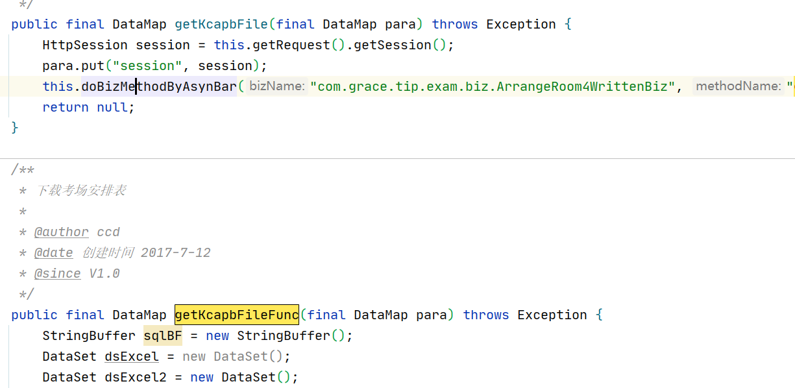
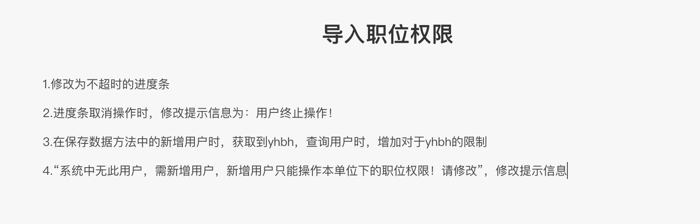

2022年12月

<!--more-->

## 12.1

有点迷茫啊，要怎么准备社招啊，现在开始看面经嘛？

还是老规矩，每天上班拿出来半小时到一小时看算法，时间充裕的话再加半个小时面经，并且记录下来

剩余的时间准备新技术（晚上），新技术迅速推进，了解即可，然后去github看开源项目。

投简历前一个月看是背八股。

## 12.2

今天看了一下牛客，发现小厂现在面试都是微服务和消息队列

。。。。

任务很重啊   任重而道远。

先去看新技术把

将我写的方法删了

```java

/**
	 * 判断单位是否有职位
	 *
	 * @author xzb
	 * @throws Exception
	 * @date 创建时间 2022-11-30
	 * @since V1.0
	 */
public static DataSet judgePositionExists(DataSet pds) throws Exception {
    DataSet dataSets = new DataSet();
    if (pds.size() == 0) {
        return dataSets;
    }
    for (int i = 0; i < pds.size(); i++) {
        DataMap row = pds.getRow(i);
        //下级单位
        DataSet dscodeTemp = row.getDataSet("dscode");
        //职位
        DataSet dsposition = row.getDataSet("dsposition");
        //第一次判断，然后使用递归向下走 ，一般有下级单位都会满足条件
        if (dscodeTemp.size() != 0 || dsposition.size() != 0) {
            if (dscodeTemp.size() > 0) {
                DataSet dscode = judgePositionExists(dscodeTemp);
                //递归的dscode，返回的下级单位不满足条件则会被置为空   所以下面要再判断一次
                row.put("dscode", dscode);
            }
            //因为递归的话，会改变row中dscode的大小，就是如果下级单位不满足会被清空，所以要再判断一下大小
            if(row.getDataSet("dscode").size()!=0||row.getDataSet("dsposition").size()!=0){
                dataSets.add(row);
            }
        }
    }
    return dataSets;
}
```

## 12.3

  修改之前议题，去看一下修改的什么内容。

```
this.createPath(basePath + File.separator + "pdf" + File.separator +kqmc);// pdf文件存放路径

FileOutputStream os = new FileOutputStream(new File(basePath
                + File.separator + "pdf" + File.separator + kqmc + File.separator + pdfFileName));
```


修改为ajax

```java
var files={
    url : "stdrg.do?method=doAreaNotice&pcid=${pcid!='null'?pcid:''}&kqid="+kqid+"",
    type : "post",  
    enctype: "multipart/form-data",
    success : function(data){
        if (AjaxUtil.checkException(data)) {
            AjaxUtil.showException(data);
            return;
        }
        var map = new HashMap(data);
        var iskqgg = map.get("iskqgg");

        if (iskqgg == "1") {
            layer.open({
                type : 2,
                title : '信息公告',
                shadeClose : false,
                shade : 0.6,
                area : [ '80%', '80%' ],
                closeBtn : 0,
                content : "stdrg.do?method=fwdAreaNotice&pcid=${pcid!='null'?pcid:''}&kqid="+kqid+"&btn=1",
                end : function(){
                    var cz = $("#cz").val();
                    if(cz == '2'){
                        document.getElementById('cz').value='1';
                        return false;
                    }

                    submitLoading = layer.msg("您的报考信息正在提交中，请稍候...", {
                        icon: 16,
                        shade: [0.5, "#f5f5f5"],
                        scrollbar: false,
                        time: 100000
                    });
                    var files={
                        url : "stdrg.do?method=doTxbkxx&pcid=${pcid!='null'?pcid:''}&bmid=${bmid!='null'?bmid:''}",
                        type : "post",  
                        enctype: "multipart/form-data",
                        success : function(data){  
                            layer.close(submitLoading);
                            if (AjaxUtil.checkException(data)) {
                                AjaxUtil.showException(data);
                                return;
                            }
                            var map = new HashMap(data);
                            alert(map.get("msg"));
                            location.href = "stdrg.do?method=fwdFlowPage&pcid=${pcid!='null'?pcid:''}&bmid=${bmid!='null'?bmid:''}";
                        },
                        error : function(){
                            alert("保存失败，请重试！");
                            layer.close(submitLoading);
                            return false;
                        } 
                    };
                    $("#formTxbkxx").ajaxForm(files); 
                    $("#formTxbkxx").submit();
                    return false;
                }
            });
        } else {
            submitLoading = layer.msg("您的报考信息正在提交中，请稍候...", {
                icon: 16,
                shade: [0.5, "#f5f5f5"],
                scrollbar: false,
                time: 100000
            });

            var files={  
                url : "stdrg.do?method=doTxbkxx&pcid=${pcid!='null'?pcid:''}&bmid=${bmid!='null'?bmid:''}",
                type : "post",  
                enctype: "multipart/form-data",
                success : function(data){  
                    layer.close(submitLoading);
                    if (AjaxUtil.checkException(data)) {
                        AjaxUtil.showException(data);
                        return;
                    }
                    var map = new HashMap(data);
                    alert(map.get("msg"));
                    location.href = "stdrg.do?method=fwdFlowPage&pcid=${pcid!='null'?pcid:''}&bmid=${bmid!='null'?bmid:''}";
                },
                error : function(){
                    alert("保存失败，请重试！");
                    layer.close(submitLoading);
                    return false;
                } 
            };
            $("#formTxbkxx").ajaxForm(files); 
            $("#formTxbkxx").submit();
            return false;
        }
    },
    error : function(){
        return false;
    } 
};
$("#formTxbkxx").ajaxForm(files); 
$("#formTxbkxx").submit();
```

```java
var pcid = $("#pcid").val();
var bmid = $("#bmid").val();
$.post({
    url : "stdrg.do?method=doAreaNotice",
    async: false,
    data:{
        'pcid': pcid,
        'kqid': kqid
    },
    dataType: "text",
    success : function(data){
        if (AjaxUtil.checkException(data)) {
            AjaxUtil.showException(data);
            return;
        }
        var map = new HashMap(data);
        var iskqgg = map.get("iskqgg");
        if (iskqgg == "1") {
            layer.open({
                type : 2,
                title : '信息公告',
                shadeClose : false,
                shade : 0.6,
                area : [ '80%', '80%' ],
                closeBtn : 0,
                content : "stdrg.do?method=fwdAreaNotice&pcid=${pcid!='null'?pcid:''}&kqid="+kqid+"&btn=1",
                end : function(){
                    var cz = $("#cz").val();
                    if(cz == '2'){
                        document.getElementById('cz').value='1';
                        return false;
                    }

                    submitLoading = layer.msg("您的报考信息正在提交中，请稍候...", {
                        icon: 16,
                        shade: [0.5, "#f5f5f5"],
                        scrollbar: false,
                        time: 100000
                    });
                    $.post({
                        url : "stdrg.do?method=doTxbkxx",
                        async: true,
                        data:{
                            'pcid': pcid,
                            'bmid': bmid
                        },
                        dataType: 'text',
                        success : function(data){
                            layer.close(submitLoading);
                            if (AjaxUtil.checkException(data)) {
                                AjaxUtil.showException(data);
                                return;
                            }
                            var map = new HashMap(data);
                            alert(map.get("msg"));
                            location.href = "stdrg.do?method=fwdFlowPage&pcid=${pcid!='null'?pcid:''}&bmid=${bmid!='null'?bmid:''}";
                        },
                        error : function(){
                            alert("保存失败，请重试！");
                            layer.close(submitLoading);
                            return false;
                        }
                    });
                    $("#formTxbkxx").submit();
                    return false;
                }
            });
        } else {
            submitLoading = layer.msg("您的报考信息正在提交中，请稍候...", {
                icon: 16,
                shade: [0.5, "#f5f5f5"],
                scrollbar: false,
                time: 100000
            });
            $.post({
                url : "stdrg.do?method=doTxbkxx",
                async: false,
                data: $("#formTxbkxx").serialize(),
                dataType: 'text',
                success : function(data){
                    layer.close(submitLoading);
                    if (AjaxUtil.checkException(data)) {
                        AjaxUtil.showException(data);
                        return;
                    }
                    var map = new HashMap(data);
                    alert(map.get("msg"));
                    location.href = "stdrg.do?method=fwdFlowPage&pcid=${pcid!='null'?pcid:''}&bmid=${bmid!='null'?bmid:''}";
                },
                error : function(){
                    alert("保存失败，请重试！");
                    layer.close(submitLoading);
                    return false;
                }
            });
            $("#formTxbkxx").submit();
            return false;
        }
    },
    error : function(){
        return false;
    }
});
$("#formTxbkxx").submit();
```

## 12.4

绝命毒师

## 12.5

先整点面经压压惊

修改ajax那个，其实就是一个div放错了位置

分支：feature/xzb-modTxbkxxProblem


然以去修改之前的分支。

## 12.6

老规矩，先去看两个面经，然后再去干活。

```java
end : function(){
									var cz = $("#cz").val();
									if(cz == '2'){
										document.getElementById('cz').value='1';
										return false;
									}
									submitLoading = layer.msg("您的报考信息正在提交中，请稍候...", {
										icon: 16,
										shade: [0.5, "#f5f5f5"],
										scrollbar: false,
										time: 100000
									});
									$.post({
										url : "stdrg.do?method=doTxbkxx",
										async: false,
										data: $("#formTxbkxx").serialize(),
										dataType: 'text',
										success : function(data){
											debugger;
											layer.close(submitLoading);
											if (AjaxUtil.checkException(data)) {
												AjaxUtil.showException(data);
												return;
											}
											var map = new HashMap(data);
											alert(map.get("msg"));
											location.href = "stdrg.do?method=fwdFlowPage&pcid=${pcid!='null'?pcid:''}&bmid=${bmid!='null'?bmid:''}";
										},
										error : function(){
											alert("保存失败，请重试！");
											layer.close(submitLoading);
											return false;
										}
									});
									$("#formTxbkxx").submit();
									return false;
								}
```

## 12.7

今天先去修改议题吧，修改完再摸鱼

下午改的差不多了

## 12.8

早上，对修改的单职位隐藏进行测试。

测试正常，先去看面经，然后再去看新技术。

## 12.9

没事干了，终于可以摸鱼了，舒服，今天要将mybatis-plus完结。

## 12.10

周六

面经

进化

消息队列


来活了。

修改青海客户化，将审核信息展示的几个字去除。

```sql
INSERT INTO FW.LOCAL_CONFIG
(JBJGID, BZJM, BDHM)
VALUES('200', 'tip/jsp/student/stdXxscPage.jsp', 'tip/jsp/student/stdXxscPage_200.jsp');

INSERT INTO FW.LOCAL_DOC
(BZJM, BDHM, BDHSM)
VALUES('tip/jsp/student/stdXxscPage.jsp', 'tip/jsp/student/stdXxscPage_200.jsp', '青海客户化-信息审查-查看-去除不通过原因字段，直接显示审核意见');

INSERT INTO FW.LOCAL_CONFIG
(JBJGID, BZJM, BDHM)
VALUES('200', 'tip/jsp/wechat/wechatXxscPage.jsp', 'tip/jsp/wechat/wechatXxscPage_200.jsp');

INSERT INTO FW.LOCAL_DOC
(BZJM, BDHM, BDHSM)
VALUES('tip/jsp/wechat/wechatXxscPage.jsp', 'tip/jsp/wechat/wechatXxscPage_200.jsp', '青海客户化-移动端-信息审查-查看-去除不通过原因字段，直接显示审核意见');
```

## 12.11

云顶打怪兽

## 12.12

继续上班

新议题


去调整那个权限问题，最后还是落到了我手上。

## 12.13

做议题

先做完议题再说。

搞了一上午，终于搞定了那个滚动条会刷新的问题


**浏览器默认行为**

如果浏览器不是强制刷新（Ctrl + F5），而是普通刷新（点击刷新按钮，或者按下 F5 刷新），则页面重新载入完毕后，滚动条会调到之前访问的位置。

大多数时候，这种体验对用户是友好的。但如果我我们希望滚动条回到顶部该如何处理？

不优雅的方式：

在页面加载完成事件中执行：

```javascript
document.documentElement.scrollTop = 0
```

**原生的 API**

浏览器已经提供了原生的 API，可以轻松实现浏览器滚动后每次都回到顶部的能力。

只需在页面中执行：

```javascript
if (history.scrollRestoration) {
  history.scrollRestoration = 'manual';
}
```

**语法和兼容性**

**语法：**

`history.scrollRestoration` 有下面两个值

- `auto`

  默认值，滚动位置会被存储

- `manual`

  滚动的位置不会被存储

**兼容性：**

现代浏览器全都支持！所以放心使用！

feature/xzb-modRegistInfoReview


修改位置

```
tip/tip/jsp/orgn/rg/winTaskOneStdntCheckB.jsp
tip/tip/jsp/orgn/rg/winTaskOneStdntCheckB_200.jsp
tip/tip/jsp/orgn/rg/winTaskOneStdntCheckB_440.jsp
tip/tip/jsp/orgn/rg/winTaskOneStdntCheckB_620.jsp
tip/tip/jsp/orgn/rg/winTaskOneStdntCheckB_629.jsp

tip/tip/jsp/orgn/rg/winTaskOneStdntCheckA.jsp
tip/tip/jsp/orgn/rg/winTaskOneStdntCheckA_200.jsp
tip/tip/jsp/orgn/rg/winTaskOneStdntCheckA_440.jsp
tip/tip/jsp/orgn/rg/winTaskOneStdntCheckA_620.jsp
tip/tip/jsp/orgn/rg/winTaskOneStdntCheckA_629.jsp

tip/tip/jsp/orgn/rg/winTaskOneStdntCheckF.jsp

```

## 12.14

艹  要阳

将工单提交上。

## 12.15

啊啊啊

真的要阳了

好烦人

## 12.16

滚动条那个，管理端忘记改了，去改管理端

20020072310000000143


## 12.17

修改议题

## 12.18

周末休息

## 12.19

做分配权限那个议题，将全部信息都查询出来，然后在登录的时候进行判断。

## 12.20

在家又休息了一下

## 12.21

做完抗原正常上班。

继续做那个权限的问题。

```
//修改的类
src/com/grace/frame/urm/biz/SysUserFuncTree.java
src/com/grace/tip/sys/biz/UserExamFuncTree.java

```

将用户与考试分开，存在的几个问题

1. 超级管理员对那些考试才能拥有的功能要怎么处理
2. 选择考试之后就使用考试的权限，那么是不是用户的权限就没用了，还有啥用啊
3. 

还是不清楚要怎么改，那个分为两个那个压根没办法改

- 管理员直接拥有所有的权限？-----是的


只管普通用户，明天就开始改。

## 12.22

今天冬至哦，为啥这么困

开始做议题，希望今天一天能做完。

```sql
select gnid, max(gnmc) gnmc, max(gnsj) gnsj, max(sxh) sxh, max(gntb) gntb, max(ywlb) ywlb
from (select gnid, gnmc, gnsj, sxh, gntb, ywlb
      from fw.func a
      where gnlx = 'C'
      and dbid = '200'
      and fgn = 'rg'
      and (exists (select 'x'
                   from fw.user_func d
                   where a.gnid = d.gnid
                   and d.yhid = '20022121510000000152') 
           or exists
           (select 'x'
            from fw.user_role e, fw.role_func f
            where e.jsid = f.jsid
            and f.gnid = a.gnid
            and e.yhid = '20022121510000000152'))
      ) group by gnid;
```

```sql
select gnid, gnmc, gnsj, sxh, gntb, ywlb
from fw.func a
where gnlx = 'C'
and dbid = '200'
and fgn = 'rg'
and (exists (select 'x'
             from rg.user_task_func d
             where a.gnid = d.gnid
             and d.pcid = '20022112410000000471' 
             and d.yhid = '20022121510000000152') or exists
     (select 'x'
      from fw.user_role e, rg.role_task_func f
      where e.jsid = f.jsid 
      and f.gnid = a.gnid 
      and f.pcid = '20022112410000000471' 
      and e.yhid = '20022121510000000152')) ;
```

修改方法

```
//显示功能
src/com/grace/frame/login/SubSysMenuTree.java      createSubSysMenuTree4BUser

//考试权限修改、
src/com/grace/frame/urm/biz/SysUserFuncTree.java		entry
src/com/grace/tip/sys/biz/UserExamFuncTree.java		entry
```

出现问题，只有用户的权限正常，选择考试后的权限不正常。

明天需要再进行一下测试。

## 12.23

没找到原因，不知道这个父功能从哪里出来的。

找到原因了，全部都需要改了，唉，bug率直线提升。

```java
//业务领域功能id
src/com/grace/frame/login/LoginBiz.java 	getDefalutYwlxgnid
src/com/grace/frame/login/LoginBiz.java    	getSubSystemDs
src/com/grace/frame/login/LoginBiz.java 	getYwlxDs
    
```

就不想干活，干啥都行。。。

出现问题，普通用户进行考试权限管理出现问题

改了一下sql，解决，下午再测试一下。

测试完了，分支提交了，希望不会出现什么问题。

先摸会鱼

## 12.24

周六  终于恢复了双休，休息了一天

## 12.25

去监考，中午管了一顿饭。

## 12.26

新的一周，继续摸鱼。

做了一个议题：

考务工具箱优化，已经被人做完了，和客服部门确认了一下，然后就给关了。

## 12.27

有两个议题待做，试卷包，慢慢看

## 12.28

继续摸鱼？

## 12.29

请假回菏泽找宝盛去了

## 12.30

今天不知道要干嘛，先看自己的东西吧





修改进度条。

- 填写报考信息问题（ajax修改失败）
- 职位改报问题修改（增加参数-已取消职位不显示）
- 青海客户化-修改展示字段
- 报名信息审核问题（滚动条问题）
- 分配权限（将用户权限补全，考试权限整理）
- 考务工具箱-增加测试用户查询功能（测试功能正常）
- 新疆兵团试题包业务
- 导入职位权限
- 修改之前工单出现的问题


找到一个bug，当给当前单位的下下层分配权限时候，会出现错误。