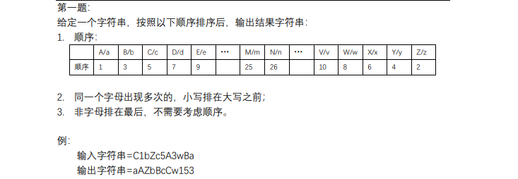
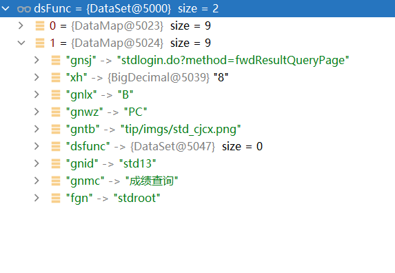

2023年4月

<!--more-->

## 4.1-4.2

躺平！颓废的周末

## 4.3

今天早上弄了一下图床，将防盗链给去除了。

将笔记图片在本地存好。

既然没什么事情，还是去做算法。


开始做成绩复查这个议题。


先写一个算法吧！

用栈实现队列：

需要两个栈就可以实现。

用队列实现栈：

从后先前依次取出元素再放进队列，剩最后一个，最后一个就是抛出的元素


成绩复查思路：

1、修改新增考试页面，增加设置成绩复查申请起始时间，设置复查结果起止时间

2、基本信息页面：增加复查相关时间展示，以及复查网址


## 4.4

又改错分支了

```java
src/com/grace/tip/student/rg/biz/StdRgBiz.java    fwdXxscPage

//xuzb.start.2023-03-31
      //考生不展示暂存状态
      if ("02".equals(zgshzt)) {
          zgshzt = "01";
      }
//xuzb.end.2023-03-31
```


修改年龄获取方法的分支

```
src/com/grace/tip/rg/biz/RegistrationBiz.java   savePerChngDeclMod
```


今天上午先不看算法，先把工单写了，然后再说

管理端：

1、新增考试增加字段：成绩复查申请起始时间、成绩复查结果查询起始时间

2、第一次导入考生科目成绩，还是用之前考生表里面的导出表，然后导入复查表和复查科目表，使用字段对照。

3、新增科目表与申请表，申请表与成绩查询类似


表结构：

申请表

KIT.SCORE_REVIEW_EXAM_STD

| 列名   | type          | 注释         |
| ------ | ------------- | ------------ |
| STDID  | VARCHAR2(20)  | 考生id       |
| KSID   | VARCHAR2(20)  | 考试id       |
| YWWYZJ | VARCHAR2(50)  | 业务唯一主键 |
| YXZJHM | VARCHAR2(20)  | 有效证件号码 |
| XM     | VARCHAR2(100) | 姓名         |
| SFFC   | VARCHAR2(3)   | 是否复查     |
| FCYY   | VARCHAR2(500) | 复查原因     |
| FCR    | VARCHAR2(20)  | 复查人       |
| FCSJ   | DATE          | 复查时间     |
| FCCS   | NUMBER(8,0)   | 复查次数     |
| JBR    | VARCHAR2(50)  | 经办人       |
| JBSJ   | DATE          | 经办时间     |
| BZ     | VARCHAR2(200) | 备注         |


科目表

KIT.SCORE_REVIEW_EXAM_STD_SUB

| 字段名称 | 类型          | 注释         |
| -------- | ------------- | ------------ |
| STDID    | VARCHAR2(20)  | 考生id       |
| KSID     | VARCHAR2(20)  | 考试id       |
| KMMC     | VARCHAR2(100) | 科目名称     |
| KMCJ     | VARCHAR2(100) | 科目成绩     |
| SFFC     | VARCHAR2(3)   | 是否复查     |
| KMFCCJ   | VARCHAR2(100) | 科目复查成绩 |


思考：

1、如何将两个表的记录放到一条    


拼接即可。

今天没看算法，把那个复查的方案捋了一下，写了工单。

## 4.5

清明时节雨纷纷

打了一天lol

## 4.6

今天还是先看算法把，看两道就开始干活


1047 删除字符串中的所有相邻重复项

150 逆波兰表达式求值


准备对成绩复查下手


首先，新增考试表增加字段

复查申请起始时间  复查申请终止时间

复查结果查询起始时间  复查结果查询终止时间

```sql
ALTER TABLE KIT.RESULT_EXAM ADD "FCSQQSSJ" DATE NULL;
ALTER TABLE KIT.RESULT_EXAM ADD "FCSQZZSJ" DATE NULL;
ALTER TABLE KIT.RESULT_EXAM ADD "FCJGCXQSSJ" DATE NULL;
ALTER TABLE KIT.RESULT_EXAM ADD "FCJGCXZZSJ" DATE NULL;
COMMENT ON COLUMN KIT.RESULT_EXAM.FCSQQSSJ IS '复查申请起始时间';
COMMENT ON COLUMN KIT.RESULT_EXAM.FCSQZZSJ IS '复查申请终止时间';
COMMENT ON COLUMN KIT.RESULT_EXAM.FCJGCXQSSJ IS '复查结果查询起始时间';
COMMENT ON COLUMN KIT.RESULT_EXAM.FCJGCXZZSJ IS '复查结果查询终止时间';
```

新增考试前端页面以及保存方法添加新增的字段

```
//修改
tip/tip/jsp/kit/rq/winResultExamAdd.jsp
src/com/grace/tip/kit/rq/biz/ResultQueryMngBiz.java    saveResultExamAdd

```

考试基本信息

```
//修改
src/com/grace/tip/kit/rq/biz/ResultQueryMngBiz.java   queryResultExamInfo
tip/tip/jsp/kit/rq/treePageResultExamInfoMng.jsp
```

修改考试页面和保存方法添加新增的字段

```
tip/tip/jsp/kit/rq/winExamInfoModify.jsp
src/com/grace/tip/kit/rq/biz/ResultQueryMngBiz.java   saveExamModify
```

## 4.7

老规矩，先算法

看算法不是为了面试，而是为了思路。

中午没饭，尝尝五爷拌面

先测试一下昨天改的功能是否正常使用


再就是新增一个功能节点，并且新增表

```
//修改
src/com/grace/tip/kit/rq/biz/ResultExamMngTree.java   createChildNode

//新增
src/com/grace/tip/kit/rq/ResultQueryController.java  fwdSorceReviewExamStdMng
tip/tip/jsp/kit/rq/treePageSorceReviewExamStdMng.jsp
src/com/grace/tip/kit/rq/biz/ResultQueryMngBiz.java  fwdSorceReviewExamStdMng
```

新建成绩复审表

```sql
CREATE TABLE KIT.SCORE_REVIEW_EXAM_STD (
	STDID VARCHAR2(20) NOT NULL,
	KSID VARCHAR2(20) NOT NULL,
	YWWYZJ VARCHAR2(50) NULL,
	YXZJHM VARCHAR2(20) NULL,
	XM VARCHAR2(100) NULL,
	SFFC VARCHAR2(3) NULL,
	FCYY VARCHAR2(500) NULL,
	FCSJ DATE NULL,
	JBR VARCHAR2(50) NULL,
	JBSJ DATE NULL,
	BZ VARCHAR2(200) NULL,
	CONSTRAINT PK_SCORE_REVIEW_EXAM_STD PRIMARY KEY (STDID,KSID)
)
TABLESPACE TS_KIT;
COMMENT ON TABLE KIT.SCORE_REVIEW_EXAM_STD IS '成绩复审申请表';
COMMENT ON COLUMN KIT.SCORE_REVIEW_EXAM_STD.STDID IS '考生ID';
COMMENT ON COLUMN KIT.SCORE_REVIEW_EXAM_STD.KSID IS '考试id';
COMMENT ON COLUMN KIT.SCORE_REVIEW_EXAM_STD.YWWYZJ IS '业务唯一主键';
COMMENT ON COLUMN KIT.SCORE_REVIEW_EXAM_STD.YXZJHM IS '有效证件号码';
COMMENT ON COLUMN KIT.SCORE_REVIEW_EXAM_STD.XM IS '姓名';
COMMENT ON COLUMN KIT.SCORE_REVIEW_EXAM_STD.SFFC IS '是否复查';
COMMENT ON COLUMN KIT.SCORE_REVIEW_EXAM_STD.FCYY IS '复查原因';
COMMENT ON COLUMN KIT.SCORE_REVIEW_EXAM_STD.FCSJ IS '复查时间';
COMMENT ON COLUMN KIT.SCORE_REVIEW_EXAM_STD.JBR IS '经办人';
COMMENT ON COLUMN KIT.SCORE_REVIEW_EXAM_STD.JBSJ IS '经办时间';
COMMENT ON COLUMN KIT.SCORE_REVIEW_EXAM_STD.BZ IS '备注';

```

新建成绩复审科目表

```sql
CREATE TABLE KIT.SCORE_REVIEW_EXAM_STD_SUB (
	STDID VARCHAR2(20) NOT NULL,
	KSID VARCHAR2(20) NOT NULL,
	KMMC VARCHAR2(100) NOT NULL,
	KMCJ NUMBER(8,4) NULL,
	SFFC VARCHAR2(3) NULL,
	KMFCCJ NUMBER(8,4) NULL,
	CONSTRAINT PK_SCORE_REVIEW_EXAM_STD_SUB PRIMARY KEY (STDID,KSID,KMMC)
)
TABLESPACE TS_KIT;
COMMENT ON TABLE KIT.SCORE_REVIEW_EXAM_STD_SUB IS '成绩复查科目表';
COMMENT ON COLUMN KIT.SCORE_REVIEW_EXAM_STD_SUB.STDID IS '考生id';
COMMENT ON COLUMN KIT.SCORE_REVIEW_EXAM_STD_SUB.KSID IS '考试id';
COMMENT ON COLUMN KIT.SCORE_REVIEW_EXAM_STD_SUB.KMMC IS '科目名称';
COMMENT ON COLUMN KIT.SCORE_REVIEW_EXAM_STD_SUB.KMCJ IS '科目成绩';
COMMENT ON COLUMN KIT.SCORE_REVIEW_EXAM_STD_SUB.SFFC IS '是否复查';
COMMENT ON COLUMN KIT.SCORE_REVIEW_EXAM_STD_SUB.KMFCCJ IS '科目复查成绩';
```

新增了复查管理页面，第一步修改查询！

```
//新增
 src/com/grace/tip/kit/rq/ResultQueryController.java	querySorceReviewExamStdInfo
 src/com/grace/tip/kit/rq/biz/ResultQueryMngBiz.java    querySorceReviewExamStdInfo
```

## 4.8-4.9

臭娘们来了，休息

## 4.10

老规矩，算法两道

前k个高频元素，使用大小顶堆进行解决

二叉树的基础知识


tmd，阿里又封了


发现那些很强的人，他们不是智商比我高，而是规划能力太强了。


开始做成绩复审。

上一周做了增加节点、表、以及查询功能。

这周准备做管理端的导入导出功能。

导入

```
//新增
src/com/grace/tip/kit/rq/ResultQueryController.java	 fwdImportSorceReviewExamStd
tip/jsp/kit/rq/winImportSorceReviewExamStd.jsp
src/com/grace/tip/kit/rq/ResultQueryController.java fwdParseColm4ImportSorceReviewExamStd
src/com/grace/tip/kit/rq/biz/ResultQueryMngBiz.java fwdParseColm4ImportSorceReviewExamStd
tip/jsp/kit/rq/winParseColm4ImportSorceReviewExamStd.jsp

```


ksid = 20018032610000000045


导出的模版中没有考生的id，直接去使用姓名和身份证号码查询这个考生的id。

明天接着做。


## 4.11

老规矩，先看算法，然后直接八股

利用率要搞起来，不能浪费

看小林coding

算法只看了一下二叉树递归遍历前中后序

开始做议题吧。


还有许多其他的议题需要改，需要暂时存储一下代码

## 4.12

不知不觉又到了中旬，这个月可是啥也没怎么学

今天先不能看算法

上午修改了其他议题

下午准备看算法

就看了二叉树的迭代遍历

抽时间需要把所有算法全部复习一遍，暂定周五

## 4.13

先修改一个议题，然后再去写算法。

```
//新增
src/com/grace/tip/exam/biz/ArrangeRoom4WrittenBiz.java sysncSiteRoomInfoByTjStd4PosType
//修改
saveCombineLoaskRoom4PosType
```

修改完毕，去看算法喽

看了二叉树的统一迭代遍历

下午准备再看一下层序遍历，然后去做议题

层序遍历也分为递归和层序遍历

又让我出差，我不去，谁爱去谁去，不行就n+1。怕个屁

## 4.14

先复习一下算法。

复习一下昨天看的层序遍历

别忘了做导入

思路：固定列，固定五科。


```
//新增
src/com/grace/tip/kit/rq/ResultQueryController.java    saveImportSorceReviewExamStdInfo
src/com/grace/tip/kit/rq/biz/ResultQueryMngBiz.java    saveImportSorceReviewExamStdInfo
```

## 4.15-4.16

休息，本来是说这周末去淄博吃烧烤，都怪那娘们

## 4.17

先复习一下算法，然后看议题。

议题，重要失误！

科目名称是列名

导入暂时正常，挨着做。接下来再做导出功能

```
//新增
src/com/grace/tip/kit/rq/ResultQueryController.java  fwdExportSorceReviewExamStdExcel
src/com/grace/tip/kit/rq/biz/ResultQueryMngBiz.java  fwdExportSorceReviewExamStdExcel
src/com/grace/tip/kit/rq/biz/ResultQueryMngBiz.java  fwdExportSorceReviewExamStdExcelFunc
```


## 4.18

先看两道算法，然后小林。。。

发现一个非常牛的算法：




思路：

先创建一个hashmap，key是大小写字母以及数字的ascii，value是权值。

然后自定义sort，如果大小写一样，那么小写的在前面。

不要一味贪图刷题速度，能装进脑子，才是最好的效果！

导出操作

```
//新增
src/com/grace/tip/kit/rq/ResultQueryController.java   fwdImportSorceReviewStdExcel
src/com/grace/tip/kit/rq/biz/ResultQueryMngBiz.java   fwdImportSorceReviewStdExcel
```


清空数据

```
src/com/grace/tip/kit/rq/ResultQueryController.java   saveClearSorceReviewExamStdInfo
src/com/grace/tip/kit/rq/biz/ResultQueryMngBiz.java   saveClearSorceReviewExamStdInfo
```

修改

```
//新增
tip/tip/jsp/kit/rq/winSorceReviewExamStdInfoModify.jsp
src/com/grace/tip/kit/rq/ResultQueryController.java    fwdSorceReviewExamStdInfoModify
src/com/grace/tip/kit/rq/biz/ResultQueryMngBiz.java	   fwdSorceReviewExamStdInfoModify
```

## 4.19

一个月又要过完了。。。

总感觉看算法不太行，先搞两道算法，然后去看八股或者小林。

二叉树的旋转


判断二叉树是否对称没做


开始做议题，

一个修改没做完，哈哈哈


## 4.20

做一道算法，从今天开始，做每日一题

然后去看书，每天一上午的时间，再怎么着一个月也能看一本书了；

上午还是摸鱼太多了，要抓紧时间。

下午开始干活！

删除操作

```
//新增
src/com/grace/tip/kit/rq/ResultQueryController.java    saveSorceReviewExamStdInfoDel
src/com/grace/tip/kit/rq/biz/ResultQueryMngBiz.java    saveSorceReviewExamStdInfoDel
```

五一要用，，，冲

详情

```
tip/tip/jsp/kit/rq/winViewSorceReviewExamStdInfo.jsp
src/com/grace/tip/kit/rq/ResultQueryController.java    fwdViewSorceReviewExamStdInfo
src/com/grace/tip/kit/rq/biz/ResultQueryMngBiz.java	   fwdViewSorceReviewExamStdInfo
```


重置查询状态

```
//新增

src/com/grace/tip/kit/rq/ResultQueryController.java    saveResetSorceReviewExamStdFcjgzt
src/com/grace/tip/kit/rq/biz/ResultQueryMngBiz.java	   saveResetSorceReviewExamStdFcjgzt
```


明天把那个导入复查成绩做完。

## 4.21

今天不摸鱼了。

抓紧干

做成绩导入工作

做直接导入，简单方便，直接固定列

```
新增
tip/tip/jsp/kit/rq/winSorceReviewResultImportFile.jsp
src/com/grace/tip/kit/rq/ResultQueryController.java   fwdSorceReviewResultImportFile
src/com/grace/tip/kit/rq/ResultQueryController.java   saveSorceReviewResultImp
src/com/grace/tip/kit/rq/biz/ResultQueryMngBiz.java   saveSorceReviewResultImp
```


导入暂时告一段落，直接去做申请端

增加复查查询网址

考生复查页面


```
//修改
src/com/grace/tip/kit/rq/biz/ResultQueryMngBiz.java   fwdResultExamInfo

//新增
src/com/grace/tip/kit/rq/ResultQueryController.java  fwdSorceReviewQueryPage
src/com/grace/tip/kit/rq/biz/ResultQueryMngBiz.java  fwdSorceReviewQueryPage
tip/tip/jsp/kit/rq/pageSorceReviewQuery.jsp
```


需要调前端页面，好烦


修改登录拦截

```
com/grace/frame/login/LoginUtil.java
```


一个思路，后面可以借鉴

校验完成开始跳转

```
tip/tip/jsp/kit/rq/pageSorceReviewApply.jsp  //申请页面
src/com/grace/tip/kit/rq/ResultQueryController.java  fwdSorceReviewApplyPage
src/com/grace/tip/kit/rq/biz/ResultQueryMngBiz.java  fwdSorceReviewApplyPage
```


问题：var map = new HashMap(data);传不过去值

## 4.22

休息哦

## 4.23

继续加急做议题，今天看进度，进度不怎么样的话就加班

找到解决办法，直接将框架引入进来。

```
新增
src/com/grace/tip/kit/rq/biz/ResultQueryMngBiz.java  saveSorceReviewApply
src/com/grace/tip/kit/rq/ResultQueryController.java  saveSorceReviewApply
```


## 4.24

今天将那个撤销申请还有查询结果


撤销

```
//新增
src/com/grace/tip/kit/rq/ResultQueryController.java   saveRevokeSorceReviewApply
src/com/grace/tip/kit/rq/biz/ResultQueryMngBiz.java   saveRevokeSorceReviewApply

```


查询复查结果

```
src/com/grace/tip/kit/rq/ResultQueryController.java   checkSorceReviewResultStdInfo
src/com/grace/tip/kit/rq/biz/ResultQueryMngBiz.java   checkSorceReviewResultStdInfo

src/com/grace/tip/kit/rq/ResultQueryController.java   fwdSorceReviewResultPage
src/com/grace/tip/kit/rq/biz/ResultQueryMngBiz.java   fwdSorceReviewResultPage
tip/tip/jsp/kit/rq/pageSorceReviewResult.jsp
```


先将考试列表页面修改完，然后再去修改样式。


前端改的就是快，几分钟就改好了。

修改考试列表

```
src/com/grace/tip/kit/rq/biz/ResultQueryMngBiz.java    fwdResultQueryListPage
tip/tip/jsp/kit/rq/pageResultQueryList.jsp
```


## 4.25

继续做那个需求，这几天就先没看算法。

今天要将

将是否查询复查结果删除。

将第二次导入的时候做一下结果校验

```
src/com/grace/tip/kit/rq/ResultQueryController.java  chkSorceReviewResultImport4Flow
src/com/grace/tip/kit/rq/ResultQueryController.java  fwdSorceReviewResultImport4Flow
src/com/grace/tip/kit/rq/biz/ResultQueryMngBiz.java  chkSorceReviewResultImport4Flow
src/com/grace/tip/kit/rq/biz/ResultQueryMngBiz.java  chkSorceReviewResultImport4FlowFunc
tip/tip/jsp/kit/rq/winSorceReviewImport4Flow.jsp
src/com/grace/tip/kit/rq/biz/ResultQueryMngBiz.java  saveSorceReviewResultImpFunc
src/com/grace/tip/kit/rq/biz/ResultQueryMngBiz.java  addErrRow
```


## 4.26

终于把那个功能做完了，加了四五天的班。。。

感觉还要改

今天上午十点之前要把操作文档写出来。

算法都快忘完了，，，

稍微复习一下

看一下小林的图解系列，多看一些书，回头面试有东西


```
src/com/grace/tip/student/rg/biz/StdRgBiz.java   getPosition4Stdnt_640
src/com/grace/tip/student/rg/biz/StdRgBiz.java   getPosition4Stdnt_209
```

照片比对流程中，微信端也要改。

先放一边，把成绩复查改了再说。


还几把要做考生端，不早说



仿照成绩查询来做一下成绩复查

```
成绩查询
fwdResultQueryPage
```

372328199701020012

李孝志


考生端成绩复查按钮

```
//修改
src/com/grace/tip/student/login/biz/StdLoginBiz.java    fwdResultQueryPage
tip/tip/jsp/student/stdExamResultQuery.jsp
```


考试复查申请

```
//新增
src/com/grace/tip/student/login/biz/StdLoginBiz.java     verificationScoreReviewApplyInfo
src/com/grace/tip/student/login/StdLoginController.java  verificationScoreReviewApplyInfo
tip/jsp/student/stdExamSorceReviewApplyMng.jsp
src/com/grace/tip/student/login/biz/StdLoginBiz.java     fwdSorceReviewApplyPage
src/com/grace/tip/student/login/StdLoginController.java  fwdSorceReviewApplyPage
```


呦西，没问题。

明天上午就能改完。

## 4.27

新的需求，将页面在报名系统上加上


结果页面

```
//增加
src/com/grace/tip/student/login/StdLoginController.java verificationScoreReviewResultInfo
src/com/grace/tip/student/login/biz/StdLoginBiz.java    verificationScoreReviewResultInfo


src/com/grace/tip/student/login/StdLoginController.java fwdSorceReviewResultPage
src/com/grace/tip/student/login/biz/StdLoginBiz.java   fwdSorceReviewResultPage
tip/tip/jsp/student/stdExamSorceReviewResult.jsp
```


修改新议题

将clob数据转换为string

```java
//xuzb.start 2023.4.27 将缓存数据中的clob转换为String
Clob jktzsmb = dsPrintModel.getRow(0).getClob("gsnr");
if(null != jktzsmb && jktzsmb.length() > 0){
    String jktzsmb_str = StringUtil.Colb2String(jktzsmb);
    dsPrintModel.put(0,"gsnr",jktzsmb_str);
}else{
    dsPrintModel.put(0,"gsnr","");
}

String jktzsmbstr = dsPrintModel.getString(0,"gsnr");
if (StringUtil.chkStrNull(jktzsmbstr)) {
    throw new BizException("未维护缴款通知书模板格式，请联系系统管理员。");
}

Printer printer = Printer.getInstanceByGsnr(jktzsmbstr);

//xuzb.end 2023.4.27 将缓存数据中的clob转换为String

// 转换格式内容
		Clob clob = ds.getClob(0, "gsnr");
		ds.put(0, "gsnr", StringUtil.Colb2String(clob));
```


修改clob议题

```
src/com/grace/tip/fee/platform/gznontax/GzNontaxPayUtil.java   createNontaxOrder_Offline

src/com/grace/tip/ba/biz/BaBiz.java   fwdCertPrint

src/com/grace/tip/kit/cp/biz/CertPrintMngBiz.java   getCertPrintPrinter

src/com/grace/tip/kit/cp/biz/CertPrintMngBiz.java   getCertEmailPrinter

src/com/grace/tip/student/ba/biz/StdBaBiz.java   fwdResultCheckTable

src/com/grace/tip/student/ba/biz/StdBaBiz.java   fwdRefundPrint

src/com/grace/tip/student/ba/biz/StdBaBiz.java   fwdStdRefundTable

src/com/grace/tip/student/ba/biz/StdBaBiz.java   fwdPerChngDeclTable
```


照片比对流程中，修改微信端

上传照片微信端

```
src/com/grace/tip/student/rg/biz/StdRgBiz.java   doSczp_moblie
```


## 4.28

今天把成绩复查又改了一遍，还剩下一个照片比对的议题没有改

一会改了，先去看两道算法

摸鱼摸到下班吗，算了，一会去改下工单吧

删除新增的code使用zpshfs这个code

```
String zpdsyqCode = TipUtil.getPara(pcid, "task_zpdsyq", "NONE");
String zpdsyqContent = CodeUtil.discode("zpdsyq", zpdsyqCode, "");// 照片底色要求
```

4.页面中展示的照片说明“如上传照片多次提示”上传的照片与支付宝认证照片对比失败,请重新上传照片或重新进行身份认证操作!“，请咨询400-001-0370。”需要判断是否开启了照片比对的参数，如果开启，则展示，否则不展示； 

```
String tip_aliphoto_compare = SysParaUtil.getPara("tip_aliphoto_compare", "0");
rdm.put("photocompare", tip_aliphoto_compare);
```


芜湖  改完了，一会回去收拾收拾东西，准备回家