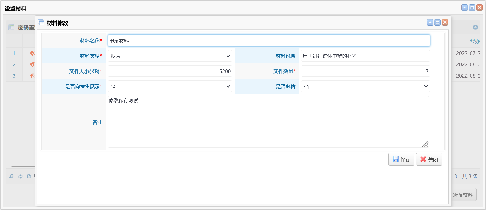
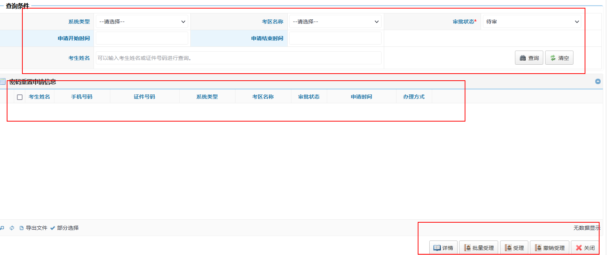
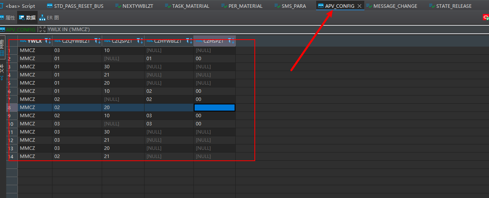
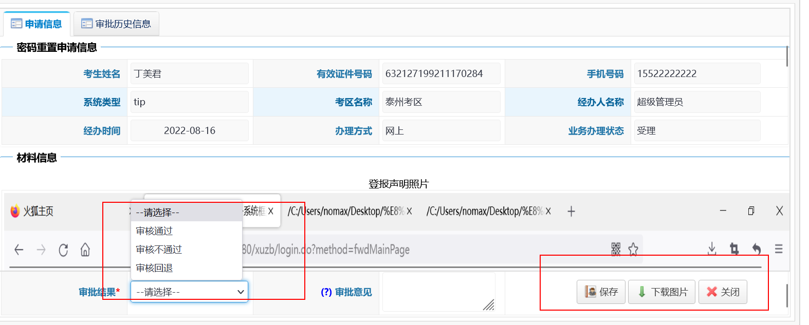
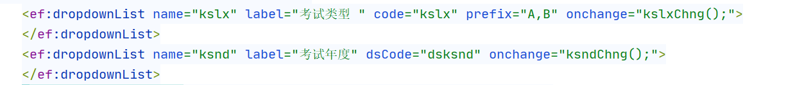

# 七月

## 7.1

看了一天的tip，没有什么收获

## 7.2

拿毕业证

## 7.3

居家休息

## 7.4

- git的学习
- 小王八的使用

## 7.5

做业务

- 就是测试功能，然后看流程以及数据流向

## 7.6

下雨了、烦

铁头晚上来

吃了360

## 7.7

请了周五下午的一下午假

## 7.8

出差事项培训

机房熟悉流程

## 7.9

上午考务培训

下午坐车去泰安

## 7.10

菏泽考试

## 7.11

上午做核酸

下午继续看tip

**代码位置--参数信息--业务流程**

## 7.12-7.16出差

## 7.17

喝酒休息

## 7.18

开始上班

熟悉单位端

## 7.19    

继续看tip

看了报名考试的流程

以及大部分单位端

🐖来找我吃火锅

## 7.20

继续tip单位端

是在不行我就看面经或者看算法或者看技术去了


终于分配任务了

- 首先先申请了lab的账号
- 然后问琪姐新建了分支
- 拉到本地切换分支
- 第一个问题
  - 修改提示信息

## 7.21

- 修改代码
- 申请账号
- 提代码
- 创建工单
- 深入了解虚拟机
  - java虚拟机栈
  - 本地方法栈
- 算法
  - 二分查找
  - 移除元素

## 7.22

- 学习并了解一下vscode
- 然后继续看tip管理端
- 考试管理

## 7.23-7.24

居家颓废

## 7.25

不知道要干嘛，继续看业务？

找到一个神仙博客，准备看springcloud

[SpringCloud教程第1篇：Eureka - 方志朋的博客 (fangzhipeng.com)](https://www.fangzhipeng.com/springcloud/2017/06/01/sc01-eureka.html)

## 7.26

学习springcloud

- 注册中心
- 负载均衡

注册手机号更新为空传问题

## 7.27

#### 注册手机号更新为空传问题

看了一上午 发现其实没啥问题。

准备去看b站进行学习；

下午

新手培训

分布式

## 7.28

bas密码重置功能开发：

大体流程构思；

## 7.29

准备写方法中的逻辑代码

- 增加密码重置
- 设置材料
- 新增材料

## 7.30-7.31

周末；

去西站喝酒

云顶之奕

# 八月

## 8.1

- 密码重置管理
- 算法
  - 滑动窗口
  - 双指针

## 8.2-8.5

出差

海南

因为疫情延迟

## 8.6-8.7

周末

躺了两天、淦、

## 8.8

填写报销单

密码重置申请，考生端

## 8.9

报销单

考生端

新增-修改-详情

## 8.10

继续密码重置申请-考生端

## 8.11

喝酒头疼，请了一天假，以后不是周末，谁喊喝酒也不去了；；；

## 8.12

整理密码重置

密码重置审核端-受理

查询与详情页面

## 8.13-8.14

周末，文明6

## 8.15

密码重置审核端-受理

完结，就是仿照着信息修改功能，发现一些小问题，需要进行修复；

## 8.16

修改bug，审核不通过则直接结束业务

## 8.17

继续改密码重置

## 8.18

密码重置

## 8.19

添加一个批量审批按钮，下午自己学习mysql

## 8.20-8.21

周末，修仙了。修完就开始学习新的技术栈。

## 8.22

新的一周；

## 8.23

搭建博客

报名软考

## 8.24

搭建博客

## 8.25

搭建博客告一段落。

一周都没有分配任务，闲的发慌。

既然没有事情，那么就开始准备软考吧。

计算机系统p1-p20

## 8.26

看会软考。

然后下午做了一个tip明文显示身份证号码的小功能。

软考看了进制转换。需要复习一下cpu：运算器、控制器、

## 8.27-8.28

喝酒+唐诗

## 8.29

周一，无任务，准备软考。

软考p20-p83

## 8.30

无任务

算法+软考

## 8.31

弄了一天的Doris，狗屁没弄懂。

# 九月

## 9.1

无工作任务

java小知识点，jdk8新特性 lambda与：：

软考看到加密。

# 项目

## 1、密码重置申请

考生端-管理端-审核端   都是仿照信息修改进行改写的；

### 管理端

首先，需要先对某个系统的某个考区开放密码重置功能，然后再设置密码重置需要上传的材料信息；


就算有考生已经进行了密码重置的申请，也不会影响材料的新增与删除。

没个系统的每个考点都只能添加一个。

如果要删除某个考点密码重置的功能，需要确保此考点下没有正在审核的密码重置申请。

可以对已添加的材料进行修改与删除，修改则是对其中的一些条件进行修改。



### 考生端


1. 对当前用户的申请进行查询,并且展示到页面上。判断其审批状态。来显示状态以及修改和详情按钮
2. 新增密码重置申请，如果此用户已经对该考区进行密码重置申请，并且审核没有办结，那么将不能进行重复申请。

### 审核端

首先添加新的功能节点。




设置筛选条件，受理的业务办理状态为01，办理为02，办结为03，这样就能分开进行查询

可以对考生申请的密码重置进行审核，



这个表为业务受理前的状态，并将业务受理后的状态进行赋值，例如，受理情况下，审核通过，将审核信息的业务办理状态变更为办理的待审。



受理可以对申请进行：审核通过，审核不通过，审核回退

审核通过则进行下一个业务流程，审核不通过则结束此次业务，

审核回退则将申请打回考生，让考生进行修改之后重新进行审核。


撤销操作。

对已经处理过的申请，可以进行撤销处理


通过以及不通过都可以进行撤销。退回则不可以进行撤销。

对办结或者不通过的申请，直接修改其状态，让其结束业务流程。


考生端则是按照此表的状态来判断业务状态。

ywblzt为0则是办理中。为1则是办理完成，办理完成会对办理结果进行修改。

这就是密码重置功能的全部业务流程。具体流程需要继续完善。

## 2、考生报考数据管理

## 3、全国平台-打印座次表

修改插入语句，将生成方式插入表中。在生成pdf的时候进行判断编排考场的方式，来确定打印的表头。

## 4、单位用户管理-增加导入职位审核权限功能

- 首先导入文件
- 对导入文件的数据进行校验
- 校验是否拥有上一个权限
- 查询当前批次下这个用户所拥有的权限，必须还要有职位。三表联立
- 还有就是用户默认拥有自己的权限，所以还要查询一下当前用户的信息。
- 最后进行保存

难点：联立sql

```java
sqlBF.append("  select 1 ");
sqlBF.append("  from rg.task_orgn a ");
sqlBF.append("  where (( a.pcid = ? ");
sqlBF.append("          and exists ");
sqlBF.append("          (select b.dwid ");
sqlBF.append("           from rg.orgn_user_data_right b ");
sqlBF.append("           where a.dwid = b.dwid ");
sqlBF.append("                 and b.yhid = ? ");
sqlBF.append("                 and exists ");
sqlBF.append("                 (select c.zwid from rg.task_position c where b.dwid = c.dwid))) ");
sqlBF.append("          or ( a.zgdwid = ? and a.pcid = ?))  ");
sqlBF.append("          and a.dwbh = ?  ");


//查询当前用户的单位信息
sqlBF.setLength(0);
sqlBF.append(" select a.dwbh ");
sqlBF.append("   from rg.task_orgn a ");
sqlBF.append("  where a.pcid = ? ");
sqlBF.append("    and exists (select b.dwid ");
sqlBF.append("           from rg.orgn_user b ");
sqlBF.append("          where a.dwid = b.dwid ");
sqlBF.append("            and b.yhid = ?) ");
```


# 公司技术

## 新增自增长序列

```sql
create sequence BI.SEQ_XTID
minvalue 10000000000
maxvalue 99999999999
start with 10000000001
increment by 1
nocache
cycle;
```

## code转换

```java
String xtlx = CodeUtil.discode("XTLX", xtlx_code);
```

## 前端下拉框文本框

```jsp
<ef:textinput name="xtbh" label="系统编号" required="true" colspan="3" validType="engNum" />
<ef:textinput name="xtmc" label="系统名称" required="true" colspan="3" />
<ef:multiDropdownList name="jbjgid" label="系统审核权限" dsCode="dskqmc"
                      required="true" colspan="6" />
```

## 是否包含某个字段

```java
sqlBF.setLength(0);
sqlBF.append(" select 1 ");
sqlBF.append("   from ba.std_pass_reset ");
sqlBF.append("  where xtid = ? ");
sqlBF.append("    and jbjgid in (" + StringUtil.replaceC2QCQ(mkdm)
             + ") ");
```


## 包含DBID的SQL语句

```sql
--功能菜单
INSERT INTO FW.FUNC
(DBID, GNID, GNMC, FGN, GNSJ, GNLX, SXH, GNTB, BZ, YWLB)
SELECT DBID,'bar010h', '密码重置', 'bar01', NULL, 'C', 12, NULL, NULL, 'bas' FROM FW.DBID_INFO
```

## 新增功能节点

```sql
--功能菜单
INSERT INTO FW.FUNC
(DBID, GNID, GNMC, FGN, GNSJ, GNLX, SXH, GNTB, BZ, YWLB)
SELECT DBID,'bar010h', '密码重置', 'bar01', NULL, 'C', 12, NULL, NULL, 'bas' FROM FW.DBID_INFO
--功能按钮  密码重置受理
INSERT INTO FW.FUNC
(DBID, GNID, GNMC, FGN, GNSJ, GNLX, SXH, GNTB, BZ, YWLB)
SELECT DBID, 'bar010h01', '密码重置受理', 'bar010h', 'url:pwd.do?method=fwdPasswordResetSlPage', 'C', 0, 'icon-user-suit', NULL, 'bas'  FROM FW.DBID_INFO
--功能按钮  密码重置受理
INSERT INTO FW.FUNC
(DBID, GNID, GNMC, FGN, GNSJ, GNLX, SXH, GNTB, BZ, YWLB)
SELECT DBID,'bar010h02', '密码重置办理', 'bar010h', 'url:pwd.do?method=fwdPasswordResetCLPage', 'C', 1, 'icon-user-red', NULL, 'bas' FROM FW.DBID_INFO
--功能按钮  密码重置办结
INSERT INTO FW.FUNC
(DBID, GNID, GNMC, FGN, GNSJ, GNLX, SXH, GNTB, BZ, YWLB)
SELECT DBID, 'bar010h03', '密码重置办结', 'bar010h', 'url:pwd.do?method=fwdPasswordResetBJPage', 'C', 2, 'icon-user-orange', NULL, 'bas' FROM FW.DBID_INFO


INSERT INTO FW.FUNC_DOC
(GNID, GNMC, FGN, GNSJ, GNLX, GNTB, BZ)
VALUES('bar010h', '密码重置', 'bar01', NULL, 'C', NULL, NULL);

INSERT INTO FW.FUNC_DOC
(GNID, GNMC, FGN, GNSJ, GNLX, GNTB, BZ)
VALUES('bar010h01', '密码重置受理', 'bar010h', 'url:pwd.do?method=fwdPasswordResetSlPage', 'C', 'icon-user-suit', NULL);

INSERT INTO FW.FUNC_DOC
(GNID, GNMC, FGN, GNSJ, GNLX, GNTB, BZ)
VALUES('bar010h02', '密码重置办理', 'bar010h', 'url:pwd.do?method=fwdPasswordResetCLPage', 'C', 'icon-user-red', NULL);

INSERT INTO FW.FUNC_DOC
(GNID, GNMC, FGN, GNSJ, GNLX, GNTB, BZ)
VALUES('bar010h03', '密码重置办结', 'bar010h', 'url:pwd.do?method=fwdPasswordResetBJPage', 'C', 'icon-user-orange', NULL);


INSERT INTO FW.FUNC_UNION
(DBID, GNID, GNMC, JBJGFW, BZ)
SELECT DBID, 'bar010h', '密码重置', '*', NULL FROM FW.DBID_INFO

INSERT INTO FW.FUNC_UNION
(DBID, GNID, GNMC, JBJGFW, BZ)
SELECT DBID, 'bar010h01', '密码重置受理', '*', NULL FROM FW.DBID_INFO

INSERT INTO FW.FUNC_UNION
(DBID, GNID, GNMC, JBJGFW, BZ)
SELECT DBID, 'bar010h02', '密码重置办理', '*', NULL FROM FW.DBID_INFO

INSERT INTO FW.FUNC_UNION
(DBID, GNID, GNMC, JBJGFW, BZ)
SELECT DBID, 'bar010h03', '密码重置办结', '*', NULL FROM FW.DBID_INFO
```

## 判断调用方法是否出现异常

```js
		var url = new URL("exam.do", "fwdUploadMaterialsModifyBatchCheck");
		url.addQueryGridSelectData("gridMaterials", "clmc");
		var data1 = AjaxUtil.syncBizRequest(url);
		//先进行校验，判断选择材料名称是否相同。
		if (AjaxUtil.checkIsGoOn(data1)) {
		
		}
```

## 客户化

```sql
fw.local_doc
fw.local_config
//在这两个表中添加记录即可
INSERT INTO FW.LOCAL_DOC
(BZJM, BDHM, BDHSM)
VALUES('tip/jsp/student/stdRefundPage.jsp', 'tip/jsp/student/stdRefundPage_620.jsp', '考试退费申请甘肃客户化');

INSERT INTO FW.LOCAL_CONFIG
(JBJGID, BZJM, BDHM)
VALUES('620', 'stdRefundPage.jsp', 'stdRefundPage_620.jsp');
```

## 数据库新增表

```sql
-- Create table
create table RG.TASK_DEGREE_AREA
(
  pcid      VARCHAR2(20) not null,
  jbid       VARCHAR2(20) not null,
  zyid       VARCHAR2(20) not null,
  kqid       VARCHAR2(20)
)
tablespace TS_RG;
-- Add comments to the table 
comment on table RG.TASK_DEGREE_AREA
  is '专业考区信息表';
-- Add comments to the columns 
comment on column RG.TASK_DEGREE_AREA.pcid
  is '业务流水号';
comment on column RG.TASK_DEGREE_AREA.jbid
  is '人员ID';
comment on column RG.TASK_DEGREE_AREA.zyid
  is '姓名';
comment on column RG.TASK_DEGREE_AREA.kqid
  is '有效证件类型';

-- Create/Recreate primary, unique and foreign key constraints 
alter table RG.TASK_DEGREE_AREA
  add constraint PK_TASK_DEGREE_AREA primary key (pcid,jbid,zyid)
  using index 
  tablespace TS_BA;
```


## 滚动条问题

### 浏览器默认行为

如果浏览器不是强制刷新（Ctrl + F5），而是普通刷新（点击刷新按钮，或者按下 F5 刷新），则页面重新载入完毕后，滚动条会调到之前访问的位置。

大多数时候，这种体验对用户是友好的。但如果我我们希望滚动条回到顶部该如何处理？

不优雅的方式：

在页面加载完成事件中执行：

```javascript
document.documentElement.scrollTop = 0
```

### 原生的 API

浏览器已经提供了原生的 API，可以轻松实现浏览器滚动后每次都回到顶部的能力。

只需在页面中执行：

```javascript
if (history.scrollRestoration) {
  history.scrollRestoration = 'manual';
}
```

### 语法和兼容性

**语法：**

`history.scrollRestoration` 有下面两个值

- `auto`

  默认值，滚动位置会被存储

- `manual`

  滚动的位置不会被存储

**兼容性：**

现代浏览器全都支持！所以放心使用！

## 新增code

```sql
--FW.CODE_LIST
INSERT INTO FW.CODE_LIST
(DMBH, DMMC, DMSM, DMSYFW)
VALUES('YJZT', '邮寄状态', NULL, '30');
--FW.CODE_DOC
INSERT INTO FW.CODE_DOC
(DMBH, CODE, CONTENT, SM)
VALUES('YJZT', '0', '受理中', NULL);
INSERT INTO FW.CODE_DOC
(DMBH, CODE, CONTENT, SM)
VALUES('YJZT', '1', '已受理', NULL);
INSERT INTO FW.CODE_DOC
(DMBH, CODE, CONTENT, SM)
VALUES('YJZT', '2', '未邮寄', NULL);
INSERT INTO FW.CODE_DOC
(DMBH, CODE, CONTENT, SM)
VALUES('YJZT', '3', '已邮寄', NULL);

--FW.CODE_CONFIG
INSERT INTO FW.CODE_CONFIG
(DBID, DMBH, CODE, CONTENT, XH)
SELECT DBID,'YJZT', '0', '受理中', '1' FROM FW.DBID_INFO;
INSERT INTO FW.CODE_CONFIG
(DBID, DMBH, CODE, CONTENT, XH)
SELECT DBID,'YJZT', '1', '已受理', '2' FROM FW.DBID_INFO;
INSERT INTO FW.CODE_CONFIG
(DBID, DMBH, CODE, CONTENT, XH)
SELECT DBID,'YJZT', '2', '未邮寄', '3' FROM FW.DBID_INFO;
INSERT INTO FW.CODE_CONFIG
(DBID, DMBH, CODE, CONTENT, XH)
SELECT DBID,'YJZT', '3', '已邮寄', '4' FROM FW.DBID_INFO;
```


## 下拉框绑定点击事件



```js

// 选择年月在后遍历出考试信息
function ksndChng() {
    var pcid = getObject("pcid");
    pcid.setReadOnly(false);
    var ssny = getObject("ksnd").getValue();
    var kslx = getObject("kslx").getValue();
    if (chkObjNull(ssny) && chkObjNull(kslx)) {//考试类型与所属年月都没选择的话，就加载所有考试
        allPcid();
        return;
    }
    if (chkObjNull(ssny)){//只有考试类型为空则刷新
        kslxChng();
        return;
    }
    var url = new URL("rg.do", "queryTaskExamInfoByKsnd");
    url.addPara("ksnd", ssny);
    url.addPara("kslx", kslx);
    var data = AjaxUtil.syncBizRequest(url);
    var datacode = new HashMap(data);
    getObject("pcid").reloadOpt(datacode.get("dsksinfo"));
}

// 首次进页面加载所有考试
function allPcid() {
    var pcid = getObject("pcid");
    pcid.setReadOnly(false);
    var ssny = getObject("ksnd").getValue();
    var kslx = getObject("kslx").getValue();
    var url = new URL("rg.do", "queryTaskExamInfoByKsnd");
    url.addPara("ksnd", ssny);
    url.addPara("kslx", kslx);
    var data = AjaxUtil.syncBizRequest(url);
    var datacode = new HashMap(data);
    getObject("pcid").reloadOpt(datacode.get("dsksinfo"));
}
```

```java
public final DataMap queryTaskExamInfoByKslx(final DataMap para) throws Exception {
    String ksnd = para.getString("ksnd");
    String kslx = para.getString("kslx");
    StringBuffer sqlBF = new StringBuffer();

    sqlBF.setLength(0);
    sqlBF.append(" select pcid key, '【'||a.ssny||'】'||a.pcmcjc value, ssny, a.pcdm ");
    sqlBF.append("   from rg.exam_task a ");
    sqlBF.append("  where dbid = ? ");
    sqlBF.append("    and kslx = ? ");
    if (!StringUtil.chkStrNull(ksnd)) {
        sqlBF.append("and ssny like ? ");
    }
    this.sql.setSql(sqlBF.toString());
    this.sql.setString(1, GlobalVars.SYS_DBID);
    this.sql.setString(2, kslx);
    if (!StringUtil.chkStrNull(ksnd)) {
        this.sql.setString(3, ksnd + "%");
    }

    DataSet dsExam = this.sql.executeQuery();

    dsExam.sortdesc("ssny,pcdm");
    DataMap rdm = new DataMap();
    rdm.put("dsksinfo", dsExam);
    return rdm;
}
```

## 密码强校验

jsp

```js
if (!/^(?![a-zA-Z]+$)(?![A-Z0-9]+$)(?![A-Z\W_]+$)(?![a-z0-9]+$)(?![a-z\W_]+$)(?![0-9\W_]+$)[a-zA-Z0-9\W_]{8,12}$/.test(yhmm)) {
    alert("密码必须是由大写字母、小写字母、数字、特殊字符组成(至少满足三种规则)，8-12 位！");
    return;
}
```

java

```java

String regexp = "^(?![a-zA-Z]+$)(?![A-Z0-9]+$)(?![A-Z\\W_]+$)(?![a-z0-9]+$)(?![a-z\\W_]+$)(?![0-9\\W_]+$)[a-zA-Z0-9\\W_]{8,12}$";

if (!xpwd.matches(regexp)) {
    throw new BizException("密码必须是由大写字母、小写字母、数字、特殊字符组成(至少满足三种规则)，8-12 位！");
}
```


## 批量修改数据库数据

```sql
UPDATE FW.FUNC a
SET a.GNMC='报考资格在线核查'
WHERE a.GNMC='考后资格审核' AND a.DBID =(select b.dbid from fw.DBID_INFO b);
```

获取系统级别参数

## 登录拦截

```
com/grace/frame/login/LoginUtil.java
```


# 问题以及解决方法

1、对一个权限进行导入文件批量操作，需要先对导入数据进行校验，校验是否拥有操作的权限，需要多个表连表查询，：将数据全部查询出来，然后使用java进行筛选，听他们说java要比sql快。

# 主要业务

1、密码重置

分为管理端、单位端、考生端。

考生端申请：填写申请原因，申请所需材料

单位端：受理，处理，办结

管理端：因为分为不同的考区，所以对各个考区进行设置上传材料的设置，意思就是每个考区可以上传的材料不相同。

2、导入职位权限

管理端可以对单位端进行管理，对单位用户的权限进行管理，单位较多，所以单个设置比较麻烦

需要新增导入职位权限的功能。

1. 首先可以下载导入模版，excel文件，对其中需要填写的信息进行梳理，以及展示示例
2. 导入分为两步，展示导入结果，点击保存，然后才将数据保存到数据库中。
   - 第一步：对导入结果进行校验，用户是否存在，导入的权限是否存在，角色类型是否存在等
   - 角色不存在则新增，权限不存在则报错，对不同的校验进行不同的处理；
   - 先暂存在session中
   - 最后进行保存


# 需求

1、将座位表的样式调整一下，原因是有的考区30人和25人的考场是混合的，如果是选择30人的，那么就会空出来五个，所以现在将25人考场自动选择，只需要判断考场容量即可    2023-1-31

2、修改身份证号计算年龄的方法，使用参数控制，参数包括年月日，年是最不准确的参数，日是最准确的参数，近似值。 2.1

3、数据级联问题，增加一个系统参数，控制展示全部数据，还是只展示最后一个数据 2.2

4、单位用户新增用户，用户编号是自动生成的，现在新增一个字段，可以进行自定义，再新增一个按钮，可以自己生成用户编号。2.2

5、单位端分配权限问题，单位端创建下级单位用户时候，不让他拥有全部权限，让他拥有和当前单位一样的权限。2.3

6、**职位改报方案**：仿照现在的职位改报系统进行修改，管理端取消职位或者对职位进行改报，考生端已经选择完成职位或者已经报名成功的考生将显示职位改报按钮，只能选择科目数量相同的职位，然后需要考生进一步确认信息，确认完成信息之后提交审核，审核直接跳过初审，直接终审，审核通过之后职位改报成功。对逾期没有改报的用户将进行退费。2.10

方案修改：

- 新增一个主表，用来记录哪些考生可以进行改报，可以用来控制职位改报按钮(管理端对职位进行取消或者改报之后就导入考生)
- 考生历史表：记录考生改报的历史记录
- 职位改报范围表：记录可以改报的范围，如果是没有记录默认就是全部。
- 新增一个职位改报考生查询功能，可对改报考生信息进行导出

7、新增职位端职位查询功能，查询当前单位下的所有职位信息，可以选择查询条件。展示的字段与考生报考时候填写的一样。

8、**成绩复审方案**：增加成绩复审管理，除了导入查询成绩之外，还需要导入需要复审的科目，新增一个科目表与申请表，两个表相关联。这样就与成绩查询分割开了。导入时候，需要导入需要查询科目的名称成绩，固定表头（方便后台读取数据）。将科目信息存入科目表格。每个科目有一个是否申请复查字段。前端展示，只展示科目表中有的科目，所以管理端不导入的话，考生无法成绩复查。2.20

第一次导入考生信息，让考生进行选择字段对照，并且可以增加科目，使用的是成绩查询导出的模版。4.4


9、管理端密码强度修改：

- 大小写字母+数字+特殊字符不少于8位； 
- 并且3个月强制要求修改一次密码。
- 登录时做一个判断，拦截器中放行修改页面即可
- 最难的是正则表达式
- 2.27

10、考生端照片处理工具：

- 将支付宝照片比对增加照片处理工具的判断
- 将流程中上传照片加上支付宝的处理逻辑
- 增加一个系统参数，获取照片处理方式
- 增加一个系统参数，获取照片底色
- 2.27
- 修改：将管理端的照片比对客户化，并且将管理端和考生端保存照片比对的方法与流程中保持一致
- 客户化原因是提示信息每个地区都不一样
- 将照片审核方式系统参数和考试参数保持一致
- 新增一个在线审核工具的参数
- 4.19

11、专业绑定考区功能

- 批次参数-考区选择方式，由只有职位类考试改为全部考试。增加code专业绑定考区。
- 增加专业考区信息表（rg.task_degree_area）包含字段：pcid、jbid、zyid、kqid
- 管理端级别专业科目管理功能修改：增加维护专业绑定考区功能，选中专业后可以维护绑定的考区，查询时展示选中的考区；选中级别可以一次性维护级别下的所有专业考区。
- 考生端填写报考信息修改：对于资格类的考试并且考区选择方式为专业绑定考区时，选择专业后加载绑定的考区进行选择；保存时验证报名的专业是否存在改考区。获取专业考区的方法增加缓存机制，开启了专业绑定考区但是专业没有维护时默认获取全部考区。
- 3.3
- 修改为-在级别处可批量维护级别下所有的科目绑定考区。
- 进入页面将考区置为空，选择科目时才去加载。
- 为区别进入和修改，进入直接加载获取绑定考区方法，在方法里做判断。为空则不查询。