# String类

## 1、trim（）方法

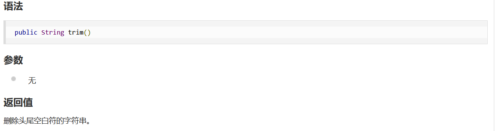

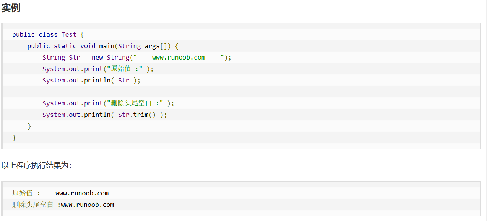


# Oracle

## 监听器问题


## DUAL伪表

>dual是一个虚拟表，用来构成select的语法规则，oracle保证dual里面永远只有一条记录。我们可以用它来做很多事情，如下：

```
1、查看当前用户，可以在 SQL Plus中执行下面语句 select user from dual;

　　2、用来调用系统函数

   select to_char(sysdate,‘yyyy-mm-dd hh24:mi:ss‘) from dual;--获得当前系统时间

 　　select SYS_CONTEXT(‘USERENV‘,‘TERMINAL‘) from dual;--获得主机名

 　　select SYS_CONTEXT(‘USERENV‘,‘language‘) from dual;--获得当前 locale

 　　select dbms_random.random from dual;--获得一个随机数
  
    select concat(‘010-‘,‘88888888‘)||‘转23‘ 电话 from dual;

3、得到序列的下一个值或当前值，用下面语句

　　select your_sequence.nextval from dual;--获得序列your_sequence的下一个值

　　select your_sequence.currval from dual;--获得序列your_sequence的当前值

　　4、可以用做计算器 select 7*9 from dual;
```


## sysdate函数

SYSDATE函数可以得到目前系统的时间，例如：

```sql
select sysdate from dual;
```

SYSDATE函数常用的格式举例如下：

```sql
--加法 
select sysdate,add_months(sysdate,12) from dual; --加1年 
select sysdate,add_months(sysdate,1) from dual; --加1月 
select sysdate,to_char(sysdate+7,'yyyy-mm-dd HH24:MI:SS') from dual; --加1星期 
select sysdate,to_char(sysdate+1,'yyyy-mm-dd HH24:MI:SS') from dual; --加1天 
select sysdate,to_char(sysdate+1/24,'yyyy-mm-dd HH24:MI:SS') from dual; --加1小时 
select sysdate,to_char(sysdate+1/24/60,'yyyy-mm-dd HH24:MI:SS') from dual; --加1分钟 
select sysdate,to_char(sysdate+1/24/60/60,'yyyy-mm-dd HH24:MI:SS') from dual; --加1秒 
 
--减法 
select sysdate,add_months(sysdate,-12) from dual; --减1年 
select sysdate,add_months(sysdate,-1) from dual; --减1月 
select sysdate,to_char(sysdate-7,'yyyy-mm-dd HH24:MI:SS') from dual; --减1星期 
select sysdate,to_char(sysdate-1,'yyyy-mm-dd HH24:MI:SS') from dual; --减1天 
select sysdate,to_char(sysdate-1/24,'yyyy-mm-dd HH24:MI:SS') from dual; --减1小时 
select sysdate,to_char(sysdate-1/24/60,'yyyy-mm-dd HH24:MI:SS') from dual; --减1分钟 
select sysdate,to_char(sysdate-1/24/60/60,'yyyy-mm-dd HH24:MI:SS') from dual; --减1秒 
 
--举例：
 
--1、取得当前日期是本月的第几周
select to_char(sysdate,'YYYYMMDD W HH24:MI:SS') from dual;
select to_char(sysdate,'W') from dual; 
 
--2、取得当前日期是一个星期中的第几天，星期日为第一天
 select sysdate,to_char(sysdate,'D') from dual; 
--类似: 
select to_char(sysdate,'yyyy') from dual; --年 
select to_char(sysdate,'Q' from dual; --季 
select to_char(sysdate,'mm') from dual; --月 
select to_char(sysdate,'dd') from dual; --日 
--ddd 年中的第几天 
--WW 年中的第几个星期 
--W 该月中第几个星期 
--D 周中的星期几 
--hh 小时(12) 
--hh24 小时(24) 
--Mi 分 
--ss 秒 
 
--3、取当前日期是星期几，中文显示
select to_char(sysdate,'day') from dual;
 
--4、如果一个表在一个date类型的字段上面建立了索引，如何使用 
alter session set NLS_DATE_FORMAT='YYYY-MM-DD HH24:MI:SS' 
 
--5、得到当前的日期 
select sysdate from dual; 
 
--6、得到当天凌晨0点0分0秒的日期 
select trunc(sysdate) from dual; 
-- 得到这天的最后一秒 
select trunc(sysdate) + 0.99999 from dual; 
-- 得到小时的具体数值 
select trunc(sysdate) + 1/24 from dual; 
select trunc(sysdate) + 7/24 from dual;
 
--7、得到明天凌晨0点0分0秒的日期 
select trunc(sysdate+1) from dual; 
select trunc(sysdate)+1 from dual; 
 
--8、本月一日的日期 
select trunc(sysdate,'mm') from dual; 
 
--9、得到下月一日的日期 
select trunc(add_months(sysdate,1),'mm') from dual; 
 
--10、返回当前月的最后一天
select last_day(sysdate) from dual; 
select last_day(trunc(sysdate)) from dual; 
select trunc(last_day(sysdate)) from dual; 
select trunc(add_months(sysdate,1),'mm') - 1 from dual; 
 
--11、得到一年的每一天 
select trunc(sysdate,'yyyy')+ rn -1 date0 
from 
(select rownum rn from all_objects 
where rownum<366); 
 
--12、今天是今年的第N天 
SELECT TO_CHAR(SYSDATE,'DDD') FROM DUAL; 
 
--13、如何在给现有的日期加上2年 
select add_months(sysdate,24) from dual; 
 
--14、判断某一日子所在年分是否为润年 
select decode(to_char(last_day(trunc(sysdate,'y')+31),'dd'),'29','闰年','平年') from dual; 
 
--15、判断两年后是否为润年 
select decode(to_char(last_day(trunc(add_months(sysdate,24),'y')+31),'dd'),'29','闰年','平年') from dual; 
 
--16、得到日期的季度 
select ceil(to_number(to_char(sysdate,'mm'))/3) from dual; 
select to_char(sysdate, 'Q') from dual; 
```

## 添加数据源

首先更改tnsnames.ora

```
# tnsnames.ora Network Configuration File: D:\oracle\product\10.2.0\db_1\network\admin\tnsnames.ora
# Generated by Oracle configuration tools.

ORCL =
  (DESCRIPTION =
    (ADDRESS = (PROTOCOL = TCP)(HOST = DESKTOP-RQ6GUCE)(PORT = 1521))
    (CONNECT_DATA =
      (SERVER = DEDICATED)
      (SERVICE_NAME = orcl)
    )
  )
  
tip =
  (DESCRIPTION =
    (ADDRESS = (PROTOCOL = TCP)(HOST = 192.168.200.201)(PORT = 1521))
    (CONNECT_DATA =
	  (SID = tip)
      (SERVICE_NAME = tip)
    )
  )


EXTPROC_CONNECTION_DATA =
  (DESCRIPTION =
    (ADDRESS_LIST =
      (ADDRESS = (PROTOCOL = IPC)(KEY = EXTPROC1))
    )
    (CONNECT_DATA =
      (SID = PLSExtProc)
      (PRESENTATION = RO)
    )
  )


```

再修改监听器

```
# listener.ora Network Configuration File: D:\oracle\product\10.2.0\db_1\network\admin\listener.ora
# Generated by Oracle configuration tools.

SID_LIST_LISTENER =
  (SID_LIST =
    (SID_DESC =
      (SID_NAME = PLSExtProc)
      (ORACLE_HOME = D:\oracle\product\10.2.0\db_1)
      (PROGRAM = extproc)
    )
	(SID_DESC =
      (SID_NAME = tip)
      (ORACLE_HOME = D:\oracle\product\10.2.0\db_1)
      (GLOBAL_DBNAME = tip)
    )
	
  )

LISTENER =
  (DESCRIPTION_LIST =
    (DESCRIPTION =
      (ADDRESS = (PROTOCOL = IPC)(KEY = EXTPROC1))
      (ADDRESS = (PROTOCOL = TCP)(HOST = DESKTOP-RQ6GUCE)(PORT = 1521))
	  
    )
	(DESCRIPTION =
	  (ADDRESS = (PROTOCOL = TCP)(HOST = 192.168.200.201)(PORT = 1521))
	)
  )

```


# Git与小乌龟的使用

git的使用

https://blog.csdn.net/qq_34964197/article/details/81104419

https://www.cnblogs.com/mengcheng9300/p/12955591.html

git+小乌龟的使用

https://cloud.tencent.com/developer/article/1991639


首先汉化小乌龟


汉化成功，尝试着去拉取代码

参考[(37条消息) git 拉取远程分支到本地_carfge的博客-CSDN博客_git 拉取远程分支](https://blog.csdn.net/carfge/article/details/79691360)

## 一、拉取项目

1、首先创建一个文件夹，用来存放拉取得代码

2、文件夹右键打开


然后初始化

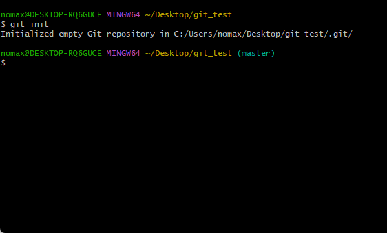

3、与远程仓库建立链接

```
git remote add origin git@github.com:xuzb0312/nk_communuty.git   --22端口报错
删除
git remote rm origin
重新添加一个
git remote add origin https://github.com/xuzb0312/nk_communuty.git  --也有问题

```

解决办法：https://www.cnblogs.com/jaxu/p/12027839.html

将git中的sslverify关掉：

```
git config --system http.sslverify false
```

完成

4、把远程分支拉到本地

```
git fetch origin dev
```

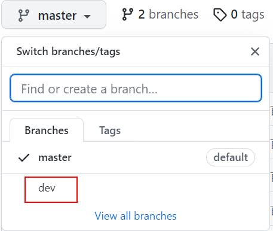

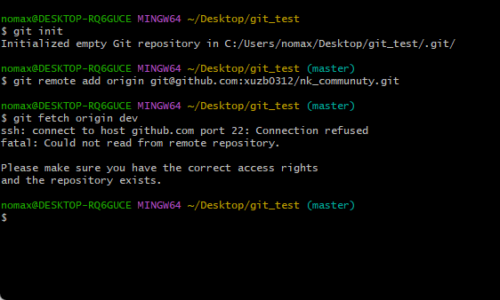

出现错误，显示22号端口被拒绝，那么不用ssh，用https试一下

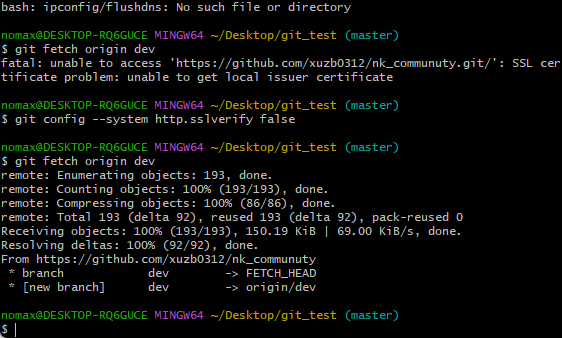

完成

5、在本地创建分支develop并切换到该分支

```
git checkout -b dev(本地分支名称) origin/develop(远程分支名称)

git checkout -b develop origin/dev
```

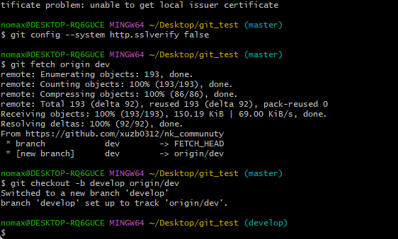

6、把远程分支的内容都拉取到本地

```
git pull origin dev
```

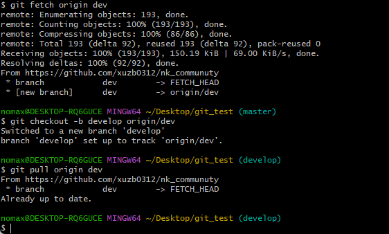

查看本地文件

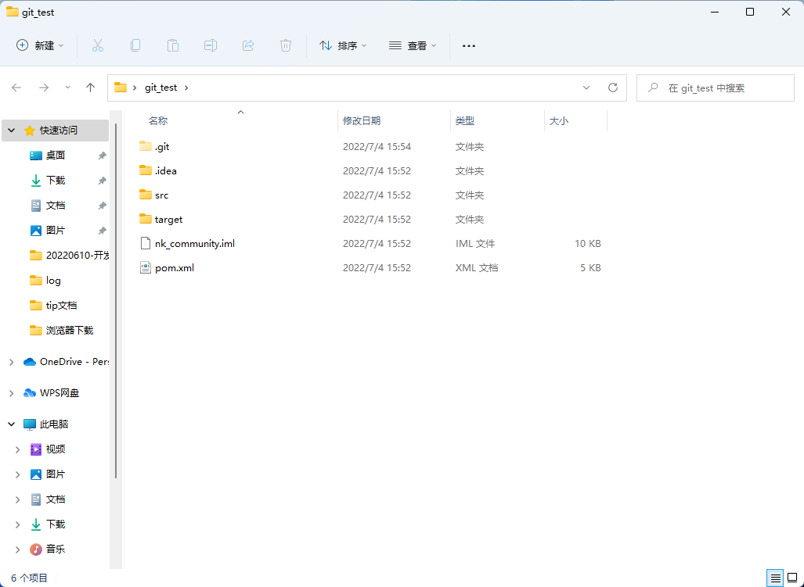

发现已经拉取完毕

## 二、上传

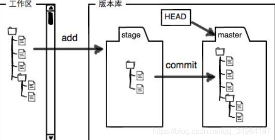

接下来就开始上传

为了直观的感受，新建一个txt文件

1、git add . 

将所有文件添加到缓存

2、git commit -m "upload files"

将缓存中的文件提取到分支

3、将本地文件推送到gitlab或者github

git push  会报错

根据提示 完善命令；

```
git push --set-upstream origin develop
```

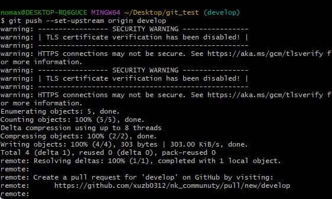

这一步会提示你登录


后续每次开发前先git pull一下，然后再进行开发，git add,git commit,git push等；

完成！

三、解决代码冲突

1. 切换到需要合并的分支，顺便拉一下代码
2. 然后点击你要合并的分支，最后处理一下代码冲突

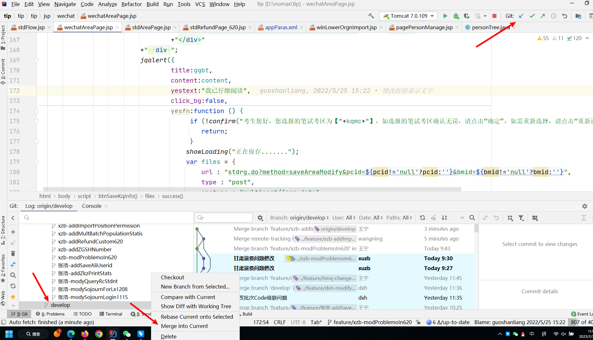

代码合并完了，没有图片，网上巴拉一个

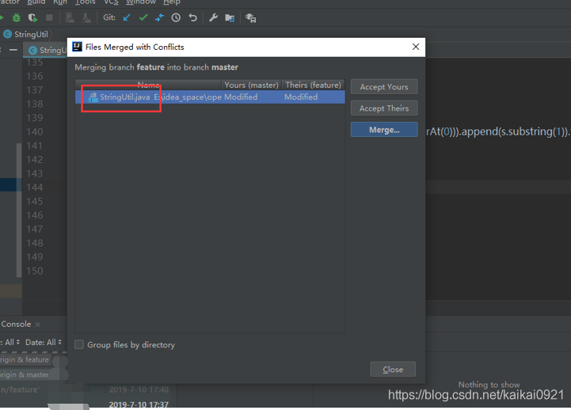

中间视图为最终解决冲突后的代码，>>表示是否将该代码保留，X表示去掉改代码。

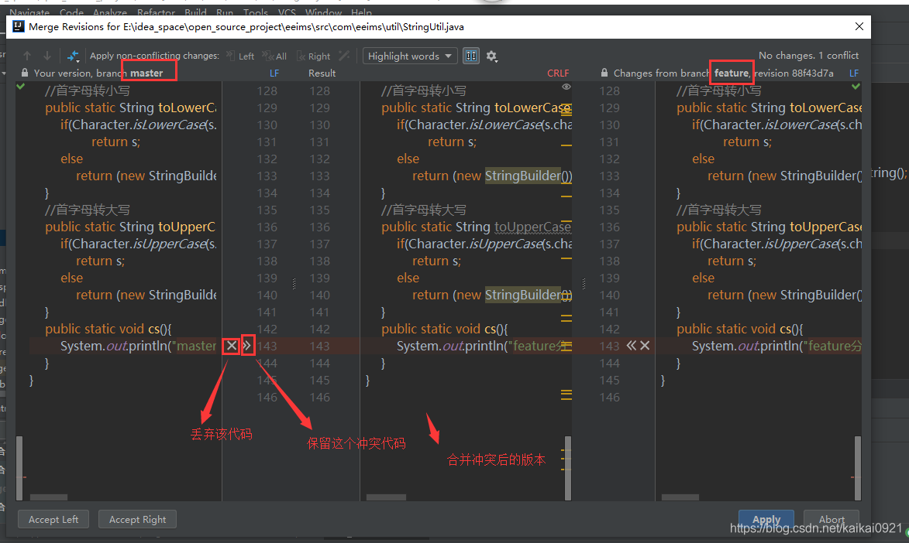

点击应用之后，出现下面代表已经合到本地上了，还要push到远程分支上。

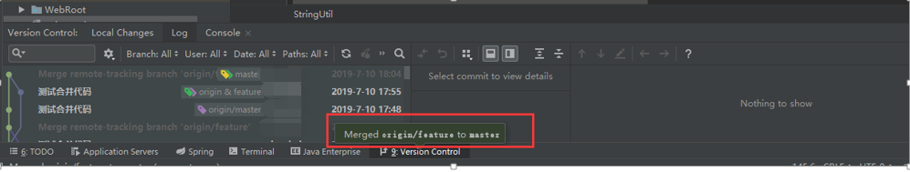

## 小乌龟的使用

1、本地新建一个文件夹，名字随意

2、点击进入文件夹

3、进入文件夹内，右键创建版本库

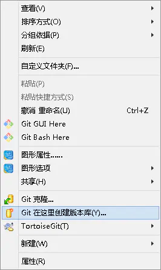

4、不勾选，直接确定

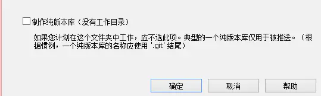

5、右键选择设置


6、填写git的账号与名称

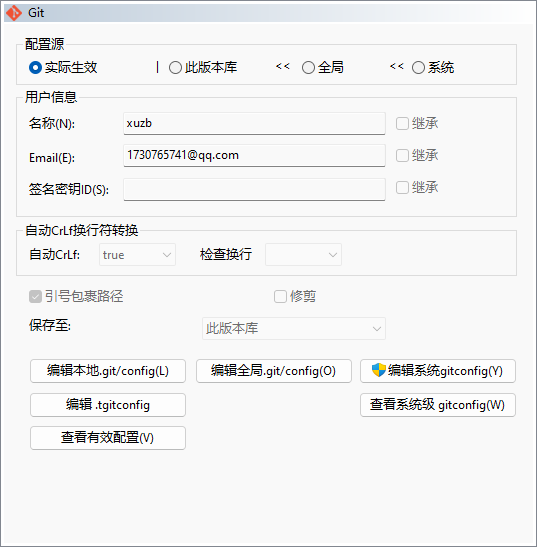

7、点击右侧的远端

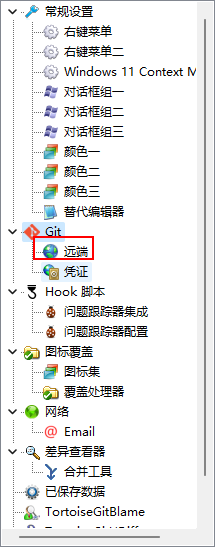

8、填写项目url

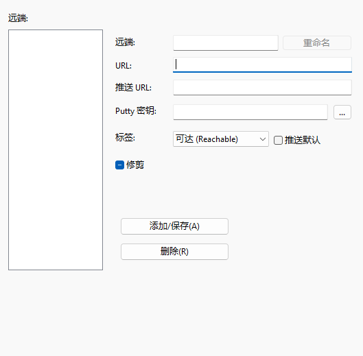

直接确定

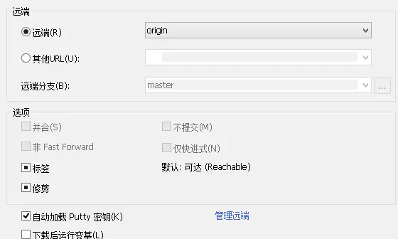

8、点击确定以后会弹出一个框，让你进行身份认证，你只需要将你之前注册的用户名密码重新输入一遍，然后小乌龟就开始抛投了，抛投完成以后，显示成功之后，点击关闭即可，现在，你的本地仓库就已经建好了

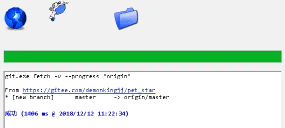

9、你可以通过拉取获得项目最新的成果，如果是多人协作的话，最好先拉取在提交

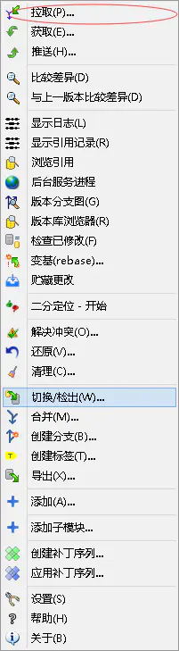

因为拉取只会拉取不一样的内容

10、以后你有什么需要更新的，只需要先提交，在同步即可，需要注意的是，提交只是提交到本地版本库，并非提交到远程版本服务器，所以，你要想在远程版本服务器上看到你最新的修改，你还需要同步

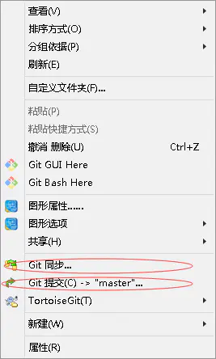

11、同步点击推送即可，一定要先提交再同步

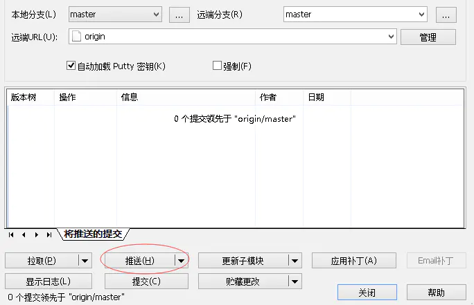

小乌龟也学完了！

# DBeaver

https://mp.weixin.qq.com/s/oqEAZNk-TorqRUocav27Ew


下载地址：[Releases · dbeaver/dbeaver (github.com)](https://github.com/dbeaver/dbeaver/releases)

1、安装

2、配置

因为 DBeaver 是基于 Maven 构建的，数据库驱动也就是链接数据库的 JDBC 驱动是通过 Maven 仓库下载的。选择「首选项」→「Maven」，添加阿里云镜像地址：

> http://maven.aliyun.com/nexus/content/groups/public

3、后面直接使用就可以了

4、有好多小功能，比如说筛选、自动生成sql等

# FinalShell

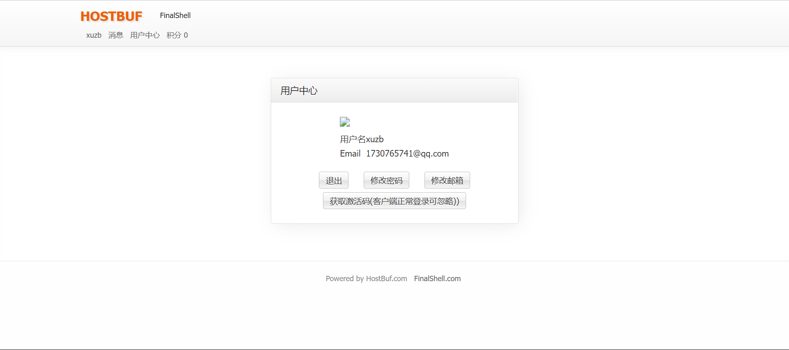

放弃xshell

使用这个终端试一试，虽然高级同步功能是要钱的，但是等到用到的时候再说吧；

```
xuzb
xu739524
```

[(38条消息) Linux远程连接工具：finalshell_Mike江的博客-CSDN博客_finalshell](https://blog.csdn.net/tennysonsky/article/details/119812235)

finalshell使用方法


# IDEA

## 拉项目

克隆项目

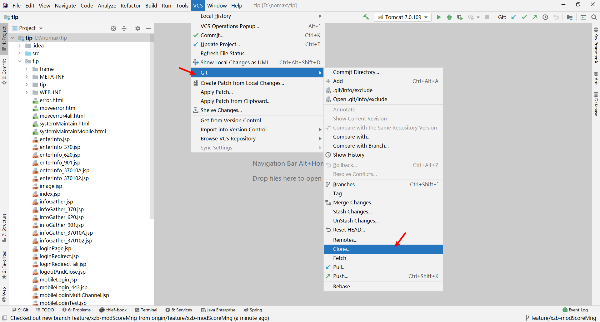

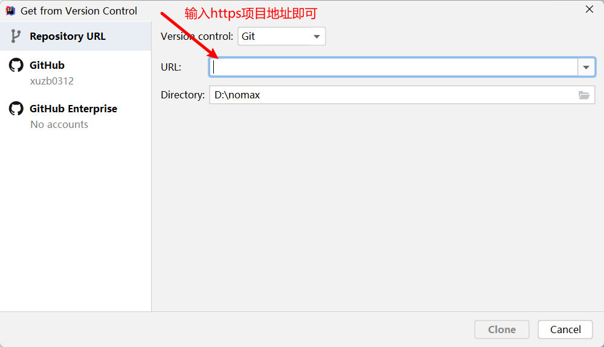

克隆完成之后，切换分支

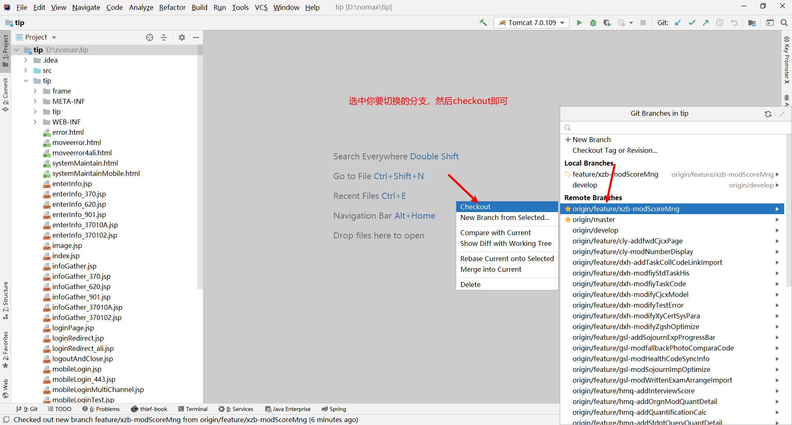

然后配置jdk与tomcat

更换tomcat的包

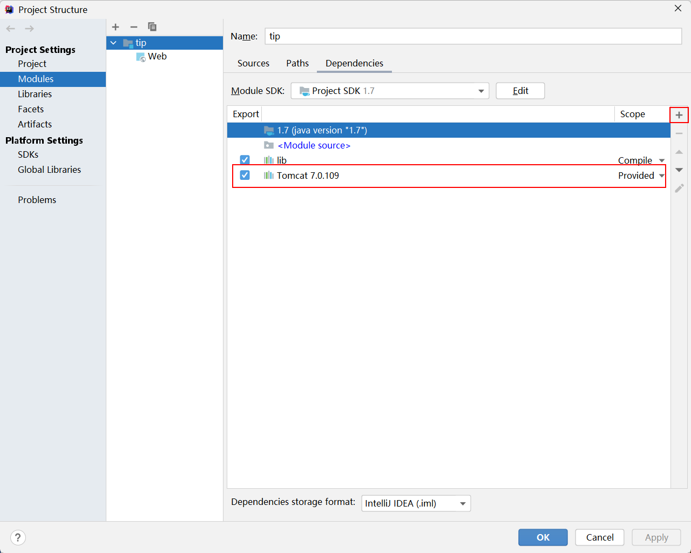

之后就可以正常跑起来了；

## 上传项目

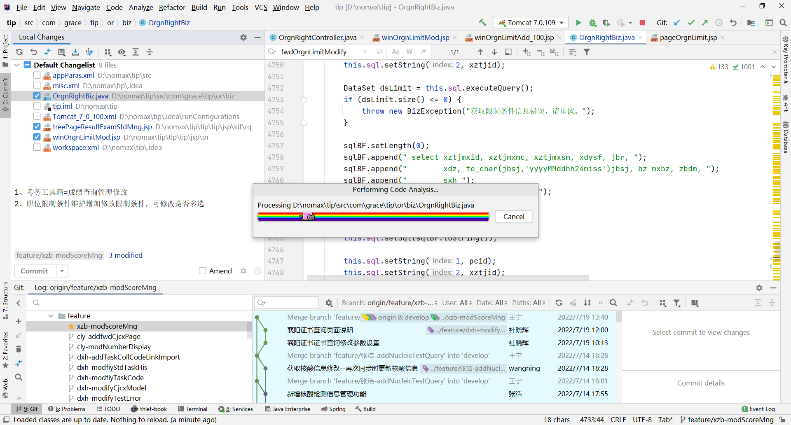

提交代码到gitlab，选择你修改文件**以及选择你自己的分支**

# SQL

### SQL INSERT INTO SELECT 语句

通过 SQL，您可以从一个表复制信息到另一个表。

INSERT INTO SELECT 语句从一个表复制数据，然后把数据插入到一个已存在的表中。

```sql
INSERT INTO Websites (name, country)
SELECT app_name, country FROM apps
WHERE id=1;
```

将id=1的数据复制一份到另一个表。


使用exitis关键字来判断是否符合条件。

